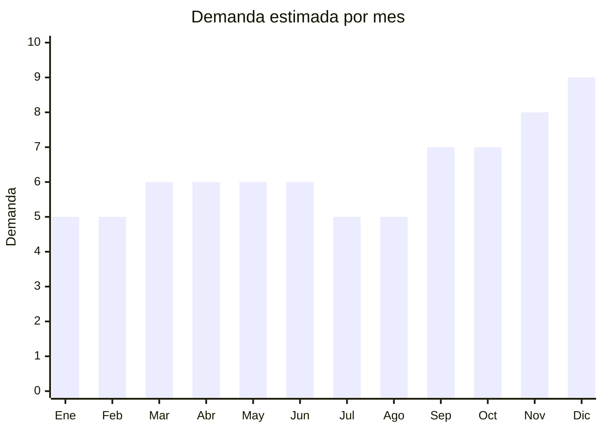

# Cubiertos de mesa

> **Capítulo NCM 82** — Herramientas y útiles, artículos de cuchillería | **Temporada:** Atemporal

## Qué es y por qué importarlo

Los cubiertos de mesa incluyen sets de tenedores, cuchillos, cucharas y cucharitas (generalmente x24 piezas: 6 de cada tipo) en acero inoxidable, con presentación en caja o estuche. Es un producto de demanda permanente y compra recurrente: cada hogar necesita al menos un juego completo, y la reposición ocurre por desgaste, mudanzas, casamientos o ampliación del vajillero. El sector gastronómico (restaurantes, bares, catering) compra en volumen de forma regular.

Jieyang (provincia de Guangdong, China) es el principal hub mundial de producción de cubiertos de acero inoxidable, con capacidad de producir desde líneas económicas hasta calidad premium con acabados espejo, dorados o mate. Los precios FOB de USD 3 a USD 15 por set de 24 piezas permiten márgenes atractivos en un mercado argentino donde los sets se venden entre ARS 12.000 y ARS 70.000. La compra es altamente recurrente: quien compra para 6 personas eventualmente necesita para 12, y los restaurantes reponen mensualmente.

## Datos clave

| Dato | Valor |
|------|-------|
| **Posición NCM** | 8215.20.00 (juegos surtidos de cubiertos) |
| **Derecho de importación (DIE)** | 18% + 3% tasa estadística |
| **IVA** | 21% + 20% percepción |
| **Rango FOB típico** | USD 3.00 — USD 15.00 por set 24 piezas |
| **Precio de venta en Argentina** | ARS 12.000 — ARS 70.000 |
| **Margen bruto estimado** | 150% — 300% |
| **MOQ típico** | 200 — 500 sets |
| **Demanda en MercadoLibre** | Alta |
| **Competencia en MercadoLibre** | Media-Alta |
| **Dificultad para importar** | Fácil |
| **Certificaciones necesarias** | Ninguna obligatoria (recomendado: apto contacto alimentos) |
| **Antidumping** | No |
| **Hub de producción en China** | Jieyang, Guangdong |

## Variantes y subtipos más comunes

| Subtipo / Variante | FOB aprox. | Venta AR aprox. | Nota |
|--------------------|-----------|-----------------|------|
| Set x24 piezas acero inox clásico | USD 3.00 — 6.00 | ARS 12.000 — 30.000 | **Más vendido** |
| Set x24 piezas acabado dorado/mate | USD 5.00 — 10.00 | ARS 25.000 — 50.000 | Tendencia deco |
| Set x48 piezas (12 personas) | USD 8.00 — 15.00 | ARS 35.000 — 70.000 | Familias/eventos |
| Set x16 piezas económico (4 personas) | USD 2.00 — 4.00 | ARS 8.000 — 18.000 | Producto de entrada |
| Cubiertos gastronómicos (x100 unidades sueltas) | USD 10.00 — 25.00 | ARS 30.000 — 80.000 | Canal gastronomía |

## Regulaciones y requisitos

<Tabs>
  <Tab title="Certificaciones">
    | Organismo | Requiere | Detalle |
    |-----------|----------|---------|
    | ARCA (Aduana) | Sí siempre | Despacho estándar |
    | ANMAT | No obligatorio | No es alimento, pero al ser utensilio en contacto con alimentos es recomendable tener certificado "food grade" |
    | ENACOM | No | No es electrónico |
    | INTI | No | No es textil ni calzado |

    Producto sin barreras regulatorias complejas. Importación libre. Se recomienda solicitar al proveedor certificado de acero inoxidable apto para contacto alimentario (food grade 18/10, 18/8 o 304 stainless steel).
  </Tab>

  <Tab title="Etiquetado">
    | Requisito | Aplica |
    |-----------|--------|
    | Idioma español | Sí |
    | Datos del importador | Sí |
    | Composición / materiales | Sí (acero inoxidable 18/10, 18/8, 304, 430, etc.) |
    | País de origen | Sí |
    | Garantía legal 6 meses | Sí |
    | Cantidad de piezas | Sí (indicar en caja) |
    | Apto lavavajillas | Recomendado |
  </Tab>

  <Tab title="Restricciones">
    Sin restricciones especiales. Producto de importación libre.

    **Nota:** Para cubiertos destinados a gastronomía, tener certificación de acero "food grade" puede ser un diferencial comercial importante. Los cubiertos de acero 430 (magnético) son más económicos pero de menor calidad que los 304 (18/8 o 18/10, no magnético). Verificar la calidad del acero con el proveedor para evitar óxido prematuro.
  </Tab>
</Tabs>

## Logística

| Dato | Valor |
|------|-------|
| **Peso típico por set (24 pzas)** | 0.8 — 2.0 kg |
| **Volumen típico** | Bajo (producto compacto y pesado para su tamaño) |
| **Fragilidad** | Muy baja (acero resistente) |
| **Envío recomendado** | Marítimo LCL |
| **Tiempo total estimado** | 50 — 80 días (marítimo) |
| **Baterías de litio** | No |
| **Requiere empaque especial** | No — verificar que la caja de presentación sea resistente |

<Warning>
**Verificar calidad del acero antes de pedir volumen.** Solicitar siempre una muestra previa. El mayor riesgo con cubiertos importados es el acero de baja calidad (tipo 201 o 430 barato) que se oxida rápidamente. Pedir al proveedor certificado de material y hacer la prueba del imán: el acero 304 (18/8) de calidad NO es magnético. Si el imán se pega fuerte, es acero 430 o inferior. Esto marca la diferencia entre reclamos masivos y clientes satisfechos.
</Warning>

## Estacionalidad



| Aspecto | Detalle |
|---------|---------|
| **Meses pico** | Octubre (Día de la Madre — sets regalo), Noviembre-Diciembre (CyberMonday, Navidad, casamientos, fiestas de fin de año) |
| **Meses valle** | Enero-Febrero y Julio-Agosto — demanda base estable |
| **Cuándo pedir** | Julio-Agosto para tener stock en temporada alta (octubre-diciembre) |

## Ventajas y riesgos

<CardGroup cols={2}>
  <Card title="Ventajas" icon="circle-check">
    - Demanda permanente (producto esencial en todo hogar)
    - Compra recurrente (reposición, ampliación, regalos)
    - Canal gastronómico de alto volumen
    - Producto compacto y resistente al transporte
    - Tendencia cubiertos dorados/mate amplía el mercado
  </Card>
  <Card title="Riesgos" icon="triangle-exclamation">
    - Calidad del acero variable (riesgo de óxido con acero 201/430)
    - Reclamos frecuentes si el acabado es deficiente
    - Competencia de marcas locales e importadas establecidas
    - Necesita buena presentación en caja para venta retail/regalo
  </Card>
</CardGroup>

## Palabras clave para buscar en Alibaba

```
cutlery set 24 pieces wholesale, stainless steel flatware set, silverware set bulk,
fork spoon knife set box, 18/10 cutlery set, Jieyang cutlery factory,
gold cutlery set wholesale, matte black cutlery set, restaurant flatware bulk
```

## Fuentes

- [MercadoLibre Argentina — Sets de cubiertos de mesa](https://listado.mercadolibre.com.ar/set-cubiertos-mesa)
- [Alibaba — Cutlery set wholesale](https://www.alibaba.com/showroom/cutlery-set-wholesale.html)
