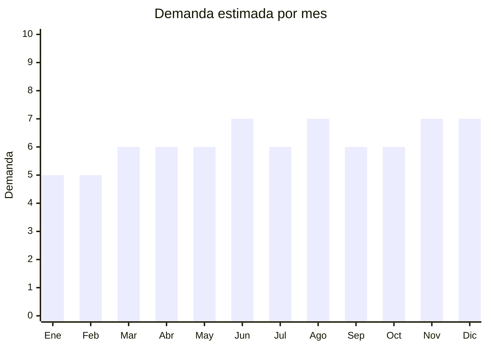

# Herramientas manuales

> **Capítulo NCM 82** — Herramientas y útiles, artículos de cuchillería | **Temporada:** Atemporal

## Qué es y por qué importarlo

Las herramientas manuales abarcan sets de destornilladores, llaves combinadas, pinzas, alicates, martillos, llaves Allen, cintas métricas y kits completos en maletín. Es un producto de demanda permanente: todo hogar, taller, obra y vehículo necesita un juego de herramientas básico, y la compra es recurrente por desgaste, pérdida o ampliación del kit.

Yongkang (provincia de Zhejiang, China) es la **capital china de las herramientas**, con miles de fábricas especializadas que producen para el mundo entero. Los precios FOB van de USD 2 a USD 20 por set, dependiendo de la cantidad de piezas y calidad del acero. En Argentina compiten marcas como Hamilton, Lusqtoff, Estrella Deco y Bremen, pero hay amplio espacio para sets de buena relación precio-calidad. Un dato clave: si la herramienta clasifica como **bien de capital**, el IVA se reduce al 10.5% en lugar del 21%, mejorando significativamente el margen.

## Datos clave

| Dato | Valor |
|------|-------|
| **Posiciones NCM típicas** | 8205.xx (herramientas de mano diversas) |
| **Derecho de importación (DIE)** | 5% — 18% (según subpartida específica) + 3% tasa estadística |
| **IVA** | 21% estándar / **10.5% si clasifica como bien de capital** + percepciones |
| **Rango FOB típico** | USD 2.00 — USD 20.00 por set |
| **Precio de venta en Argentina** | ARS 10.000 — ARS 80.000 |
| **Margen bruto estimado** | 120% — 250% |
| **MOQ típico** | 200 — 1,000 sets |
| **Demanda en MercadoLibre** | Alta |
| **Competencia en MercadoLibre** | Alta (Hamilton, Lusqtoff, Estrella Deco, Bremen) |
| **Dificultad para importar** | Fácil-Moderada |
| **Certificaciones necesarias** | Ninguna obligatoria |
| **Antidumping** | No |
| **Hub de producción en China** | Yongkang, Zhejiang |

## Variantes y subtipos más comunes

| Subtipo / Variante | FOB aprox. | Venta AR aprox. | Nota |
|--------------------|-----------|-----------------|------|
| Kit básico hogar (25 piezas en estuche) | USD 2.00 — 5.00 | ARS 10.000 — 25.000 | Producto de entrada |
| Set completo (100-150 piezas en maletín) | USD 8.00 — 15.00 | ARS 35.000 — 65.000 | **Más vendido** |
| Set profesional (200+ piezas en carro/maletín) | USD 15.00 — 25.00 | ARS 60.000 — 100.000 | Segmento profesional |
| Juego de llaves combinadas (set x12) | USD 3.00 — 8.00 | ARS 12.000 — 35.000 | Alta rotación |
| Set destornilladores de precisión | USD 1.50 — 4.00 | ARS 5.000 — 18.000 | Electrónica/celulares |

## Regulaciones y requisitos

<Tabs>
  <Tab title="Certificaciones">
    | Organismo | Requiere | Detalle |
    |-----------|----------|---------|
    | ARCA (Aduana) | Sí siempre | Despacho estándar |
    | ANMAT | No | No aplica |
    | ENACOM | No | No es electrónico |
    | INTI | No | No es textil ni calzado |

    Producto sin barreras regulatorias complejas. Importación libre.

    **Beneficio fiscal:** Consultar con despachante si la herramienta clasifica como **bien de capital** bajo la normativa vigente. En caso afirmativo, el IVA se reduce al **10.5%** en lugar del 21%, lo que impacta directamente en el costo final de importación.
  </Tab>

  <Tab title="Etiquetado">
    | Requisito | Aplica |
    |-----------|--------|
    | Idioma español | Sí |
    | Datos del importador | Sí |
    | Composición / materiales | Sí (tipo de acero: cromo vanadio, carbono, etc.) |
    | País de origen | Sí |
    | Garantía legal 6 meses | Sí |
    | Medidas/especificaciones | Recomendado (tamaños de llaves, torques, etc.) |
  </Tab>

  <Tab title="Restricciones">
    Sin restricciones especiales. Producto de importación libre.

    **Nota:** Algunas herramientas de corte (serruchos, formones) pueden requerir protección especial para transporte pero no tienen restricciones de importación. Verificar que sets con cúter/cuchillo no se clasifiquen como cuchillería (Cap. 82 igualmente, pero distinta subpartida y posible distinto arancel).
  </Tab>
</Tabs>

## Logística

| Dato | Valor |
|------|-------|
| **Peso típico por set** | 1.5 — 10.0 kg (según cantidad de piezas) |
| **Volumen típico** | Medio-Bajo (compacto para su peso — se cobra flete por peso) |
| **Fragilidad** | Muy baja (acero es resistente) |
| **Envío recomendado** | Marítimo LCL o FCL según volumen |
| **Tiempo total estimado** | 50 — 80 días (marítimo) |
| **Baterías de litio** | No (herramientas manuales, sin motor) |
| **Requiere empaque especial** | No — maletín incluido protege las piezas |

<Warning>
**El peso es el factor clave del flete.** Las herramientas de acero pesan mucho para su volumen. A diferencia de productos plásticos (donde se paga por CBM), aquí se paga por peso. Calcular bien el flete por kilo antes de pedir. Un pallet de maletines de 150 piezas puede pesar fácilmente +500 kg. Solicitar al proveedor que optimice el embalaje para reducir peso muerto (separadores de cartón en vez de foam pesado).
</Warning>

## Estacionalidad



| Aspecto | Detalle |
|---------|---------|
| **Meses pico** | Junio (Día del Padre — producto estrella para regalar), Agosto (Día del Niño para sets juveniles), Noviembre-Diciembre (CyberMonday, Navidad) |
| **Meses valle** | Enero-Febrero — demanda base estable |
| **Cuándo pedir** | Marzo-Abril para tener stock en Día del Padre (junio) |

## Ventajas y riesgos

<CardGroup cols={2}>
  <Card title="Ventajas" icon="circle-check">
    - Demanda permanente (producto esencial hogar/taller)
    - Producto estrella para Día del Padre
    - IVA 10.5% posible si clasifica como bien de capital
    - Sin barreras regulatorias
    - Producto resistente al transporte (no se rompe)
  </Card>
  <Card title="Riesgos" icon="triangle-exclamation">
    - Competencia fuerte de marcas establecidas (Hamilton, Lusqtoff)
    - Producto pesado (flete alto por peso)
    - Calidad del acero variable (cromo vanadio vs. acero blando)
    - Reclamos si las herramientas se deforman con uso normal
  </Card>
</CardGroup>

## Palabras clave para buscar en Alibaba

```
hand tool set wholesale, tool kit box set, tool set 150 pieces, wrench set combination,
screwdriver set professional, Yongkang tool factory, home repair tool kit,
mechanic tool set box, CRV hand tool set wholesale
```

## Fuentes

- [MercadoLibre Argentina — Sets de herramientas manuales](https://listado.mercadolibre.com.ar/set-herramientas-manuales)
- [Alibaba — Hand tool set wholesale](https://www.alibaba.com/showroom/hand-tool-set-wholesale.html)
