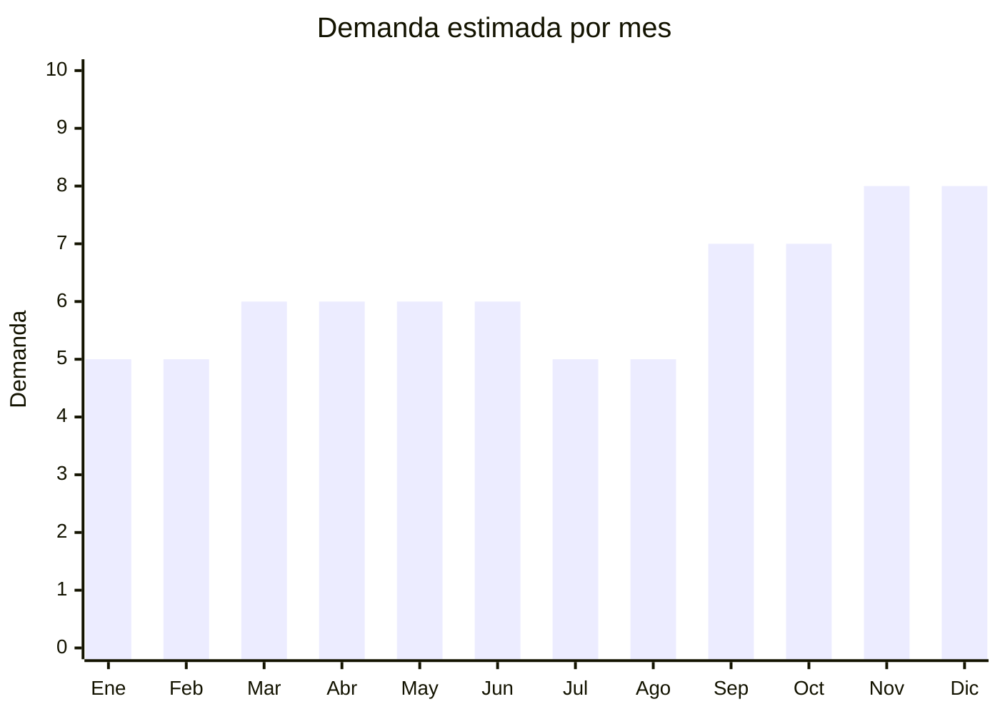

# Sets de cuchillos de cocina

> **Capítulo NCM 82** — Herramientas y útiles, artículos de cuchillería | **Temporada:** Atemporal

## Qué es y por qué importarlo

Los sets de cuchillos de cocina incluyen conjuntos de 5 a 8 piezas (cuchillo de chef, santoku, pan, trinchero, pelador, tijera) con bloque de madera, acrílico o barra magnética. Es un producto esencial en todo hogar y en gastronomía profesional, con demanda permanente y compra recurrente por desgaste o actualización.

Yangjiang (provincia de Guangdong, China) es la **capital mundial de la cuchillería**, concentrando más del 60% de la producción global de cuchillos. Los precios FOB son extremadamente competitivos (USD 3-15 por set completo), lo que permite márgenes superiores al 200% compitiendo contra marcas como Tramontina, Trento y 3 Claveles que dominan el mercado argentino. Con aproximadamente 3,148 resultados activos en MercadoLibre, la categoría demuestra alta demanda y espacio para nuevos competidores con buena relación precio-calidad.

## Datos clave

| Dato | Valor |
|------|-------|
| **Posición NCM** | 8211.91.00 (cuchillos de mesa con hoja fija) |
| **Derecho de importación (DIE)** | 18% + 3% tasa estadística |
| **IVA** | 21% + 20% percepción |
| **Rango FOB típico** | USD 3.00 — USD 15.00 por set |
| **Precio de venta en Argentina** | ARS 15.000 — ARS 80.000 |
| **Margen bruto estimado** | 150% — 300% |
| **MOQ típico** | 200 — 500 sets |
| **Demanda en MercadoLibre** | Alta (~3,148 resultados) |
| **Competencia en MercadoLibre** | Alta (Tramontina, Trento, 3 Claveles, Hudson) |
| **Dificultad para importar** | Fácil |
| **Certificaciones necesarias** | Ninguna obligatoria |
| **Antidumping** | No |
| **Hub de producción en China** | Yangjiang, Guangdong |

## Variantes y subtipos más comunes

| Subtipo / Variante | FOB aprox. | Venta AR aprox. | Nota |
|--------------------|-----------|-----------------|------|
| Set x5 cuchillos básico con bloque | USD 3.00 — 6.00 | ARS 15.000 — 35.000 | Producto de entrada |
| Set x7 cuchillos + tijera con bloque madera | USD 6.00 — 10.00 | ARS 30.000 — 55.000 | **Más vendido** |
| Set x8 cuchillos premium con bloque acrílico | USD 10.00 — 15.00 | ARS 50.000 — 80.000 | Segmento alto |
| Set x3 cuchillos de chef (sin bloque) | USD 2.00 — 5.00 | ARS 10.000 — 25.000 | Complementario |
| Barra magnética + cuchillos sueltos | USD 4.00 — 8.00 | ARS 20.000 — 45.000 | Tendencia cocina moderna |

## Regulaciones y requisitos

<Tabs>
  <Tab title="Certificaciones">
    | Organismo | Requiere | Detalle |
    |-----------|----------|---------|
    | ARCA (Aduana) | Sí siempre | Despacho estándar |
    | ANMAT | No | No es alimento ni cosmético |
    | ENACOM | No | No es electrónico |
    | INTI | No | No es textil ni calzado |

    Producto sin barreras regulatorias complejas. Importación libre y directa. No requiere licencia previa.
  </Tab>

  <Tab title="Etiquetado">
    | Requisito | Aplica |
    |-----------|--------|
    | Idioma español | Sí |
    | Datos del importador | Sí |
    | Composición / materiales | Sí (indicar tipo de acero: inoxidable 3Cr13, 5Cr15MoV, 440C, etc.) |
    | País de origen | Sí |
    | Garantía legal 6 meses | Sí |
    | Instrucciones de uso y cuidado | Recomendado |
  </Tab>

  <Tab title="Restricciones">
    Sin restricciones especiales. Producto de importación libre.

    **Nota:** Los cuchillos no están clasificados como armas blancas cuando son de uso doméstico/cocina. No requieren permisos especiales de importación. Evitar modelos que puedan confundirse con armas (cuchillos tácticos, bayonetas).
  </Tab>
</Tabs>

## Logística

| Dato | Valor |
|------|-------|
| **Peso típico por set** | 1.0 — 3.0 kg |
| **Volumen típico** | Medio (los bloques ocupan espacio) |
| **Fragilidad** | Baja (acero resistente, proteger filos) |
| **Envío recomendado** | Marítimo LCL |
| **Tiempo total estimado** | 50 — 80 días (marítimo) |
| **Baterías de litio** | No |
| **Requiere empaque especial** | Sí — protección de filos con fundas plásticas individuales |

<Warning>
**Proteger los filos durante el transporte.** Solicitar al proveedor que cada cuchillo venga con funda protectora individual (blade guard). Los roces entre hojas durante el envío pueden dañar el filo y generar reclamos de calidad. Verificar que los bloques de madera estén bien ajustados para evitar que los cuchillos se muevan dentro del embalaje.
</Warning>

## Estacionalidad



| Aspecto | Detalle |
|---------|---------|
| **Meses pico** | Octubre (Día de la Madre — formato regalo), Noviembre-Diciembre (CyberMonday, Navidad, regalos de fin de año) |
| **Meses valle** | Enero-Febrero — demanda base estable todo el año |
| **Cuándo pedir** | Julio-Agosto para tener stock en temporada alta de regalos |

## Ventajas y riesgos

<CardGroup cols={2}>
  <Card title="Ventajas" icon="circle-check">
    - Demanda permanente (producto esencial de cocina)
    - FOB muy competitivo desde Yangjiang
    - Alto margen (150-300%)
    - Ideal como set regalo (Día de la Madre, Navidad)
    - Sin barreras regulatorias
  </Card>
  <Card title="Riesgos" icon="triangle-exclamation">
    - Competencia fuerte de marcas establecidas (Tramontina, Trento)
    - Calidad del acero variable entre proveedores
    - Posibles reclamos por filo si el acero es de baja calidad
    - Necesita buena presentación para competir con marcas conocidas
  </Card>
</CardGroup>

## Palabras clave para buscar en Alibaba

```
kitchen knife set with block wholesale, chef knife set 7 pieces, stainless steel knife set,
knife block set wooden, Yangjiang knife factory, kitchen knife set gift box,
5cr15mov knife set wholesale, santoku knife set bulk
```

## Fuentes

- [MercadoLibre Argentina — Sets de cuchillos de cocina](https://listado.mercadolibre.com.ar/set-cuchillos-cocina)
- [Alibaba — Kitchen knife set wholesale](https://www.alibaba.com/showroom/kitchen-knife-set-wholesale.html)
