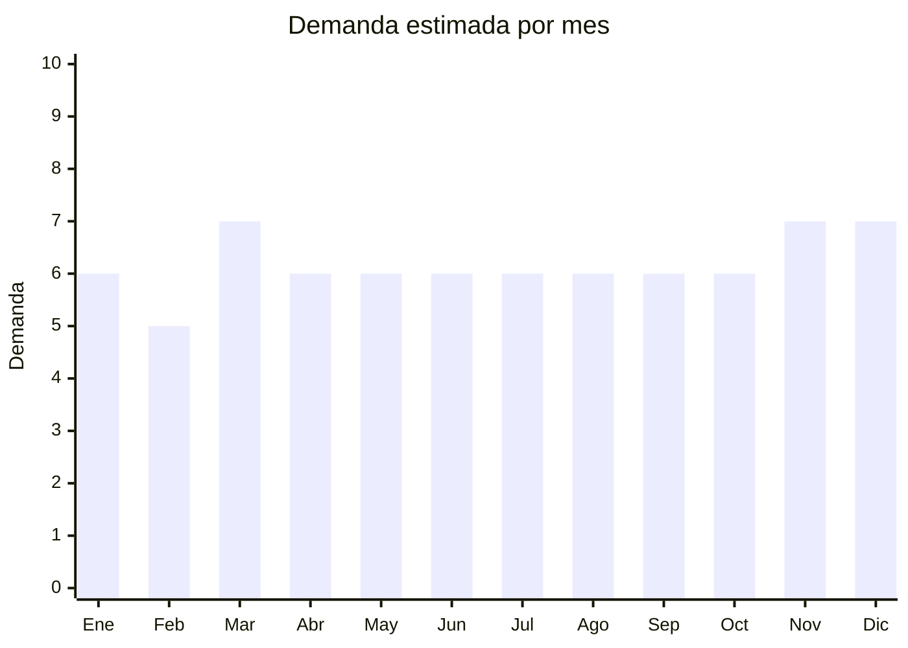

# Tijeras multiuso

> **Capítulo NCM 82** — Herramientas y útiles, artículos de cuchillería | **Temporada:** Atemporal

## Qué es y por qué importarlo

Las tijeras multiuso abarcan una categoría amplia de tijeras para diferentes aplicaciones: cocina (cortar pollo, hierbas, abrir envases), costura (tela, hilos), oficina (papel, cartón), jardín (poda liviana) y peluquería (corte de cabello). Es un producto de consumo masivo, demanda permanente y alta rotación: se desgastan, se pierden y se necesitan en múltiples puntos del hogar.

Las fábricas de Guangdong (China) producen tijeras de acero inoxidable a precios FOB desde USD 0.30 por unidad, lo que permite márgenes extraordinarios considerando que en Argentina una tijera de calidad media se vende entre ARS 3.000 y ARS 15.000. El bajo peso unitario hace que el flete sea muy eficiente (se pueden enviar miles de unidades en poco espacio y peso), convirtiendo este producto en uno de los más rentables del Cap. 82 para importadores que buscan volumen y rotación rápida.

## Datos clave

| Dato | Valor |
|------|-------|
| **Posición NCM** | 8213.00.00 (tijeras y sus hojas) |
| **Derecho de importación (DIE)** | 18% + 3% tasa estadística |
| **IVA** | 21% + 20% percepción |
| **Rango FOB típico** | USD 0.30 — USD 3.00 por unidad |
| **Precio de venta en Argentina** | ARS 3.000 — ARS 15.000 |
| **Margen bruto estimado** | 200% — 400% |
| **MOQ típico** | 500 — 3,000 unidades |
| **Demanda en MercadoLibre** | Alta |
| **Competencia en MercadoLibre** | Media (mercado fragmentado) |
| **Dificultad para importar** | Muy fácil |
| **Certificaciones necesarias** | Ninguna obligatoria |
| **Antidumping** | No |
| **Hub de producción en China** | Guangdong (múltiples fábricas) |

## Variantes y subtipos más comunes

| Subtipo / Variante | FOB aprox. | Venta AR aprox. | Nota |
|--------------------|-----------|-----------------|------|
| Tijera de cocina multiuso (acero inox) | USD 0.50 — 1.50 | ARS 3.000 — 8.000 | **Más vendido** — alta rotación |
| Tijera de costura / modista (20-25cm) | USD 0.80 — 2.00 | ARS 4.000 — 10.000 | Nicho específico |
| Tijera de oficina ergonómica | USD 0.30 — 1.00 | ARS 2.000 — 5.000 | Venta masiva / librerías |
| Tijera de jardín / poda liviana | USD 1.00 — 3.00 | ARS 5.000 — 15.000 | Mayor ticket |
| Tijera de peluquería profesional | USD 1.50 — 5.00 | ARS 8.000 — 25.000 | Nicho alto margen |

## Regulaciones y requisitos

<Tabs>
  <Tab title="Certificaciones">
    | Organismo | Requiere | Detalle |
    |-----------|----------|---------|
    | ARCA (Aduana) | Sí siempre | Despacho estándar |
    | ANMAT | No | No aplica |
    | ENACOM | No | No es electrónico |
    | INTI | No | No es textil ni calzado |

    Producto sin barreras regulatorias. Importación libre y directa. No requiere licencia previa ni intervenciones especiales.
  </Tab>

  <Tab title="Etiquetado">
    | Requisito | Aplica |
    |-----------|--------|
    | Idioma español | Sí |
    | Datos del importador | Sí |
    | Composición / materiales | Sí (acero inoxidable, mango ABS/PP, etc.) |
    | País de origen | Sí |
    | Garantía legal 6 meses | Sí |
    | Uso indicado | Recomendado (cocina, costura, oficina, etc.) |
  </Tab>

  <Tab title="Restricciones">
    Sin restricciones especiales. Producto de importación libre.

    **Nota:** Las tijeras de uso doméstico, oficina y costura no tienen ninguna restricción. Las tijeras de poda o jardinería tampoco requieren permisos especiales. Producto sencillo desde el punto de vista aduanero.
  </Tab>
</Tabs>

## Logística

| Dato | Valor |
|------|-------|
| **Peso típico por unidad** | 0.05 — 0.25 kg |
| **Volumen típico** | Muy bajo (producto compacto y liviano) |
| **Fragilidad** | Muy baja (acero resistente) |
| **Envío recomendado** | Marítimo LCL — incluso aéreo es viable por bajo peso |
| **Tiempo total estimado** | 50 — 80 días (marítimo) / 15 — 25 días (aéreo) |
| **Baterías de litio** | No |
| **Requiere empaque especial** | Sí — protección de filos con fundas individuales |

<Warning>
**Ideal para envío aéreo en primeros pedidos.** Por su bajo peso y volumen, las tijeras son uno de los pocos productos donde el envío aéreo puede ser viable económicamente para lotes de prueba (500-1,000 unidades). Esto permite testear el mercado en 15-25 días sin comprometer capital en un envío marítimo grande. Solicitar al proveedor funda protectora en cada unidad para evitar cortes en el packaging.
</Warning>

## Estacionalidad



| Aspecto | Detalle |
|---------|---------|
| **Meses pico** | Marzo (vuelta a clases — tijeras de oficina/escolar), Noviembre-Diciembre (CyberMonday, regalos) |
| **Meses valle** | Febrero — demanda muy estable todo el año |
| **Cuándo pedir** | Cualquier momento — mantener stock permanente, reforzar antes de marzo |

## Ventajas y riesgos

<CardGroup cols={2}>
  <Card title="Ventajas" icon="circle-check">
    - Márgenes excepcionales (200-400%)
    - Bajo peso y volumen (flete muy eficiente)
    - Demanda masiva y permanente
    - Múltiples nichos (cocina, costura, oficina, jardín, peluquería)
    - Viable para envío aéreo en lotes de prueba
  </Card>
  <Card title="Riesgos" icon="triangle-exclamation">
    - Producto de bajo ticket unitario (necesita volumen para ser rentable)
    - Calidad del filo variable entre proveedores
    - Competencia por precio en segmento bajo
    - Necesita buena presentación (blister/packaging) para venta retail
  </Card>
</CardGroup>

## Palabras clave para buscar en Alibaba

```
kitchen scissors wholesale, stainless steel scissors bulk, multipurpose scissors,
sewing scissors professional, office scissors ergonomic, garden pruning scissors,
hair cutting scissors wholesale, Guangdong scissors factory
```

## Fuentes

- [MercadoLibre Argentina — Tijeras multiuso](https://listado.mercadolibre.com.ar/tijera-multiuso)
- [Alibaba — Stainless steel scissors wholesale](https://www.alibaba.com/showroom/stainless-steel-scissors-wholesale.html)
