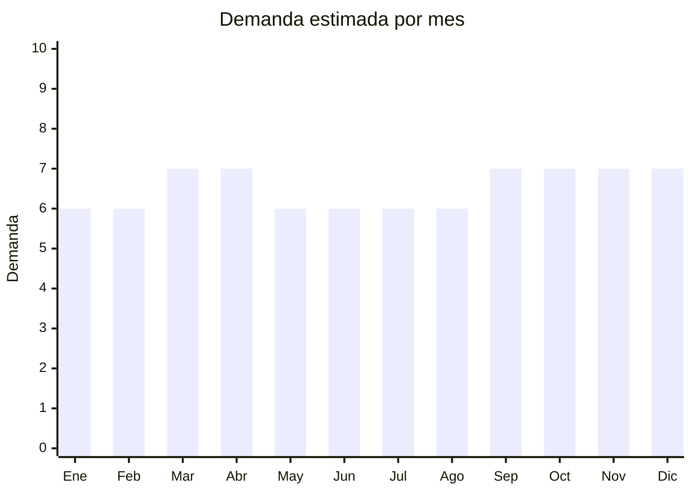

# Candados y cerraduras

> **Capítulo NCM 83** — Manufacturas diversas de metales comunes | **Temporada:** Atemporal

## Qué es y por qué importarlo

Los candados y cerraduras abarcan desde los clásicos candados de arco, cerraduras para puertas (cilíndricas, de embutir, de sobreponer), cerrojos de seguridad, hasta las modernas cerraduras inteligentes con Bluetooth, WiFi y huella dactilar. Es un mercado que se divide en dos segmentos claros: el **tradicional** (herrería, ferretería, reposición) y el **smart** (domótica, seguridad tech).

Argentina tiene una demanda constante de cerraduras y candados por reposición, construcción nueva y refacción. Las marcas nacionales como ACYTRA, CANDEX, INOMAX y KALLAY dominan el segmento tradicional, pero hay espacio creciente para cerraduras inteligentes donde marcas como Suono, Novohome y Ezviz están ganando terreno. China (especialmente Yongkang y Wenzhou) es el mayor productor mundial de candados y cerraduras, con precios FOB que permiten márgenes interesantes.

El segmento smart es el de mayor crecimiento: las cerraduras Bluetooth y con huella dactilar están en tendencia tanto para hogares como para Airbnb y oficinas.

## Datos clave

| Dato | Valor |
|------|-------|
| **Posiciones NCM típicas** | 8301.10 (candados), 8301.30 (cerraduras para muebles), 8301.40 (otras cerraduras), 8301.70 (llaves sueltas) |
| **Derecho de importación** | 18% (DIE) + 3% tasa estadística |
| **Rango FOB típico** | USD 1 — USD 15 por unidad |
| **Precio de venta en Argentina** | ARS 5.000 — ARS 120.000 |
| **Margen bruto estimado** | 80% — 250% |
| **MOQ típico** | 200 — 1,000 unidades |
| **Demanda en MercadoLibre** | Alta |
| **Competencia en MercadoLibre** | Alta (tradicional) / Media (smart) |
| **Dificultad para importar** | Moderada (smart requiere ENACOM) |
| **Certificaciones necesarias** | ENACOM (solo cerraduras smart con Bluetooth/WiFi) |
| **Antidumping** | No |

## Demanda y mercado en Argentina

- **Volumen de mercado:** Miles de publicaciones activas en MercadoLibre. Los candados Bulit son bestsellers en la categoría tradicional. Las cerraduras inteligentes crecen fuerte.
- **Tendencia:** Estable en tradicional, creciente en smart locks. La adopción de cerraduras inteligentes se acelera por Airbnb y oficinas coworking.
- **Perfil del comprador:** Ferreterías (mayorista), propietarios de viviendas (reposición), administradores de Airbnb/oficinas (smart), cerrajeros.
- **Canales de venta principales:** MercadoLibre, ferreterías, cerrajerías, casas de electricidad/domótica.

<Note>
Las cerraduras inteligentes con Bluetooth son el segmento de mayor crecimiento. Marcas como Suono y Novohome ya tienen presencia fuerte en MercadoLibre Argentina con precios de ARS 60.000-150.000.
</Note>

## Competencia

| Aspecto | Situación |
|---------|-----------|
| **Cantidad de vendedores en ML** | +500 vendedores activos |
| **Hay marcas dominantes** | Sí: ACYTRA, CANDEX, INOMAX, KALLAY (tradicional); Suono, Novohome, Ezviz (smart) |
| **Tipo de competidores** | Fabricantes locales + importadores |
| **Rango de precios en ML** | ARS 5.000 — ARS 150.000 |
| **Posibilidad de diferenciarse** | Alta en smart locks, Media en tradicional |

**Cómo diferenciarse:**
- Cerraduras smart con app propia y soporte técnico local
- Candados de alta seguridad con certificaciones internacionales
- Kits completos (cerradura + manija + cilindro) listos para instalar
- Marca propia en segmento medio con packaging profesional

## Variantes y subtipos más comunes

| Subtipo / Variante | FOB aprox. | Venta AR aprox. | Nota |
|--------------------|-----------|-----------------|------|
| Candado de arco clásico (30-50mm) | USD 1 — 3 | ARS 5.000 — 15.000 | Mayor volumen |
| Cerradura de embutir para puertas | USD 3 — 8 | ARS 15.000 — 40.000 | Reposición constante |
| Cerradura digital con huella dactilar | USD 8 — 15 | ARS 60.000 — 120.000 | **Mayor crecimiento** |
| Cerradura Bluetooth/WiFi smart | USD 10 — 15 | ARS 80.000 — 150.000 | Requiere ENACOM |
| Candado de combinación | USD 1 — 3 | ARS 5.000 — 12.000 | Popular en gimnasios/lockers |

## Regulaciones y requisitos

<Warning>
**Cerraduras smart con Bluetooth/WiFi requieren certificación ENACOM.** Cualquier dispositivo que emita o reciba señales de radiofrecuencia (Bluetooth, WiFi, Zigbee) debe estar homologado por ENACOM antes de su comercialización en Argentina. Sin esta certificación, la Aduana puede retener la mercadería. El trámite demora aproximadamente 30-60 días y cuesta entre USD 300-800 por modelo. Los candados y cerraduras tradicionales (sin electrónica) NO requieren esta certificación.
</Warning>

<Tabs>
  <Tab title="Certificaciones">
    | Organismo | Requiere | Detalle | Costo aprox. | Tiempo aprox. |
    |-----------|----------|---------|-------------|--------------|
    | ARCA (Aduana) | Sí siempre | Despacho de importación estándar | — | — |
    | ENACOM | Solo smart locks | Homologación de dispositivos Bluetooth/WiFi | USD 300 — 800 por modelo | 30 — 60 días |
    | INTI | No | No requiere certificación INTI | — | — |
    | IRAM | No obligatorio | Existe norma IRAM 4047 para cerraduras, pero no es obligatoria para importar | — | — |

    Los candados y cerraduras mecánicas (sin electrónica) no requieren certificaciones especiales más allá del despacho aduanero estándar.
  </Tab>

  <Tab title="Etiquetado">
    | Requisito | Aplica |
    |-----------|--------|
    | Idioma español | Sí |
    | Datos del importador | Sí |
    | Composición / materiales | Sí (indicar material: latón, acero, zinc) |
    | Instrucciones de uso | Sí (especialmente smart locks) |
    | País de origen | Sí |
    | Garantía legal 6 meses | Sí |
  </Tab>

  <Tab title="Restricciones">
    Sin restricciones especiales para candados y cerraduras mecánicas. Las cerraduras inteligentes con conectividad inalámbrica (Bluetooth, WiFi) requieren homologación ENACOM obligatoria antes de comercializar. No hay antidumping vigente para este tipo de producto.
  </Tab>
</Tabs>

## Logística

| Dato | Valor |
|------|-------|
| **Peso típico por unidad** | 0.15 — 1.5 kg |
| **Volumen típico** | Bajo a medio |
| **Fragilidad** | Baja (mecánicos) / Media (smart locks con electrónica) |
| **Envío recomendado** | Marítimo LCL para volumen; Aéreo para smart locks de alto valor |
| **Tiempo total estimado** | 15 — 25 días (aéreo) / 50 — 80 días (marítimo) |
| **Baterías de litio** | Sí (smart locks — requiere clasificación de mercancía peligrosa) |
| **Requiere empaque especial** | Sí para smart locks (protección anti-golpe, empaque individual) |

## Estacionalidad



| Aspecto | Detalle |
|---------|---------|
| **Meses pico** | Marzo-Abril (post-vacaciones, refacciones) y Octubre-Diciembre (construcción, CyberMonday, regalos tech) |
| **Meses valle** | Enero-Febrero — demanda base siempre presente |
| **Cuándo pedir** | Agosto para cubrir temporada octubre-diciembre; Enero para cubrir marzo-abril |

## Ventajas y riesgos

<CardGroup cols={2}>
  <Card title="Ventajas" icon="circle-check">
    - Demanda constante por reposición y construcción
    - Mercado dual: tradicional + smart con márgenes distintos
    - Smart locks con márgenes de 150-250%
    - Producto no perecedero, larga vida en stock
    - China es líder mundial en producción
    - Crecimiento fuerte del segmento smart/domótica
  </Card>
  <Card title="Riesgos" icon="triangle-exclamation">
    - Marcas nacionales establecidas en segmento tradicional
    - ENACOM obligatorio para smart locks (costo y tiempo)
    - Baterías de litio en smart locks complican logística
    - Calidad variable en proveedores chinos de bajo costo
    - Riesgo de cerraduras de baja seguridad que dañen la reputación
  </Card>
</CardGroup>

## Palabras clave para buscar en Alibaba

```
padlock wholesale, door lock cylinder, smart door lock fingerprint,
bluetooth padlock, digital lock WiFi, mortise lock brass,
combination padlock gym, electronic door lock keyless, rim lock wholesale
```

## Fuentes

- [MercadoLibre Argentina — Cerraduras y candados](https://listado.mercadolibre.com.ar/cerraduras-candados)
- [Alibaba — Padlocks and door locks](https://www.alibaba.com/showroom/padlock-wholesale.html)
