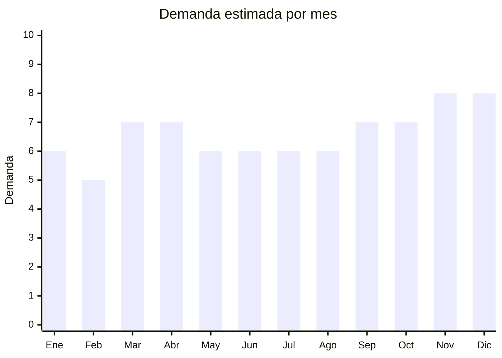

# Ganchos, perchas y organizadores de metal

> **Capítulo NCM 83** — Manufacturas diversas de metales comunes | **Temporada:** Atemporal

## Qué es y por qué importarlo

Esta categoría incluye ganchos adhesivos de metal (para pared, baño, cocina), perchas metálicas (de alambre, antideslizantes, para pantalones), organizadores de pared (barras con ganchos, rejillas metálicas, estantes flotantes de metal), ganchos para cortinas de baño y accesorios de organización del hogar fabricados en acero, aluminio o aleaciones.

La tendencia global de **home organization** (organización del hogar) impulsó enormemente esta categoría. Contenidos virales en redes sociales sobre orden y organización generan demanda constante. Los ganchos adhesivos de metal reemplazaron a los plásticos porque se perciben como más duraderos y estéticos. Las perchas metálicas premium (tipo boutique, antideslizantes) también crecen frente a las de plástico y madera.

China (especialmente Guangdong y Zhejiang) fabrica la gran mayoría de estos productos a precios que permiten márgenes excelentes. El bajo costo FOB por unidad (desde USD 0.10) y el volumen de demanda hacen que sea un producto ideal para importadores principiantes.

## Datos clave

| Dato | Valor |
|------|-------|
| **Posiciones NCM típicas** | 8302.50.00 (percheros, perchas y artículos similares), 8302.41 (guarniciones para muebles) |
| **Derecho de importación** | 18% (DIE) + 3% tasa estadística |
| **Rango FOB típico** | USD 0.10 — USD 2 por unidad |
| **Precio de venta en Argentina** | ARS 2.000 — ARS 20.000 |
| **Margen bruto estimado** | 200% — 500% |
| **MOQ típico** | 500 — 3,000 unidades |
| **Demanda en MercadoLibre** | Alta |
| **Competencia en MercadoLibre** | Media-Alta |
| **Dificultad para importar** | Fácil |
| **Certificaciones necesarias** | Ninguna |
| **Antidumping** | No |

## Demanda y mercado en Argentina

- **Volumen de mercado:** Alto. Miles de publicaciones activas en MercadoLibre entre ganchos, perchas y organizadores. Los ganchos adhesivos de acero inoxidable son particularmente populares.
- **Tendencia:** Creciente. La tendencia de home organization y minimalismo sigue en alza. Las redes sociales generan demanda constante con contenido de decoración y orden.
- **Perfil del comprador:** Amas de casa, personas que alquilan (no pueden atornillar), decoradores, locales de bazar y organización del hogar.
- **Canales de venta principales:** MercadoLibre, bazares, tiendas de decoración, Instagram shops.

<Note>
Los ganchos adhesivos de acero inoxidable (sin perforación) son especialmente populares entre inquilinos que no pueden hacer agujeros en las paredes. Este nicho crece a medida que aumenta la proporción de inquilinos en las grandes ciudades argentinas.
</Note>

## Competencia

| Aspecto | Situación |
|---------|-----------|
| **Cantidad de vendedores en ML** | +300 vendedores activos |
| **Hay marcas dominantes** | No hay marca dominante clara. Algunas marcas de bazar importado |
| **Tipo de competidores** | Importadores de bazar, tiendas de organización |
| **Rango de precios en ML** | ARS 2.000 — ARS 20.000 |
| **Posibilidad de diferenciarse** | Alta |

**Cómo diferenciarse:**
- Sets temáticos (kit baño, kit cocina, kit entrada)
- Diseño premium: acabados negros mate, dorado, cobre
- Packaging con fotos de ambientación estilo Pinterest/Instagram
- Marca propia posicionada en "organización del hogar"

## Variantes y subtipos más comunes

| Subtipo / Variante | FOB aprox. | Venta AR aprox. | Nota |
|--------------------|-----------|-----------------|------|
| Ganchos adhesivos acero inox (pack x4-6) | USD 0.50 — 1.50 (pack) | ARS 3.000 — 8.000 | **Más vendido** |
| Perchas metálicas antideslizantes (pack x10) | USD 1.00 — 2.00 (pack) | ARS 5.000 — 12.000 | Tendencia premium |
| Organizador de pared con ganchos (barra) | USD 1.00 — 2.00 | ARS 5.000 — 15.000 | Cocina y entrada |
| Perchero de puerta (sin tornillos) | USD 0.50 — 1.50 | ARS 3.000 — 10.000 | Ideal inquilinos |
| Rejilla metálica organizadora de pared | USD 1.00 — 2.00 | ARS 5.000 — 20.000 | Deco + funcional |

## Regulaciones y requisitos

<Tabs>
  <Tab title="Certificaciones">
    | Organismo | Requiere | Detalle | Costo aprox. | Tiempo aprox. |
    |-----------|----------|---------|-------------|--------------|
    | ARCA (Aduana) | Sí siempre | Despacho de importación estándar | — | — |
    | INTI | No | No requiere certificación | — | — |
    | IRAM | No | No hay norma obligatoria para estos productos | — | — |

    Producto sin barreras regulatorias. Es una de las categorías más simples para importar.
  </Tab>

  <Tab title="Etiquetado">
    | Requisito | Aplica |
    |-----------|--------|
    | Idioma español | Sí |
    | Datos del importador | Sí |
    | Composición / materiales | Sí (acero inoxidable, aluminio, etc.) |
    | Capacidad de peso | Recomendado (indicar kg máx. por gancho) |
    | País de origen | Sí |
    | Garantía legal 6 meses | Sí |
  </Tab>

  <Tab title="Restricciones">
    Sin restricciones especiales para ganchos, perchas y organizadores de metal. No hay antidumping vigente, no se requieren licencias especiales ni certificaciones previas.
  </Tab>
</Tabs>

## Logística

| Dato | Valor |
|------|-------|
| **Peso típico por unidad** | 0.02 — 0.30 kg |
| **Volumen típico** | Bajo a medio |
| **Fragilidad** | Baja |
| **Envío recomendado** | Marítimo LCL para volumen; Aéreo/Courier para primeras pruebas |
| **Tiempo total estimado** | 10 — 20 días (aéreo) / 50 — 80 días (marítimo) |
| **Baterías de litio** | No |
| **Requiere empaque especial** | No (empaque estándar; proteger acabados cromados/dorados de rayaduras) |

## Estacionalidad



| Aspecto | Detalle |
|---------|---------|
| **Meses pico** | Marzo-Abril (mudanzas, vuelta de vacaciones, reorganización del hogar) y Octubre-Diciembre (CyberMonday, regalos, renovación pre-fiestas) |
| **Meses valle** | Febrero — demanda base siempre presente |
| **Cuándo pedir** | Agosto para cubrir octubre-diciembre; Enero para cubrir marzo-abril |

## Ventajas y riesgos

<CardGroup cols={2}>
  <Card title="Ventajas" icon="circle-check">
    - Tendencia de home organization en crecimiento
    - Sin regulaciones ni certificaciones
    - Márgenes de 200-500%
    - Muy liviano y fácil de almacenar
    - Ideal para venta por sets/kits con ticket alto
    - Marketing visual potente (fotos de ambientación)
  </Card>
  <Card title="Riesgos" icon="triangle-exclamation">
    - Adhesivos de baja calidad generan devoluciones
    - Acabados que se oxidan o descascaran (cromado barato)
    - Perchas que deforman la ropa (calibre fino)
    - Competencia creciente de bazares importadores
    - Capacidad de peso real menor a la anunciada
  </Card>
</CardGroup>

## Palabras clave para buscar en Alibaba

```
adhesive hook stainless steel, metal hanger wholesale, wall hook no drill,
closet organizer metal, metal coat hook, over door hook hanger,
wire hanger antislip, wall mounted rack hooks, bathroom hook adhesive
```

## Fuentes

- [MercadoLibre Argentina — Ganchos y perchas](https://listado.mercadolibre.com.ar/ganchos-perchas-metal)
- [Alibaba — Wall hooks and hangers wholesale](https://www.alibaba.com/showroom/adhesive-wall-hook.html)
