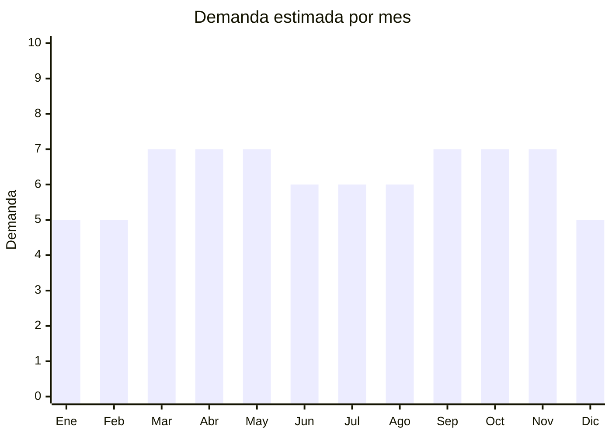

# Herrajes para muebles

> **Capítulo NCM 83** — Manufacturas diversas de metales comunes | **Temporada:** Atemporal

## Qué es y por qué importarlo

Los herrajes para muebles incluyen bisagras (rectas, de cierre suave, de piano), correderas para cajones (telescópicas, de bola), manijas y tiradores (acero inoxidable, zamac, aluminio), soportes para estantes, patas para muebles, amortiguadores de puerta y todo tipo de accesorio metálico que se usa en la fabricación y reparación de muebles. Es un mercado enorme y silencioso: no es glamoroso, pero tiene demanda perpetua.

En Argentina, la industria del mueble (fábricas, carpinterías, instaladores de cocinas) y los consumidores finales que hacen refacciones hogareñas generan una demanda constante. MercadoLibre muestra más de 1,992 resultados activos en la categoría. Marcas como Bronzen, Mosconi, Cima y Hafele son referentes, pero hay un enorme espacio para producto importado de China con buena relación precio-calidad. El caso de Toshi (manija con +10,000 unidades vendidas) demuestra que el volumen existe.

China (especialmente Guangdong y Zhejiang) es el mayor fabricante mundial de herrajes, con precios FOB desde USD 0.20 que permiten márgenes excelentes en un producto de alta rotación.

## Datos clave

| Dato | Valor |
|------|-------|
| **Posiciones NCM típicas** | 8302.10 (bisagras), 8302.41 (herrajes para muebles), 8302.42 (otros herrajes) |
| **Derecho de importación** | 14% — 18% (DIE) + 3% tasa estadística |
| **Rango FOB típico** | USD 0.20 — USD 3 por unidad |
| **Precio de venta en Argentina** | ARS 1.500 — ARS 25.000 |
| **Margen bruto estimado** | 150% — 400% |
| **MOQ típico** | 500 — 5,000 unidades |
| **Demanda en MercadoLibre** | Alta (1,992+ publicaciones) |
| **Competencia en MercadoLibre** | Alta |
| **Dificultad para importar** | Fácil |
| **Certificaciones necesarias** | Ninguna |
| **Antidumping** | No |

## Demanda y mercado en Argentina

- **Volumen de mercado:** Muy alto. Más de 1,992 publicaciones activas en MercadoLibre. Las carpinterías e instaladores de cocinas compran por volumen regularmente.
- **Tendencia:** Estable con crecimiento moderado. La tendencia del DIY (hacelo vos mismo) y la renovación de cocinas impulsan la demanda minorista.
- **Perfil del comprador:** Carpinteros y muebleros (mayorista), instaladores de cocinas, ferreteros, consumidor final DIY.
- **Canales de venta principales:** MercadoLibre, ferreterías industriales, casas de herrajes, venta mayorista a carpinterías.

<Note>
La manija marca Toshi superó las 10,000 unidades vendidas en MercadoLibre, demostrando que un solo SKU de herraje puede generar volumen significativo si se posiciona correctamente.
</Note>

## Competencia

| Aspecto | Situación |
|---------|-----------|
| **Cantidad de vendedores en ML** | +300 vendedores activos |
| **Hay marcas dominantes** | Sí: Bronzen, Mosconi, Cima, Hafele (premium) |
| **Tipo de competidores** | Importadores + fabricantes locales |
| **Rango de precios en ML** | ARS 1.500 — ARS 25.000 |
| **Posibilidad de diferenciarse** | Media-Alta |

**Cómo diferenciarse:**
- Kits completos para un mueble (bisagras + correderas + tiradores)
- Herrajes de cierre suave (soft-close) a precio competitivo
- Diseños modernos minimalistas en acabados negro mate y dorado
- Venta mayorista con descuentos por volumen a carpinterías

## Variantes y subtipos más comunes

| Subtipo / Variante | FOB aprox. | Venta AR aprox. | Nota |
|--------------------|-----------|-----------------|------|
| Bisagra cazoleta 35mm (cierre suave) | USD 0.30 — 0.80 | ARS 2.000 — 6.000 | **Mayor volumen** |
| Corredera telescópica cajón 400-500mm | USD 0.80 — 2.00 | ARS 4.000 — 12.000 | Alta demanda en cocinas |
| Manija/tirador acero inoxidable | USD 0.20 — 1.50 | ARS 1.500 — 8.000 | Toshi superó 10K ventas |
| Soporte para estante (par) | USD 0.20 — 0.60 | ARS 1.500 — 4.000 | Producto complementario |
| Patas para muebles (juego x4) | USD 1.00 — 3.00 | ARS 5.000 — 15.000 | Tendencia de patas metálicas |

## Regulaciones y requisitos

<Tabs>
  <Tab title="Certificaciones">
    | Organismo | Requiere | Detalle | Costo aprox. | Tiempo aprox. |
    |-----------|----------|---------|-------------|--------------|
    | ARCA (Aduana) | Sí siempre | Despacho de importación estándar | — | — |
    | INTI | No | No requiere certificación | — | — |
    | IRAM | No obligatorio | No hay norma obligatoria para herrajes | — | — |

    Producto sin barreras regulatorias significativas. Es una de las categorías más simples de importar.
  </Tab>

  <Tab title="Etiquetado">
    | Requisito | Aplica |
    |-----------|--------|
    | Idioma español | Sí |
    | Datos del importador | Sí |
    | Composición / materiales | Sí (acero, zamac, aluminio, etc.) |
    | Instrucciones de instalación | Recomendado |
    | País de origen | Sí |
    | Garantía legal 6 meses | Sí |
  </Tab>

  <Tab title="Restricciones">
    Sin restricciones especiales para herrajes de muebles. No hay antidumping vigente ni licencias especiales requeridas. Es una de las categorías más libres para importar.
  </Tab>
</Tabs>

## Logística

| Dato | Valor |
|------|-------|
| **Peso típico por unidad** | 0.03 — 0.50 kg |
| **Volumen típico** | Bajo |
| **Fragilidad** | Baja |
| **Envío recomendado** | Marítimo LCL (peso alto en volumen); Aéreo para primeras muestras |
| **Tiempo total estimado** | 15 — 25 días (aéreo) / 50 — 80 días (marítimo) |
| **Baterías de litio** | No |
| **Requiere empaque especial** | No (embalaje estándar en cajas de cartón con separadores) |

## Estacionalidad



| Aspecto | Detalle |
|---------|---------|
| **Meses pico** | Marzo-Mayo (arranque de construcción/refacción post-verano) y Septiembre-Noviembre (segunda temporada de obra) |
| **Meses valle** | Enero-Febrero y Diciembre — baja por vacaciones en la industria de la construcción |
| **Cuándo pedir** | Enero para cubrir marzo-mayo; Julio para cubrir septiembre-noviembre |

## Ventajas y riesgos

<CardGroup cols={2}>
  <Card title="Ventajas" icon="circle-check">
    - Demanda perpetua por reposición y obra nueva
    - Sin regulaciones ni certificaciones
    - Márgenes de 150-400%
    - Producto no perecedero, sin fecha de vencimiento
    - Liviano y fácil de almacenar
    - Miles de SKUs posibles para diversificar
  </Card>
  <Card title="Riesgos" icon="triangle-exclamation">
    - Competencia de marcas establecidas (Hafele, Bronzen)
    - Calidad variable: bisagras baratas pueden fallar rápido
    - Necesidad de amplio catálogo para ser competitivo
    - Peso acumulado alto en volumen (flete significativo)
    - Devoluciones si las medidas no coinciden con estándares locales
  </Card>
</CardGroup>

## Palabras clave para buscar en Alibaba

```
cabinet hinge soft close, drawer slide telescopic, furniture handle stainless steel,
cabinet pull knob, furniture leg metal, shelf bracket wholesale,
kitchen cabinet hardware, wardrobe hinge, furniture fitting wholesale
```

## Fuentes

- [MercadoLibre Argentina — Herrajes para muebles](https://listado.mercadolibre.com.ar/herrajes-muebles)
- [Alibaba — Cabinet hardware wholesale](https://www.alibaba.com/showroom/cabinet-hardware.html)
