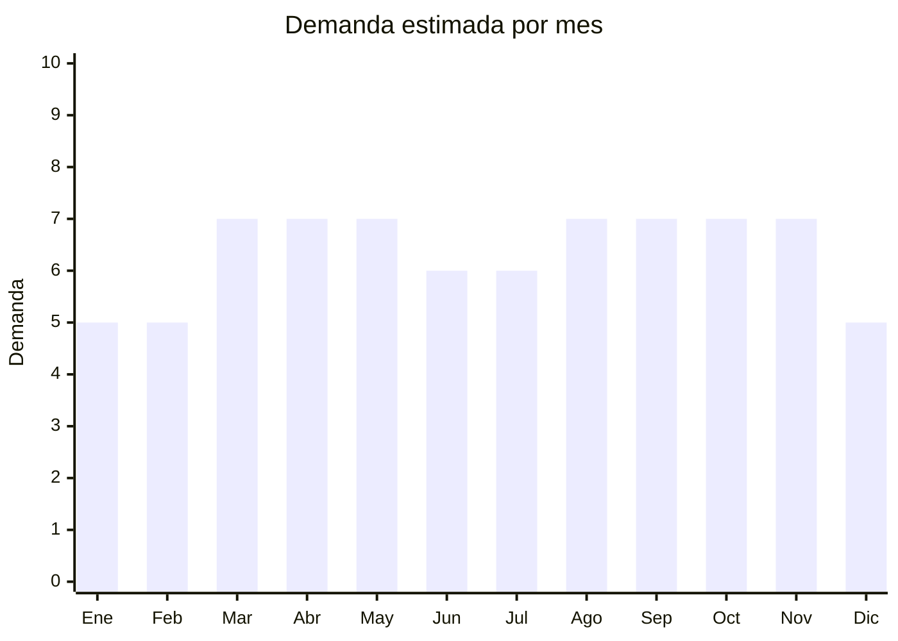

# Tornillería y bulonería

> **Capítulo NCM 73** — Manufacturas de fundición, hierro o acero | **Temporada:** Atemporal

<Note>
Aunque la tornillería se clasifica en el **Capítulo NCM 73** (manufacturas de hierro o acero), se incluye en esta sección por su relación directa con el resto de manufacturas metálicas del Cap. 83 y porque suele importarse junto con herrajes y otros productos de ferretería.
</Note>

## Qué es y por qué importarlo

La tornillería y bulonería abarca tornillos (autoperforantes, para madera, para chapa, métricos), bulones, tuercas, arandelas, remaches, tarugos metálicos y todo tipo de elemento de fijación de acero, acero inoxidable o latón. Es un producto de consumo masivo tanto industrial (fábricas, talleres, construcción) como doméstico (reparaciones, DIY, mantenimiento).

Argentina consume millones de unidades por mes. Cada obra de construcción, cada taller mecánico, cada carpintería y cada hogar necesita tornillería. Los kits y surtidos (cajas organizadoras con variedad de medidas) son especialmente populares para venta minorista y en MercadoLibre. La ventaja de importar desde China es el precio: el costo FOB por unidad puede ser de centavos, permitiendo vender al detalle con márgenes enormes cuando se arman kits.

China produce más del 40% de la tornillería mundial, con fábricas especializadas en Haiyan (Zhejiang) y Dongguan (Guangdong) que exportan a todo el mundo con normas DIN, ISO y SAE.

## Datos clave

| Dato | Valor |
|------|-------|
| **Posiciones NCM típicas** | 7318.11 (tirafondos), 7318.12 (otros tornillos para madera), 7318.14 (autoperforantes), 7318.15 (otros tornillos), 7318.16 (tuercas) |
| **Derecho de importación** | 14% (DIE) + 3% tasa estadística |
| **Rango FOB típico** | USD 0.01 — USD 0.10 por unidad (USD 500 — 2,000 por tonelada) |
| **Precio de venta en Argentina** | ARS 500 — ARS 15.000 (kits/cajas) |
| **Margen bruto estimado** | 150% — 500% (especialmente en kits) |
| **MOQ típico** | 500 — 5,000 kg (se compra por peso) |
| **Demanda en MercadoLibre** | Muy alta |
| **Competencia en MercadoLibre** | Alta |
| **Dificultad para importar** | Fácil |
| **Certificaciones necesarias** | Ninguna para uso general |
| **Antidumping** | No |

## Demanda y mercado en Argentina

- **Volumen de mercado:** Masivo. Se consumen miles de toneladas al año. Es un insumo básico de toda industria y hogar.
- **Tendencia:** Estable y permanente. La demanda está atada a la actividad de construcción, industria y mantenimiento general.
- **Perfil del comprador:** Ferreterías (canal principal), industrias metalúrgicas, carpinterías, talleres mecánicos, consumidor final DIY.
- **Canales de venta principales:** Ferreterías (mayorista y minorista), MercadoLibre (kits y surtidos), distribuidoras industriales.

<Note>
Los **kits surtidos** (caja organizadora con 200-1,000 piezas de distintas medidas) son los más vendidos en MercadoLibre. El comprador hogareño prefiere tener variedad de medidas lista para usar en lugar de comprar bolsas de una sola medida.
</Note>

## Competencia

| Aspecto | Situación |
|---------|-----------|
| **Cantidad de vendedores en ML** | +500 vendedores activos |
| **Hay marcas dominantes** | No hay marca dominante en genérico. Stanley, Ferton en kits premium |
| **Tipo de competidores** | Importadores, distribuidoras ferreteras |
| **Rango de precios en ML** | ARS 500 — ARS 15.000 (kits) |
| **Posibilidad de diferenciarse** | Media |

**Cómo diferenciarse:**
- Kits organizadores por uso (kit plomería, kit electricista, kit carpintero)
- Cajas plásticas transparentes con separadores y etiquetas por medida
- Tornillería de acero inoxidable (mayor precio, menor competencia)
- Marca propia con packaging profesional y tabla de medidas incluida

## Variantes y subtipos más comunes

| Subtipo / Variante | FOB aprox. | Venta AR aprox. | Nota |
|--------------------|-----------|-----------------|------|
| Kit surtido 200-500 piezas con caja | USD 2 — 5 (el kit) | ARS 5.000 — 12.000 | **Más vendido en ML** |
| Tornillos autoperforantes (kg) | USD 0.80 — 1.50/kg | ARS 3.000 — 8.000/kg | Altísima rotación |
| Bulones métricos con tuerca (kg) | USD 1.00 — 2.00/kg | ARS 4.000 — 10.000/kg | Demanda industrial |
| Tornillos para madera (kg) | USD 0.70 — 1.20/kg | ARS 2.500 — 7.000/kg | Carpintería y obra |
| Arandelas y tuercas surtidas | USD 0.50 — 1.00/kg | ARS 2.000 — 5.000/kg | Complemento necesario |

## Regulaciones y requisitos

<Tabs>
  <Tab title="Certificaciones">
    | Organismo | Requiere | Detalle | Costo aprox. | Tiempo aprox. |
    |-----------|----------|---------|-------------|--------------|
    | ARCA (Aduana) | Sí siempre | Despacho de importación estándar | — | — |
    | INTI | No | No requiere certificación para uso general | — | — |
    | IRAM | No obligatorio | Existen normas IRAM-IAS para tornillería estructural, pero no son obligatorias para importación general | — | — |

    La tornillería de uso general no tiene barreras regulatorias. Para tornillería de uso estructural (construcción de edificios), algunos compradores industriales pueden exigir certificados de calidad del fabricante (resistencia, dureza, composición).
  </Tab>

  <Tab title="Etiquetado">
    | Requisito | Aplica |
    |-----------|--------|
    | Idioma español | Sí |
    | Datos del importador | Sí |
    | Material / composición | Sí (acero, acero inoxidable, galvanizado) |
    | Medidas y especificaciones | Sí (diámetro, largo, paso de rosca) |
    | País de origen | Sí |
    | Grado de resistencia | Recomendado (ej: grado 8.8, 10.9) |
  </Tab>

  <Tab title="Restricciones">
    Sin restricciones especiales para tornillería y bulonería de uso general. No hay antidumping vigente ni licencias especiales. Para tornillería de aplicación nuclear o militar pueden existir restricciones, pero no aplica al mercado comercial general.
  </Tab>
</Tabs>

## Logística

| Dato | Valor |
|------|-------|
| **Peso típico por unidad** | 0.002 — 0.05 kg |
| **Volumen típico** | Bajo (pero peso alto en volumen) |
| **Fragilidad** | Muy baja |
| **Envío recomendado** | Marítimo LCL o FCL (producto pesado, flete marítimo es más económico) |
| **Tiempo total estimado** | 50 — 80 días (marítimo) |
| **Baterías de litio** | No |
| **Requiere empaque especial** | No (cajas de cartón reforzadas por el peso) |

## Estacionalidad



| Aspecto | Detalle |
|---------|---------|
| **Meses pico** | Marzo-Mayo y Agosto-Noviembre — temporadas fuertes de construcción e industria |
| **Meses valle** | Enero-Febrero y Diciembre — receso por vacaciones |
| **Cuándo pedir** | Noviembre para cubrir marzo (lead time marítimo de ~3 meses); Junio para cubrir septiembre |

## Ventajas y riesgos

<CardGroup cols={2}>
  <Card title="Ventajas" icon="circle-check">
    - Demanda masiva y permanente
    - Sin regulaciones ni certificaciones
    - Márgenes altísimos en kits surtidos (500%+)
    - Producto indestructible, sin vencimiento
    - Fácil de segmentar (kits por uso/profesión)
    - China líder mundial con precios imbatibles
  </Card>
  <Card title="Riesgos" icon="triangle-exclamation">
    - Producto muy pesado (flete marítimo significativo)
    - Competencia de precio en producto genérico
    - Calidad variable (dureza, galvanizado)
    - Stock inicial alto en variedad de medidas
    - Necesidad de espacio de almacenamiento
  </Card>
</CardGroup>

## Palabras clave para buscar en Alibaba

```
screw assortment kit, self-tapping screw wholesale, wood screw bulk,
bolt and nut set, stainless steel screw lot, machine screw metric,
drywall screw wholesale, anchor bolt kit, washer assortment box
```

## Fuentes

- [MercadoLibre Argentina — Tornillería y bulonería](https://listado.mercadolibre.com.ar/tornillos-bulones)
- [Alibaba — Screws and bolts wholesale](https://www.alibaba.com/showroom/screw-wholesale.html)
