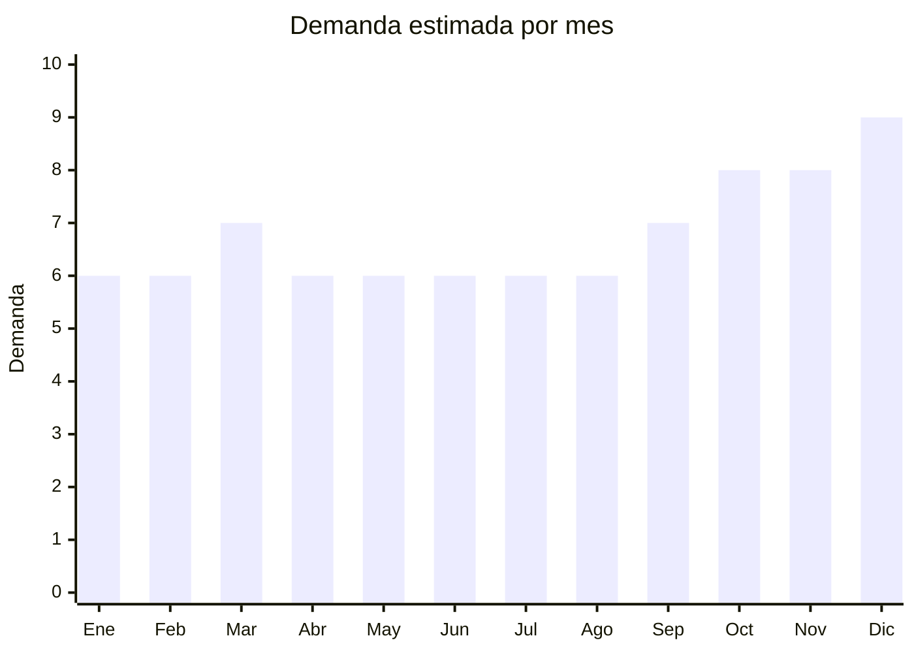

# Amoladoras Angulares

> **Capitulo NCM 84** — Maquinas, aparatos y artefactos mecanicos | **Temporada:** Atemporal

## Que es y por que importarlo

La amoladora angular (tambien llamada "radial" o "pulidora") es una herramienta electrica rotativa utilizada para cortar, desbastar y pulir metales, piedra, ceramica y otros materiales. Es una de las herramientas mas vendidas en Argentina, indispensable tanto para profesionales de la construccion y la metalurgia como para uso hogareno en proyectos de bricolaje.

Con precios FOB desde USD 5 por unidad y margenes de 150-250%, las amoladoras representan una oportunidad de importacion con bajo costo de entrada. Al igual que los taladros, tributan IVA al 10.5% como bienes de capital, lo que mejora significativamente el margen neto respecto a otros productos.

**Sin antidumping.**

## Datos clave

| Dato | Valor |
|------|-------|
| **Posiciones NCM tipicas** | 8467.29.00 |
| **Derecho de importacion** | 5% — 14% (DIE) + 3% tasa estadistica |
| **Rango FOB tipico** | USD 5 — USD 20 por unidad |
| **Precio de venta en Argentina** | ARS 20,000 — ARS 80,000 |
| **Margen bruto estimado** | 150% — 250% |
| **MOQ tipico** | 100 — 500 unidades |
| **Demanda en MercadoLibre** | Alta (12,000+ resultados) |
| **Competencia en MercadoLibre** | Alta (Bosch, Makita, DeWalt, Black+Decker, Stanley, Lusqtoff) |
| **Dificultad para importar** | Baja-Media |
| **Certificaciones necesarias** | S-Mark (puede requerir segun modelo) |
| **Antidumping** | **No** |

## Variantes y subtipos mas comunes

| Subtipo / Variante | FOB aprox. | Venta AR aprox. | Nota |
|--------------------|-----------|-----------------|------|
| 115mm hobby (650-750W) | USD 5 — 8 | ARS 20,000 — 35,000 | Entrada al mercado. Uso hogareno y ligero. Alta rotacion |
| 125mm semipro (850-1000W) | USD 8 — 12 | ARS 35,000 — 55,000 | La mas vendida. Equilibrio entre potencia, tamano y precio |
| Inalambrica 18V | USD 12 — 18 | ARS 50,000 — 70,000 | Tendencia creciente. Mayor margen. Requiere bateria Li-ion |
| Combo amoladora + taladro | USD 15 — 20 | ARS 60,000 — 80,000 | Excelente valor percibido. Incrementa ticket promedio significativamente |

## Regulaciones y requisitos

<Tabs>
  <Tab title="Certificaciones">
    - **S-Mark**: Puede ser requerido dependiendo del modelo. Consultar con laboratorio acreditado
    - **IVA reducido**: Tributa IVA al **10.5%** como bien de capital (no 21% estandar)
    - **Derechos menores**: DIE entre 5% y 14%, inferior al 20% de electrodomesticos
    - **Costo certificacion**: USD 500 — USD 1,000 por modelo (si aplica S-Mark)
    - **Tiempo**: 20 — 40 dias
  </Tab>
  <Tab title="Etiquetado">
    - Manual de instrucciones en espanol con normas de seguridad de uso
    - Datos del importador: razon social, CUIT, domicilio
    - Indicacion de voltaje (220V/50Hz para modelos con cable) o voltaje de bateria (18V/20V para inalambricas)
    - Potencia en watts y velocidad en RPM
    - Diametro maximo de disco compatible (115mm o 125mm)
    - Pais de origen
  </Tab>
  <Tab title="Restricciones">
    - **Disco de corte**: La amoladora generalmente se importa SIN disco. Los discos se venden por separado y tienen sus propias normas
    - **Protector de disco**: Obligatorio que incluya guarda protectora. Sin ella, el producto puede ser objetado
    - **Modelos inalambricos**: Aplican las mismas restricciones de baterias Li-ion (MSDS, UN38.3)
    - **Voltaje del cargador**: Para modelos inalambricos, verificar que el cargador sea 220V/50Hz
    - **Carbon y escobillas**: Verificar disponibilidad de repuestos (carbones) para el modelo especifico
  </Tab>
</Tabs>

## Logistica

| Dato | Valor |
|------|-------|
| **Peso tipico por unidad** | 2 — 4 kg |
| **Volumen tipico** | Medio |
| **Fragilidad** | Baja (producto robusto y resistente) |
| **Envio recomendado** | Maritimo (por volumen y peso) |
| **Tiempo total estimado** | 7 — 15 dias (aereo) / 45 — 70 dias (maritimo) |

<Tip>
La amoladora de 125mm (850-1000W) es el modelo mas demandado y ofrece la mejor relacion entre costo, margen y volumen de ventas. Para maximizar el valor percibido, negocia con el proveedor la inclusion de 2-3 discos de corte y un maletin rigido. Este "combo" puede agregar solo USD 1-2 al costo FOB pero permite aumentar el precio de venta en ARS 5,000-10,000.
</Tip>

## Estacionalidad



| Aspecto | Detalle |
|---------|---------|
| **Meses pico** | Octubre a Diciembre (regalos, Black Friday, preparacion de fin de ano). Marzo tambien sube por inicio de proyectos de construccion |
| **Meses valle** | Demanda muy estable todo el ano. Las herramientas tienen baja estacionalidad comparadas con otros productos |

## Ventajas y riesgos

<CardGroup cols={2}>
  <Card title="Ventajas" icon="circle-check">
    - IVA reducido al 10.5% mejora margen neto significativamente
    - Derechos de importacion bajos (5-14%)
    - Producto robusto, baja fragilidad en transporte
    - Herramienta esencial con demanda constante
    - Combos con taladro aumentan ticket promedio
    - Inversion inicial baja (desde USD 5/unidad FOB)
  </Card>
  <Card title="Riesgos" icon="triangle-exclamation">
    - Competencia fuerte de marcas profesionales (Bosch, Makita)
    - Calidad del motor y rodamientos es critica (producto de alto esfuerzo)
    - Carbones y escobillas deben tener repuesto disponible
    - Modelos inalambricos agregan complejidad por baterias Li-ion
    - Garantia legal obligatoria (riesgo de devoluciones por calidad)
    - Producto que requiere guarda protectora obligatoria
  </Card>
</CardGroup>

## Palabras clave para buscar en Alibaba

```
angle grinder 125mm 220V
angle grinder 850W 220V 50Hz
cordless angle grinder 18V lithium
angle grinder 115mm 750W
power tool angle grinder OEM
mini grinder 4.5 inch 220V
angle grinder combo drill set
electric grinder 1000W 220V
```

## Fuentes

- [MercadoLibre Argentina — Amoladoras angulares](https://listado.mercadolibre.com.ar/amoladora-angular)
- [Alibaba — Angle Grinder 220V](https://www.alibaba.com/trade/search?SearchText=angle+grinder+220V)
