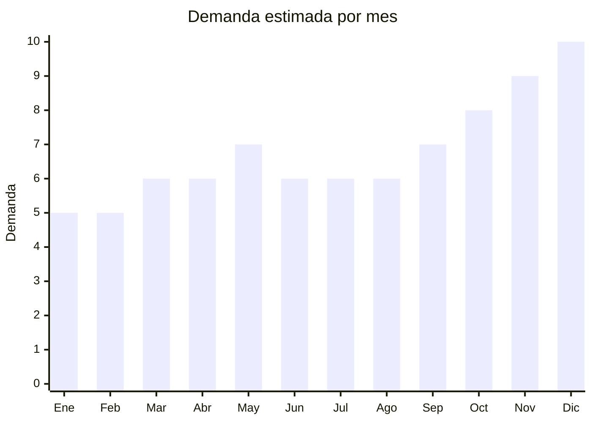

# Aspiradoras Robot

> **Capitulo NCM 84** — Maquinas, aparatos y artefactos mecanicos | **Temporada:** Atemporal

## Que es y por que importarlo

La aspiradora robot es un dispositivo autonomo que limpia pisos de forma automatica, utilizando sensores para navegar por el hogar evitando obstaculos. Los modelos mas avanzados incluyen funcion de trapeado, mapeo laser LiDAR y estacion de vaciado automatico. Es uno de los productos de tecnologia para el hogar con mayor crecimiento en Argentina.

El caso de exito de Gadnic Z900 (mas de 10,000 unidades vendidas en MercadoLibre) demuestra el potencial del mercado. Los precios FOB desde China son muy competitivos (USD 15-80), lo que permite margenes brutos de 150% a 300% dependiendo de las funcionalidades del modelo importado.

**Sin antidumping.**

## Datos clave

| Dato | Valor |
|------|-------|
| **Posiciones NCM tipicas** | 8508.11.00 |
| **Derecho de importacion** | 20% (DIE) + 3% tasa estadistica |
| **Rango FOB tipico** | USD 15 — USD 80 por unidad |
| **Precio de venta en Argentina** | ARS 80,000 — ARS 400,000 |
| **Margen bruto estimado** | 150% — 300% |
| **MOQ tipico** | 50 — 200 unidades |
| **Demanda en MercadoLibre** | Alta (8,000+ resultados) |
| **Competencia en MercadoLibre** | Media-Alta (Gadnic, Xiaomi, iRobot, Samsung) |
| **Dificultad para importar** | Media-Alta |
| **Certificaciones necesarias** | S-Mark + QR obligatorio. ENACOM si tiene WiFi |
| **Antidumping** | **No** |

## Variantes y subtipos mas comunes

| Subtipo / Variante | FOB aprox. | Venta AR aprox. | Nota |
|--------------------|-----------|-----------------|------|
| Basica solo aspira | USD 15 — 25 | ARS 80,000 — 120,000 | Entrada al mercado. Sin WiFi, navegacion aleatoria. Menor tramite (sin ENACOM) |
| Aspira + trapea | USD 25 — 40 | ARS 120,000 — 200,000 | La mas popular. Doble funcion agrega valor percibido |
| Con mapeo LiDAR | USD 40 — 60 | ARS 200,000 — 300,000 | Navegacion inteligente. Requiere ENACOM (WiFi). Mayor margen |
| Estacion de vaciado automatico | USD 60 — 80 | ARS 300,000 — 400,000 | Premium. Auto-vaciado de deposito. Maximo margen pero mayor MOQ en valor |

## Regulaciones y requisitos

<Tabs>
  <Tab title="Certificaciones">
    - **S-Mark obligatorio**: Como aparato electrico, requiere certificacion de seguridad electrica
    - **Codigo QR**: Debe incluir codigo QR vinculado a informacion de seguridad
    - **ENACOM**: La mayoria de los modelos con WiFi requieren homologacion ante ENACOM. Este tramite puede demorar 30-90 dias y cuesta aproximadamente USD 200-500 por modelo
    - **Modelos sin WiFi**: No requieren ENACOM, lo que simplifica significativamente el proceso
    - **Costo total certificaciones**: USD 1,000 — USD 2,500 por modelo (S-Mark + ENACOM)
  </Tab>
  <Tab title="Etiquetado">
    - Manual de instrucciones en espanol (incluido el uso de la app si tiene WiFi)
    - Datos del importador: razon social, CUIT, domicilio legal
    - Indicacion de voltaje (220V / 50Hz) y potencia
    - Etiqueta con modelo, numero de serie y pais de origen
    - Informacion sobre tipo de bateria (Li-ion) y capacidad en mAh
  </Tab>
  <Tab title="Restricciones">
    - **Baterias Li-ion**: Transporte regulado. Requiere documentacion especifica para envio (MSDS, UN38.3 test report)
    - **ENACOM obligatorio para WiFi**: La gran mayoria de modelos modernos incluyen WiFi. Sin homologacion ENACOM no se puede comercializar legalmente
    - **Voltaje**: Verificar compatibilidad 220V/50Hz. Algunos modelos estan disenados para mercado 110V
    - **App en espanol**: Si el robot se controla por app, verificar que este disponible en espanol y funcione en Argentina
  </Tab>
</Tabs>

## Logistica

| Dato | Valor |
|------|-------|
| **Peso tipico por unidad** | 2 — 5 kg |
| **Volumen tipico** | Medio (cajas cuadradas/circulares) |
| **Fragilidad** | Alta (sensores, componentes electronicos, bateria) |
| **Envio recomendado** | Maritimo (recomendado por volumen y costo) |
| **Tiempo total estimado** | 7 — 15 dias (aereo) / 45 — 70 dias (maritimo) |

<Tip>
Las aspiradoras robot contienen baterias de litio, lo que agrega requisitos de documentacion para transporte (MSDS y certificado UN38.3). Solicita estos documentos al proveedor ANTES de confirmar la orden. Para el primer pedido, considera importar modelos SIN WiFi para evitar el tramite de ENACOM y acelerar tu entrada al mercado.
</Tip>

<Warning>
Las baterias de litio tienen regulaciones especificas de transporte tanto aereo como maritimo. Un envio sin la documentacion correcta puede ser rechazado por la naviera o la aerolinea. Asegurate de que el proveedor incluya el MSDS (Material Safety Data Sheet) y el certificado de prueba UN38.3.
</Warning>

## Estacionalidad



| Aspecto | Detalle |
|---------|---------|
| **Meses pico** | Octubre a Diciembre (Hot Sale, Black Friday, Navidad). Es un producto muy popular como regalo de fin de ano |
| **Meses valle** | Enero-Febrero (post-fiestas). La demanda base es estable el resto del ano |

## Ventajas y riesgos

<CardGroup cols={2}>
  <Card title="Ventajas" icon="circle-check">
    - Margenes brutos de 150-300% sobre costo importado
    - Mercado en crecimiento sostenido en Argentina
    - Producto percibido como premium/tecnologico
    - Caso de exito comprobado (Gadnic Z900 +10,000 ventas)
    - Multiples segmentos de precio para posicionarse
    - Alto valor percibido por el consumidor
  </Card>
  <Card title="Riesgos" icon="triangle-exclamation">
    - ENACOM obligatorio para modelos WiFi (tramite largo)
    - Baterias Li-ion requieren documentacion especial de transporte
    - Producto fragil, requiere embalaje cuidadoso
    - Servicio tecnico post-venta necesario (repuestos, filtros, cepillos)
    - Competencia de marcas globales (Xiaomi, iRobot)
    - App del fabricante debe funcionar correctamente en Argentina
  </Card>
</CardGroup>

## Palabras clave para buscar en Alibaba

```
robot vacuum cleaner 220V
robot vacuum mop 2 in 1
robot vacuum LiDAR navigation
robot vacuum auto empty station
robot vacuum cleaner OEM ODM
smart robot vacuum WiFi app control
robot vacuum cleaner gyroscope navigation
robot vacuum self emptying dust bin
```

## Fuentes

- [MercadoLibre Argentina — Aspiradoras robot](https://listado.mercadolibre.com.ar/aspiradora-robot)
- [Alibaba — Robot Vacuum Cleaner](https://www.alibaba.com/trade/search?SearchText=robot+vacuum+cleaner+220V)
