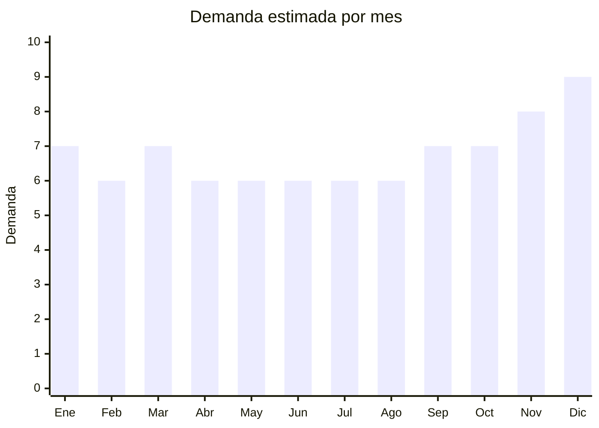

# Balanzas Digitales

> **Capitulo NCM 84** — Maquinas, aparatos y artefactos mecanicos | **Temporada:** Atemporal

## Que es y por que importarlo

Las balanzas digitales son instrumentos de medicion de peso que utilizan sensores electronicos (celdas de carga) para mostrar el peso en una pantalla digital. Abarcan desde pequenas balanzas de cocina hasta balanzas personales de bano, postales y de precision para joyeria. Son uno de los productos con mejor relacion inversion-retorno para importar.

Con precios FOB desde USD 2 por unidad y margenes brutos de 200% a 400%, las balanzas digitales son ideales para importadores que comienzan. Su peso liviano (200g a 1kg) permite incluso envio aereo, lo que reduce tiempos y simplifica la logistica. En MercadoLibre Argentina hay mas de 3,700 publicaciones activas, demostrando una demanda sostenida.

**Sin antidumping.**

## Datos clave

| Dato | Valor |
|------|-------|
| **Posiciones NCM tipicas** | 8423.10.00 |
| **Derecho de importacion** | 14% — 18% (DIE) + 3% tasa estadistica |
| **Rango FOB tipico** | USD 2 — USD 5 por unidad |
| **Precio de venta en Argentina** | ARS 8,000 — ARS 25,000 |
| **Margen bruto estimado** | 200% — 400% |
| **MOQ tipico** | 100 — 1,000 unidades |
| **Demanda en MercadoLibre** | Alta (3,700+ resultados) |
| **Competencia en MercadoLibre** | Media (marcas genericas dominan, pocas marcas fuertes) |
| **Dificultad para importar** | Baja |
| **Certificaciones necesarias** | Ninguna obligatoria para uso domestico |
| **Antidumping** | **No** |

## Variantes y subtipos mas comunes

| Subtipo / Variante | FOB aprox. | Venta AR aprox. | Nota |
|--------------------|-----------|-----------------|------|
| Cocina 1-5 kg | USD 2 — 3 | ARS 8,000 — 12,000 | La mas vendida. Precision 1g. Ideal para reposteria y dietas |
| Cocina 1-10 kg | USD 3 — 4 | ARS 10,000 — 15,000 | Mayor capacidad. Popular en cocinas profesionales |
| Personal/bano (150kg) | USD 3 — 5 | ARS 12,000 — 20,000 | Balanza de piso. Pantalla LCD grande. Buena demanda |
| Postal/paqueteria (30-50kg) | USD 4 — 5 | ARS 15,000 — 25,000 | Nicho especifico para emprendedores de e-commerce |
| Joyeria/precision (0.01g) | USD 2 — 4 | ARS 8,000 — 15,000 | Precision de centesima de gramo. Nicho joyeria y laboratorio |

## Regulaciones y requisitos

<Tabs>
  <Tab title="Certificaciones">
    - **Uso domestico**: No requiere certificaciones especiales para balanzas de uso domestico (cocina, bano)
    - **Uso comercial/metrologia legal**: Si la balanza se usa para transacciones comerciales (venta por peso), SI requiere aprobacion de modelo por INTI y verificacion periodica
    - **Pilas/baterias**: Si usa pilas (comun en balanzas de cocina), no hay restricciones especiales de transporte como con Li-ion
    - **Costo**: Minimo para uso domestico. USD 1,500+ si se busca aprobacion de metrologia legal
  </Tab>
  <Tab title="Etiquetado">
    - Manual de instrucciones en espanol
    - Datos del importador: razon social, CUIT, domicilio
    - Capacidad maxima de peso y precision (ej: 5kg / 1g)
    - Tipo de alimentacion (pilas CR2032, AAA, recargable, etc.)
    - Unidades de medida disponibles (g, kg, oz, lb)
    - Pais de origen
  </Tab>
  <Tab title="Restricciones">
    - **Sin restricciones significativas** para balanzas de uso domestico
    - **Metrologia legal**: Solo aplica si se comercializa para uso en transacciones comerciales de venta por peso
    - **Pilas incluidas**: Si las balanzas incluyen pilas, verificar que sean de buena calidad y no esten vencidas al llegar
    - **Precision**: Verificar que la precision declarada sea real mediante pruebas con pesas patron antes de importar
  </Tab>
</Tabs>

## Logistica

| Dato | Valor |
|------|-------|
| **Peso tipico por unidad** | 0.2 — 1 kg |
| **Volumen tipico** | Bajo |
| **Fragilidad** | Media (pantalla LCD y celda de carga son sensibles) |
| **Envio recomendado** | Aereo (posible y recomendado para primeros pedidos) o maritimo (para volumen) |
| **Tiempo total estimado** | 5 — 10 dias (aereo) / 40 — 60 dias (maritimo) |

<Tip>
Las balanzas digitales son uno de los pocos productos de este capitulo donde el envio aereo es economicamente viable gracias a su bajo peso (200g-1kg por unidad). Para un primer pedido de prueba, puedes importar 200-500 unidades por via aerea y tener stock en 7-10 dias. Esto te permite validar el mercado rapidamente antes de hacer un pedido maritimo grande.
</Tip>

## Estacionalidad



| Aspecto | Detalle |
|---------|---------|
| **Meses pico** | Noviembre-Diciembre (regalos). Enero tambien sube por propositos de ano nuevo (dieta, salud) que impulsan balanzas de cocina y personales |
| **Meses valle** | Demanda muy estable durante todo el ano. Producto de uso cotidiano |

## Ventajas y riesgos

<CardGroup cols={2}>
  <Card title="Ventajas" icon="circle-check">
    - Margenes brutos excepcionales (200-400%)
    - Inversion inicial muy baja (desde USD 2/unidad)
    - Producto liviano, envio aereo viable
    - Sin certificaciones obligatorias para uso domestico
    - Competencia fragmentada (pocas marcas dominantes)
    - Alta rotacion de inventario
    - Multiples nichos (cocina, bano, joyeria, postal)
  </Card>
  <Card title="Riesgos" icon="triangle-exclamation">
    - Producto de bajo ticket unitario (necesitas volumen)
    - Calidad de celdas de carga variable entre proveedores
    - Precision declarada puede no coincidir con la real
    - Producto sensible a golpes (pantalla LCD, sensores)
    - Pilas incluidas pueden llegar descargadas o vencidas
    - Mercado de precio bajo donde centavos de dolar importan
  </Card>
</CardGroup>

## Palabras clave para buscar en Alibaba

```
digital kitchen scale 5kg 1g
digital kitchen scale 10kg
digital bathroom scale 180kg
digital postal scale 50kg
precision scale 0.01g jewelry
electronic kitchen scale LCD
digital weighing scale OEM
mini digital scale portable
food scale stainless steel platform
```

## Fuentes

- [MercadoLibre Argentina — Balanzas digitales](https://listado.mercadolibre.com.ar/balanza-digital)
- [Alibaba — Digital Kitchen Scale](https://www.alibaba.com/trade/search?SearchText=digital+kitchen+scale)
