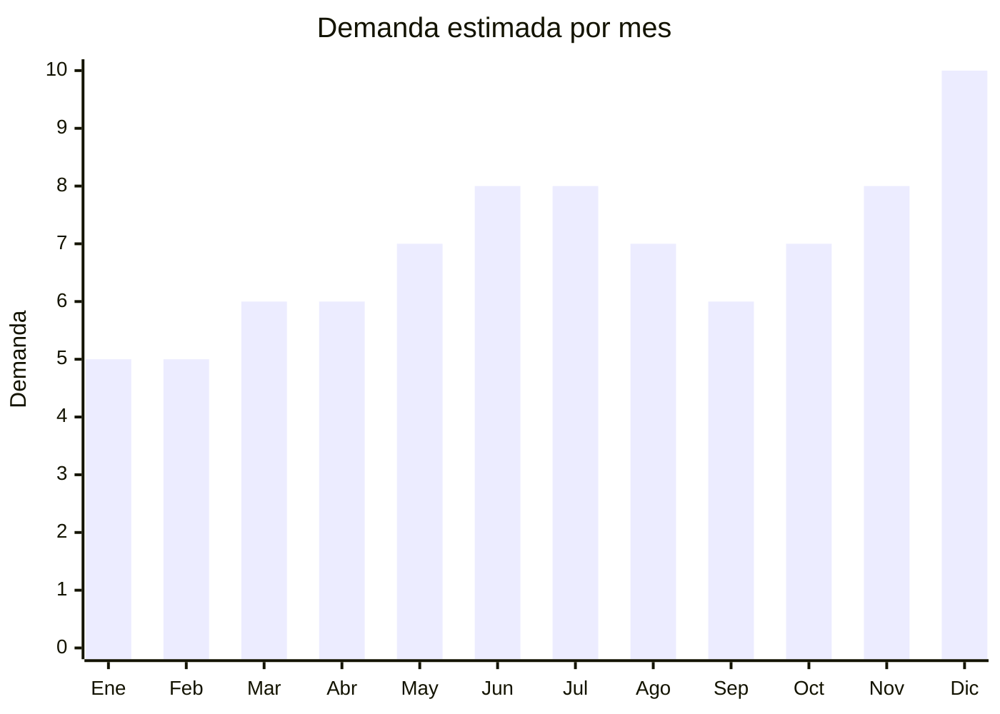

# Cafeteras

> **Capitulo NCM 84** — Maquinas, aparatos y artefactos mecanicos | **Temporada:** Atemporal

## Que es y por que importarlo

Las cafeteras electricas abarcan una amplia gama de productos, desde las simples cafeteras de goteo hasta las maquinas espresso automaticas. El boom del cafe de especialidad (specialty coffee) en Argentina ha impulsado fuertemente la demanda de cafeteras de mayor calidad para uso domestico, especialmente las express manuales y las de capsulas.

Los precios FOB desde China permiten margenes de 150% a 300%, con el segmento express manual como el de mayor potencial. La cultura del cafe en Argentina es una de las mas fuertes de Latinoamerica, lo que garantiza una base de demanda solida y creciente.

**Sin antidumping.**

## Datos clave

| Dato | Valor |
|------|-------|
| **Posiciones NCM tipicas** | 8516.71.00 |
| **Derecho de importacion** | 20% (DIE) + 3% tasa estadistica |
| **Rango FOB tipico** | USD 5 — USD 40 por unidad |
| **Precio de venta en Argentina** | ARS 40,000 — ARS 200,000 |
| **Margen bruto estimado** | 150% — 300% |
| **MOQ tipico** | 50 — 300 unidades |
| **Demanda en MercadoLibre** | Muy Alta (25,000+ resultados) |
| **Competencia en MercadoLibre** | Alta (Nespresso, Dolce Gusto, Oster, Philips, Peabody) |
| **Dificultad para importar** | Media |
| **Certificaciones necesarias** | S-Mark + QR obligatorio (aparato electrico) |
| **Antidumping** | **No** |

## Variantes y subtipos mas comunes

| Subtipo / Variante | FOB aprox. | Venta AR aprox. | Nota |
|--------------------|-----------|-----------------|------|
| Cafetera de goteo (drip) | USD 5 — 10 | ARS 40,000 — 70,000 | Clasica americana. Demanda estable, bajo margen unitario |
| Italiana electrica (moka) | USD 5 — 8 | ARS 35,000 — 60,000 | Version electrica de la moka. Nicho especifico |
| Express manual (15-20 bar) | USD 15 — 30 | ARS 80,000 — 150,000 | La mas demandada. Boom del specialty coffee la impulsa. Mejor relacion margen/demanda |
| De capsulas (compatible) | USD 12 — 25 | ARS 70,000 — 130,000 | Compatible con capsulas Nespresso/Dolce Gusto. Negocio recurrente por capsulas |
| Espresso automatica | USD 30 — 40 | ARS 150,000 — 200,000 | Premium. Molinillo integrado. Menor volumen pero mayor margen |

## Regulaciones y requisitos

<Tabs>
  <Tab title="Certificaciones">
    - **S-Mark obligatorio**: Toda cafetera electrica requiere certificacion de seguridad electrica
    - **Codigo QR**: Obligatorio, vinculado a informacion de seguridad del producto
    - **ENACOM**: No requerido, salvo modelos smart con conectividad WiFi/Bluetooth (muy poco comunes)
    - **Costo certificacion**: USD 800 — USD 1,500 por modelo
    - **Tiempo**: 30 — 60 dias para certificacion S-Mark
  </Tab>
  <Tab title="Etiquetado">
    - Manual de instrucciones en espanol con procedimientos de limpieza
    - Datos del importador: razon social, CUIT, domicilio legal
    - Indicacion de voltaje (220V / 50Hz) y potencia en watts
    - Materiales en contacto con alimentos/agua: deben ser food grade
    - Presion de trabajo en bares (para modelos express)
    - Capacidad del deposito de agua en litros
  </Tab>
  <Tab title="Restricciones">
    - **Materiales food grade**: Depositos, filtros y partes en contacto con agua/cafe deben ser aptos para alimentos
    - **BPA Free**: Los componentes plasticos no deben contener BPA
    - **Voltaje**: Critico verificar 220V/50Hz. Las cafeteras express son especialmente sensibles al voltaje
    - **Presion**: Las express deben alcanzar minimo 15 bar de presion para un espresso correcto
    - **Compatibilidad de capsulas**: Si es modelo de capsulas, verificar compatibilidad real con marcas disponibles en Argentina
  </Tab>
</Tabs>

## Logistica

| Dato | Valor |
|------|-------|
| **Peso tipico por unidad** | 2 — 6 kg |
| **Volumen tipico** | Medio-Alto |
| **Fragilidad** | Media-Alta (componentes internos de presion, portafiltros) |
| **Envio recomendado** | Maritimo (por peso y volumen) |
| **Tiempo total estimado** | 7 — 15 dias (aereo) / 45 — 70 dias (maritimo) |

<Tip>
El segmento de cafeteras express manuales (15-20 bar) es el de mayor potencial. Busca modelos con portafiltro de 51mm o 58mm (estandar de la industria), ya que los usuarios de specialty coffee valoran la compatibilidad con accesorios del mercado. Incluir un tamper y jarra espumadora como accesorios agrega valor percibido sin aumentar mucho el costo FOB.
</Tip>

## Estacionalidad



| Aspecto | Detalle |
|---------|---------|
| **Meses pico** | Junio-Julio (invierno, mayor consumo de cafe caliente), Noviembre-Diciembre (Black Friday, Navidad). La cafetera es un regalo clasico |
| **Meses valle** | Enero-Febrero (verano, menor consumo de cafe caliente). Aun asi la demanda se mantiene razonable |

## Ventajas y riesgos

<CardGroup cols={2}>
  <Card title="Ventajas" icon="circle-check">
    - Tendencia specialty coffee impulsa demanda creciente
    - Margenes de 150-300% sobre costo FOB
    - Cultura del cafe muy arraigada en Argentina
    - Producto de regalo ideal (alto volumen en fiestas)
    - Modelo de capsulas genera negocio recurrente
    - Multiples segmentos de precio para posicionarse
  </Card>
  <Card title="Riesgos" icon="triangle-exclamation">
    - Competencia fuerte de marcas premium (Nespresso, Oster, Philips)
    - Servicio tecnico post-venta critico (presion, caldera, bombas)
    - Calidad de la extraccion debe ser verificada antes de importar
    - Compatibilidad de capsulas puede generar reclamos si no es real
    - Producto pesado que requiere envio maritimo
    - Garantia legal de 6 meses minimo obligatoria
  </Card>
</CardGroup>

## Palabras clave para buscar en Alibaba

```
espresso coffee machine 15 bar 220V
coffee maker express manual 220V
capsule coffee machine nespresso compatible 220V
drip coffee maker 220V 50Hz
coffee machine 20 bar pump 220V
semi automatic espresso machine
coffee maker OEM private label
moka pot electric 220V
```

## Fuentes

- [MercadoLibre Argentina — Cafeteras](https://listado.mercadolibre.com.ar/cafetera)
- [Alibaba — Espresso Coffee Machine 220V](https://www.alibaba.com/trade/search?SearchText=espresso+coffee+machine+220V)
