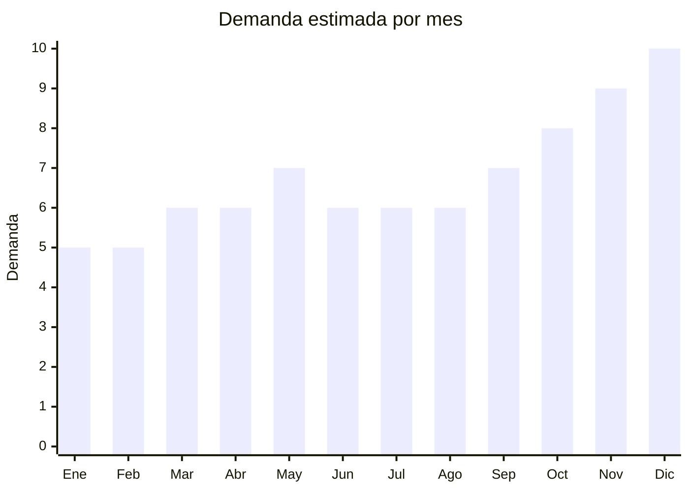

# Freidoras de Aire

> **Capitulo NCM 84** — Maquinas, aparatos y artefactos mecanicos | **Temporada:** Atemporal

## Que es y por que importarlo

La freidora de aire (air fryer) es un electrodomestico que cocina alimentos mediante circulacion de aire caliente a alta velocidad, logrando resultados similares a la fritura pero con minimo o nulo uso de aceite. Es el producto N.1 en ventas de pequenos electrodomesticos en Argentina, con una tendencia consolidada que crece ano tras ano impulsada por la busqueda de cocina mas saludable.

China fabrica la gran mayoria de las freidoras de aire del mundo, lo que permite acceder a precios FOB muy competitivos con margenes brutos de 150% a 300%. La demanda en MercadoLibre es extremadamente alta, con miles de publicaciones activas y volumen de ventas sostenido durante todo el ano.

**Sin antidumping.**

## Datos clave

| Dato | Valor |
|------|-------|
| **Posiciones NCM tipicas** | 8516.60.00 |
| **Derecho de importacion** | 20% (DIE) + 3% tasa estadistica |
| **Rango FOB tipico** | USD 10 — USD 35 por unidad |
| **Precio de venta en Argentina** | ARS 50,000 — ARS 200,000 |
| **Margen bruto estimado** | 150% — 300% |
| **MOQ tipico** | 50 — 200 unidades |
| **Demanda en MercadoLibre** | Muy Alta (20,000+ resultados) |
| **Competencia en MercadoLibre** | Alta (Atma, Philco, Peabody, Gadnic) |
| **Dificultad para importar** | Media |
| **Certificaciones necesarias** | S-Mark + QR obligatorio (aparato electrico) |
| **Antidumping** | **No** |

## Variantes y subtipos mas comunes

| Subtipo / Variante | FOB aprox. | Venta AR aprox. | Nota |
|--------------------|-----------|-----------------|------|
| Economica 3-4L | USD 10 — 15 | ARS 50,000 — 80,000 | Ideal para parejas o personas solas. Mas facil de vender por precio |
| Familiar 5-6L | USD 15 — 22 | ARS 80,000 — 130,000 | La mas vendida. Capacidad ideal para familias de 3-4 personas |
| Profesional 8-12L | USD 25 — 35 | ARS 130,000 — 200,000 | Mayor margen. Funciona como horno convector compacto |
| Doble canasta | USD 20 — 30 | ARS 100,000 — 180,000 | Tendencia creciente. Permite cocinar dos preparaciones simultaneas |

## Regulaciones y requisitos

<Tabs>
  <Tab title="Certificaciones">
    - **S-Mark obligatorio**: Toda freidora de aire requiere certificacion de seguridad electrica S-Mark para poder comercializarse en Argentina
    - **Codigo QR**: Debe incluir codigo QR en el producto que enlace a la informacion de seguridad del fabricante
    - **Laboratorio autorizado**: La certificacion debe realizarse en un laboratorio acreditado por el organismo nacional competente
    - **Costo aproximado**: USD 800 — USD 1,500 por modelo a certificar
    - **Tiempo**: 30 — 60 dias para obtener la certificacion
  </Tab>
  <Tab title="Etiquetado">
    - Etiqueta de eficiencia energetica (si aplica segun resolucion vigente)
    - Manual de instrucciones en espanol
    - Datos del importador en etiqueta: razon social, CUIT, domicilio
    - Voltaje: 220V / 50Hz (verificar que NO sea 110V)
    - Indicacion de potencia en watts
  </Tab>
  <Tab title="Restricciones">
    - **ENACOM**: No requiere homologacion, salvo modelos con conectividad WiFi que si necesitan tramite ante ENACOM
    - **Voltaje**: Asegurar que el producto sea compatible con 220V/50Hz. Muchos modelos chinos vienen en version 110V
    - **Enchufe**: Debe ser tipo I (tres patas) o incluir adaptador. El enchufe chino NO es compatible
    - **Sin restricciones de importacion adicionales** para este tipo de producto
  </Tab>
</Tabs>

## Logistica

| Dato | Valor |
|------|-------|
| **Peso tipico por unidad** | 3 — 8 kg |
| **Volumen tipico** | Alto (cajas voluminosas) |
| **Fragilidad** | Media (componentes plasticos y resistencias internas) |
| **Envio recomendado** | Maritimo (obligatorio por peso y volumen) |
| **Tiempo total estimado** | 7 — 15 dias (aereo) / 45 — 70 dias (maritimo) |

<Tip>
Las freidoras de aire son productos voluminosos. Al negociar con el proveedor, solicita que el embalaje sea lo mas compacto posible (sin doble caja innecesaria) para optimizar el espacio en contenedor. Un contenedor de 40 pies puede transportar aproximadamente 800-1,200 unidades dependiendo del tamano del modelo. Prioriza modelos de 5-6L que ofrecen el mejor balance entre volumen de carga y precio de venta.
</Tip>

## Estacionalidad



| Aspecto | Detalle |
|---------|---------|
| **Meses pico** | Octubre a Diciembre (Hot Sale, Black Friday, Navidad y Fiestas). Mayo tambien sube por Hot Sale de otono |
| **Meses valle** | Enero-Febrero (post-fiestas), aunque la demanda nunca baja demasiado por ser producto de uso diario |

## Ventajas y riesgos

<CardGroup cols={2}>
  <Card title="Ventajas" icon="circle-check">
    - Demanda consolidada y en crecimiento sostenido
    - Margenes brutos de 150-300% sobre costo de importacion
    - Producto N.1 en pequenos electrodomesticos
    - Multiples variantes permiten segmentar mercado
    - Tendencia de cocina saludable impulsa ventas
    - Producto de uso diario con alta rotacion
  </Card>
  <Card title="Riesgos" icon="triangle-exclamation">
    - Competencia alta con marcas posicionadas (Atma, Philips, Peabody)
    - Certificacion S-Mark obligatoria suma costo y tiempo
    - Producto voluminoso que requiere envio maritimo
    - Verificar compatibilidad 220V/50Hz antes de comprar
    - Garantia y servicio tecnico post-venta necesarios
    - Riesgo de modelos con enchufe no compatible
  </Card>
</CardGroup>

## Palabras clave para buscar en Alibaba

```
air fryer 3.5L 220V
air fryer 5.5L digital 220V
air fryer 6L touch screen
air fryer dual basket 8L
air fryer OEM ODM private label
electric air fryer 1500W 220V 50Hz
oil free fryer large capacity
digital air fryer LCD display
```

## Fuentes

- [MercadoLibre Argentina — Freidoras de aire](https://listado.mercadolibre.com.ar/freidora-de-aire)
- [Alibaba — Air Fryer 220V](https://www.alibaba.com/trade/search?SearchText=air+fryer+220V)
