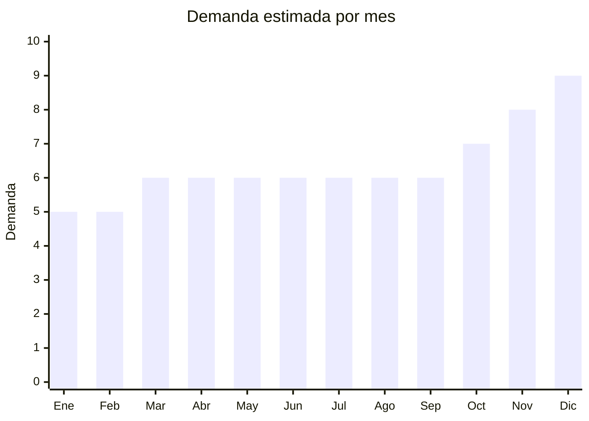

# Licuadoras y Batidoras

> **Capitulo NCM 84** — Maquinas, aparatos y artefactos mecanicos | **Temporada:** Atemporal

## Que es y por que importarlo

Las licuadoras y batidoras son electrodomesticos esenciales de cocina presentes en practicamente todos los hogares argentinos. Incluyen desde minipimers multifuncion hasta licuadoras de vaso de alta potencia. Su caracter de producto basico garantiza una demanda constante y predecible durante todo el ano.

Con precios FOB desde USD 3 por unidad, representan una de las opciones de importacion con menor inversion inicial y riesgo reducido. La clave del negocio esta en los modelos multifuncion (minipimer 4 en 1, mixer con accesorios) que permiten un mayor precio de venta y margen.

**Sin antidumping.**

## Datos clave

| Dato | Valor |
|------|-------|
| **Posiciones NCM tipicas** | 8509.40.00 (procesadores/batidoras), 8210.00.00 (manuales) |
| **Derecho de importacion** | 20% (DIE) + 3% tasa estadistica |
| **Rango FOB tipico** | USD 3 — USD 15 por unidad |
| **Precio de venta en Argentina** | ARS 20,000 — ARS 80,000 |
| **Margen bruto estimado** | 150% — 250% |
| **MOQ tipico** | 100 — 500 unidades |
| **Demanda en MercadoLibre** | Muy Alta (15,000+ resultados) |
| **Competencia en MercadoLibre** | Alta (Philips, Philco, Atma, Liliana, Gadnic) |
| **Dificultad para importar** | Baja-Media |
| **Certificaciones necesarias** | S-Mark + QR obligatorio (aparato electrico) |
| **Antidumping** | **No** |

## Variantes y subtipos mas comunes

| Subtipo / Variante | FOB aprox. | Venta AR aprox. | Nota |
|--------------------|-----------|-----------------|------|
| Minipimer basica | USD 3 — 5 | ARS 20,000 — 35,000 | Alta rotacion, bajo margen unitario. Ideal para volumen |
| Minipimer 4 en 1 | USD 5 — 8 | ARS 35,000 — 55,000 | Incluye vaso, procesador, batidor. La mas vendida por relacion precio-funcionalidad |
| Licuadora de vaso 1.5L | USD 6 — 10 | ARS 30,000 — 50,000 | Clasica. Importante verificar calidad del vaso (vidrio vs plastico) |
| Batidora de mano | USD 4 — 7 | ARS 25,000 — 45,000 | Para reposteria. Demanda estable |
| Mixer profesional / alta potencia | USD 10 — 15 | ARS 55,000 — 80,000 | 1000W+, vaso de vidrio/tritan. Mayor margen, menor volumen de ventas |

## Regulaciones y requisitos

<Tabs>
  <Tab title="Certificaciones">
    - **S-Mark obligatorio**: Todos los modelos electricos requieren certificacion de seguridad electrica
    - **Codigo QR**: Obligatorio en el producto, vinculado a informacion de seguridad
    - **ENACOM**: No requerido (estos productos no incluyen conectividad inalambrica)
    - **Costo certificacion**: USD 600 — USD 1,200 por modelo
    - **Tiempo**: 20 — 45 dias para obtener la certificacion S-Mark
  </Tab>
  <Tab title="Etiquetado">
    - Manual de instrucciones en espanol
    - Datos del importador: razon social, CUIT, domicilio
    - Indicacion de voltaje (220V / 50Hz) y potencia en watts
    - Material en contacto con alimentos: debe indicar que es apto (food grade)
    - Pais de origen visible
  </Tab>
  <Tab title="Restricciones">
    - **Materiales food grade**: Las cuchillas y vasos deben ser aptos para contacto con alimentos. Solicitar certificado al proveedor
    - **Voltaje**: Verificar compatibilidad 220V/50Hz. Problema comun con modelos disenados para 110V
    - **BPA Free**: Verificar que los componentes plasticos no contengan BPA (bisfenol A), ya que es un requisito creciente del mercado
    - **Sin restricciones adicionales** de importacion
  </Tab>
</Tabs>

## Logistica

| Dato | Valor |
|------|-------|
| **Peso tipico por unidad** | 1 — 3 kg |
| **Volumen tipico** | Medio |
| **Fragilidad** | Media (cuidado con vasos de vidrio y cuchillas) |
| **Envio recomendado** | Maritimo (por volumen) o aereo (pedidos pequenos) |
| **Tiempo total estimado** | 5 — 10 dias (aereo) / 40 — 65 dias (maritimo) |

<Tip>
Los modelos minipimer 4 en 1 ofrecen la mejor relacion entre costo de importacion, precio de venta y volumen logistico. Al ser mas compactos que las licuadoras de vaso, se pueden transportar mas unidades por contenedor. Un contenedor de 20 pies puede transportar entre 2,000 y 4,000 unidades de minipimers.
</Tip>

## Estacionalidad



| Aspecto | Detalle |
|---------|---------|
| **Meses pico** | Octubre a Diciembre (Hot Sale, Black Friday, Navidad). Producto clasico de regalo |
| **Meses valle** | Enero-Febrero. La demanda es muy estable por ser producto basico de cocina |

## Ventajas y riesgos

<CardGroup cols={2}>
  <Card title="Ventajas" icon="circle-check">
    - Inversion inicial muy baja (desde USD 3/unidad FOB)
    - Demanda constante y predecible todo el ano
    - Producto esencial de cocina, presente en todos los hogares
    - No requiere ENACOM (simplifica tramites)
    - Multiples variantes permiten cubrir distintos segmentos de precio
    - Alta rotacion de inventario
  </Card>
  <Card title="Riesgos" icon="triangle-exclamation">
    - Competencia muy alta con marcas establecidas
    - Margenes menores en modelos basicos (compensar con volumen)
    - Calidad de cuchillas y motores variable entre proveedores
    - Vasos de vidrio aumentan fragilidad en transporte
    - Producto commodity donde el precio es clave
    - Necesidad de garantia y repuestos (cuchillas, vasos)
  </Card>
</CardGroup>

## Palabras clave para buscar en Alibaba

```
hand blender 4 in 1 220V
immersion blender set 220V
blender jar 1.5L 220V 50Hz
hand mixer electric 220V
food processor mini 220V
stick blender multifunctional
juicer blender glass jar 220V
kitchen blender OEM private label
```

## Fuentes

- [MercadoLibre Argentina — Licuadoras y batidoras](https://listado.mercadolibre.com.ar/licuadora-batidora)
- [Alibaba — Hand Blender 220V](https://www.alibaba.com/trade/search?SearchText=hand+blender+220V)
