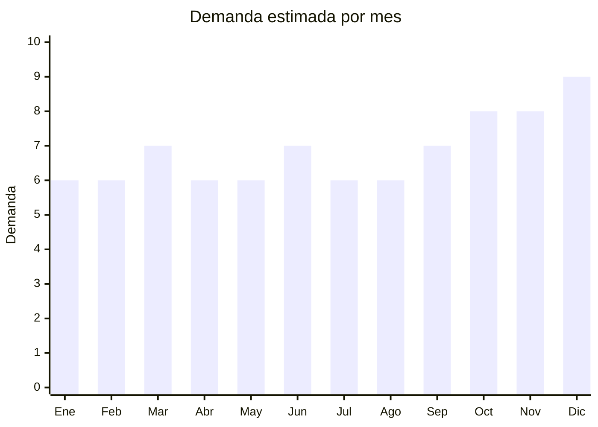

# Taladros y Atornilladores

> **Capitulo NCM 84** — Maquinas, aparatos y artefactos mecanicos | **Temporada:** Atemporal

## Que es y por que importarlo

Los taladros y atornilladores inalambricos son herramientas electricas portatiles esenciales tanto para uso profesional como hogareno. Los modelos a bateria de litio (12V, 18V, 20V) dominan el mercado por su comodidad y portabilidad. Yongkang, en la provincia de Zhejiang (China), es la capital mundial de herramientas electricas, con cientos de fabricantes que ofrecen precios FOB muy competitivos.

Una ventaja clave de importar herramientas electricas es que tributan IVA al 10.5% (en lugar del 21% estandar) por ser consideradas bienes de capital, lo que mejora el flujo de caja y el margen neto. Los derechos de importacion tambien son menores (5-14%) comparados con electrodomesticos.

**Sin antidumping.**

## Datos clave

| Dato | Valor |
|------|-------|
| **Posiciones NCM tipicas** | 8467.21.00 |
| **Derecho de importacion** | 5% — 14% (DIE) + 3% tasa estadistica |
| **Rango FOB tipico** | USD 8 — USD 30 por unidad |
| **Precio de venta en Argentina** | ARS 30,000 — ARS 120,000 |
| **Margen bruto estimado** | 150% — 300% |
| **MOQ tipico** | 100 — 500 unidades |
| **Demanda en MercadoLibre** | Muy Alta (18,000+ resultados) |
| **Competencia en MercadoLibre** | Alta (Bosch, Makita, DeWalt, Black+Decker, Gadnic, Lusqtoff) |
| **Dificultad para importar** | Media |
| **Certificaciones necesarias** | S-Mark (puede requerir segun modelo) |
| **Antidumping** | **No** |

## Variantes y subtipos mas comunes

| Subtipo / Variante | FOB aprox. | Venta AR aprox. | Nota |
|--------------------|-----------|-----------------|------|
| Atornillador 12V basico | USD 8 — 12 | ARS 30,000 — 50,000 | Entrada al mercado. Ideal para uso hogareno. Alta rotacion |
| Taladro percutor 18V | USD 12 — 20 | ARS 50,000 — 80,000 | El mas vendido. Uso semi-profesional. Incluye 2 baterias idealmente |
| Combo taladro + amoladora | USD 20 — 28 | ARS 70,000 — 100,000 | Excelente valor percibido. Mayor ticket promedio |
| Brushless premium 20V | USD 22 — 30 | ARS 80,000 — 120,000 | Motor sin escobillas, mayor durabilidad. Segmento profesional |

## Regulaciones y requisitos

<Tabs>
  <Tab title="Certificaciones">
    - **S-Mark**: Puede ser requerido dependiendo del modelo y la clasificacion del producto. Consultar con laboratorio acreditado
    - **IVA reducido**: Las herramientas electricas portatiles tributan IVA al **10.5%** como bienes de capital, no al 21% estandar. Esto es una ventaja significativa
    - **Costo certificacion**: USD 600 — USD 1,200 por modelo (si aplica S-Mark)
    - **Tiempo**: 20 — 45 dias
  </Tab>
  <Tab title="Etiquetado">
    - Manual de instrucciones en espanol con normas de seguridad
    - Datos del importador: razon social, CUIT, domicilio
    - Indicacion de voltaje de bateria (12V, 18V, 20V) y tipo (Li-ion)
    - Capacidad de bateria en Ah (amperios-hora)
    - Velocidad maxima en RPM
    - Torque maximo en Nm (Newton-metro)
    - Pais de origen
  </Tab>
  <Tab title="Restricciones">
    - **Baterias Li-ion**: Requieren documentacion especifica para transporte: MSDS (Hoja de Datos de Seguridad) y certificado de prueba UN38.3
    - **Transporte aereo**: Las baterias de litio tienen restricciones especificas. Deben viajar integradas en el equipo o con embalaje especial
    - **Cargador 220V**: Verificar que el cargador incluido sea compatible con 220V/50Hz. Es el error mas comun
    - **Normas de seguridad**: Deben cumplir con normas de proteccion contra sobrecarga y cortocircuito en baterias
  </Tab>
</Tabs>

## Logistica

| Dato | Valor |
|------|-------|
| **Peso tipico por unidad** | 1.5 — 4 kg (con baterias y maletin) |
| **Volumen tipico** | Medio (maletines rigidos) |
| **Fragilidad** | Baja-Media (productos robustos, pero baterias son sensibles) |
| **Envio recomendado** | Maritimo (recomendado por volumen y regulacion de baterias) |
| **Tiempo total estimado** | 10 — 20 dias (aereo, con restricciones Li-ion) / 45 — 70 dias (maritimo) |

<Tip>
Yongkang (Zhejiang, China) es la capital mundial de herramientas electricas. Al buscar proveedores en Alibaba, filtra por ubicacion "Yongkang" para acceder directamente a fabricantes especializados con anos de experiencia en el rubro. Solicita siempre el certificado UN38.3 de las baterias ANTES de confirmar la orden, ya que sin este documento el envio puede ser rechazado.
</Tip>

<Warning>
Las baterias de litio-ion son clasificadas como mercancia peligrosa para transporte. Cada envio debe incluir: MSDS actualizado, certificado UN38.3, y el embalaje debe cumplir con regulaciones IATA (aereo) o IMDG (maritimo). Un envio sin esta documentacion sera rechazado y puede generar multas.
</Warning>

## Estacionalidad



| Aspecto | Detalle |
|---------|---------|
| **Meses pico** | Octubre a Diciembre (regalos de fin de ano, Black Friday). Marzo y Septiembre tambien suben por inicio de obras/refacciones de temporada |
| **Meses valle** | Demanda relativamente estable todo el ano. Herramientas tienen menor estacionalidad que electrodomesticos |

## Ventajas y riesgos

<CardGroup cols={2}>
  <Card title="Ventajas" icon="circle-check">
    - IVA reducido al 10.5% (bien de capital) mejora margen neto
    - Derechos de importacion menores (5-14% vs 20% de electrodomesticos)
    - Demanda constante y alta todo el ano
    - Yongkang ofrece cientos de proveedores especializados
    - Combos (taladro + amoladora) aumentan ticket promedio
    - Producto de larga durabilidad, genera confianza en la marca
  </Card>
  <Card title="Riesgos" icon="triangle-exclamation">
    - Baterias Li-ion requieren documentacion especial de transporte
    - Competencia fuerte de marcas profesionales (Bosch, Makita, DeWalt)
    - Calidad de baterias y cargador es critica (riesgo de baterias genericas)
    - Cargador debe ser 220V/50Hz (error frecuente con modelos de 110V)
    - Servicio tecnico y repuestos necesarios (carbones, baterias de reemplazo)
    - Garantia legal obligatoria de 6 meses minimo
  </Card>
</CardGroup>

## Palabras clave para buscar en Alibaba

```
cordless drill 18V lithium battery
cordless drill driver 20V brushless
electric drill 12V rechargeable
impact drill 18V Li-ion two batteries
power tool combo kit drill angle grinder
cordless screwdriver 12V
brushless hammer drill 20V
power tools set 21V OEM Yongkang
```

## Fuentes

- [MercadoLibre Argentina — Taladros y atornilladores](https://listado.mercadolibre.com.ar/taladro-atornillador-inalambrico)
- [Alibaba — Cordless Drill 18V](https://www.alibaba.com/trade/search?SearchText=cordless+drill+18V+lithium)
