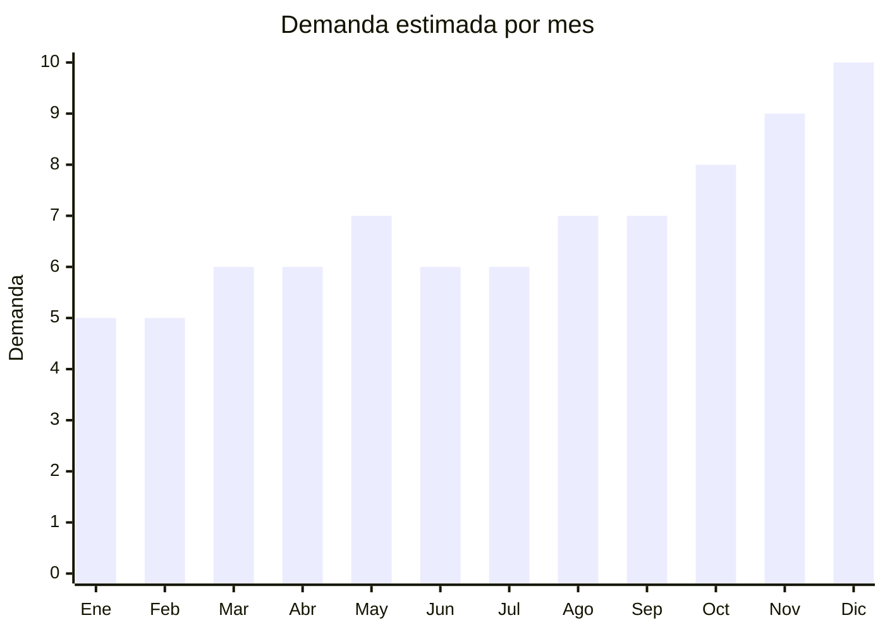

# Aros de Luz (Ring Light)

> **Capitulo NCM 85** — Maquinas, aparatos y material electrico | **Temporada:** Atemporal

## Que es y por que importarlo

El aro de luz (ring light) es una luminaria circular con LEDs que proporciona iluminacion uniforme y sin sombras, especialmente disenada para fotografia, videollamadas, streaming y creacion de contenido para redes sociales. Se popularizo con el auge de YouTube, TikTok e Instagram, y su demanda sigue creciendo impulsada por el trabajo remoto, las videollamadas profesionales y la economia de creadores de contenido.

China es el principal fabricante mundial de ring lights, con precios FOB desde USD 3 por unidades basicas hasta USD 12 por modelos profesionales con tripode incluido. En Argentina, marcas como Bodeltec y Aitech dominan el segmento medio, pero hay amplio espacio para importadores con marca propia. Los margenes brutos oscilan entre 200% y 350%, y la principal ventaja es que no requiere homologacion ENACOM (los modelos sin WiFi/Bluetooth no tienen conectividad inalambrica).

**Sin antidumping.**

## Datos clave

| Dato | Valor |
|------|-------|
| **Posiciones NCM tipicas** | 9405.40 (luminarias/aparatos de alumbrado LED), 8539.50 (lamparas LED) |
| **Derecho de importacion** | 14% — 20% (DIE) + 3% tasa estadistica |
| **Rango FOB tipico** | USD 3 — USD 12 por unidad (con tripode) |
| **Precio de venta en Argentina** | ARS 15,000 — ARS 50,000 |
| **Margen bruto estimado** | 200% — 350% |
| **MOQ tipico** | 30 — 200 unidades |
| **Demanda en MercadoLibre** | Alta (miles de publicaciones activas) |
| **Competencia en MercadoLibre** | Media (Bodeltec, Aitech, genericos) |
| **Dificultad para importar** | Facil-Media |
| **Certificaciones necesarias** | S-Mark puede requerir (aparato electrico). ENACOM: No |
| **Antidumping** | **No** |

## Variantes y subtipos mas comunes

| Subtipo / Variante | FOB aprox. | Venta AR aprox. | Nota |
|--------------------|-----------|-----------------|------|
| Ring light 26cm basico (10") | USD 3 — 5 | ARS 15,000 — 25,000 | Entrada. USB. 3 tonos de luz. Incluye soporte celular |
| Ring light 36cm profesional (14") | USD 6 — 10 | ARS 25,000 — 40,000 | El mas vendido. Con tripode de 2m. Control remoto |
| Ring light 36cm RGB | USD 8 — 12 | ARS 30,000 — 50,000 | Colores RGB. Popular en streaming y TikTok |
| Mini ring light clip 10cm | USD 1 — 2 | ARS 5,000 — 10,000 | Se engancha al celular. Selfies y videollamadas |
| Ring light con tripode 2m | USD 8 — 12 | ARS 30,000 — 50,000 | Set completo. Tripode extensible + soporte celular + control |
| Ring light de escritorio | USD 4 — 7 | ARS 15,000 — 30,000 | Base con brazo flexible. Ideal videollamadas y home office |

## Regulaciones y requisitos

<Tabs>
  <Tab title="Certificaciones">
    - **ENACOM**: No requiere homologacion (los modelos estandar no tienen WiFi ni Bluetooth)
    - **S-Mark**: Puede requerirse para modelos que se conectan a la red electrica (220V). Los modelos USB estan exentos en la practica
    - **Codigo QR**: Si aplica S-Mark, debe incluir QR de seguridad
    - **Costo S-Mark** (si aplica): USD 500 — USD 1,000 por modelo
    - **Tiempo**: 30 — 45 dias

    <Note>
    La mayoria de los ring lights populares son alimentados por USB (5V), lo que simplifica el encuadre regulatorio. Si el modelo incluye transformador o se conecta directo a 220V, el requisito de S-Mark es mas estricto.
    </Note>
  </Tab>
  <Tab title="Etiquetado">
    - Manual de instrucciones en espanol
    - Datos del importador: razon social, CUIT, domicilio
    - Potencia en watts
    - Tipo de alimentacion (USB / 220V)
    - Temperatura de color (Kelvin)
    - Garantia legal 6 meses
  </Tab>
  <Tab title="Restricciones">
    - **Sin restricciones especiales** para ring lights
    - **Excepcion**: Si el modelo incluye conectividad Bluetooth para control remoto integrado (no el control remoto separado), podria requerir ENACOM
    - El control remoto Bluetooth que viene suelto generalmente se clasifica por separado
    - Verificar clasificacion NCM: puede caer en 9405 (luminarias) o 8539 (lamparas LED) segun el diseno
  </Tab>
</Tabs>

## Logistica

| Dato | Valor |
|------|-------|
| **Peso tipico por unidad** | 0.5 — 2 kg (con tripode) |
| **Volumen tipico** | Medio (tripode ocupa espacio en largo) |
| **Fragilidad** | Alta (LEDs y difusor plastico fragiles) |
| **Envio recomendado** | Maritimo LCL para volumenes grandes. Aereo viable para pedidos chicos |
| **Tiempo total estimado** | 7 — 15 dias (aereo) / 45 — 70 dias (maritimo) |
| **Baterias de litio** | Algunas unidades incluyen bateria recargable interna o control remoto con pila boton |
| **Requiere empaque especial** | Si: proteccion adicional contra golpes. Solicitar cajas reforzadas con foam |

<Tip>
Los ring lights son productos FRAGILES. Solicitar al proveedor empaque reforzado con foam interior y caja master con separadores. Los modelos con tripode de 2 metros tienen cajas largas que complican el apilado en contenedor. Considerar importar por separado los tripodes y los aros si el volumen lo justifica. Los modelos USB de 26cm son los mas seguros para una primera importacion por su bajo costo y menor riesgo de rotura.
</Tip>

## Estacionalidad



| Aspecto | Detalle |
|---------|---------|
| **Meses pico** | Octubre a Diciembre (Hot Sale, Black Friday, Navidad). Popular como regalo para creadores de contenido y adolescentes |
| **Meses valle** | Enero-Febrero (post-fiestas). La demanda base es estable por uso profesional y home office |
| **Cuando pedir para llegar a tiempo** | Agosto-Septiembre para temporada navidad (considerando 6-10 semanas de lead time maritimo) |

## Ventajas y riesgos

<CardGroup cols={2}>
  <Card title="Ventajas" icon="circle-check">
    - Margenes brutos de 200-350% sobre costo FOB
    - ENACOM no requerido (modelos sin WiFi/BT)
    - Tendencia creciente con economia de creadores
    - Multiples variantes para distintos presupuestos
    - Popular como regalo tecnologico accesible
    - Trabajo remoto y videollamadas sostienen demanda
    - Bajo MOQ permite testear con poca inversion
  </Card>
  <Card title="Riesgos" icon="triangle-exclamation">
    - Producto FRAGIL: alto porcentaje de roturas en transporte
    - Tripodes de baja calidad generan reclamos y devoluciones
    - Competencia creciente con marcas establecidas
    - LEDs de mala calidad pueden tener vida util corta
    - Volumen del empaque encarece flete vs valor del producto
    - Parpadeo (flicker) en LEDs baratos genera reviews negativos
  </Card>
</CardGroup>

<Warning>
La fragilidad es el principal riesgo de este producto. Solicitar videos del empaque al proveedor antes de confirmar el pedido. Invertir en muestras previas para verificar calidad de LEDs (uniformidad, parpadeo, temperatura de color). Los modelos con tripode de aluminio tienen menor tasa de reclamos que los de plastico.
</Warning>

## Palabras clave para buscar en Alibaba

```
ring light 10 inch LED USB
ring light 14 inch tripod stand
ring light 36cm RGB streaming
mini ring light clip selfie
ring light desktop flexible arm
ring light 18 inch professional photography
LED ring light dimmable 3 colors
ring light with phone holder tripod 2m
```

## Fuentes

- [MercadoLibre Argentina — Aro de luz ring light](https://listado.mercadolibre.com.ar/aro-de-luz)
- [Alibaba — Ring light with tripod](https://www.alibaba.com/trade/search?SearchText=ring+light+tripod+stand)
- [Alibaba — LED ring light USB](https://www.alibaba.com/trade/search?SearchText=LED+ring+light+USB)
