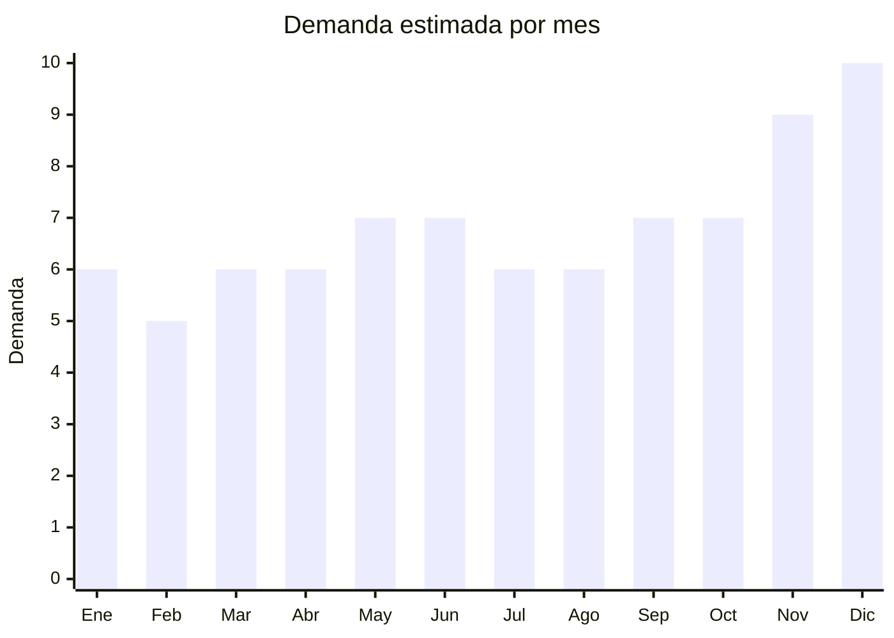

# Auriculares Bluetooth

> **Capitulo NCM 85** — Maquinas, aparatos y material electrico | **Temporada:** Atemporal

## Que es y por que importarlo

Los auriculares Bluetooth son dispositivos de audio inalambricos que se conectan a smartphones, tablets y computadoras mediante tecnologia Bluetooth. Incluyen categorias como TWS (True Wireless Stereo) in-ear, over-ear con vincha, neckband y deportivos. Es uno de los productos electronicos mas vendidos a nivel global y en Argentina.

China, particularmente la ciudad de Shenzhen, es el centro mundial de produccion de auriculares Bluetooth. Fabricas chinas producen tanto para marcas globales (Apple, Samsung, Sony) como para marcas propias y white-label. Esto permite al importador acceder a productos de calidad aceptable a precios FOB extremadamente bajos, con margenes que superan el 200% facilmente. Marcas chinas como Lenovo, QCY, Baseus y Haylou ofrecen productos con muy buena relacion calidad-precio y ya tienen reconocimiento en el mercado argentino.

En MercadoLibre Argentina, los auriculares Bluetooth son uno de los productos mas buscados de la categoria tecnologia. Vendedores como Venex superan las 50,000 unidades vendidas, lo que demuestra la enorme demanda y el potencial del nicho.

## Datos clave

| Dato | Valor |
|------|-------|
| **Posiciones NCM tipicas** | 8518.30.00 |
| **Derecho de importacion** | 20% (DIE) + 3% tasa estadistica |
| **Rango FOB tipico** | USD 1 — USD 8 por unidad |
| **Precio de venta en Argentina** | ARS 5,000 — ARS 40,000 |
| **Margen bruto estimado** | 200% — 500% |
| **MOQ tipico** | 100 — 500 unidades |
| **Demanda en MercadoLibre** | Alta |
| **Competencia en MercadoLibre** | Alta |
| **Dificultad para importar** | Moderada (requiere ENACOM) |
| **Certificaciones necesarias** | ENACOM (Bluetooth), S-Mark + QR fiscal |
| **Antidumping** | **No** |

## Demanda y mercado en Argentina

- **Volumen de mercado:** Miles de publicaciones activas en MercadoLibre con ventas que superan las 50,000 unidades en los vendedores top. Es una de las categorias mas activas de electronica.
- **Tendencia:** Creciente. La adopcion de auriculares inalambricos sigue en aumento, especialmente TWS in-ear que reemplazaron a los auriculares con cable.
- **Perfil del comprador:** Jovenes de 15 a 40 anos, usuarios de smartphones, gamers, trabajadores remotos y deportistas.
- **Canales de venta principales:** MercadoLibre (dominante), tiendas online propias, locales de electronica, ferias mayoristas.

<Note>
Los auriculares TWS in-ear economicos (rango ARS 5,000-15,000) representan el mayor volumen de ventas. Vendedores como Venex, con mas de 50,000 unidades vendidas, demuestran que la demanda es masiva incluso en el segmento economico.
</Note>

## Competencia

| Aspecto | Situacion |
|---------|-----------|
| **Cantidad de vendedores en ML** | +2,000 vendedores activos |
| **Hay marcas dominantes** | Si: Venex (marca propia), Lenovo, QCY, Baseus, Haylou en el segmento economico; Samsung, JBL, Sony en el premium |
| **Tipo de competidores** | Importadores directos y distribuidores de marcas chinas |
| **Rango de precios en ML** | ARS 5,000 — ARS 120,000 |
| **Posibilidad de diferenciarse** | Media — el mercado esta saturado pero hay espacio con marca propia y packaging diferenciado |

**Como diferenciarse:**
- Crear marca propia con packaging profesional y garantia local
- Especializarse en un nicho (deportivos, ANC, gaming)
- Ofrecer estuches de carga con pantalla LED y funciones extra
- Kits combo (auriculares + funda + cable de carga)

## Variantes y subtipos mas comunes

| Subtipo / Variante | FOB aprox. | Venta AR aprox. | Nota |
|--------------------|-----------|-----------------|------|
| TWS in-ear economicos | USD 1 — 3 | ARS 5,000 — 12,000 | Mayor volumen de ventas, ideal para empezar |
| TWS con ANC (cancelacion de ruido) | USD 4 — 8 | ARS 15,000 — 35,000 | Margen alto, diferenciacion por feature |
| Over-ear Bluetooth | USD 3 — 7 | ARS 10,000 — 30,000 | Nicho gamer y audiofilo casual |
| Deportivos con gancho | USD 2 — 5 | ARS 8,000 — 20,000 | Resistentes al sudor, nicho fitness |
| Neckband (cuello) | USD 1.50 — 4 | ARS 6,000 — 15,000 | Popular en segmento precio-calidad |

## Regulaciones y requisitos

<Tabs>
  <Tab title="Certificaciones">
    | Organismo | Requiere | Detalle | Costo aprox. | Tiempo aprox. |
    |-----------|----------|---------|-------------|--------------|
    | ARCA (Aduana) | Si siempre | Despacho de importacion | Variable | — |
    | ENACOM | **Si** | Homologacion obligatoria por emision Bluetooth (radiofrecuencia) | USD 100 — 300 por modelo | 4 — 8 semanas |
    | S-Mark (Seguridad electrica) | Si | Marca de seguridad electrica obligatoria para productos electronicos | USD 200 — 500 por modelo | 4 — 6 semanas |
    | QR fiscal | Si | Codigo QR de trazabilidad obligatorio en el packaging | Incluido en proceso S-Mark | — |

    <Warning>
    La homologacion ENACOM es **obligatoria** para cualquier dispositivo Bluetooth. Sin ella, la aduana puede retener el envio. Se recomienda iniciar el tramite antes de embarcar la mercaderia. Cada modelo/variante requiere su propia homologacion.
    </Warning>
  </Tab>

  <Tab title="Etiquetado">
    | Requisito | Aplica |
    |-----------|--------|
    | Idioma espanol | Si |
    | Datos del importador | Si |
    | Composicion / materiales | Si |
    | Instrucciones de uso | Si |
    | Garantia legal 6 meses | Si |
    | Logo ENACOM y numero de homologacion | Si |
    | QR de trazabilidad | Si |

    El etiquetado debe estar en espanol e incluir: nombre del importador, CUIT, direccion, pais de origen, numero de homologacion ENACOM y el codigo QR fiscal. Se puede usar stickers adheridos al packaging original.
  </Tab>

  <Tab title="Restricciones">
    No hay medidas antidumping vigentes para auriculares Bluetooth. Sin embargo, tener en cuenta:

    - La ENACOM puede rechazar modelos que no cumplan con los estandares de emision de radiofrecuencia
    - Los auriculares con bateria de litio tienen restricciones de envio aereo (deben cumplir normas UN38.3 para baterias)
    - Algunos modelos economicos pueden ser retenidos si la aduana considera que el valor declarado es demasiado bajo (subvaluacion)
  </Tab>
</Tabs>

## Logistica

| Dato | Valor |
|------|-------|
| **Peso tipico por unidad** | 0.05 — 0.15 kg (con estuche y caja) |
| **Volumen tipico** | Muy bajo |
| **Fragilidad** | Media |
| **Envio recomendado** | Aereo o courier (por ser ultraliviano) |
| **Tiempo total estimado** (pedido a deposito) | 3 — 6 semanas (aereo) / 8 — 12 semanas (maritimo) |
| **Baterias de litio** | **Si** — requiere documentacion UN38.3 y MSDS |
| **Requiere empaque especial** | Si: caja individual + burbuja/foam para proteger estuche de carga |

<Tip>
Por ser ultralivianos, los auriculares Bluetooth son ideales para envio aereo. Un pallet de 1,000 unidades puede pesar menos de 150 kg, lo que hace que el costo de flete aereo sea muy competitivo frente al maritimo. Shenzhen (SZX) es el aeropuerto de origen mas conveniente. Solicitar siempre al proveedor los certificados UN38.3 y MSDS para las baterias de litio antes de embarcar.
</Tip>

## Estacionalidad



| Aspecto | Detalle |
|---------|---------|
| **Meses pico** | Noviembre — Diciembre (regalos de Navidad, Black Friday, Hot Sale) |
| **Meses valle** | Febrero — Marzo (post-fiestas) |
| **Cuando pedir para llegar a tiempo** | Agosto — Septiembre (considerando 8-10 semanas de lead time maritimo para temporada alta) |

## Ventajas y riesgos

<CardGroup cols={2}>
  <Card title="Ventajas" icon="circle-check">
    - Margenes brutos superiores al 200%, pudiendo alcanzar 500% en modelos economicos
    - Producto ultraliviano: el flete tiene impacto minimo en el costo
    - Demanda constante y creciente todo el ano
    - Gran variedad de proveedores en Shenzhen con MOQ bajos (desde 100 unidades)
    - Posibilidad de crear marca propia (OEM/ODM) con inversion minima
    - Alto volumen de busquedas y ventas en MercadoLibre
  </Card>
  <Card title="Riesgos" icon="triangle-exclamation">
    - Competencia muy alta: mercado saturado de vendedores
    - Requiere homologacion ENACOM (costo y tiempo adicional)
    - Calidad variable: los modelos mas baratos (sub USD 1.50) suelen tener alta tasa de falla
    - Baterias de litio complican la logistica (documentacion especial, restricciones aereas)
    - Guerra de precios: los margenes se erosionan rapidamente si no hay diferenciacion
    - Riesgo de productos con Bluetooth no homologable (frecuencias no permitidas)
  </Card>
</CardGroup>

<Warning>
Antes de hacer un pedido grande, solicitar muestras de al menos 3-5 proveedores distintos. Probar la calidad de audio, duracion de bateria, rango Bluetooth y durabilidad del estuche de carga. Los auriculares sub-USD 1.00 FOB generalmente tienen una tasa de falla superior al 15%, lo que puede destruir la reputacion del vendedor en MercadoLibre.
</Warning>

## Palabras clave para buscar en Alibaba

```
TWS earbuds bluetooth 5.3, wireless earphones OEM, ANC earbuds factory,
bluetooth headphones over ear, sport earbuds waterproof IPX5,
neckband bluetooth earphone, TWS earbuds with LED display case,
custom logo wireless earbuds, Shenzhen earphone manufacturer
```

## Fuentes

- [Nomenclador NCM - ARCA (ex-AFIP)](https://www.arca.gob.ar)
- [ENACOM - Homologacion de equipos](https://www.enacom.gob.ar/homologacion)
- [MercadoLibre Argentina - Auriculares Bluetooth](https://www.mercadolibre.com.ar/auriculares-bluetooth)
- [Alibaba - TWS Earbuds suppliers](https://www.alibaba.com/trade/search?SearchText=tws+earbuds+bluetooth)
- [Ministerio de Economia - Arancel externo comun](https://www.argentina.gob.ar/economia)
