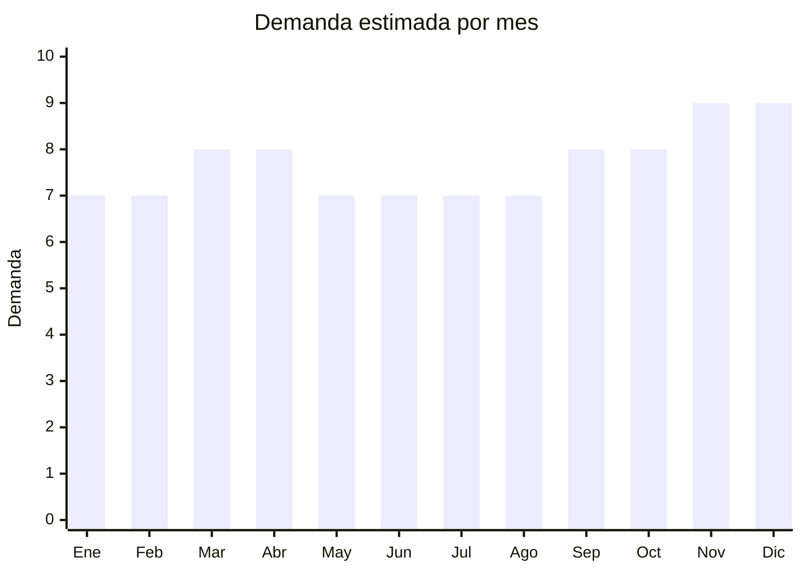

# Cámaras de seguridad WiFi

> **Capítulo NCM 85** — Máquinas, aparatos y material eléctrico, y sus partes | **Temporada:** Atemporal

<Warning>
**ENACOM obligatorio.** Toda cámara de seguridad con conectividad WiFi requiere homologación ENACOM antes de su comercialización en Argentina. Sin esta certificación, la Aduana puede retener la mercadería y no se puede vender legalmente. Iniciar el trámite ANTES de embarcar la mercadería. Costo: USD 300-800 por modelo. Tiempo: 30-60 días.
</Warning>

## Qué es y por qué importarlo

Las cámaras de seguridad WiFi (también llamadas cámaras IP) son dispositivos de videovigilancia que se conectan a la red inalámbrica del hogar u oficina y permiten monitoreo en tiempo real desde el celular. Incluyen cámaras domo para interiores, bullet para exteriores, cámaras PTZ con giro 360 grados, kits de 4 cámaras con NVR (grabador), y modelos solares con batería para zonas sin cableado eléctrico.

La inseguridad en Argentina impulsa una demanda sostenida y creciente de sistemas de videovigilancia. Las cámaras WiFi democratizaron la seguridad: ya no hace falta un sistema cableado profesional. Cualquier persona puede instalar una cámara WiFi en minutos y monitorear su hogar desde el celular. Esto generó un mercado masivo que no existía hace 10 años.

Gadnic es el vendedor indiscutido N.1 en MercadoLibre Argentina con más de 100,000 unidades vendidas en la categoría. Otras marcas como Ezviz (Hikvision), Imou (Dahua), Xiaomi y Tapo (TP-Link) tienen presencia fuerte. China (Shenzhen, Hangzhou) concentra más del 80% de la producción mundial de cámaras de seguridad, con fabricantes como Hikvision y Dahua liderando globalmente.

## Datos clave

| Dato | Valor |
|------|-------|
| **Posiciones NCM típicas** | 8525.81.90 (cámaras de televisión, cámaras digitales de video) |
| **Derecho de importación** | 14-20% (DIE) + 3% tasa estadística |
| **Rango FOB típico** | USD 5.00 — USD 25.00 (individual), USD 30.00 — USD 100.00 (kit 4 cámaras + NVR) |
| **Precio de venta en Argentina** | ARS 25.000 — ARS 150.000 |
| **Margen bruto estimado** | 150% — 300% |
| **MOQ típico** | 50 — 500 unidades |
| **Demanda en MercadoLibre** | Muy Alta |
| **Competencia en MercadoLibre** | Alta |
| **Dificultad para importar** | Media-Alta (ENACOM + S-Mark) |
| **Certificaciones necesarias** | ENACOM (WiFi obligatorio), S-Mark + QR de seguridad eléctrica |
| **Antidumping** | No |

## Demanda y mercado en Argentina

- **Volumen de mercado:** Una de las categorías con mayor crecimiento en electrónica en MercadoLibre. Gadnic solo acumula más de 100,000 unidades vendidas. El mercado total se estima en cientos de miles de unidades anuales.
- **Tendencia:** Fuertemente creciente. La inseguridad, la caída del costo de las cámaras y la facilidad de instalación impulsan la adopción masiva.
- **Perfil del comprador:** Hogares (seguridad del hogar), comercios (vigilancia), oficinas, edificios, countrys, Airbnbs, estacionamientos, depósitos.
- **Canales de venta principales:** MercadoLibre, casas de electricidad, instaladores de seguridad, tiendas de tecnología.

<Note>
Gadnic lidera con más de 100,000 unidades vendidas en MercadoLibre Argentina. Su estrategia: múltiples modelos (domo, bullet, PTZ, solar) con certificación ENACOM ya resuelta, soporte técnico local y app propia. Competir con Gadnic requiere diferenciación real (mejor resolución, mejor app, mayor ángulo de visión) o precio significativamente menor.
</Note>

## Competencia

| Aspecto | Situación |
|---------|-----------|
| **Cantidad de vendedores en ML** | +500 vendedores activos |
| **Hay marcas dominantes** | Sí: Gadnic (N.1 absoluto), Ezviz (Hikvision), Imou (Dahua), Xiaomi, Tapo (TP-Link) |
| **Tipo de competidores** | Importadores con marca propia + subsidiarias de marcas globales |
| **Rango de precios en ML** | ARS 25.000 — ARS 150.000 |
| **Posibilidad de diferenciarse** | Media |

**Cómo diferenciarse:**
- Cámaras solares con batería (sin cables) para zonas rurales o sin electricidad
- Kits pre-armados "llave en mano" con NVR + 4/8 cámaras + disco + cables
- Resolución 2K/4K cuando la competencia aún vende 1080p
- App con inteligencia artificial (detección de personas vs animales)
- Soporte técnico local y configuración remota incluida

## Variantes y subtipos más comunes

| Subtipo / Variante | FOB aprox. | Venta AR aprox. | Nota |
|--------------------|-----------|-----------------|------|
| Domo interior 1080p WiFi | USD 5.00 — 8.00 | ARS 25.000 — 45.000 | **Mayor volumen** — hogar básico |
| Bullet exterior IP66 2K | USD 8.00 — 15.00 | ARS 35.000 — 70.000 | Resistente a intemperie |
| PTZ 360 grados WiFi | USD 10.00 — 20.00 | ARS 40.000 — 80.000 | Seguimiento automático de movimiento |
| Kit 4 cámaras + NVR + disco | USD 30.00 — 100.00 | ARS 80.000 — 150.000 | Mayor ticket, ideal comercios |
| Solar con batería recargable | USD 15.00 — 25.00 | ARS 50.000 — 100.000 | **Nicho en crecimiento** — sin cables |

## Regulaciones y requisitos

<Warning>
**Doble certificación obligatoria.** Las cámaras WiFi requieren: (1) homologación ENACOM por el módulo WiFi, y (2) certificación S-Mark con QR de seguridad eléctrica. Ambos trámites deben completarse ANTES de comercializar. No tener estas certificaciones expone a retención aduanera, multas y prohibición de venta.
</Warning>

<Tabs>
  <Tab title="Certificaciones">
    | Organismo | Requiere | Detalle | Costo aprox. | Tiempo aprox. |
    |-----------|----------|---------|-------------|--------------|
    | ARCA (Aduana) | Sí siempre | Despacho de importación estándar | -- | -- |
    | ENACOM | **Sí** | Homologación obligatoria por módulo WiFi (radiofrecuencia) | USD 300 — 800 por modelo | 30 — 60 días |
    | S-Mark + QR | **Sí** | Certificación de seguridad eléctrica con código QR verificable | USD 500 — 1,500 por modelo | 30 — 90 días |
    | INTI | No obligatorio | No requerido para cámaras de seguridad domésticas | -- | -- |

    **Estrategia:** Iniciar ENACOM y S-Mark en paralelo, idealmente antes de que la mercadería salga de China. Enviar muestras por courier para el trámite. Muchos laboratorios argentinos procesan ambas certificaciones simultáneamente.
  </Tab>

  <Tab title="Etiquetado">
    | Requisito | Aplica |
    |-----------|--------|
    | Idioma español | Sí |
    | Datos del importador | Sí |
    | Resolución de video | Sí |
    | Tipo de conectividad | Sí (WiFi 2.4 GHz / 5 GHz) |
    | Instrucciones de instalación en español | Sí |
    | País de origen | Sí |
    | Garantía legal 6 meses | Sí |
    | Número de homologación ENACOM | Sí (obligatorio) |
    | Código QR S-Mark | Sí (obligatorio) |
  </Tab>

  <Tab title="Restricciones">
    - **ENACOM** es obligatorio para todo dispositivo con WiFi. Sin homologación, la Aduana puede retener la mercadería.
    - **S-Mark** es obligatorio para dispositivos eléctricos y electrónicos. Debe llevar el código QR visible en el producto y/o empaque.
    - **Privacidad:** En Argentina, las cámaras de seguridad en espacios públicos o semi-públicos deben cumplir con la Ley de Protección de Datos Personales (Ley 25.326). El importador no es responsable del uso que el comprador haga, pero incluir una nota sobre uso responsable es recomendable.
    - **No hay antidumping** vigente para cámaras de seguridad WiFi.
  </Tab>
</Tabs>

## Logística

| Dato | Valor |
|------|-------|
| **Peso típico por unidad** | 0.20 — 0.80 kg (individual) / 3 — 8 kg (kit 4 cámaras) |
| **Volumen típico** | Bajo (individual) / Medio (kits) |
| **Fragilidad** | Media (lentes y electrónica sensibles a impacto) |
| **Envío recomendado** | Aéreo para lotes chicos de cámaras individuales / Marítimo LCL-FCL para kits |
| **Tiempo total estimado** | 15 — 25 días (aéreo) / 50 — 80 días (marítimo) |
| **Baterías de litio** | Sí en modelos solares/batería — documentación UN38.3 requerida |
| **Requiere empaque especial** | Sí — protección para lentes, separadores internos, caja individual |

<Tip>
**Consejo logístico:** Para cámaras individuales (domo, bullet), el envío aéreo es viable por el peso bajo y el alto valor unitario. Para kits de 4+ cámaras con NVR y disco duro, el marítimo es más práctico por peso y volumen. Los modelos con batería de litio (solares) requieren documentación adicional UN38.3.
</Tip>

## Estacionalidad



| Aspecto | Detalle |
|---------|---------|
| **Meses pico** | Noviembre-Diciembre (CyberMonday, Black Friday, fin de año — picos de inseguridad + regalos tech), Marzo-Abril (vuelta a la rutina, refuerzo de seguridad) |
| **Meses valle** | Enero-Febrero y Junio-Julio — demanda base siempre presente porque la inseguridad no tiene estación |
| **Cuándo pedir** | Agosto-Septiembre para tener stock certificado en noviembre. Considerar 30-60 días de ENACOM en el timeline. |

## Ventajas y riesgos

<CardGroup cols={2}>
  <Card title="Ventajas" icon="circle-check">
    - Demanda creciente impulsada por inseguridad
    - Márgenes de 150-300% según modelo
    - Producto que se vende solo (necesidad real del consumidor)
    - Ticket promedio alto (ARS 35,000-80,000)
    - Oportunidad en kits "llave en mano" con alto valor agregado
    - Segmento solar/batería en fuerte crecimiento
  </Card>
  <Card title="Riesgos" icon="triangle-exclamation">
    - ENACOM obligatorio (costo + tiempo + riesgo de demora)
    - S-Mark + QR también requerido (doble certificación)
    - Competencia fuerte de Gadnic (+100,000 vendidos)
    - Apps chinas genéricas con mala experiencia de usuario
    - Soporte post-venta necesario (configuración WiFi genera consultas)
    - Modelos con batería litio complican la logística
  </Card>
</CardGroup>

<Note>
**La app es clave.** La experiencia del usuario final depende enormemente de la app del celular para ver las cámaras. Las apps genéricas chinas (iCSee, CamHi, YCC365) tienen interfaz pobre y problemas de conectividad. Elegir un proveedor con app estable y en español es un diferenciador real. Marcas como Ezviz y Tapo destacan por tener apps superiores.
</Note>

## Palabras clave para buscar en Alibaba

```
wifi camera security wholesale, IP camera 1080p WiFi, PTZ camera outdoor,
CCTV kit 4 cameras NVR, solar security camera battery, dome camera indoor WiFi,
bullet camera outdoor IP66, smart home camera wholesale,
security camera system OEM, wireless camera night vision
```

## Fuentes

- [MercadoLibre Argentina — Cámaras de seguridad](https://listado.mercadolibre.com.ar/camaras-seguridad-wifi)
- [Alibaba — WiFi security camera](https://www.alibaba.com/showroom/wifi-security-camera.html)
- [ENACOM — Homologación de equipos](https://www.enacom.gob.ar/homologacion)
- [S-Mark Argentina — Certificación seguridad eléctrica](https://www.argentina.gob.ar/produccion/defensa-del-consumidor/seguridad-electrica)
