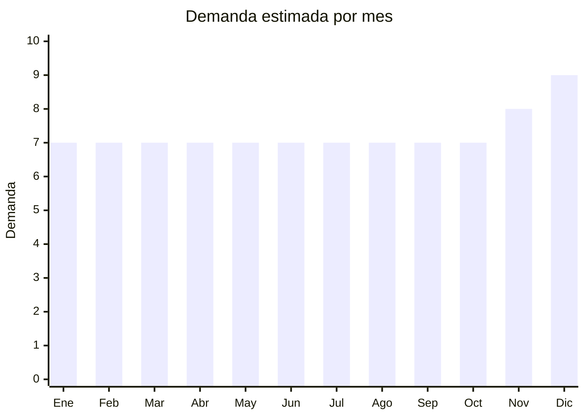

# Cargadores y Cables USB

> **Capitulo NCM 85** — Maquinas, aparatos y material electrico | **Temporada:** Atemporal

## Que es y por que importarlo

Los cargadores y cables USB son accesorios esenciales para smartphones, tablets, laptops y practicamente cualquier dispositivo electronico moderno. Incluyen cargadores de pared (5W a 65W+), cables USB-C, Lightning, Micro-USB, y cargadores inalambricos Qi. Es un producto de consumo masivo con reposicion constante: los cables se rompen, se pierden, y la gente siempre necesita uno extra.

Este es uno de los productos con mayor volumen de ventas en MercadoLibre Argentina, con mas de 6,600 resultados activos solo para "cable USB-C". La demanda es extremadamente estable durante todo el ano porque no depende de temporadas ni modas. Todo el que tiene un celular necesita al menos un cable y un cargador.

China produce la inmensa mayoria de cargadores y cables USB del mundo. Los costos FOB son extremadamente bajos (desde USD 0.30 por cable), lo que permite margenes brutos de 200-400% incluso vendiendo a precios muy competitivos en Argentina. Marcas chinas como Baseus, Ugreen, USAMS y Toocki ofrecen productos de calidad certificada con opciones de marca propia (OEM).

## Datos clave

| Dato | Valor |
|------|-------|
| **Posiciones NCM tipicas** | 8504.40.90 (cargadores), 8544.42.00 (cables) |
| **Derecho de importacion** | 14% — 18% (DIE) + 3% tasa estadistica |
| **Rango FOB tipico** | USD 0.30 — USD 3 por unidad |
| **Precio de venta en Argentina** | ARS 3,000 — ARS 15,000 |
| **Margen bruto estimado** | 200% — 400% |
| **MOQ tipico** | 200 — 1,000 unidades |
| **Demanda en MercadoLibre** | Muy Alta |
| **Competencia en MercadoLibre** | Muy Alta |
| **Dificultad para importar** | Facil — Moderada |
| **Certificaciones necesarias** | S-Mark (cargadores), QR fiscal. ENACOM solo para cargadores inalambricos Qi |
| **Antidumping** | **No** |

## Demanda y mercado en Argentina

- **Volumen de mercado:** Masivo. Mas de 6,600 publicaciones activas solo para cables USB-C en MercadoLibre. Es un producto de primera necesidad tecnologica con reposicion continua.
- **Tendencia:** Estable y creciente. La migracion a USB-C (impulsada por regulacion europea y adopcion de Apple) aumenta la demanda de cables y cargadores nuevos. La carga rapida (PD, QC) tambien impulsa la renovacion de cargadores.
- **Perfil del comprador:** Todo usuario de smartphone, tablet o laptop. Desde el adolescente que necesita un cable barato hasta el profesional que busca un cargador GaN de 65W.
- **Canales de venta principales:** MercadoLibre (dominante), kioscos tecnologicos, tiendas de accesorios de celulares, ferias mayoristas (Once, Flores).

<Note>
Los cables y cargadores son productos de "alta frecuencia de compra": un mismo cliente puede comprar 2-3 cables al ano. Esto genera recurrencia natural sin necesidad de esfuerzo de marketing. Con mas de 6,600 publicaciones activas solo para cables USB-C, la demanda es innegable.
</Note>

## Competencia

| Aspecto | Situacion |
|---------|-----------|
| **Cantidad de vendedores en ML** | +3,000 vendedores activos (cables + cargadores combinados) |
| **Hay marcas dominantes** | Parcialmente: Samsung y Apple en originales; Baseus, Ugreen en calidad; muchas marcas genericas |
| **Tipo de competidores** | Importadores mayoristas, revendedores de Once/Flores, tiendas oficiales de marcas |
| **Rango de precios en ML** | ARS 2,000 — ARS 30,000 |
| **Posibilidad de diferenciarse** | Media — la diferenciacion viene por calidad percibida, packaging y garantia |

**Como diferenciarse:**
- Cables reforzados con trenzado de nylon y certificacion MFi (para Lightning)
- Cargadores GaN compactos de alta potencia (30W-65W) con multiples puertos
- Kits combo (cargador + cable) en packaging premium
- Ofrecer garantia de 12 meses (el doble de la legal) como diferenciador
- Cables con indicador LED de carga

## Variantes y subtipos mas comunes

| Subtipo / Variante | FOB aprox. | Venta AR aprox. | Nota |
|--------------------|-----------|-----------------|------|
| Cable USB-C a USB-C 1m basico | USD 0.30 — 0.80 | ARS 3,000 — 6,000 | Mayor volumen, commodity |
| Cable Lightning (MFi o compatible) | USD 0.50 — 1.50 | ARS 4,000 — 10,000 | MFi certificado vale mas |
| Cargador pared 20W PD (USB-C) | USD 1 — 2 | ARS 5,000 — 12,000 | Estandar actual para iPhones |
| Cargador 65W GaN (multi-puerto) | USD 2 — 3 | ARS 10,000 — 20,000 | Premium, alto margen absoluto |
| Cargador inalambrico Qi 15W | USD 1.50 — 3 | ARS 6,000 — 15,000 | Requiere ENACOM |

## Regulaciones y requisitos

<Tabs>
  <Tab title="Certificaciones">
    | Organismo | Requiere | Detalle | Costo aprox. | Tiempo aprox. |
    |-----------|----------|---------|-------------|--------------|
    | ARCA (Aduana) | Si siempre | Despacho de importacion | Variable | — |
    | ENACOM | **Solo cargadores inalambricos Qi** | Los cargadores Qi emiten radiofrecuencia y requieren homologacion. Cables y cargadores con cable NO requieren ENACOM | USD 100 — 300 por modelo | 4 — 8 semanas |
    | S-Mark (Seguridad electrica) | Puede requerir para cargadores | Marca de seguridad electrica. Aplicable a cargadores de pared que se conectan a 220V | USD 200 — 500 por modelo | 4 — 6 semanas |
    | QR fiscal | Si | Codigo QR de trazabilidad en packaging | Incluido en proceso S-Mark | — |

    <Note>
    Los cables USB por si solos generalmente no requieren S-Mark ni ENACOM (son componentes pasivos). Los cargadores de pared si pueden requerir S-Mark por ser equipos electricos conectados a la red de 220V. Verificar con el despachante de aduanas segun el modelo especifico.
    </Note>
  </Tab>

  <Tab title="Etiquetado">
    | Requisito | Aplica |
    |-----------|--------|
    | Idioma espanol | Si |
    | Datos del importador | Si |
    | Composicion / materiales | Si (tipo de cable, materiales) |
    | Instrucciones de uso | Si (especialmente para cargadores) |
    | Garantia legal 6 meses | Si |
    | Especificaciones electricas | Si (voltaje, amperaje, wataje) |
    | QR de trazabilidad | Si (cargadores) |

    Para cargadores de pared, el etiquetado debe indicar claramente: voltaje de entrada (100-240V), voltaje de salida, amperaje maximo, y potencia en watts. Tambien debe indicar compatibilidad con la red electrica argentina (220V / 50Hz). El enchufe debe ser tipo I (argentino de 3 patas) o incluir adaptador.
  </Tab>

  <Tab title="Restricciones">
    No hay medidas antidumping vigentes para cables ni cargadores USB. Consideraciones:

    - Los cargadores deben ser compatibles con **220V / 50Hz** (tension argentina). Muchos cargadores chinos son 100-240V universal, pero verificar siempre
    - El enchufe debe ser compatible con enchufes argentinos (tipo I, 3 patas). Se pueden importar con enchufe universal y agregar adaptador, o solicitar al fabricante enchufe tipo I directamente
    - Cables que dicen "Lightning" sin certificacion MFi de Apple pueden ser retenidos por aduana si se detecta que usan la marca Apple sin autorizacion
    - Los cargadores sub-estandar (sin proteccion contra sobrecarga) son un riesgo de seguridad y pueden generar problemas legales si causan danos
  </Tab>
</Tabs>

## Logistica

| Dato | Valor |
|------|-------|
| **Peso tipico por unidad** | 0.02 — 0.15 kg |
| **Volumen tipico** | Muy bajo |
| **Fragilidad** | Baja |
| **Envio recomendado** | Aereo o courier (ultraliviano y compacto) |
| **Tiempo total estimado** (pedido a deposito) | 3 — 5 semanas (aereo) / 8 — 12 semanas (maritimo) |
| **Baterias de litio** | **No** (salvo power banks, que son otra categoria) |
| **Requiere empaque especial** | No — packaging estandar es suficiente |

<Tip>
Cables y cargadores son los productos mas eficientes para envio aereo: 1,000 cables USB-C pesan menos de 30 kg total. No tienen baterias de litio (a diferencia de auriculares y smartwatches), lo que simplifica enormemente la logistica aerea. Se pueden enviar por courier express (DHL/FedEx) sin restricciones especiales. Esto permite reposicion rapida de stock en 5-7 dias.
</Tip>

## Estacionalidad



| Aspecto | Detalle |
|---------|---------|
| **Meses pico** | Noviembre — Diciembre (regalos, Black Friday). Leve aumento cuando Apple/Samsung lanzan nuevos modelos |
| **Meses valle** | No hay valle significativo — la demanda es excepcionalmente estable |
| **Cuando pedir para llegar a tiempo** | La estabilidad permite comprar en cualquier momento. Reforzar stock en Septiembre — Octubre para fiestas |

## Ventajas y riesgos

<CardGroup cols={2}>
  <Card title="Ventajas" icon="circle-check">
    - Demanda extremadamente estable y predecible durante todo el ano
    - Costos FOB ultra bajos (desde USD 0.30): margen incluso vendiendo barato
    - Producto sin baterias de litio (cables y cargadores con cable): logistica simple
    - No requiere ENACOM para cables y cargadores con cable (salvo Qi)
    - Alta frecuencia de recompra: los clientes vuelven solos
    - Ultraliviano: el flete es casi insignificante en el costo total
    - Producto complementario ideal para vender junto con otros electronicos
  </Card>
  <Card title="Riesgos" icon="triangle-exclamation">
    - Competencia brutal: es un commodity con miles de vendedores
    - Margenes bajo presion constante por guerra de precios
    - Calidad variable: cables baratos pueden danar dispositivos o no cargar rapido
    - Cargadores sin proteccion pueden sobrecalentar y generar reclamos/accidentes
    - Enchufe argentino (tipo I) no es el estandar chino: requiere adaptacion
    - Cables Lightning sin MFi pueden dejar de funcionar con actualizaciones de iOS
  </Card>
</CardGroup>

<Warning>
La calidad en cables y cargadores es critica por seguridad. Un cargador sin proteccion contra sobrecarga, cortocircuito o sobrecalentamiento puede danar el celular del comprador o, en casos extremos, provocar incendios. Importar siempre cargadores con certificaciones internacionales (CE, FCC, UL) y solicitar al proveedor los reportes de pruebas. Un incidente de seguridad puede destruir la reputacion del vendedor y generar responsabilidad legal.
</Warning>

## Palabras clave para buscar en Alibaba

```
USB C cable nylon braided, PD 20W charger USB-C wall adapter,
GaN charger 65W multi port, wireless charger Qi 15W,
Lightning cable MFi certified, fast charging cable Type-C,
USB charger factory OEM custom logo, phone charger wholesale,
USB C to USB C 60W cable, wall charger 220V universal
```

## Fuentes

- [Nomenclador NCM - ARCA (ex-AFIP)](https://www.arca.gob.ar)
- [ENACOM - Homologacion de equipos](https://www.enacom.gob.ar/homologacion)
- [MercadoLibre Argentina - Cables USB](https://www.mercadolibre.com.ar/cable-usb-c)
- [MercadoLibre Argentina - Cargadores](https://www.mercadolibre.com.ar/cargador-celular)
- [Alibaba - USB cables and chargers](https://www.alibaba.com/trade/search?SearchText=usb+c+cable+charger)
- [Ministerio de Economia - Arancel externo comun](https://www.argentina.gob.ar/economia)
