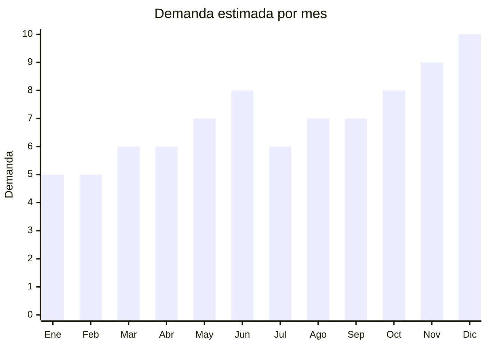

# Cortadoras de Pelo

> **Capitulo NCM 85** — Maquinas, aparatos y material electrico | **Temporada:** Atemporal

## Que es y por que importarlo

Las cortadoras de pelo son dispositivos electricos (con cable o recargables) disenados para cortar y perfilar el cabello y la barba. Incluyen cortadoras (clippers), trimmers de precision para barba y detalles, y kits completos con multiples accesorios. La tendencia de grooming masculino y cuidado personal impulsa una demanda sostenida y creciente en Argentina.

China es el principal fabricante mundial, con marcas como Kemei y VGR que dominan el segmento economico-medio del mercado argentino. Los precios FOB van desde USD 3 por modelos basicos hasta USD 15 por kits profesionales completos, con margenes brutos de 150% a 300%. En MercadoLibre se encuentran mas de 12,000 resultados activos, lo que demuestra una demanda masiva y constante.

**Sin antidumping.**

## Datos clave

| Dato | Valor |
|------|-------|
| **Posiciones NCM tipicas** | 8510.20.00 (cortadoras de pelo/esquiladoras con motor electrico) |
| **Derecho de importacion** | 20% (DIE) + 3% tasa estadistica |
| **Rango FOB tipico** | USD 3 — USD 15 por unidad |
| **Precio de venta en Argentina** | ARS 15,000 — ARS 60,000 |
| **Margen bruto estimado** | 150% — 300% |
| **MOQ tipico** | 50 — 300 unidades |
| **Demanda en MercadoLibre** | Muy Alta (12,000+ resultados activos) |
| **Competencia en MercadoLibre** | Alta (Kemei, VGR, Philco, GA.MA, Wahl) |
| **Dificultad para importar** | Media |
| **Certificaciones necesarias** | S-Mark puede requerir (modelos con cable 220V). ENACOM: No |
| **Antidumping** | **No** |

## Variantes y subtipos mas comunes

| Subtipo / Variante | FOB aprox. | Venta AR aprox. | Nota |
|--------------------|-----------|-----------------|------|
| Cortadora basica recargable | USD 3 — 5 | ARS 15,000 — 25,000 | Entrada. USB recargable. 4-8 peines guia. Uso domestico |
| Cortadora profesional | USD 8 — 15 | ARS 30,000 — 60,000 | Motor potente. Cuchillas acero/ceramica. Display LCD. Uso barberia |
| Trimmer barba/detalles | USD 3 — 6 | ARS 10,000 — 25,000 | Precision para contornos y barba. Recargable USB-C. Compacto |
| Kit completo (cortadora + trimmer + nariz) | USD 10 — 15 | ARS 35,000 — 60,000 | Mayor ticket. Incluye cortadora, trimmer y cortador nariz/orejas |
| Afeitadora electrica rotativa | USD 5 — 12 | ARS 20,000 — 45,000 | 3 cabezales rotativos. Recargable. Alternativa a Philips Shaver |

## Regulaciones y requisitos

<Tabs>
  <Tab title="Certificaciones">
    - **ENACOM**: No requiere homologacion (no tiene conectividad inalambrica)
    - **S-Mark**: Puede requerirse para modelos que se conectan con cable a la red electrica (220V). Los modelos recargables por USB tienen menor exigencia
    - **Codigo QR**: Si aplica S-Mark, debe incluir QR de seguridad
    - **Costo S-Mark** (si aplica): USD 500 — USD 1,000 por modelo
    - **Tiempo**: 30 — 45 dias

    <Note>
    La tendencia del mercado se mueve hacia modelos 100% recargables (USB o USB-C), lo que simplifica el encuadre regulatorio al evitar la conexion directa a 220V. Priorizar estos modelos para reducir tramites y costos de certificacion.
    </Note>
  </Tab>
  <Tab title="Etiquetado">
    - Manual de instrucciones en espanol
    - Datos del importador: razon social, CUIT, domicilio
    - Tipo de alimentacion (recargable / cable / dual)
    - Voltaje si aplica (110-240V universal preferible)
    - Potencia en watts
    - Tipo de cuchilla (acero inoxidable, ceramica, titanio)
    - Garantia legal 6 meses
  </Tab>
  <Tab title="Restricciones">
    - **Sin restricciones especiales** para cortadoras de pelo
    - **Voltaje**: Si el modelo tiene cable, verificar compatibilidad 220V/50Hz. Muchos modelos chinos son universales (110-240V)
    - **Bateria de litio**: Los modelos recargables contienen bateria de litio. Verificar regulaciones de transporte aereo (etiquetado UN3481)
    - **Cuchillas**: No hay restricciones especiales. Las cuchillas de acero inoxidable o ceramica son estandar
  </Tab>
</Tabs>

## Logistica

| Dato | Valor |
|------|-------|
| **Peso tipico por unidad** | 0.3 — 1 kg (con accesorios y caja) |
| **Volumen tipico** | Bajo (cajas compactas) |
| **Fragilidad** | Baja (producto robusto, carcasa plastica resistente) |
| **Envio recomendado** | Aereo viable (producto liviano). Maritimo LCL para volumenes grandes |
| **Tiempo total estimado** | 7 — 15 dias (aereo) / 45 — 70 dias (maritimo) |
| **Baterias de litio** | Si (modelos recargables). Requiere etiquetado especial para transporte aereo |
| **Requiere empaque especial** | No (empaque retail estandar con foam interno) |

<Tip>
Las cortadoras de pelo son productos livianos (0.3-1 kg) ideales para envio aereo. Sin embargo, al contener baterias de litio, el proveedor debe embalar correctamente con etiqueta UN3481 para transporte aereo. Los kits completos (cortadora + trimmer + nariz) tienen el mejor margen por ticket promedio mas alto. Kemei y VGR ya tienen reconocimiento en Argentina, lo que facilita la venta, pero considerar marca propia (OEM) para diferenciarse a largo plazo.
</Tip>

## Estacionalidad



| Aspecto | Detalle |
|---------|---------|
| **Meses pico** | Junio (Dia del Padre — regalo estrella), Octubre-Diciembre (Hot Sale, Black Friday, Navidad) |
| **Meses valle** | Enero-Febrero (post-fiestas). La demanda base es estable todo el ano por ser producto de uso personal continuo |
| **Cuando pedir para llegar a tiempo** | Abril para Dia del Padre (junio). Agosto-Septiembre para temporada navidad (considerando 6-10 semanas lead time) |

## Ventajas y riesgos

<CardGroup cols={2}>
  <Card title="Ventajas" icon="circle-check">
    - Margenes brutos de 150-300% sobre costo FOB
    - Demanda masiva y constante (12,000+ resultados en ML)
    - Tendencia grooming masculino en crecimiento
    - Producto liviano ideal para envio aereo
    - No requiere ENACOM (sin conectividad inalambrica)
    - Kemei y VGR ya tienen reconocimiento de marca
    - Kits completos permiten mayor ticket promedio
    - Dia del Padre genera pico de ventas garantizado
  </Card>
  <Card title="Riesgos" icon="triangle-exclamation">
    - Competencia alta con marcas establecidas (Wahl, GA.MA, Philco)
    - S-Mark puede requerirse para modelos con cable 220V
    - Calidad de cuchillas variable entre proveedores
    - Baterias de litio complican logistica aerea
    - Reclamos por durabilidad de bateria en modelos baratos
    - Garantia y servicio post-venta necesarios (repuestos cuchillas)
  </Card>
</CardGroup>

<Warning>
Solicitar siempre muestras antes de hacer un pedido grande. La calidad de las cuchillas y la duracion de la bateria son los dos factores que mas generan reclamos y reviews negativos. Verificar que las cuchillas mantengan el filo despues de 50+ usos y que la bateria dure al menos 60 minutos con carga completa. Los modelos con cuchilla de ceramica tienen mayor durabilidad y menor tasa de reclamos.
</Warning>

## Palabras clave para buscar en Alibaba

```
hair clipper rechargeable USB professional
hair trimmer beard cordless LCD display
hair clipper kit set nose trimmer
electric hair clipper ceramic blade
barber clipper professional 220V
rotary electric shaver 3 head
hair clipper OEM private label
cordless hair trimmer T-blade zero gap
```

## Fuentes

- [MercadoLibre Argentina — Cortadoras de pelo](https://listado.mercadolibre.com.ar/cortadora-de-pelo)
- [Alibaba — Hair clipper rechargeable](https://www.alibaba.com/trade/search?SearchText=hair+clipper+rechargeable+professional)
- [Alibaba — Beard trimmer cordless](https://www.alibaba.com/trade/search?SearchText=beard+trimmer+cordless+LCD)
