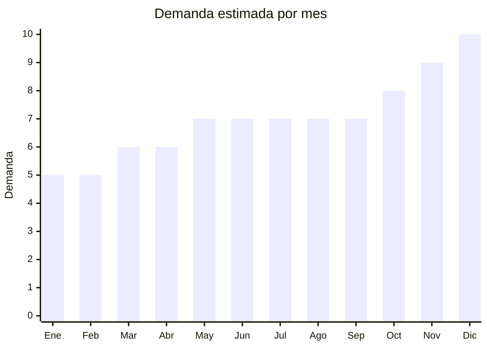

# Dispositivos Smart Home

> **Capitulo NCM 85** — Maquinas, aparatos y material electrico | **Temporada:** Atemporal

## Que es y por que importarlo

Los dispositivos smart home son aparatos electronicos que permiten automatizar y controlar funciones del hogar de forma remota a traves de WiFi, Zigbee o Bluetooth. Incluyen enchufes inteligentes, interruptores WiFi, dimmers, sensores de puertas y ventanas, hubs de automatizacion y cortinas motorizadas. Se controlan desde el celular mediante apps como Tuya Smart, Smart Life, eWeLink, y son compatibles con asistentes de voz como Alexa y Google Home.

En Argentina la demanda de domotica accesible crece de manera sostenida, impulsada por la popularizacion de Alexa y Google Home. El ecosistema Tuya domina el mercado con marcas como Etheos, Sonoff y productos con marca propia. Los precios FOB son extremadamente bajos (USD 1-8 por unidad) y los margenes brutos oscilan entre 200% y 400%, lo que convierte a esta categoria en una de las mas rentables del capitulo 85.

**Sin antidumping.**

## Datos clave

| Dato | Valor |
|------|-------|
| **Posiciones NCM tipicas** | 8536.50.90 (interruptores/conmutadores), 8536.69.90 (enchufes/conectores) |
| **Derecho de importacion** | 14% — 20% (DIE) + 3% tasa estadistica |
| **Rango FOB tipico** | USD 1 — USD 8 por unidad |
| **Precio de venta en Argentina** | ARS 5,000 — ARS 25,000 |
| **Margen bruto estimado** | 200% — 400% |
| **MOQ tipico** | 50 — 500 unidades |
| **Demanda en MercadoLibre** | Alta (miles de publicaciones activas) |
| **Competencia en MercadoLibre** | Media-Alta (Etheos, Sonoff, Tuya genericos) |
| **Dificultad para importar** | Media-Alta (requiere ENACOM por WiFi) |
| **Certificaciones necesarias** | ENACOM (WiFi obligatorio) + S-Mark + QR |
| **Antidumping** | **No** |

## Variantes y subtipos mas comunes

| Subtipo / Variante | FOB aprox. | Venta AR aprox. | Nota |
|--------------------|-----------|-----------------|------|
| Enchufe WiFi (smart plug) | USD 1.50 — 3 | ARS 5,000 — 12,000 | El mas vendido. Control on/off y medicion de consumo. Compatible Alexa/Google |
| Interruptor smart (1-3 gangs) | USD 3 — 6 | ARS 8,000 — 20,000 | Reemplaza interruptor de pared. Version touch o mecanico |
| Dimmer smart WiFi | USD 3 — 5 | ARS 8,000 — 18,000 | Control de intensidad de luz. Requiere instalacion electrica |
| Sensor puerta/ventana | USD 1 — 2 | ARS 5,000 — 10,000 | Funciona con hub Zigbee o WiFi directo. Alerta al celular |
| Hub Zigbee/Gateway | USD 5 — 8 | ARS 15,000 — 25,000 | Centraliza sensores y dispositivos Zigbee. Menor consumo que WiFi |
| Cortina motorizada WiFi | USD 15 — 30 | ARS 30,000 — 80,000 | Mayor ticket. Requiere instalacion. Motor + riel incluido |

## Regulaciones y requisitos

<Tabs>
  <Tab title="Certificaciones">
    - **ENACOM obligatorio**: Todo dispositivo con conectividad WiFi, Bluetooth o Zigbee requiere homologacion ante ENACOM (Ente Nacional de Comunicaciones). Sin esta homologacion no se puede comercializar legalmente en Argentina
    - **S-Mark obligatorio**: Como aparato electrico, requiere certificacion de seguridad electrica S-Mark
    - **Codigo QR**: Debe incluir codigo QR en el producto que enlace a informacion de seguridad
    - **Costo ENACOM**: USD 200 — USD 500 por modelo a homologar
    - **Costo S-Mark**: USD 500 — USD 1,200 por modelo a certificar
    - **Tiempo total**: 30 — 90 dias para ambas certificaciones
  </Tab>
  <Tab title="Etiquetado">
    - Manual de instrucciones en espanol
    - Datos del importador: razon social, CUIT, domicilio
    - Voltaje de operacion (110-240V en la mayoria de los smart home)
    - Numero de homologacion ENACOM visible
    - Indicacion de potencia maxima soportada (especialmente enchufes)
    - Garantia legal 6 meses
  </Tab>
  <Tab title="Restricciones">
    - **ENACOM es excluyente**: Sin homologacion ENACOM no se puede nacionalizar el producto. Iniciar tramite ANTES de importar
    - **Compatibilidad electrica**: Los interruptores y enchufes deben ser compatibles con la instalacion electrica argentina (220V/50Hz)
    - **Normativa de baja tension**: Los dispositivos que se conectan a la red electrica deben cumplir normas de seguridad electrica vigentes
    - **Sin restricciones de importacion adicionales** para este tipo de producto
  </Tab>
</Tabs>

## Logistica

| Dato | Valor |
|------|-------|
| **Peso tipico por unidad** | 0.05 — 0.3 kg |
| **Volumen tipico** | Bajo (cajas muy compactas) |
| **Fragilidad** | Baja-Media (componentes electronicos pero resistentes) |
| **Envio recomendado** | Aereo o courier (producto liviano, alto valor por kilo) |
| **Tiempo total estimado** | 7 — 15 dias (aereo) / 45 — 70 dias (maritimo) |
| **Baterias de litio** | No (la mayoria se alimenta de la red electrica) |
| **Requiere empaque especial** | No (embalaje estandar con proteccion antistatica) |

<Tip>
Los dispositivos smart home son ideales para envio aereo por su bajo peso y alto valor unitario. Un pedido de 500 enchufes WiFi pesa aproximadamente 50-80 kg y cabe en pocas cajas. Prioriza productos del ecosistema Tuya ya que tienen app establecida y soporte en espanol, lo que reduce reclamos post-venta. Solicita al proveedor que incluya manual en espanol y empaque con tu marca (OEM) para diferenciarte de la competencia generica.
</Tip>

## Estacionalidad



| Aspecto | Detalle |
|---------|---------|
| **Meses pico** | Octubre a Diciembre (Hot Sale, Black Friday, Navidad). La domotica es un regalo tecnologico popular en fiestas |
| **Meses valle** | Enero-Febrero (post-fiestas), aunque la demanda base es estable todo el ano por ser producto tecnologico de tendencia |
| **Cuando pedir para llegar a tiempo** | Agosto-Septiembre para temporada alta de fin de ano (considerando 8-12 semanas de lead time con certificaciones) |

## Ventajas y riesgos

<CardGroup cols={2}>
  <Card title="Ventajas" icon="circle-check">
    - Margenes brutos de 200-400% sobre costo FOB
    - Producto ultraliviano, ideal para envio aereo
    - Tendencia creciente de domotica en Argentina
    - Ecosistema Tuya facilita soporte y compatibilidad
    - Compatible con Alexa y Google Home (venta facil)
    - Bajo MOQ permite testear con poca inversion
    - Multiples variantes para diversificar catalogo
  </Card>
  <Card title="Riesgos" icon="triangle-exclamation">
    - ENACOM obligatorio agrega costo y tiempo significativo
    - S-Mark + QR tambien obligatorio para aparatos electricos
    - Competencia creciente con marcas ya establecidas (Etheos, Sonoff)
    - Actualizaciones de firmware pueden generar incompatibilidades
    - Soporte tecnico post-venta necesario (configuracion WiFi)
    - Interruptores requieren conocimiento de instalacion electrica
  </Card>
</CardGroup>

<Warning>
No importar dispositivos smart home sin homologacion ENACOM. El tramite puede demorar 30-90 dias y es obligatorio para cualquier dispositivo con WiFi, Bluetooth o Zigbee. Iniciar el tramite ANTES de embarcar la mercaderia. Sin ENACOM, la aduana puede retener el envio indefinidamente.
</Warning>

## Palabras clave para buscar en Alibaba

```
smart plug WiFi 220V Tuya
smart switch WiFi touch panel 220V
WiFi dimmer switch Tuya compatible
Zigbee gateway hub smart home
smart curtain motor WiFi Tuya
door window sensor WiFi Zigbee
smart home kit WiFi 220V OEM
smart plug energy monitor Alexa Google Home
```

## Fuentes

- [MercadoLibre Argentina — Dispositivos smart home](https://listado.mercadolibre.com.ar/domotica-smart-home)
- [Alibaba — Smart home devices Tuya](https://www.alibaba.com/trade/search?SearchText=smart+home+tuya+220V)
- [ENACOM — Homologacion de equipos](https://www.enacom.gob.ar/homologacion)
