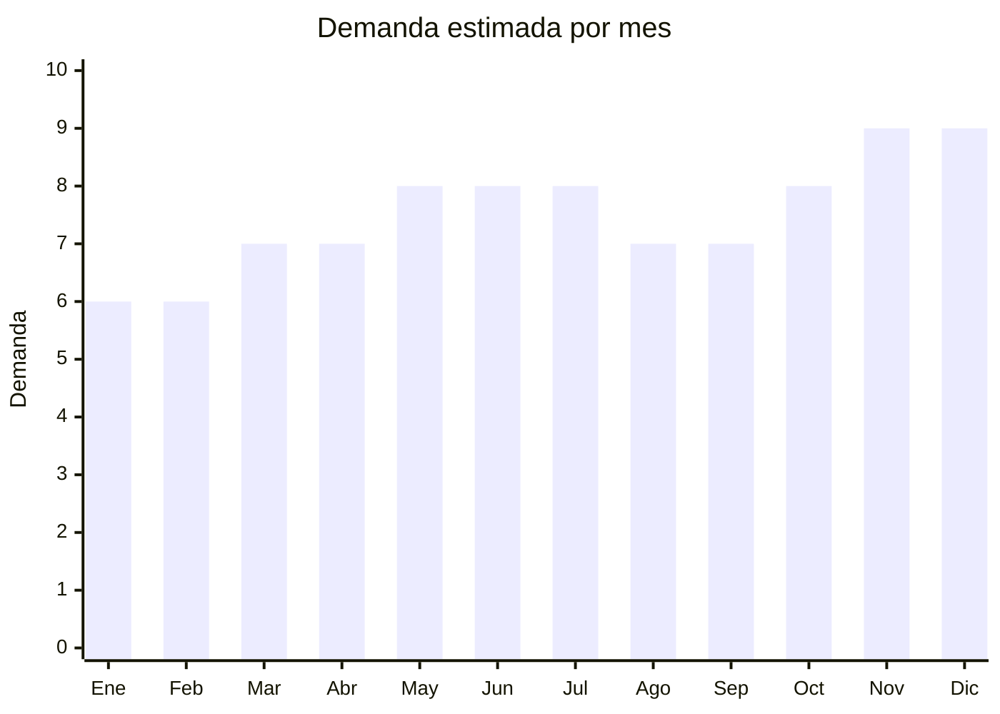

# Iluminación LED

> **Capítulo NCM 85** — Máquinas, aparatos y material eléctrico, y sus partes | **Temporada:** Atemporal

## Qué es y por qué importarlo

La iluminación LED abarca todo el espectro de productos de iluminación basados en diodos emisores de luz: focos LED E27 (reemplazo de incandescentes), tiras LED RGB decorativas, paneles LED empotrables para cielorraso, focos dicroica GU10, tiras LED smart WiFi controlables por app, y tubos neón flex decorativos. China produce más del 80% de los LEDs del mundo, con hubs productivos en Zhongshan (Guangdong) — conocida como la "capital del LED" — y Shenzhen.

La transición global de iluminación incandescente/fluorescente a LED es irreversible. Argentina prohibió la venta de lámparas incandescentes en 2011, lo que aceleró la adopción masiva de LEDs. El mercado de reposición es constante: los focos LED tienen vida útil de 15,000-50,000 horas pero se cambian por actualización, mudanza o ampliación. El segmento decorativo (tiras LED, neón flex) crece fuerte por tendencias de interiorismo y redes sociales (setup gamer, decoración de locales comerciales, ambientación de Airbnbs).

Bodeltec es uno de los sellers con mayor volumen en MercadoLibre Argentina con más de 100,000 unidades vendidas en la categoría de iluminación LED. Otras marcas como Sica, Osram, Philips y Candela tienen presencia, pero el segmento genérico importado domina en volumen.

## Datos clave

| Dato | Valor |
|------|-------|
| **Posiciones NCM típicas** | 8539.50.00 (lámparas y tubos LED), 9405.40 (luminarias y aparatos de alumbrado LED) |
| **Derecho de importación** | 14-20% (DIE) + 3% tasa estadística |
| **Rango FOB típico** | USD 0.30 — USD 5.00 por unidad (según tipo) |
| **Precio de venta en Argentina** | ARS 2.000 — ARS 30.000 |
| **Margen bruto estimado** | 200% — 400% |
| **MOQ típico** | 500 — 5,000 unidades |
| **Demanda en MercadoLibre** | Muy Alta |
| **Competencia en MercadoLibre** | Alta |
| **Dificultad para importar** | Media (S-Mark obligatorio para luminarias) |
| **Certificaciones necesarias** | S-Mark + QR (luminarias), ENACOM (solo modelos smart WiFi/BT) |
| **Antidumping** | No |

## Demanda y mercado en Argentina

- **Volumen de mercado:** Categoría masiva en MercadoLibre. Focos LED E27 y tiras LED son dos de los productos más vendidos en toda la sección de iluminación. Sellers top superan las 100,000 unidades vendidas.
- **Tendencia:** Estable-Creciente. La transición a LED es permanente. El segmento smart (WiFi) y decorativo (tiras RGB, neón flex) es el de mayor crecimiento.
- **Perfil del comprador:** Hogares (reposición de focos), electricistas (compra mayorista), locales comerciales, gamers (setup RGB), diseñadores de interiores, Airbnbs, constructores.
- **Canales de venta principales:** MercadoLibre, casas de electricidad, ferreterías, mayoristas de iluminación, tiendas de decoración.

<Note>
Bodeltec acumula más de 100,000 unidades vendidas en MercadoLibre Argentina en iluminación LED. Las tiras LED RGB de 5 metros son un bestseller constante, con precios de ARS 5,000-15,000 y márgenes superiores al 300%. El segmento de focos LED E27 tiene mayor volumen pero márgenes menores por la competencia de precio.
</Note>

## Competencia

| Aspecto | Situación |
|---------|-----------|
| **Cantidad de vendedores en ML** | +1,500 vendedores activos |
| **Hay marcas dominantes** | Mixto: Philips y Osram en premium; Sica, Candela en medio; genéricos importados dominan en volumen |
| **Tipo de competidores** | Importadores directos (mayoría) + subsidiarias de marcas globales |
| **Rango de precios en ML** | ARS 2.000 — ARS 30.000 |
| **Posibilidad de diferenciarse** | Media-Alta (especialmente en decorativo y smart) |

**Cómo diferenciarse:**
- Tiras LED smart WiFi con app en español y compatibilidad con Alexa/Google Home
- Kits completos: tira LED + fuente + controlador + control remoto
- Neón flex con formas decorativas pre-armadas (letras, figuras)
- Paneles LED slim de alto rendimiento para oficinas y comercios
- Packaging con marca propia y certificación destacada

## Variantes y subtipos más comunes

| Subtipo / Variante | FOB aprox. | Venta AR aprox. | Nota |
|--------------------|-----------|-----------------|------|
| Foco LED E27 9-12W (equivale 75-100W) | USD 0.30 — 0.80 | ARS 2.000 — 5.000 | **Mayor volumen** — reposición masiva |
| Tira LED RGB 5 metros + control remoto | USD 1.00 — 3.00 | ARS 5.000 — 15.000 | **Bestseller decorativo** |
| Panel LED empotrar redondo/cuadrado | USD 2.00 — 5.00 | ARS 8.000 — 20.000 | Construcción y remodelación |
| Foco dicroica GU10 LED | USD 0.50 — 1.50 | ARS 3.000 — 8.000 | Reemplazo de halógenas |
| Tira LED smart WiFi RGB (Alexa/Google) | USD 3.00 — 5.00 | ARS 10.000 — 25.000 | **Tendencia creciente** — requiere ENACOM |
| Neón flex decorativo (formas/letras) | USD 2.00 — 5.00 | ARS 8.000 — 30.000 | Decoración, locales, Instagram |

## Regulaciones y requisitos

<Warning>
**S-Mark obligatorio para luminarias.** Los productos de iluminación LED que se conectan a la red eléctrica (focos, paneles, tubos) requieren certificación S-Mark con código QR de seguridad eléctrica. Adicionalmente, los modelos smart con WiFi o Bluetooth requieren homologación ENACOM. No confundir: las tiras LED de baja tensión (12V/24V) que usan fuente externa tienen requisitos diferentes que el foco que va directo al portalámparas.
</Warning>

<Tabs>
  <Tab title="Certificaciones">
    | Organismo | Requiere | Detalle | Costo aprox. | Tiempo aprox. |
    |-----------|----------|---------|-------------|--------------|
    | ARCA (Aduana) | Sí siempre | Despacho de importación estándar | -- | -- |
    | S-Mark + QR | **Sí** (luminarias 220V) | Certificación de seguridad eléctrica para focos, paneles y tubos LED que van directo a la red | USD 500 — 1,500 por familia de producto | 30 — 90 días |
    | ENACOM | Solo modelos smart WiFi/BT | Homologación obligatoria si el LED tiene módulo WiFi o Bluetooth | USD 300 — 800 por modelo | 30 — 60 días |
    | INTI | No obligatorio | Laboratorio de ensayo disponible para tests voluntarios | -- | -- |

    **Aclaración importante:** Las tiras LED de 12V/24V que usan transformador/fuente externa pueden tener requisitos distintos a los focos de 220V. El transformador/fuente sí requiere S-Mark. Consultar con el laboratorio certificador antes de importar.
  </Tab>

  <Tab title="Etiquetado">
    | Requisito | Aplica |
    |-----------|--------|
    | Idioma español | Sí |
    | Datos del importador | Sí |
    | Potencia (watts) | Sí |
    | Equivalencia incandescente (ej: "equivale a 75W") | Recomendado (argumento de venta) |
    | Temperatura de color (K) | Sí (3000K cálida, 4000K neutra, 6500K fría) |
    | Lumens | Recomendado |
    | Voltaje | Sí (220V / 12V / 24V) |
    | Base/casquillo | Sí (E27, GU10, etc.) |
    | País de origen | Sí |
    | Garantía legal 6 meses | Sí |
    | Código QR S-Mark | Sí (obligatorio para luminarias 220V) |
  </Tab>

  <Tab title="Restricciones">
    - **S-Mark** obligatorio para luminarias que se conectan a 220V (focos, paneles, tubos). El código QR debe ser visible en el producto o empaque.
    - **ENACOM** solo para modelos con WiFi o Bluetooth (tiras smart, focos smart). Los LEDs "no smart" no requieren ENACOM.
    - **Eficiencia energética:** Argentina tiene estándares mínimos de eficiencia para iluminación. Verificar que los LEDs cumplan con la normativa vigente de etiquetado energético.
    - **No hay antidumping** vigente para LEDs de uso general. Verificar en CNCE para tipos específicos.
    - **Atención con tubos LED:** Los tubos T8 LED de reemplazo de fluorescentes pueden tener requisitos adicionales de seguridad eléctrica por la compatibilidad con balastos existentes.
  </Tab>
</Tabs>

## Logística

| Dato | Valor |
|------|-------|
| **Peso típico por unidad** | 0.05 — 0.30 kg (focos) / 0.20 — 0.50 kg (tiras 5m) / 0.50 — 2.00 kg (paneles) |
| **Volumen típico** | Bajo a medio |
| **Fragilidad** | **Alta** (focos de vidrio y tubos son muy frágiles) / Media (tiras LED son flexibles) |
| **Envío recomendado** | Marítimo LCL/FCL con empaque reforzado / Aéreo para tiras LED (livianas) |
| **Tiempo total estimado** | 15 — 25 días (aéreo) / 50 — 80 días (marítimo) |
| **Baterías de litio** | No (excepto modelos con batería de emergencia) |
| **Requiere empaque especial** | **Sí** — focos y tubos necesitan caja individual con protección anti-golpe. Las tiras LED son flexibles y requieren menos protección. |

<Tip>
**Cuidado con la fragilidad de focos y tubos.** La rotura en tránsito es la causa de pérdida N.1 en iluminación LED importada. Exigir al proveedor empaque individual con foam o cartón corrugado alveolar. Las cajas master no deben superar 15 kg. Las tiras LED en rollo son mucho más resistentes al transporte y tienen mejor relación valor/volumen para envío aéreo.
</Tip>

## Estacionalidad



| Aspecto | Detalle |
|---------|---------|
| **Meses pico** | Mayo-Julio (invierno — más horas de oscuridad, mayor consumo de iluminación), Noviembre-Diciembre (CyberMonday, Black Friday, decoración navideña, tiras LED para fiestas) |
| **Meses valle** | Enero-Febrero (verano — menos horas de uso de iluminación artificial) |
| **Cuándo pedir** | Marzo-Abril para cubrir temporada de invierno. Septiembre para cubrir noviembre-diciembre (decoración navideña + regalos). |

## Ventajas y riesgos

<CardGroup cols={2}>
  <Card title="Ventajas" icon="circle-check">
    - Márgenes de 200-400% (especialmente tiras LED y decorativo)
    - Demanda masiva y constante (transición a LED es permanente)
    - China produce 80%+ del LED mundial — variedad infinita de proveedores
    - Producto liviano con buena relación valor/peso
    - Segmento smart/decorativo en fuerte crecimiento
    - Ideal para marca propia con packaging personalizado
    - Producto de reposición constante
  </Card>
  <Card title="Riesgos" icon="triangle-exclamation">
    - Focos y tubos son MUY frágiles (rotura en transporte)
    - S-Mark obligatorio para luminarias 220V (costo y tiempo)
    - ENACOM adicional si son modelos smart WiFi/BT
    - Competencia de precio muy agresiva en focos E27 básicos
    - Calidad lumínica variable (lumen reales vs declarados)
    - Parpadeo (flicker) en LEDs baratos genera devoluciones
    - Temperatura de color inconsistente entre lotes
  </Card>
</CardGroup>

<Warning>
**Verificar calidad lumínica antes de comprar volumen.** Los problemas más comunes en LEDs importados de bajo costo son: (1) parpadeo visible (flicker), (2) temperatura de color distinta a la declarada, (3) lumens reales menores a los del empaque, (4) vida útil corta (se queman en meses). Pedir muestras y testear durante al menos 2 semanas antes de hacer un pedido grande. Un foco que parpadea o tiene color amarillento genera devoluciones masivas.
</Warning>

## Palabras clave para buscar en Alibaba

```
LED bulb E27 wholesale, LED strip RGB 5050 5m, LED panel light round,
GU10 LED spotlight, WiFi smart LED strip Alexa, neon flex LED,
LED tube T8, LED downlight recessed, LED bulb manufacturer Zhongshan,
smart LED bulb WiFi RGB, LED strip controller wholesale
```

## Fuentes

- [MercadoLibre Argentina — Iluminación LED](https://listado.mercadolibre.com.ar/iluminacion-led)
- [Alibaba — LED bulb wholesale](https://www.alibaba.com/showroom/led-bulb-wholesale.html)
- [S-Mark Argentina — Seguridad eléctrica](https://www.argentina.gob.ar/produccion/defensa-del-consumidor/seguridad-electrica)
- [ENACOM — Homologación de equipos](https://www.enacom.gob.ar/homologacion)
