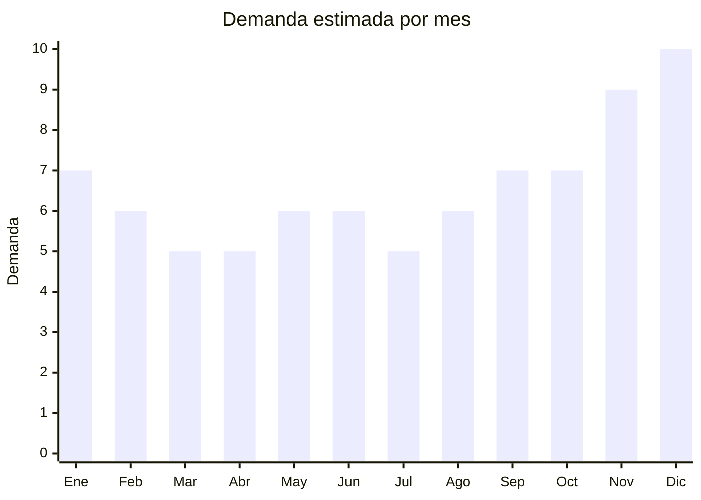

# Parlantes Bluetooth

> **Capitulo NCM 85** — Maquinas, aparatos y material electrico | **Temporada:** Atemporal

## Que es y por que importarlo

Los parlantes Bluetooth (tambien llamados speakers portatiles) son dispositivos de audio inalambricos que reproducen musica y contenido multimedia desde smartphones, tablets o computadoras via Bluetooth. Vienen en multiples formatos: mini portatiles tipo JBL Go, medianos de 10-20W, parlantes party de 30-60W con luces LED, y barras de sonido para TV.

Es un producto con demanda sostenida en Argentina, impulsada por el estilo de vida al aire libre, reuniones sociales, y el uso domestico. JBL domina el segmento premium, pero marcas como Noga, Stromberg y Aiwa tienen una presencia fuerte en el segmento medio-bajo con precios accesibles. Esto deja una ventana de oportunidad para importadores que quieran posicionar productos de buena calidad con marca propia o marcas chinas reconocidas.

China es el principal fabricante mundial de parlantes Bluetooth, con clusters de produccion en Shenzhen y Dongguan. Los proveedores chinos ofrecen desde modelos basicos de USD 3 hasta sistemas party de alta potencia por USD 15, con opciones de personalizacion de marca (OEM/ODM) accesibles para importadores pequenos.

## Datos clave

| Dato | Valor |
|------|-------|
| **Posiciones NCM tipicas** | 8518.22.00 |
| **Derecho de importacion** | 14% — 20% (DIE) + 3% tasa estadistica |
| **Rango FOB tipico** | USD 3 — USD 15 por unidad |
| **Precio de venta en Argentina** | ARS 15,000 — ARS 80,000 |
| **Margen bruto estimado** | 150% — 300% |
| **MOQ tipico** | 100 — 300 unidades |
| **Demanda en MercadoLibre** | Alta |
| **Competencia en MercadoLibre** | Alta |
| **Dificultad para importar** | Moderada (requiere ENACOM) |
| **Certificaciones necesarias** | ENACOM (Bluetooth), S-Mark + QR fiscal |
| **Antidumping** | **No** |

## Demanda y mercado en Argentina

- **Volumen de mercado:** Miles de publicaciones activas en MercadoLibre. Los modelos tipo JBL Go y similares lideran en volumen de ventas. Los parlantes party con luces LED tambien tienen alta rotacion.
- **Tendencia:** Estable con crecimiento moderado. La demanda se mantiene constante impulsada por el uso social y domestico del producto.
- **Perfil del comprador:** Jovenes de 18 a 45 anos que buscan audio portatil para salidas, viajes, pileta y reuniones. Tambien compradores de barras de sonido para mejorar el audio del TV.
- **Canales de venta principales:** MercadoLibre (dominante), tiendas de electronica, retail fisico (cadenas como Fravega, Musimundo).

<Note>
JBL es la marca de referencia y "price anchor" del mercado. Los compradores buscan "parlante tipo JBL" incluso cuando quieren una alternativa economica. Posicionar un producto que se compare visualmente con JBL pero a mitad de precio es una estrategia probada.
</Note>

## Competencia

| Aspecto | Situacion |
|---------|-----------|
| **Cantidad de vendedores en ML** | +1,500 vendedores activos |
| **Hay marcas dominantes** | Si: JBL (premium), Noga, Stromberg, Aiwa (medio), marcas chinas genericas (bajo) |
| **Tipo de competidores** | Importadores directos, distribuidores oficiales y revendedores |
| **Rango de precios en ML** | ARS 8,000 — ARS 200,000 |
| **Posibilidad de diferenciarse** | Media — hay espacio en el segmento party con luces y en barras de sonido |

**Como diferenciarse:**
- Parlantes con diseno resistente al agua (IPX6/IPX7) para uso en pileta y playa
- Modelos party con luces LED RGB y microfono karaoke incluido
- Barras de sonido 2.1 economicas como alternativa a marcas premium
- Packaging profesional con manual en espanol y garantia local destacada

## Variantes y subtipos mas comunes

| Subtipo / Variante | FOB aprox. | Venta AR aprox. | Nota |
|--------------------|-----------|-----------------|------|
| Mini portatil (tipo JBL Go, 5W) | USD 3 — 5 | ARS 15,000 — 25,000 | Mayor volumen, ideal para empezar |
| Mediano 10-20W (tipo JBL Flip) | USD 5 — 10 | ARS 25,000 — 50,000 | Buen equilibrio margen/calidad |
| Party 30-60W con luces LED | USD 8 — 15 | ARS 40,000 — 80,000 | Alto margen, nicho fiestas/eventos |
| Barra de sonido para TV | USD 8 — 15 | ARS 35,000 — 70,000 | Demanda creciente, menos competencia |

## Regulaciones y requisitos

<Tabs>
  <Tab title="Certificaciones">
    | Organismo | Requiere | Detalle | Costo aprox. | Tiempo aprox. |
    |-----------|----------|---------|-------------|--------------|
    | ARCA (Aduana) | Si siempre | Despacho de importacion | Variable | — |
    | ENACOM | **Si** | Homologacion obligatoria por emision Bluetooth (radiofrecuencia) | USD 100 — 300 por modelo | 4 — 8 semanas |
    | S-Mark (Seguridad electrica) | Si | Marca de seguridad electrica para equipos con bateria/cargador | USD 200 — 500 por modelo | 4 — 6 semanas |
    | QR fiscal | Si | Codigo QR de trazabilidad en packaging | Incluido en proceso S-Mark | — |

    <Warning>
    Cada modelo de parlante con Bluetooth diferente requiere su propia homologacion ENACOM. Si importas 3 modelos distintos, necesitas 3 homologaciones separadas. Planificar el costo y tiempo de esto antes de armar el catalogo.
    </Warning>
  </Tab>

  <Tab title="Etiquetado">
    | Requisito | Aplica |
    |-----------|--------|
    | Idioma espanol | Si |
    | Datos del importador | Si |
    | Composicion / materiales | Si |
    | Instrucciones de uso | Si |
    | Garantia legal 6 meses | Si |
    | Logo ENACOM y numero de homologacion | Si |
    | QR de trazabilidad | Si |
    | Potencia de salida (watts) | Si |

    El packaging debe indicar claramente la potencia real de salida (RMS), no la "potencia pico" que muchos fabricantes chinos declaran de forma exagerada. Esto puede generar reclamos de compradores si el parlante no rinde lo esperado.
  </Tab>

  <Tab title="Restricciones">
    No hay medidas antidumping vigentes para parlantes Bluetooth. Consideraciones importantes:

    - La bateria de litio requiere documentacion UN38.3 y MSDS para el transporte
    - Los parlantes con potencia superior a 60W pueden requerir documentacion adicional de seguridad electrica
    - Verificar que el cargador incluido sea compatible con la tension argentina (220V/50Hz)
    - Parlantes con radio FM tambien requieren homologacion de la frecuencia FM en ENACOM
  </Tab>
</Tabs>

## Logistica

| Dato | Valor |
|------|-------|
| **Peso tipico por unidad** | 0.2 — 1.5 kg (segun tamano) |
| **Volumen tipico** | Bajo (mini) a Medio (party) |
| **Fragilidad** | Media |
| **Envio recomendado** | Aereo (mini/medianos) o Maritimo LCL (party/barras de sonido) |
| **Tiempo total estimado** (pedido a deposito) | 3 — 6 semanas (aereo) / 8 — 12 semanas (maritimo) |
| **Baterias de litio** | **Si** — requiere documentacion UN38.3 y MSDS |
| **Requiere empaque especial** | Si: caja reforzada con foam interior, especialmente para modelos mas grandes |

<Tip>
Los parlantes mini (tipo JBL Go) son lo suficientemente livianos para envio aereo, lo que reduce el lead time a 3-4 semanas. Para parlantes party o barras de sonido, el envio maritimo LCL es mas economico pero tarda 8-12 semanas. Considerar hacer un mix: primeras unidades por aereo para testear el mercado y reposicion por maritimo.
</Tip>

## Estacionalidad



| Aspecto | Detalle |
|---------|---------|
| **Meses pico** | Noviembre — Diciembre (regalos de fiestas), Enero (verano, pileta, salidas) |
| **Meses valle** | Marzo — Abril (post-vacaciones, vuelta a clases) |
| **Cuando pedir para llegar a tiempo** | Agosto — Septiembre (para temporada alta Nov-Dic), Octubre para stock de verano |

## Ventajas y riesgos

<CardGroup cols={2}>
  <Card title="Ventajas" icon="circle-check">
    - Margenes brutos de 150% a 300% dependiendo del segmento
    - Producto aspiracional: la gente paga mas por un buen parlante
    - Buen potencial de marca propia (OEM/ODM) con packaging diferenciado
    - Multiples nichos dentro de la misma categoria (mini, party, soundbar)
    - Demanda estable durante todo el ano con picos en fiestas y verano
    - Menos sensible a la guerra de precios que auriculares
  </Card>
  <Card title="Riesgos" icon="triangle-exclamation">
    - JBL domina la percepcion de marca: dificil competir en el segmento premium
    - Mayor volumen/peso que auriculares: flete mas caro por unidad
    - Calidad de audio muy variable entre proveedores: imprescindible probar muestras
    - Potencia exagerada por fabricantes chinos puede generar reclamos
    - Requiere ENACOM (costo y tiempo por cada modelo)
    - Baterias de litio mas grandes implican mayores restricciones logisticas
  </Card>
</CardGroup>

<Warning>
Cuidado con la potencia declarada por los fabricantes chinos. Un parlante que dice "40W" muchas veces tiene una potencia real (RMS) de 5-10W. Siempre solicitar la especificacion de potencia RMS real y verificarla con las muestras. Publicar potencia inflada en MercadoLibre genera reclamos y devoluciones.
</Warning>

## Palabras clave para buscar en Alibaba

```
portable bluetooth speaker OEM, wireless speaker waterproof IPX7,
party speaker LED lights, bluetooth speaker 20W factory,
soundbar bluetooth home theater, mini bluetooth speaker custom logo,
karaoke speaker bluetooth microphone, Shenzhen speaker manufacturer,
bluetooth speaker TWS pairing, outdoor speaker rugged
```

## Fuentes

- [Nomenclador NCM - ARCA (ex-AFIP)](https://www.arca.gob.ar)
- [ENACOM - Homologacion de equipos](https://www.enacom.gob.ar/homologacion)
- [MercadoLibre Argentina - Parlantes Bluetooth](https://www.mercadolibre.com.ar/parlante-bluetooth)
- [Alibaba - Bluetooth speakers suppliers](https://www.alibaba.com/trade/search?SearchText=bluetooth+speaker+portable)
- [Ministerio de Economia - Arancel externo comun](https://www.argentina.gob.ar/economia)
