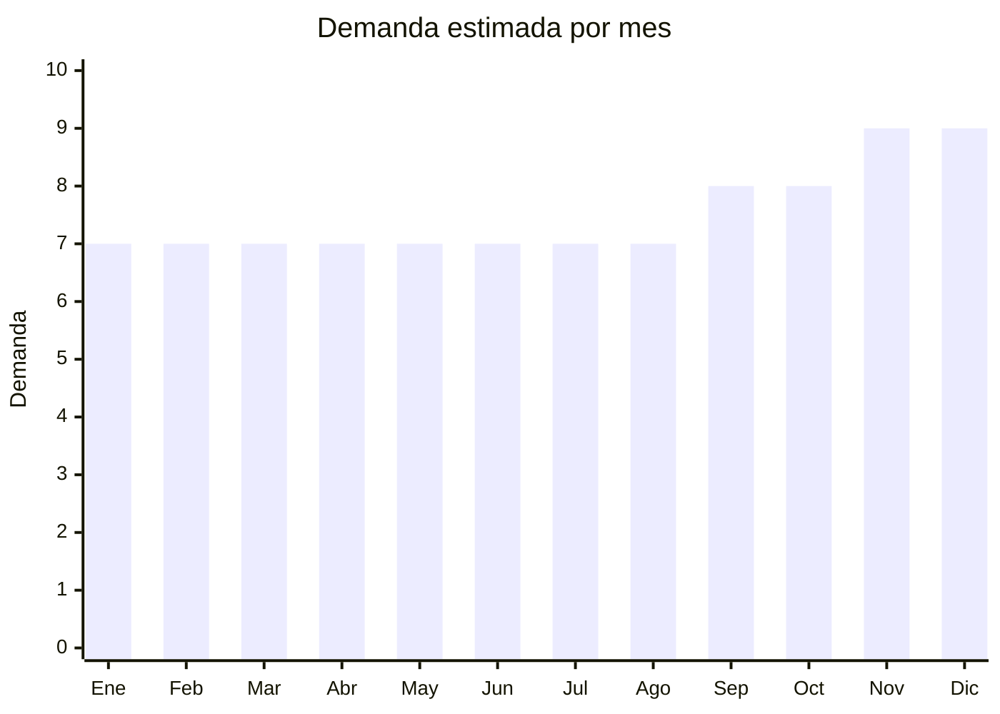

# Power banks / baterías portátiles

> **Capítulo NCM 85** — Máquinas, aparatos y material eléctrico, y sus partes | **Temporada:** Atemporal

<Warning>
**Producto con regulación especial de transporte.** Las baterías de litio requieren certificación UN38.3 para transporte internacional. Hay restricciones en envío aéreo (cantidad limitada por bulto). Verificar siempre con tu forwarder las condiciones de embarque antes de cerrar pedido.
</Warning>

## Qué es y por qué importarlo

Los power banks (baterías externas portátiles) son acumuladores de litio recargables diseñados para cargar dispositivos móviles fuera de una fuente de energía fija. Incluyen desde modelos compactos de 10,000 mAh hasta unidades de alta capacidad de 30,000 mAh con carga solar o inalámbrica.

Argentina tiene una penetración de smartphones superior al 85% de la población, lo que genera una demanda constante de accesorios de carga. El uso intensivo de apps, redes sociales y navegación GPS agota las baterías rápidamente, haciendo del power bank un accesorio casi indispensable. China (Shenzhen) concentra más del 90% de la producción mundial de power banks, con fábricas que producen para marcas como Xiaomi, Anker y Baseus.

En MercadoLibre Argentina, Gadnic lidera la categoría con más de 5,000 unidades vendidas en sus modelos principales. Xiaomi Mi Power Bank 50W es la referencia de calidad-precio en el segmento premium. Hay espacio para marcas propias en el segmento medio con diferenciación por diseño y funcionalidades (carga rápida, MagSafe, cables integrados).

## Datos clave

| Dato | Valor |
|------|-------|
| **Posiciones NCM típicas** | 8507.60.00 (acumuladores eléctricos de iones de litio) |
| **Derecho de importación** | 14-18% (DIE) + 3% tasa estadística |
| **Rango FOB típico** | USD 3.00 — USD 12.00 por unidad |
| **Precio de venta en Argentina** | ARS 10.000 — ARS 50.000 |
| **Margen bruto estimado** | 150% — 300% |
| **MOQ típico** | 100 — 500 unidades |
| **Demanda en MercadoLibre** | Muy Alta |
| **Competencia en MercadoLibre** | Alta |
| **Dificultad para importar** | Media-Alta (regulación litio + logística especial) |
| **Certificaciones necesarias** | UN38.3 (transporte litio), puede requerir S-Mark para seguridad eléctrica |
| **Antidumping** | No |

## Demanda y mercado en Argentina

- **Volumen de mercado:** Miles de publicaciones activas en MercadoLibre. Los sellers top superan las 5,000+ unidades vendidas por modelo. Categoría de accesorios de celular es una de las más activas de la plataforma.
- **Tendencia:** Estable-Creciente. La adopción de carga rápida (PD/QC) y carga inalámbrica impulsa la renovación de power banks viejos por modelos nuevos.
- **Perfil del comprador:** Usuarios de smartphone (masivo), viajeros, trabajadores en campo, estudiantes, repartidores de delivery, creadores de contenido.
- **Canales de venta principales:** MercadoLibre, tiendas de electrónica, accesorios de celular, casas de computación.

<Note>
Gadnic es el vendedor N.1 en MercadoLibre Argentina en la categoría power banks con más de 5,000 unidades vendidas en sus modelos principales. Xiaomi Mi Power Bank 50W es la referencia premium. La carga rápida (20W+) ya no es diferencial sino requisito mínimo esperado por el comprador.
</Note>

## Competencia

| Aspecto | Situación |
|---------|-----------|
| **Cantidad de vendedores en ML** | +800 vendedores activos |
| **Hay marcas dominantes** | Sí: Gadnic (N.1 volumen), Xiaomi (referente calidad), Baseus, Philco |
| **Tipo de competidores** | Importadores directos + marcas blancas |
| **Rango de precios en ML** | ARS 10.000 — ARS 50.000 |
| **Posibilidad de diferenciarse** | Media |

**Cómo diferenciarse:**
- Modelos con carga rápida 65W+ (notebook compatible)
- Power banks MagSafe para iPhone
- Modelos con cables integrados (Lightning + USB-C + Micro)
- Diseños compactos ultra-slim para bolsillo
- Packaging premium con estuche incluido

## Variantes y subtipos más comunes

| Subtipo / Variante | FOB aprox. | Venta AR aprox. | Nota |
|--------------------|-----------|-----------------|------|
| 10,000 mAh slim compacto | USD 3.00 — 5.00 | ARS 10.000 — 20.000 | **Mayor rotación** |
| 20,000 mAh estándar QC 3.0 | USD 5.00 — 8.00 | ARS 18.000 — 30.000 | Mejor relación capacidad/precio |
| 30,000 mAh con panel solar | USD 8.00 — 12.00 | ARS 25.000 — 45.000 | Nicho outdoor/camping |
| MagSafe 5,000 mAh magnético | USD 4.00 — 7.00 | ARS 15.000 — 35.000 | **Tendencia creciente** (iPhone) |
| Con cables integrados (3 en 1) | USD 4.00 — 8.00 | ARS 15.000 — 30.000 | Practicidad como argumento |

## Regulaciones y requisitos

<Warning>
**Baterías de litio = regulación especial obligatoria.** Todo power bank debe contar con certificación UN38.3 para ser transportado internacionalmente. Sin este certificado, ni la aerolínea ni la naviera aceptarán la carga. Además, en envío aéreo existen límites estrictos de cantidad por bulto (generalmente máximo 2 unidades por paquete en avión de pasajeros). Consultar siempre con el forwarder antes de embarcar.
</Warning>

<Tabs>
  <Tab title="Certificaciones">
    | Organismo | Requiere | Detalle | Costo aprox. | Tiempo aprox. |
    |-----------|----------|---------|-------------|--------------|
    | ARCA (Aduana) | Sí siempre | Despacho de importación estándar | -- | -- |
    | ENACOM | No (salvo modelos con Bluetooth) | Solo si el power bank tiene funcionalidad BT/WiFi integrada | USD 300 — 600 por modelo | 30 — 60 días |
    | S-Mark (seguridad eléctrica) | Puede requerir | Certificación de seguridad eléctrica para productos con baterías de litio | USD 500 — 1,500 por modelo | 30 — 90 días |
    | UN38.3 | Sí siempre | Certificación de transporte de baterías de litio (la provee el fabricante) | Incluido en el costo del proveedor | -- |

    **Importante:** El certificado UN38.3 lo debe proveer el fabricante chino. Pedir SIEMPRE este documento junto con el MSDS (Material Safety Data Sheet) antes de embarcar. Sin estos documentos el forwarder no puede despachar la carga.
  </Tab>

  <Tab title="Etiquetado">
    | Requisito | Aplica |
    |-----------|--------|
    | Idioma español | Sí |
    | Datos del importador | Sí |
    | Capacidad (mAh) y voltaje | Sí |
    | Instrucciones de uso y seguridad | Sí |
    | País de origen | Sí |
    | Garantía legal 6 meses | Sí |
    | Símbolo de reciclaje de baterías | Recomendado |
    | Advertencias de seguridad (no exponer a calor, etc.) | Sí |
  </Tab>

  <Tab title="Restricciones">
    - **Transporte aéreo:** Máximo 2 power banks por paquete en aviones de pasajeros. Capacidad máxima individual de 100 Wh sin aprobación especial de la aerolínea (equivale a ~27,000 mAh a 3.7V).
    - **Transporte marítimo:** Requiere declaración de mercancía peligrosa clase 9 (baterías de litio). Documentación: UN38.3 + MSDS + DGD (Dangerous Goods Declaration).
    - **No hay antidumping** vigente para power banks.
    - **ENACOM** solo aplica si el power bank tiene Bluetooth o WiFi integrado (modelos raros pero existen).
  </Tab>
</Tabs>

## Logística

| Dato | Valor |
|------|-------|
| **Peso típico por unidad** | 0.15 — 0.50 kg |
| **Volumen típico** | Bajo |
| **Fragilidad** | Media (electrónica sensible a golpes fuertes) |
| **Envío recomendado** | Marítimo LCL para volumen / Aéreo para urgencias (con restricciones) |
| **Tiempo total estimado** | 20 — 30 días (aéreo) / 50 — 80 días (marítimo) |
| **Baterías de litio** | Sí — documentación especial obligatoria (UN38.3 + MSDS + DGD) |
| **Requiere empaque especial** | Sí — empaque antiestático, protección individual, separación entre unidades |

<Tip>
**Consejo logístico:** Aunque el power bank es liviano e ideal para aéreo, las restricciones de litio en avión limitan la cantidad por envío. Para pedidos de +500 unidades, el marítimo es más práctico y económico. Pedir al proveedor que empaque cada unidad en bolsa antiestática individual y que las cajas master no superen 10 kg.
</Tip>

## Estacionalidad



| Aspecto | Detalle |
|---------|---------|
| **Meses pico** | Octubre-Diciembre (CyberMonday, Black Friday, Navidad — regalo ideal), Marzo (vuelta a clases) |
| **Meses valle** | Enero-Febrero — pero la demanda base es alta todo el año |
| **Cuándo pedir** | Julio-Agosto para tener stock en octubre (inicio de temporada alta de regalos) |

## Ventajas y riesgos

<CardGroup cols={2}>
  <Card title="Ventajas" icon="circle-check">
    - Demanda masiva y constante (smartphone = necesidad diaria)
    - Producto liviano con buena relación valor/peso
    - Márgenes de 150-300% según modelo
    - Ideal para marca propia (OEM accesible desde Shenzhen)
    - Sin antidumping ni ENACOM (mayoría de modelos)
    - Renovación constante por obsolescencia tecnológica
  </Card>
  <Card title="Riesgos" icon="triangle-exclamation">
    - Regulación de transporte de litio (UN38.3 obligatorio)
    - Restricciones en envío aéreo limitan logística express
    - Competencia de precio con Gadnic y Xiaomi
    - Calidad de celdas de litio variable (riesgo de hinchazón/incendio en productos baratos)
    - S-Mark puede requerirse y demora 30-90 días
    - Capacidad "real" vs "declarada" — mAh inflados en productos baratos dañan reputación
  </Card>
</CardGroup>

<Warning>
**Cuidado con la capacidad real.** Muchos proveedores chinos de bajo costo declaran capacidades infladas (ej: dicen 20,000 mAh pero son 8,000 mAh reales). Pedir siempre test de capacidad real al proveedor y verificar con muestras propias. Vender un power bank con capacidad falsa genera devoluciones masivas y destruye la reputación en MercadoLibre.
</Warning>

## Palabras clave para buscar en Alibaba

```
power bank wholesale, portable charger 20000mah, power bank OEM Shenzhen,
slim power bank 10000mah, solar power bank wholesale, MagSafe power bank,
power bank with built-in cable, fast charging power bank PD 20W,
custom logo power bank manufacturer
```

## Fuentes

- [MercadoLibre Argentina — Power banks](https://listado.mercadolibre.com.ar/power-bank)
- [Alibaba — Power bank wholesale](https://www.alibaba.com/showroom/power-bank-wholesale.html)
- [IATA — Lithium battery guidance](https://www.iata.org/en/programs/cargo/dgr/lithium-batteries/)
- [ENACOM — Homologación de equipos](https://www.enacom.gob.ar/homologacion)
