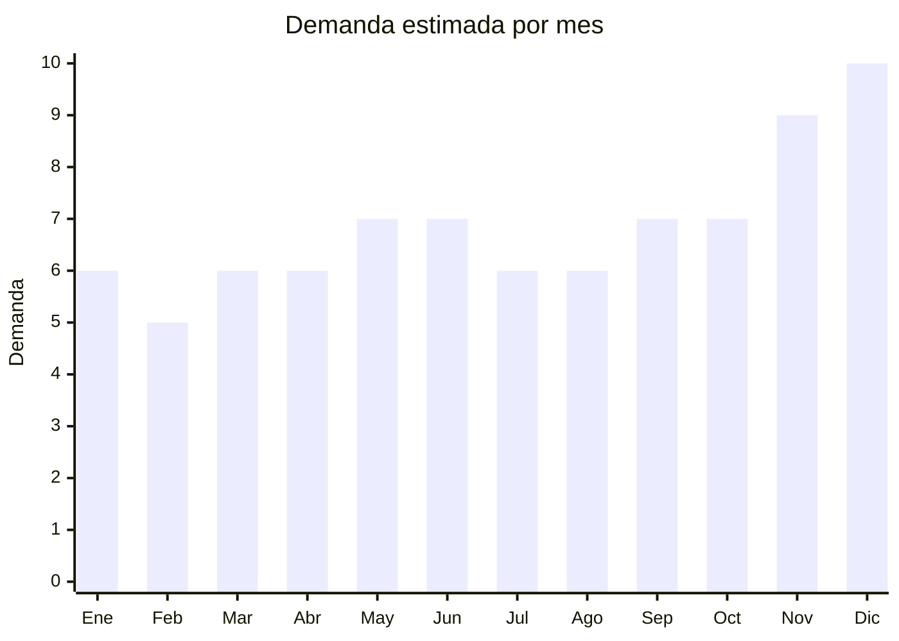

# Smartwatches y Relojes Inteligentes

> **Capitulo NCM 85** — Maquinas, aparatos y material electrico | **Temporada:** Atemporal

## Que es y por que importarlo

Los smartwatches (relojes inteligentes) son dispositivos wearable que se conectan al smartphone via Bluetooth o WiFi, ofreciendo funciones como notificaciones, monitoreo de salud (ritmo cardiaco, oxigeno en sangre, sueno), seguimiento deportivo, y en algunos modelos llamadas telefonicas directas. Incluyen desde fitness bands basicas hasta smartwatches full con GPS y WiFi integrados.

En Argentina, los smartwatches son uno de los productos tecnologicos con mayor crecimiento en los ultimos anos. Las marcas chinas dominan el top 20 de MercadoLibre: JD, Nictom y SmartBit son las mas vendidas, mientras que Samsung (con el Galaxy Fit 3) se posiciona como referente en el segmento medio-premium, siendo el segundo mas vendido. Esto demuestra que el mercado acepta bien tanto marcas economicas como reconocidas.

China concentra la mayor produccion mundial de smartwatches, con fabricas en Shenzhen y Dongguan que ofrecen modelos white-label desde USD 3 con funciones que hace pocos anos solo existian en relojes de USD 200+. Los margenes de importacion son muy atractivos (200-400%), y el producto es ultraliviano, lo que lo hace ideal para envio aereo.

## Datos clave

| Dato | Valor |
|------|-------|
| **Posiciones NCM tipicas** | 8517.62.99 / 9102.99.00 |
| **Derecho de importacion** | 14% — 20% (DIE) + 3% tasa estadistica |
| **Rango FOB tipico** | USD 3 — USD 20 por unidad |
| **Precio de venta en Argentina** | ARS 15,000 — ARS 80,000 |
| **Margen bruto estimado** | 200% — 400% |
| **MOQ tipico** | 50 — 300 unidades |
| **Demanda en MercadoLibre** | Alta |
| **Competencia en MercadoLibre** | Alta |
| **Dificultad para importar** | Moderada (requiere ENACOM) |
| **Certificaciones necesarias** | ENACOM (Bluetooth/WiFi), S-Mark + QR fiscal |
| **Antidumping** | **No** |

## Demanda y mercado en Argentina

- **Volumen de mercado:** Categoria en fuerte crecimiento. Miles de publicaciones activas en MercadoLibre con vendedores top superando las 10,000 unidades vendidas por publicacion.
- **Tendencia:** Creciente. La adopcion de wearables aumenta ano a ano impulsada por la tendencia de salud y bienestar, y por la caida de precios de los modelos chinos.
- **Perfil del comprador:** Adultos de 20 a 50 anos interesados en fitness, salud y tecnologia. Tambien jovenes que buscan un complemento "smart" accesible sin comprar un Apple Watch.
- **Canales de venta principales:** MercadoLibre (dominante), tiendas online de tecnologia, Instagram shops.

<Note>
Las marcas chinas (JD, Nictom, SmartBit) dominan el top de ventas en MercadoLibre con precios en el rango ARS 15,000-40,000. El Samsung Galaxy Fit 3 es el segundo mas vendido, lo que muestra que hay espacio tanto en el segmento economico como en el medio. La clave es la relacion funciones/precio.
</Note>

## Competencia

| Aspecto | Situacion |
|---------|-----------|
| **Cantidad de vendedores en ML** | +1,000 vendedores activos |
| **Hay marcas dominantes** | Si: JD, Nictom, SmartBit (economico); Samsung, Xiaomi (medio); Apple, Garmin (premium) |
| **Tipo de competidores** | Importadores de marcas chinas propias y distribuidores oficiales |
| **Rango de precios en ML** | ARS 10,000 — ARS 500,000 |
| **Posibilidad de diferenciarse** | Media-Alta — hay espacio en smartwatches con llamadas BT y en el nicho de ninos |

**Como diferenciarse:**
- Smartwatches con llamadas Bluetooth (speaker + microfono integrado): funcionalidad muy buscada
- Modelos para ninos con GPS y control parental: nicho con poca competencia
- Relojes con pantalla AMOLED (mejor que LCD TFT de los modelos baratos)
- Ofrecer app en espanol con buen soporte y actualizaciones

## Variantes y subtipos mas comunes

| Subtipo / Variante | FOB aprox. | Venta AR aprox. | Nota |
|--------------------|-----------|-----------------|------|
| Fitness band basica (tipo Mi Band) | USD 3 — 5 | ARS 10,000 — 20,000 | Entrada al mercado, alto volumen |
| Smartwatch con llamadas BT | USD 5 — 12 | ARS 20,000 — 45,000 | Muy demandado, buena diferenciacion |
| Smartwatch full (GPS + WiFi) | USD 12 — 20 | ARS 40,000 — 80,000 | Mayor margen absoluto, menor volumen |
| Smartwatch para ninos con GPS | USD 8 — 15 | ARS 25,000 — 50,000 | Nicho poco explotado, padres pagan bien |

## Regulaciones y requisitos

<Tabs>
  <Tab title="Certificaciones">
    | Organismo | Requiere | Detalle | Costo aprox. | Tiempo aprox. |
    |-----------|----------|---------|-------------|--------------|
    | ARCA (Aduana) | Si siempre | Despacho de importacion | Variable | — |
    | ENACOM | **Si** | Homologacion obligatoria: Bluetooth y WiFi son tecnologias de radiofrecuencia reguladas | USD 100 — 400 por modelo | 4 — 8 semanas |
    | S-Mark (Seguridad electrica) | Si | Marca de seguridad electrica para dispositivos con bateria recargable | USD 200 — 500 por modelo | 4 — 6 semanas |
    | QR fiscal | Si | Codigo QR de trazabilidad obligatorio | Incluido en proceso S-Mark | — |

    <Warning>
    Los smartwatches con **WiFi** requieren una homologacion ENACOM adicional a la de Bluetooth. Si el dispositivo tiene ambas tecnologias, se necesitan ambas certificaciones. Los modelos con GPS no requieren homologacion adicional ya que el GPS es solo receptor (no emite).
    </Warning>
  </Tab>

  <Tab title="Etiquetado">
    | Requisito | Aplica |
    |-----------|--------|
    | Idioma espanol | Si |
    | Datos del importador | Si |
    | Composicion / materiales | Si (correa: silicona, cuero, metal) |
    | Instrucciones de uso | Si |
    | Garantia legal 6 meses | Si |
    | Logo ENACOM y numero de homologacion | Si |
    | QR de trazabilidad | Si |

    Importante incluir en el packaging las funciones reales del dispositivo en espanol. Muchos smartwatches chinos incluyen funciones como "medicion de presion arterial" que no tienen precision medica. Se recomienda aclarar que las mediciones son "estimativas y no reemplazan consulta medica" para evitar problemas legales.
  </Tab>

  <Tab title="Restricciones">
    No hay medidas antidumping vigentes para smartwatches. Puntos a considerar:

    - Clasificacion NCM puede variar: si el smartwatch se clasifica como reloj (cap. 91, NCM 9102.99) puede tener diferente arancel que si se clasifica como aparato de comunicacion (cap. 85, NCM 8517.62.99). Consultar con despachante antes de importar.
    - Modelos con SIM card (smartwatches autonomos) requieren homologacion adicional de ENACOM como equipo de telecomunicaciones
    - Baterias de litio requieren documentacion UN38.3 y MSDS
    - Funciones de salud (ECG, presion arterial) pueden requerir registro ANMAT en el futuro — estar atentos a cambios regulatorios
  </Tab>
</Tabs>

## Logistica

| Dato | Valor |
|------|-------|
| **Peso tipico por unidad** | 0.05 — 0.15 kg (con caja) |
| **Volumen tipico** | Muy bajo |
| **Fragilidad** | Media (pantalla de vidrio/acrilico) |
| **Envio recomendado** | Aereo o courier (ultraliviano) |
| **Tiempo total estimado** (pedido a deposito) | 3 — 6 semanas (aereo) / 8 — 12 semanas (maritimo) |
| **Baterias de litio** | **Si** — requiere documentacion UN38.3 y MSDS |
| **Requiere empaque especial** | Si: caja individual con foam/burbuja para proteger la pantalla |

<Tip>
Los smartwatches son uno de los productos mas eficientes para envio aereo: 1,000 unidades pueden pesar menos de 150 kg total. Un pedido de prueba de 100-200 unidades se puede enviar por courier (DHL/FedEx) en 5-7 dias. Ideal para testear modelos antes de hacer pedidos grandes por maritimo.
</Tip>

## Estacionalidad



| Aspecto | Detalle |
|---------|---------|
| **Meses pico** | Noviembre — Diciembre (regalos de fiestas, Black Friday), Junio — Julio (Dia del Padre, precio como regalo accesible) |
| **Meses valle** | Febrero — Marzo (post-fiestas) |
| **Cuando pedir para llegar a tiempo** | Agosto — Septiembre (para stock de fiestas); Abril (para Dia del Padre en junio) |

## Ventajas y riesgos

<CardGroup cols={2}>
  <Card title="Ventajas" icon="circle-check">
    - Margenes brutos de 200% a 400%, superiores a muchos otros productos electronicos
    - Producto ultraliviano: costo de flete minimo, ideal para envio aereo
    - Mercado en crecimiento constante impulsado por tendencia fitness/salud
    - MOQ bajos: se puede empezar con 50-100 unidades para testear
    - Gran variedad de modelos y funciones disponibles en China
    - Producto "regalable": alta rotacion en fechas especiales
  </Card>
  <Card title="Riesgos" icon="triangle-exclamation">
    - Competencia fuerte de marcas chinas ya posicionadas (JD, Nictom, SmartBit)
    - App de control: muchos modelos usan apps chinas con mala traduccion o que dejan de funcionar
    - Funciones de salud imprecisas pueden generar reclamos y problemas legales
    - Requiere ENACOM para Bluetooth y potencialmente para WiFi (doble costo)
    - Clasificacion NCM ambigua (cap. 85 vs cap. 91) puede generar diferencias arancelarias
    - Actualizaciones de firmware dependientes del fabricante chino
  </Card>
</CardGroup>

<Warning>
El punto critico de los smartwatches chinos es la **app de control**. Antes de importar un modelo, descargar y probar la app que usa (ej: Da Fit, FitCloudPro, WearFit Pro). Verificar que este en espanol, que funcione correctamente y que el fabricante la mantenga actualizada. Un smartwatch con app mala genera devoluciones masivas y calificaciones negativas en MercadoLibre.
</Warning>

## Palabras clave para buscar en Alibaba

```
smart watch bluetooth calling, fitness tracker band OEM,
smartwatch AMOLED display, kids smart watch GPS SIM card,
smart watch heart rate blood oxygen, sport watch waterproof IP68,
custom logo smartwatch factory, Shenzhen smartwatch manufacturer,
smart watch with speaker microphone, wearable fitness band wholesale
```

## Fuentes

- [Nomenclador NCM - ARCA (ex-AFIP)](https://www.arca.gob.ar)
- [ENACOM - Homologacion de equipos](https://www.enacom.gob.ar/homologacion)
- [MercadoLibre Argentina - Smartwatches](https://www.mercadolibre.com.ar/smartwatch)
- [Alibaba - Smartwatch suppliers](https://www.alibaba.com/trade/search?SearchText=smart+watch+bluetooth)
- [Ministerio de Economia - Arancel externo comun](https://www.argentina.gob.ar/economia)
