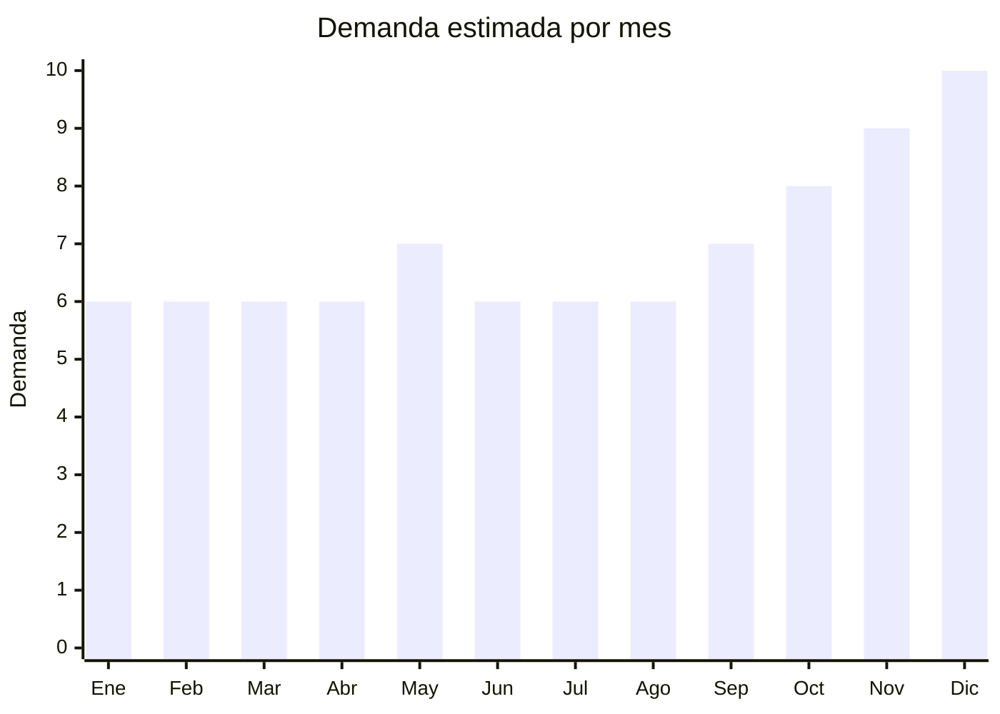

# Soportes para Celular

> **Capitulo NCM 85** — Maquinas, aparatos y material electrico | **Temporada:** Atemporal

## Que es y por que importarlo

Los soportes para celular son accesorios que permiten fijar o sostener el telefono movil en distintas superficies y situaciones: parabrisas del auto, rejilla de ventilacion, escritorio, bicicleta, o como tripode para fotos y videos. Son uno de los productos mas simples y rentables para importar desde China, con precios FOB desde USD 0.30 por unidad y margenes brutos que superan el 200%.

Este producto no requiere ninguna certificacion especial (no tiene WiFi, Bluetooth ni componentes electricos activos), lo que lo convierte en una opcion ideal para importadores principiantes. La demanda es constante y masiva: cada persona con smartphone es un potencial comprador, y la renovacion es frecuente porque son accesorios de bajo costo que se reemplazan facilmente.

**Sin antidumping.**

## Datos clave

| Dato | Valor |
|------|-------|
| **Posiciones NCM tipicas** | 8473.30.99 (partes y accesorios de maquinas), 3926.90.90 (articulos de plastico) |
| **Derecho de importacion** | 14% — 18% (DIE) + 3% tasa estadistica |
| **Rango FOB tipico** | USD 0.30 — USD 3 por unidad |
| **Precio de venta en Argentina** | ARS 3,000 — ARS 15,000 |
| **Margen bruto estimado** | 200% — 400% |
| **MOQ tipico** | 100 — 1,000 unidades |
| **Demanda en MercadoLibre** | Muy Alta (miles de publicaciones activas) |
| **Competencia en MercadoLibre** | Alta (muchos vendedores, productos genericos) |
| **Dificultad para importar** | Facil (sin certificaciones obligatorias) |
| **Certificaciones necesarias** | Ninguna (no requiere ENACOM ni S-Mark) |
| **Antidumping** | **No** |

## Variantes y subtipos mas comunes

| Subtipo / Variante | FOB aprox. | Venta AR aprox. | Nota |
|--------------------|-----------|-----------------|------|
| Soporte auto ventosa (parabrisas) | USD 0.80 — 2 | ARS 4,000 — 10,000 | Clasico. Ventosa + brazo ajustable. Universal para todos los celulares |
| Soporte auto magnetico (rejilla) | USD 0.50 — 1.50 | ARS 3,000 — 8,000 | Compacto y elegante. Requiere placa metalica en la funda del celular |
| Soporte escritorio ajustable | USD 0.30 — 1 | ARS 3,000 — 7,000 | Aluminio o plastico. Para escritorio, mesa de luz, cocina |
| Tripode con ring light | USD 3 — 8 | ARS 10,000 — 25,000 | Combinado. Mayor ticket. Popular para creadores de contenido |
| Soporte bicicleta/moto | USD 1 — 3 | ARS 5,000 — 15,000 | Resistente a vibraciones. Giro 360. Cierre con llave o silicona |

## Regulaciones y requisitos

<Tabs>
  <Tab title="Certificaciones">
    - **Sin certificaciones obligatorias**: Los soportes para celular de plastico, metal o silicona no requieren certificacion de ningun organismo
    - **ENACOM**: No requiere (no tiene conectividad inalambrica)
    - **S-Mark**: No requiere (no es aparato electrico)
    - **INTI/IRAM**: No hay norma obligatoria aplicable
    - **Excepcion**: Si el soporte incluye cargador inalambrico (Qi), si requiere ENACOM y S-Mark

    <Warning>
    Si el soporte tiene funcion de carga inalambrica (wireless charging), cambia completamente el encuadre regulatorio y requiere ENACOM + S-Mark. Verificar antes de importar.
    </Warning>
  </Tab>
  <Tab title="Etiquetado">
    - Datos del importador: razon social, CUIT, domicilio
    - Pais de origen
    - Material de fabricacion (plastico, aluminio, silicona)
    - Indicacion de compatibilidad (tamano de pantalla maximo)
    - Garantia legal 6 meses
  </Tab>
  <Tab title="Restricciones">
    - **Sin restricciones especiales** para este tipo de producto
    - La clasificacion NCM puede variar segun el material predominante (plastico: 3926, metal: 7326, mixto: 8473)
    - Consultar con despachante de aduanas la posicion correcta para optimizar aranceles
  </Tab>
</Tabs>

## Logistica

| Dato | Valor |
|------|-------|
| **Peso tipico por unidad** | 0.05 — 0.3 kg |
| **Volumen tipico** | Muy bajo (cajas compactas) |
| **Fragilidad** | Baja (plastico, metal, silicona) |
| **Envio recomendado** | Aereo o courier (ultraliviano, ideal para primeras importaciones) |
| **Tiempo total estimado** | 7 — 12 dias (aereo) / 45 — 60 dias (maritimo) |
| **Baterias de litio** | No |
| **Requiere empaque especial** | No |

<Tip>
Los soportes para celular son el producto perfecto para una primera importacion de prueba. Con USD 200-500 podes traer 200-500 unidades por aereo. Prioriza los soportes magneticos para auto y los de escritorio de aluminio, que tienen mejor percepcion de calidad y permiten un precio de venta mas alto. Solicita empaque individual con blister o caja retail para vender directamente sin reempaquetar.
</Tip>

## Estacionalidad



| Aspecto | Detalle |
|---------|---------|
| **Meses pico** | Octubre a Diciembre (Hot Sale, Black Friday, Navidad). Los soportes son un accesorio complementario ideal como regalo economico |
| **Meses valle** | Enero-Febrero (post-fiestas), pero la demanda base es constante todo el ano |
| **Cuando pedir para llegar a tiempo** | Septiembre para temporada alta (considerando 4-6 semanas de lead time aereo) |

## Ventajas y riesgos

<CardGroup cols={2}>
  <Card title="Ventajas" icon="circle-check">
    - Sin certificaciones obligatorias (ENACOM, S-Mark no aplican)
    - Margenes brutos de 200-400% sobre costo FOB
    - Producto ultraliviano, ideal para envio aereo
    - Inversion inicial muy baja (desde USD 200)
    - Demanda masiva y constante (todo usuario de smartphone)
    - Ideal para primera importacion de prueba
    - Multiples variantes para diversificar catalogo
  </Card>
  <Card title="Riesgos" icon="triangle-exclamation">
    - Competencia muy alta con productos genericos de bajo precio
    - Dificil diferenciarse sin marca propia
    - Margenes se comprimen con guerra de precios en ML
    - Calidad variable entre proveedores chinos
    - Productos de moda cambian rapido (ej: magneticos vs ventosa)
    - Ticket bajo requiere volumen alto para facturar bien
  </Card>
</CardGroup>

<Warning>
La clasificacion NCM de los soportes puede variar segun el material (plastico, metal) y si incluye componentes electronicos. Consultar con el despachante de aduanas ANTES de importar para confirmar la posicion arancelaria correcta y evitar diferencias en aduana que demoren el despacho.
</Warning>

## Palabras clave para buscar en Alibaba

```
car phone holder magnetic
car phone mount suction cup
desk phone stand adjustable aluminum
bike phone holder waterproof
tripod phone holder ring light
car vent mount phone holder
universal phone stand foldable
motorcycle phone holder anti vibration
```

## Fuentes

- [MercadoLibre Argentina — Soportes celular](https://listado.mercadolibre.com.ar/soporte-celular)
- [Alibaba — Car phone holder](https://www.alibaba.com/trade/search?SearchText=car+phone+holder)
- [Alibaba — Desk phone stand](https://www.alibaba.com/trade/search?SearchText=desk+phone+stand+aluminum)
