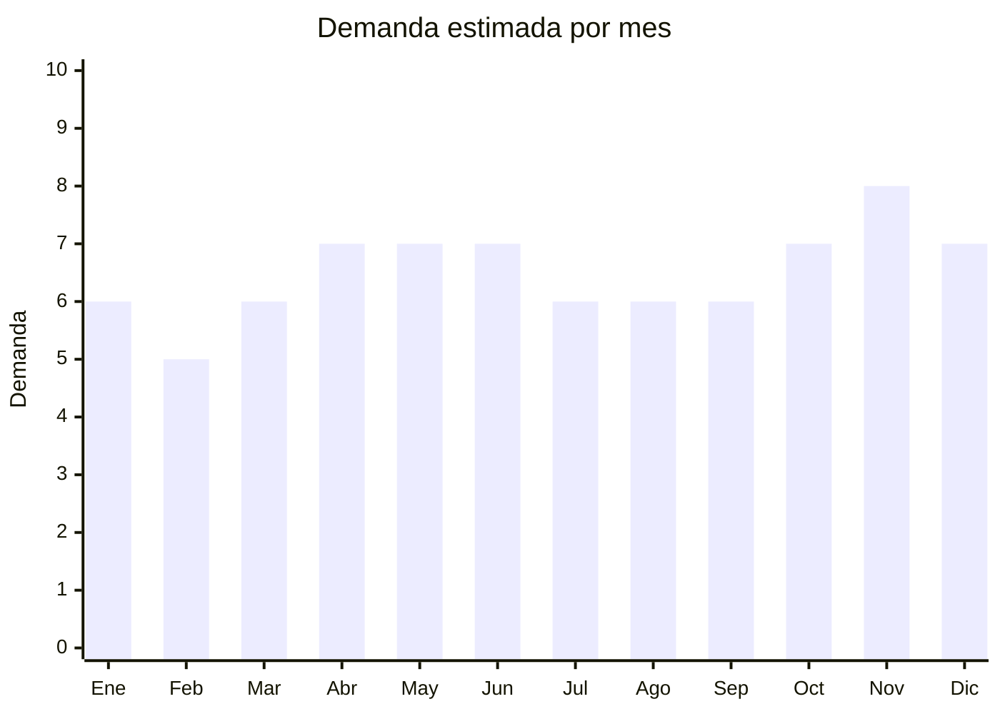

# Alfombrillas y bandejas de baul para auto

> **Capitulo NCM 87** — Vehiculos automoviles y sus partes | **Temporada:** Atemporal

## Que es y por que importarlo

Las alfombrillas para auto son piezas de goma, caucho, PVC o material termoplastico (TPE) que se colocan en el piso del vehiculo y en el baul para proteger la superficie original de barro, agua, arena, derrames y desgaste. Incluyen sets de 4 alfombrillas universales, bandejas de baul rigidas, alfombrillas moldeadas 3D tipo "bucket" que cubren bordes, y modelos especificos por marca/modelo de auto.

La demanda es permanente porque las alfombrillas se desgastan con el uso (especialmente en climas lluviosos o zonas de tierra), y los compradores de autos usados frecuentemente las renuevan. En Argentina, donde el parque automotor incluye millones de vehiculos circulando por rutas de ripio, caminos rurales y ciudades con lluvias frecuentes, este producto tiene una rotacion constante.

China produce la mayoria de alfombrillas automotrices del mundo, con fabricas en Hebei, Zhejiang y Guangdong que ofrecen tanto modelos universales como moldes especificos para los modelos mas vendidos en Argentina.

## Datos clave

| Dato | Valor |
|------|-------|
| **Posiciones NCM tipicas** | 8708.29.99 (accesorios carroceria) o 4016.99 (manufacturas de caucho) |
| **Derecho de importacion** | 18 — 20% (DIE) + 3% tasa estadistica |
| **Rango FOB tipico** | USD 3 — USD 12 por set |
| **Precio de venta en Argentina** | ARS 10.000 — ARS 40.000 |
| **Margen bruto estimado** | 150% — 250% |
| **MOQ tipico** | 100 — 300 sets |
| **Demanda en MercadoLibre** | Alta |
| **Competencia en MercadoLibre** | Media-Alta |
| **Dificultad para importar** | Facil |
| **Certificaciones necesarias** | Ninguna |
| **Antidumping** | No |

## Demanda y mercado en Argentina

- **Volumen de mercado:** Miles de publicaciones activas. Los sets universales de goma negra lideran en ventas con publicaciones de +1.000 vendidos.
- **Tendencia:** Estable con crecimiento en modelos 3D tipo bucket (mayor valor percibido y mejor ajuste).
- **Perfil del comprador:** Duenos de autos nuevos (proteccion desde el dia 1), compradores de autos usados (renovacion), taxistas/remiseros, conductores de apps, personas en zonas lluviosas o rurales.
- **Canales de venta principales:** MercadoLibre (dominante), casas de accesorios automotrices, gomerias que venden accesorios, concesionarios (como accesorio post-venta).

<Note>
Los modelos **especificos por auto** (moldeados para Fiat Cronos, Toyota Hilux, VW Gol, Chevrolet Onix) tienen menos competencia y se venden con un premium de 40-60% sobre los universales. Los autos mas vendidos en Argentina son: Fiat Cronos, Toyota Hilux, VW Gol/Polo, Chevrolet Onix, Peugeot 208 y Renault Sandero.
</Note>

## Competencia

| Aspecto | Situacion |
|---------|-----------|
| **Cantidad de vendedores en ML** | +400 vendedores activos |
| **Hay marcas dominantes** | Algunas marcas locales (Revistiendo, Goodyear accesorios) |
| **Tipo de competidores** | Importadores, fabricantes locales de caucho |
| **Rango de precios en ML** | ARS 10.000 — ARS 40.000 |
| **Posibilidad de diferenciarse** | Media-Alta |

**Como diferenciarse:**
- Alfombrillas 3D tipo bucket con bordes altos (tendencia premium)
- Modelos especificos por auto (menor competencia, mayor margen)
- Combos piso + baul del mismo material/color
- Marca propia con logo grabado en la alfombrilla

## Variantes y subtipos mas comunes

| Subtipo / Variante | FOB aprox. | Venta AR aprox. | Nota |
|--------------------|-----------|-----------------|------|
| Set x4 alfombrillas universales goma | USD 3 — 5 | ARS 10.000 — 18.000 | Volumen puro |
| Bandeja baul universal | USD 4 — 7 | ARS 12.000 — 22.000 | Complemento del set |
| Alfombrillas por modelo especifico | USD 6 — 10 | ARS 18.000 — 35.000 | **Mejor margen** |
| Alfombrillas 3D/bucket (bordes altos) | USD 8 — 12 | ARS 25.000 — 40.000 | Tendencia premium |
| Combo set piso + baul universal | USD 6 — 10 | ARS 18.000 — 32.000 | **Mas vendido** |

## Regulaciones y requisitos

<Tabs>
  <Tab title="Certificaciones">
    | Organismo | Requiere | Detalle |
    |-----------|----------|---------|
    | ARCA (Aduana) | Si siempre | Despacho estandar |
    | ANMAT | No | No es cosmético ni alimento |
    | ENACOM | No | No tiene componentes electronicos |
    | INTI | No | No es textil ni calzado |

    Producto sin barreras regulatorias. Clasificacion sencilla como accesorio de vehiculo o manufactura de caucho.
  </Tab>

  <Tab title="Etiquetado">
    | Requisito | Aplica |
    |-----------|--------|
    | Idioma espanol | Si |
    | Datos del importador | Si |
    | Composicion / materiales | Si (caucho, PVC, TPE, etc.) |
    | Pais de origen | Si |
    | Dimensiones / compatibilidad | Si (indicar si es universal o modelo especifico) |
    | Garantia legal 6 meses | Si |
  </Tab>

  <Tab title="Restricciones">
    Sin restricciones especiales. **Atencion con alfombrillas del lado conductor:** deben tener sistema antideslizante o fijacion para evitar que se deslicen sobre los pedales. Alfombrillas sueltas que interfieran con freno/acelerador pueden generar reclamos y responsabilidad legal.
  </Tab>
</Tabs>

## Logistica

| Dato | Valor |
|------|-------|
| **Peso tipico por set** | 2 — 5 kg (caucho/goma pesados) |
| **Volumen tipico** | Medio-Alto |
| **Fragilidad** | Muy baja (caucho es practicamente indestructible) |
| **Envio recomendado** | Maritimo LCL/FCL (pesado + voluminoso) |
| **Tiempo total estimado** | 45 — 75 dias (maritimo) / 15 — 25 dias (aereo, pero costoso) |
| **Baterias de litio** | No |
| **Requiere empaque especial** | No — apilar en cajas master |

<Tip>
El caucho/goma es **pesado** comparado con otros accesorios de auto. Un set de 4 alfombrillas + bandeja de baul puede pesar 4-5 kg. Esto hace que el flete aereo sea prohibitivo para volumenes grandes. **El maritimo es obligatorio** para mantener margenes. Calcula aproximadamente 500-700 sets por pallet y 8.000-10.000 sets en un contenedor de 20'.
</Tip>

## Estacionalidad



| Aspecto | Detalle |
|---------|---------|
| **Meses pico** | Abril-Junio (otono/invierno = lluvias y barro, mayor necesidad de proteccion) y Noviembre (CyberMonday + pre-vacaciones) |
| **Meses valle** | Enero-Febrero (post-vacaciones, menor actividad comercial) |
| **Cuando pedir** | Febrero-Marzo para cubrir temporada de lluvias otono/invierno; Agosto para CyberMonday/Navidad |

## Ventajas y riesgos

<CardGroup cols={2}>
  <Card title="Ventajas" icon="circle-check">
    - Demanda perpetua vinculada al parque automotor
    - Sin certificaciones ni regulaciones
    - Producto practicamente indestructible (cero roturas)
    - Posibilidad de modelos especificos con menos competencia
    - No requiere talle ni ajuste complejo
    - Facil de almacenar (apilable)
  </Card>
  <Card title="Riesgos" icon="triangle-exclamation">
    - Pesado (flete maritimo obligatorio para margen)
    - Competencia de fabricantes locales de caucho
    - Olor a goma nueva puede generar reclamos
    - Modelos universales no siempre ajustan perfecto
    - Capital inicial mayor por peso/volumen del producto
  </Card>
</CardGroup>

## Palabras clave para buscar en Alibaba

```
car floor mat rubber universal, car trunk mat, 3D car floor mat TPE,
car floor mat custom fit, car boot liner universal, car mat set wholesale,
car floor mat waterproof, car mat all weather
```

## Fuentes

- [MercadoLibre Argentina — Alfombrillas auto](https://listado.mercadolibre.com.ar/alfombrillas-auto-goma)
- [Alibaba — Car floor mat wholesale](https://www.alibaba.com/showroom/car-floor-mat-wholesale.html)
