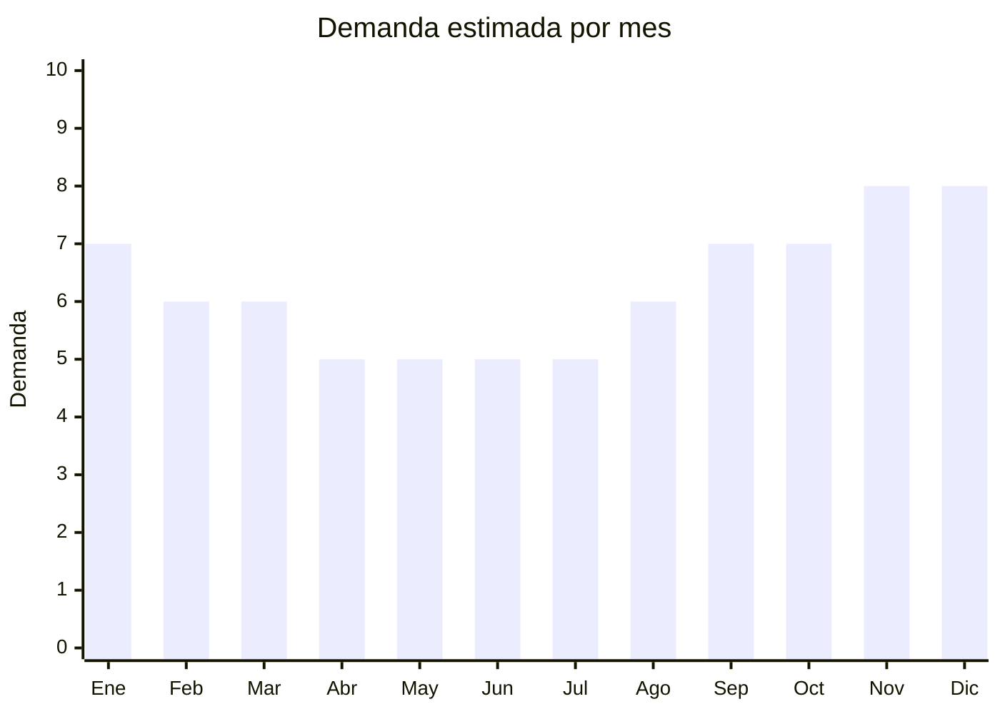

# Fundas de asiento para auto

> **Capitulo NCM 87** — Vehiculos automoviles y sus partes | **Temporada:** Atemporal

## Que es y por que importarlo

Las fundas de asiento para auto son cobertores textiles o de cuero sintetico que protegen la tapiceria original del vehiculo contra el desgaste, manchas, roturas y rayos UV. Incluyen fundas universales de tela, cuero sintetico (PU leather), neopreno, fundas deportivas con ajuste elastico, cubre asientos con respaldo completo y sets que incluyen cubre volante.

Es un producto de demanda perpetua porque el parque automotor argentino supera los 15 millones de vehiculos y la tapiceria se deteriora naturalmente con el uso. Los compradores buscan renovar la estetica interior del auto sin el costo de retapizar (que puede superar los ARS 200.000). Ademas, quienes compran autos usados frecuentemente renuevan las fundas como primera mejora.

China (especialmente Zhejiang y Guangdong) concentra la produccion mundial de fundas automotrices, con fabricas que ofrecen desde sets basicos de tela hasta lineas premium de cuero sintetico con logo personalizado desde 50 sets.

## Datos clave

| Dato | Valor |
|------|-------|
| **Posiciones NCM tipicas** | 8708.29.99 (partes y accesorios de carroceria) |
| **Derecho de importacion** | 18% (DIE) + 3% tasa estadistica |
| **Rango FOB tipico** | USD 3 — USD 15 por set |
| **Precio de venta en Argentina** | ARS 15.000 — ARS 50.000 |
| **Margen bruto estimado** | 150% — 300% |
| **MOQ tipico** | 50 — 200 sets |
| **Demanda en MercadoLibre** | Alta |
| **Competencia en MercadoLibre** | Media-Alta |
| **Dificultad para importar** | Facil |
| **Certificaciones necesarias** | Ninguna especial |
| **Antidumping** | No |

## Demanda y mercado en Argentina

- **Volumen de mercado:** Miles de publicaciones activas en MercadoLibre. Categoria con alta rotacion especialmente en sets universales.
- **Tendencia:** Estable todo el ano con leve pico pre-verano (proteccion solar) y post-vacaciones (desgaste por viajes).
- **Perfil del comprador:** Duenos de autos usados, taxistas/remiseros, conductores de apps (Uber, Cabify), familias con ninos y mascotas.
- **Canales de venta principales:** MercadoLibre (dominante), casas de accesorios automotrices, tapicerias, ferias de accesorios.

<Note>
Los modelos universales son los mas vendidos porque cubren el 80% del parque automotor. Sin embargo, los sets especificos por modelo (Corsa, Gol, Hilux, Cronos) tienen menos competencia y permiten cobrar un premium de 30-50%.
</Note>

## Competencia

| Aspecto | Situacion |
|---------|-----------|
| **Cantidad de vendedores en ML** | +500 vendedores activos |
| **Hay marcas dominantes** | No en generico. Algunas marcas locales tipo "Cuerina Nacional" |
| **Tipo de competidores** | Importadores, tapicerias con venta online |
| **Rango de precios en ML** | ARS 15.000 — ARS 50.000 |
| **Posibilidad de diferenciarse** | Media-Alta |

**Como diferenciarse:**
- Sets premium de cuero sintetico con costuras contrastantes
- Fundas especificas por modelo de auto (Hilux, Corsa, Cronos)
- Kits completos (asientos + volante + apoyacabeza + cinturon)
- Marca propia con packaging profesional y guia de instalacion

## Variantes y subtipos mas comunes

| Subtipo / Variante | FOB aprox. | Venta AR aprox. | Nota |
|--------------------|-----------|-----------------|------|
| Universal tela basica (set x2 delanteras) | USD 3 — 5 | ARS 15.000 — 22.000 | Volumen puro |
| Universal cuero sintetico (set completo) | USD 8 — 15 | ARS 30.000 — 50.000 | **Mas vendido** |
| Deportiva ajustable tipo bucket | USD 6 — 12 | ARS 25.000 — 40.000 | Publico joven |
| Cubre asiento con respaldo completo | USD 4 — 8 | ARS 18.000 — 30.000 | Proteccion total |
| Set con cubre volante incluido | USD 7 — 14 | ARS 28.000 — 48.000 | Mayor ticket promedio |

## Regulaciones y requisitos

<Tabs>
  <Tab title="Certificaciones">
    | Organismo | Requiere | Detalle |
    |-----------|----------|---------|
    | ARCA (Aduana) | Si siempre | Despacho estandar |
    | ANMAT | No | No es cosmético ni alimento |
    | ENACOM | No | No tiene componentes electronicos |
    | INTI | No | No es calzado. Textil no confeccionado como prenda |

    Producto sin barreras regulatorias significativas. Se clasifica como accesorio de vehiculo, no como textil de vestir.
  </Tab>

  <Tab title="Etiquetado">
    | Requisito | Aplica |
    |-----------|--------|
    | Idioma espanol | Si |
    | Datos del importador | Si |
    | Composicion / materiales | Si (poliester, PU leather, neopreno, etc.) |
    | Pais de origen | Si |
    | Instrucciones de instalacion | Recomendado |
    | Garantia legal 6 meses | Si |
  </Tab>

  <Tab title="Restricciones">
    Sin restricciones especiales. **Atencion con marcas automotrices registradas:** No importar fundas con logos de Toyota, Ford, Volkswagen, etc. sin licencia — es infraccion de marca y la Aduana puede retener el envio. Usar disenos genericos o marca propia.
  </Tab>
</Tabs>

## Logistica

| Dato | Valor |
|------|-------|
| **Peso tipico por set** | 1.5 — 3.5 kg |
| **Volumen tipico** | Medio-Alto (voluminoso comprimido) |
| **Fragilidad** | Muy baja |
| **Envio recomendado** | Maritimo LCL/FCL (volumen alto, peso moderado) |
| **Tiempo total estimado** | 45 — 75 dias (maritimo) / 15 — 25 dias (aereo) |
| **Baterias de litio** | No |
| **Requiere empaque especial** | Bolsa sellada para evitar humedad |

<Tip>
Las fundas se comprimen bien al vacio. Pedi al proveedor **empaque al vacio** para reducir volumen hasta un 50% y ahorrar en flete maritimo. Un contenedor de 20' puede transportar aproximadamente 2.000-3.000 sets completos.
</Tip>

## Estacionalidad



| Aspecto | Detalle |
|---------|---------|
| **Meses pico** | Noviembre-Enero (pre-vacaciones, regalos navidad, viajes de verano que motivan renovacion) |
| **Meses valle** | Abril-Junio (post-vacaciones, menor movimiento vehicular) |
| **Cuando pedir** | Agosto-Septiembre para cubrir temporada alta Nov-Ene |

## Ventajas y riesgos

<CardGroup cols={2}>
  <Card title="Ventajas" icon="circle-check">
    - Demanda perpetua vinculada al parque automotor
    - Sin certificaciones ni regulaciones complejas
    - Margenes de 150-300%
    - Producto no perecedero (stock sin vencimiento)
    - Facil de customizar con marca propia
    - Multiples variantes para diversificar
  </Card>
  <Card title="Riesgos" icon="triangle-exclamation">
    - Voluminoso (flete mas caro vs productos livianos)
    - Tallas universales no siempre calzan perfecto
    - Calidad de cuero sintetico variable (puede pelar)
    - Competencia de tapicerias locales
    - Necesidad de fotos profesionales por modelo de auto
  </Card>
</CardGroup>

## Palabras clave para buscar en Alibaba

```
car seat cover universal, PU leather car seat cover set, car seat protector wholesale,
car seat cover full set, neoprene car seat cover, custom car seat cover logo,
car seat cover waterproof, sport car seat cover
```

## Fuentes

- [MercadoLibre Argentina — Fundas asiento auto](https://listado.mercadolibre.com.ar/fundas-asiento-auto)
- [Alibaba — Car seat cover wholesale](https://www.alibaba.com/showroom/car-seat-cover-wholesale.html)
