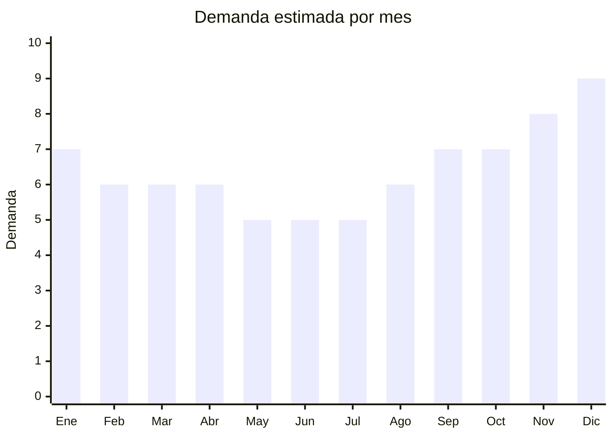

# Luces LED para auto

> **Capitulo NCM 87** — Vehiculos automoviles y sus partes | **Temporada:** Atemporal

## Que es y por que importarlo

Las luces LED para auto son dispositivos de iluminacion decorativa y funcional disenados para el interior y exterior del vehiculo. Incluyen tiras LED RGB para el interior (piso, bajo asiento, tablero), luces ambiente con control remoto o app, luces de puerta con logo proyectado, barras LED para el techo y luces LED de matricula. Se conectan al encendedor 12V, por USB o directamente a la linea electrica del auto.

Es un producto con demanda sostenida porque la personalizacion vehicular es una tendencia creciente, especialmente entre jovenes de 18 a 35 anos. Las luces LED transforman la estetica del auto por un costo minimo comparado con otras modificaciones. Ademas, son productos ultralivianos con margenes excepcionales de 200-400%.

Shenzhen (China) es el epicentro mundial de produccion LED, con miles de fabricas que ofrecen tiras LED automotrices personalizadas desde MOQ de 50 unidades.

## Datos clave

| Dato | Valor |
|------|-------|
| **Posiciones NCM tipicas** | 8512.20 (aparatos de alumbrado para vehiculos) o 9405.40 (otros aparatos electricos de alumbrado) |
| **Derecho de importacion** | 18% (DIE) + 3% tasa estadistica |
| **Rango FOB tipico** | USD 1 — USD 5 por unidad |
| **Precio de venta en Argentina** | ARS 5.000 — ARS 20.000 |
| **Margen bruto estimado** | 200% — 400% |
| **MOQ tipico** | 50 — 300 unidades |
| **Demanda en MercadoLibre** | Alta |
| **Competencia en MercadoLibre** | Media-Alta |
| **Dificultad para importar** | Facil (sin BT/WiFi) — Media (con BT/WiFi) |
| **Certificaciones necesarias** | ENACOM solo si tiene Bluetooth o WiFi |
| **Antidumping** | No |

## Demanda y mercado en Argentina

- **Volumen de mercado:** Miles de publicaciones activas. Las tiras LED RGB interior son bestsellers constantes con publicaciones de +5.000 ventas.
- **Tendencia:** En crecimiento — la cultura de tuning y personalizacion vehicular crece sostenidamente. TikTok y YouTube impulsan la tendencia con videos de "car makeover".
- **Perfil del comprador:** Jovenes 18-35, entusiastas del tuning, conductores de apps que quieren mejorar la experiencia del pasajero, regalos entre amigos.
- **Canales de venta principales:** MercadoLibre (dominante), tiendas de tuning/accesorios, Instagram, ferias de autos.

<Note>
Las **tiras LED RGB con control por app Bluetooth** son las mas vendidas y tienen el margen mas alto. Sin embargo, requieren homologacion ENACOM por incluir tecnologia de radiofrecuencia. Los modelos **sin Bluetooth** (control por remoto infrarrojo o switch manual) no requieren ENACOM y son ideales para empezar.
</Note>

## Competencia

| Aspecto | Situacion |
|---------|-----------|
| **Cantidad de vendedores en ML** | +400 vendedores activos |
| **Hay marcas dominantes** | Gadnic y marcas chinas white-label lideran |
| **Tipo de competidores** | Importadores masivos, tiendas de tuning |
| **Rango de precios en ML** | ARS 5.000 — ARS 20.000 |
| **Posibilidad de diferenciarse** | Media |

**Como diferenciarse:**
- Kits completos con instalacion simplificada (conectores plug & play)
- Videos de instalacion en la publicacion
- Modelos con control por app (mayor valor percibido)
- Combos interior + exterior (tira interior + luz matricula + luz puerta)

## Variantes y subtipos mas comunes

| Subtipo / Variante | FOB aprox. | Venta AR aprox. | Nota |
|--------------------|-----------|-----------------|------|
| Tira LED interior RGB (set x4) | USD 2 — 5 | ARS 8.000 — 20.000 | **Mas vendido** |
| Luz ambiente bajo asiento (fibra optica) | USD 3 — 5 | ARS 10.000 — 18.000 | Efecto premium |
| Luz puerta logo proyector | USD 1 — 3 | ARS 5.000 — 12.000 | Compra impulsiva |
| Barra LED techo / parabrisas | USD 3 — 5 | ARS 10.000 — 18.000 | Publico aventura/4x4 |
| Luz matricula LED (par) | USD 1 — 2 | ARS 4.000 — 8.000 | Funcional + estetico |

## Regulaciones y requisitos

<Tabs>
  <Tab title="Certificaciones">
    | Organismo | Requiere | Detalle |
    |-----------|----------|---------|
    | ARCA (Aduana) | Si siempre | Despacho estandar |
    | ANMAT | No | No es cosmético ni alimento |
    | ENACOM | **Solo modelos con Bluetooth/WiFi** | Numero RAMATEL obligatorio. Costo USD 200-1.000 por modelo, 2-6 meses de tramite |
    | INTI | No | No es textil ni calzado |
    | S-Mark | Consultar | Desde octubre 2025, aparatos electricos pueden requerir S-Mark + QR |

    <Warning>
    Si importas modelos con **control por app Bluetooth**, necesitas homologacion ENACOM antes de poder venderlos legalmente. Los modelos con **control remoto infrarrojo** o **switch manual** NO requieren ENACOM y son la opcion mas segura para empezar.
    </Warning>
  </Tab>

  <Tab title="Etiquetado">
    | Requisito | Aplica |
    |-----------|--------|
    | Idioma espanol | Si |
    | Datos del importador | Si |
    | Voltaje y potencia | Si (12V DC) |
    | Pais de origen | Si |
    | Instrucciones de instalacion | Muy recomendado |
    | Garantia legal 6 meses | Si |
    | Numero RAMATEL | Solo si tiene BT/WiFi |
  </Tab>

  <Tab title="Restricciones">
    - **Modelos con Bluetooth/WiFi:** Requieren ENACOM obligatoriamente.
    - **Luces exteriores:** Verificar que cumplan normativa de transito. Las luces estroboscopicas rojas y azules estan prohibidas (reservadas para fuerzas de seguridad).
    - **Barras LED de techo:** En algunas jurisdicciones provinciales pueden requerir revision tecnica vehicular (VTV) para uso en ruta.
  </Tab>
</Tabs>

## Logistica

| Dato | Valor |
|------|-------|
| **Peso tipico por unidad** | 0.05 — 0.30 kg |
| **Volumen tipico** | Muy bajo |
| **Fragilidad** | Baja-Media (LEDs son resistentes, conectores pueden danarse) |
| **Envio recomendado** | Aereo/Courier (ultraliviano, ideal para primeros pedidos) |
| **Tiempo total estimado** | 10 — 20 dias (aereo) / 45 — 75 dias (maritimo) |
| **Baterias de litio** | No (alimentacion 12V vehicular) |
| **Requiere empaque especial** | Proteccion anti-estatica recomendada |

<Tip>
Las luces LED son uno de los productos mas eficientes para envio aereo. Un pedido de 500 sets de tiras LED pesa menos de 50 kg y cabe en pocas cajas. El flete aereo es minimo y permite **testear el mercado rapidamente** antes de hacer pedidos grandes por maritimo.
</Tip>

## Estacionalidad



| Aspecto | Detalle |
|---------|---------|
| **Meses pico** | Noviembre-Enero (regalos navidad, CyberMonday, verano = mas salidas nocturnas en auto) |
| **Meses valle** | Mayo-Julio (invierno, menos salidas nocturnas) |
| **Cuando pedir** | Septiembre para tener stock en noviembre. Reposicion continua por bajo MOQ |

## Ventajas y riesgos

<CardGroup cols={2}>
  <Card title="Ventajas" icon="circle-check">
    - Ultraliviano (flete minimo, ideal aereo)
    - Margenes de 200-400%
    - Tendencia creciente (tuning + redes sociales)
    - Sin ENACOM en modelos basicos (IR/manual)
    - MOQ bajo para testear
    - Alto valor percibido vs costo real
  </Card>
  <Card title="Riesgos" icon="triangle-exclamation">
    - Modelos BT/WiFi requieren ENACOM (costo + tiempo)
    - Calidad variable — LEDs baratos pueden fallar rapido
    - Competencia de Gadnic y marcas establecidas
    - Riesgo de que el comprador no sepa instalar (reclamos)
    - Luces exteriores pueden tener restricciones de transito
  </Card>
</CardGroup>

## Palabras clave para buscar en Alibaba

```
car LED strip interior RGB, car ambient light USB, car door logo projector light,
car LED atmosphere light app control, car license plate LED, car LED strip 12V,
car interior LED kit, car underglow LED strip
```

## Fuentes

- [MercadoLibre Argentina — Luces LED auto](https://listado.mercadolibre.com.ar/luces-led-interior-auto)
- [Alibaba — Car LED strip wholesale](https://www.alibaba.com/showroom/car-led-strip-light.html)
