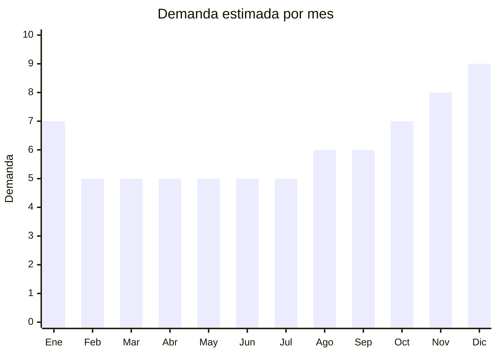

# Organizadores para auto

> **Capitulo NCM 87** — Vehiculos automoviles y sus partes | **Temporada:** Atemporal

## Que es y por que importarlo

Los organizadores para auto son accesorios disenados para mantener el orden dentro del vehiculo. Incluyen organizadores plegables de maletero, bolsillos para el respaldo del asiento trasero, redes porta objetos, bandejas antideslizantes para el tablero y bolsillos laterales para las puertas. Estan fabricados principalmente en tela Oxford 600D, poliester, cuero sintetico o combinaciones con estructura rigida.

La demanda es permanente porque todo conductor necesita orden en su vehiculo, especialmente familias con ninos, conductores de apps (Uber/Cabify), viajantes de comercio y cualquier persona que use su auto a diario. Es un producto de compra impulsiva con ticket bajo y alta percepcion de valor.

China produce la gran mayoria de organizadores vehiculares del mundo, con fabricas en Yiwu y Guangzhou que ofrecen personalizacion de logo y color desde MOQ de 100 unidades.

## Datos clave

| Dato | Valor |
|------|-------|
| **Posiciones NCM tipicas** | 8708.29.99 (accesorios de carroceria) o 4202.92 (articulos de viaje — segun material) |
| **Derecho de importacion** | 18 — 20% (DIE) + 3% tasa estadistica |
| **Rango FOB tipico** | USD 2 — USD 8 por unidad |
| **Precio de venta en Argentina** | ARS 8.000 — ARS 30.000 |
| **Margen bruto estimado** | 200% — 400% |
| **MOQ tipico** | 100 — 500 unidades |
| **Demanda en MercadoLibre** | Media-Alta |
| **Competencia en MercadoLibre** | Media |
| **Dificultad para importar** | Muy Facil |
| **Certificaciones necesarias** | Ninguna |
| **Antidumping** | No |

## Demanda y mercado en Argentina

- **Volumen de mercado:** Cientos de publicaciones activas. Nicho en crecimiento con menor saturacion que fundas o luces LED.
- **Tendencia:** Creciente — la tendencia de "car organization" en redes sociales (TikTok, Instagram) impulsa ventas.
- **Perfil del comprador:** Familias con ninos, conductores de apps, viajeros frecuentes, personas ordenadas, duenos de SUV/camionetas.
- **Canales de venta principales:** MercadoLibre, Instagram shops, casas de accesorios automotrices.

<Note>
El organizador de maletero plegable es el producto estrella de la categoria. Es compacto cuando no se usa, se despliega con estructura rigida y resuelve un problema real de todo conductor. Los modelos con logo bordado de marca propia tienen excelente percepcion de calidad.
</Note>

## Competencia

| Aspecto | Situacion |
|---------|-----------|
| **Cantidad de vendedores en ML** | +200 vendedores activos |
| **Hay marcas dominantes** | No — mercado fragmentado |
| **Tipo de competidores** | Importadores pequenos, tiendas de accesorios |
| **Rango de precios en ML** | ARS 8.000 — ARS 30.000 |
| **Posibilidad de diferenciarse** | Alta |

**Como diferenciarse:**
- Marca propia bordada en el organizador
- Combos (organizador maletero + organizador asiento + red)
- Modelos premium con compartimentos termicos (para bebidas)
- Organizadores especificos para SUV/camionetas (mas grandes)

## Variantes y subtipos mas comunes

| Subtipo / Variante | FOB aprox. | Venta AR aprox. | Nota |
|--------------------|-----------|-----------------|------|
| Organizador maletero plegable | USD 4 — 8 | ARS 15.000 — 30.000 | **Mas vendido** |
| Organizador asiento trasero (bolsillos) | USD 2 — 5 | ARS 8.000 — 18.000 | Ideal familias |
| Bolsillo lateral puerta | USD 2 — 3 | ARS 6.000 — 12.000 | Complemento |
| Red porta objetos maletero | USD 1 — 3 | ARS 5.000 — 12.000 | Bajo costo, buen margen |
| Bandeja antideslizante dashboard | USD 2 — 4 | ARS 7.000 — 15.000 | Compra impulsiva |

## Regulaciones y requisitos

<Tabs>
  <Tab title="Certificaciones">
    | Organismo | Requiere | Detalle |
    |-----------|----------|---------|
    | ARCA (Aduana) | Si siempre | Despacho estandar |
    | ANMAT | No | No es cosmético ni alimento |
    | ENACOM | No | No tiene componentes electronicos |
    | INTI | No | No es textil de vestir ni calzado |

    Producto sin ninguna barrera regulatoria. Es uno de los accesorios mas simples de importar.
  </Tab>

  <Tab title="Etiquetado">
    | Requisito | Aplica |
    |-----------|--------|
    | Idioma espanol | Si |
    | Datos del importador | Si |
    | Composicion / materiales | Si (Oxford 600D, poliester, PU leather) |
    | Pais de origen | Si |
    | Dimensiones del producto | Recomendado |
    | Garantia legal 6 meses | Si |
  </Tab>

  <Tab title="Restricciones">
    Sin restricciones. Producto de libre importacion sin requisitos especiales. Verificar que los materiales no contengan sustancias toxicas si el producto se comercializa como apto para ninos.
  </Tab>
</Tabs>

## Logistica

| Dato | Valor |
|------|-------|
| **Peso tipico por unidad** | 0.3 — 1.2 kg |
| **Volumen tipico** | Bajo-Medio (plegable/comprimible) |
| **Fragilidad** | Muy baja |
| **Envio recomendado** | Aereo para primeros lotes; Maritimo LCL para volumen |
| **Tiempo total estimado** | 10 — 20 dias (aereo) / 45 — 75 dias (maritimo) |
| **Baterias de litio** | No |
| **Requiere empaque especial** | No — se comprimen facilmente |

<Tip>
Los organizadores plegables se pueden enviar aplastados y ocupan minimo volumen. Un pedido de 200 unidades cabe facilmente en un envio aereo estandar. Pedi al proveedor que los envie **plegados al minimo** dentro de cajas master de 20-30 unidades para optimizar espacio.
</Tip>

## Estacionalidad



| Aspecto | Detalle |
|---------|---------|
| **Meses pico** | Noviembre-Enero (regalos navidad, preparacion viaje vacaciones, CyberMonday) |
| **Meses valle** | Febrero-Junio (post-vacaciones) |
| **Cuando pedir** | Agosto-Septiembre para tener stock en noviembre |

## Ventajas y riesgos

<CardGroup cols={2}>
  <Card title="Ventajas" icon="circle-check">
    - Sin regulaciones ni certificaciones
    - Margenes de 200-400%
    - Liviano y comprimible (flete bajo)
    - Menor competencia que otros accesorios auto
    - Facil de customizar con marca propia
    - Compra impulsiva — alto volumen de venta
  </Card>
  <Card title="Riesgos" icon="triangle-exclamation">
    - Calidad de costuras variable entre proveedores
    - Fotos del producto deben mostrar uso real en auto
    - Clasificacion NCM puede variar segun material (textil vs plastico)
    - Producto de ticket bajo — necesita volumen para rentabilidad
    - Modelos baratos chinos pueden tener olor quimico fuerte
  </Card>
</CardGroup>

## Palabras clave para buscar en Alibaba

```
car trunk organizer foldable, car backseat organizer, car door pocket organizer,
car trunk net, dashboard anti-slip mat, car organizer wholesale,
car storage bag oxford, SUV trunk organizer large
```

## Fuentes

- [MercadoLibre Argentina — Organizadores auto](https://listado.mercadolibre.com.ar/organizador-auto-maletero)
- [Alibaba — Car trunk organizer wholesale](https://www.alibaba.com/showroom/car-trunk-organizer.html)
