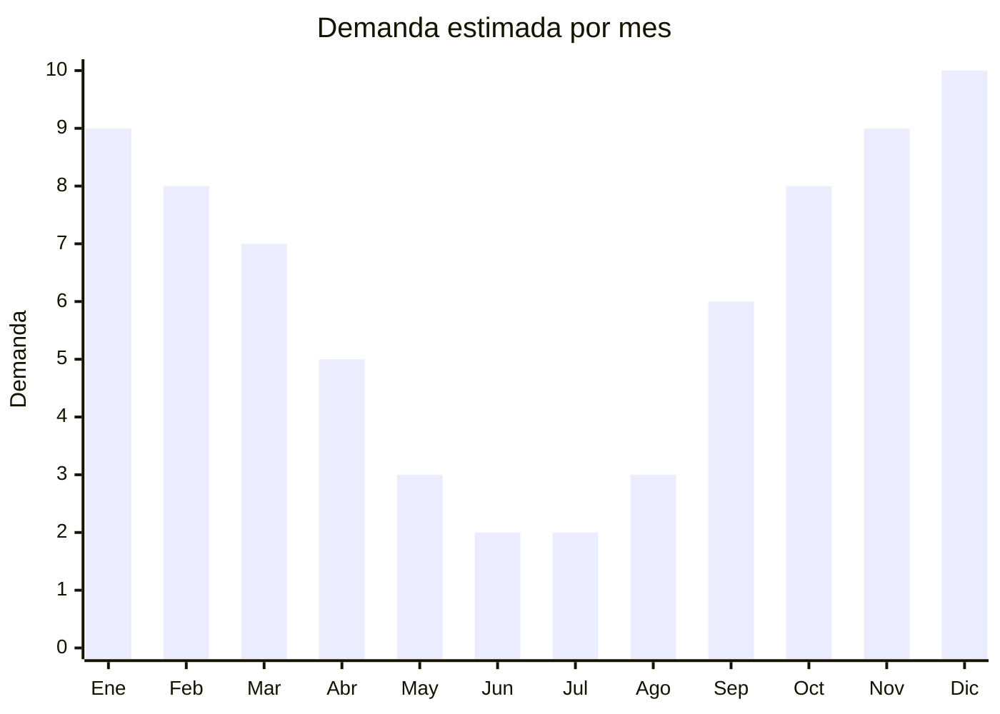

# Parasoles y protectores solares para auto

> **Capitulo NCM 87** — Vehiculos automoviles y sus partes | **Temporada:** Atemporal

## Que es y por que importarlo

Los parasoles para auto son accesorios disenados para bloquear la radiacion solar y reducir la temperatura interior del vehiculo cuando esta estacionado o en movimiento. Incluyen parasoles reflectivos para parabrisas, cortinas laterales con ventosa o magneticas, parasoles retractiles, protectores UV para ventanillas traseras y parasoles infantiles con disenos animados. Estan fabricados en materiales reflectivos (aluminio/poliester metalizado), tela con tratamiento UV, nylon o malla.

Es un producto con demanda durante todo el ano en Argentina (especialmente entre septiembre y marzo por las altas temperaturas) y con costos FOB extremadamente bajos (desde USD 0.50), lo que permite margenes de 200-400%. Cada vehiculo necesita al menos un parasol de parabrisas, y las familias con ninos compran multiples protectores laterales.

China (Yiwu y Zhejiang) domina la produccion mundial de parasoles automotrices, con fabricas que ofrecen personalizacion de diseno e impresion full color desde MOQ de 200 unidades.

## Datos clave

| Dato | Valor |
|------|-------|
| **Posiciones NCM tipicas** | 8708.29.99 (accesorios de carroceria/vehiculo) |
| **Derecho de importacion** | 18% (DIE) + 3% tasa estadistica |
| **Rango FOB tipico** | USD 0.50 — USD 3 por unidad |
| **Precio de venta en Argentina** | ARS 3.000 — ARS 12.000 |
| **Margen bruto estimado** | 200% — 400% |
| **MOQ tipico** | 200 — 1.000 unidades |
| **Demanda en MercadoLibre** | Alta |
| **Competencia en MercadoLibre** | Media |
| **Dificultad para importar** | Muy Facil |
| **Certificaciones necesarias** | Ninguna |
| **Antidumping** | No |

## Demanda y mercado en Argentina

- **Volumen de mercado:** Cientos de publicaciones activas con alta rotacion. Las publicaciones mas exitosas superan las 2.000 ventas.
- **Tendencia:** Estable con pico marcado en primavera/verano. Los parasoles retractiles y las cortinas magneticas son las variantes con mayor crecimiento.
- **Perfil del comprador:** Universal — cualquier persona con vehiculo. Especialmente familias con bebes/ninos, personas que estacionan al sol, conductores de apps, taxistas.
- **Canales de venta principales:** MercadoLibre (dominante), kioscos y maxikioscos, estaciones de servicio, casas de accesorios, venta ambulante.

<Note>
Los parasoles de parabrisas reflectivos son ideales como **producto gancho** (producto de bajo costo que atrae clientes). Muchos vendedores exitosos los usan para generar volumen y reviews positivos, y luego venden productos de mayor ticket (fundas, organizadores) al mismo comprador.
</Note>

## Competencia

| Aspecto | Situacion |
|---------|-----------|
| **Cantidad de vendedores en ML** | +300 vendedores activos |
| **Hay marcas dominantes** | No — mercado totalmente fragmentado |
| **Tipo de competidores** | Importadores pequenos, kiosqueros, vendedores ambulantes |
| **Rango de precios en ML** | ARS 3.000 — ARS 12.000 |
| **Posibilidad de diferenciarse** | Media |

**Como diferenciarse:**
- Parasoles con disenos creativos/humor argentino
- Packs combo (parabrisas + laterales + trasera)
- Cortinas magneticas (instalacion sin ventosa que se cae)
- Parasoles con bolsa de almacenamiento incluida
- Disenos infantiles con personajes (atencion: licencias)

## Variantes y subtipos mas comunes

| Subtipo / Variante | FOB aprox. | Venta AR aprox. | Nota |
|--------------------|-----------|-----------------|------|
| Parasol parabrisas reflectivo | USD 0.50 — 1.50 | ARS 3.000 — 7.000 | **Mas vendido** |
| Parasol lateral ventanilla (pack x2) | USD 0.80 — 2.00 | ARS 4.000 — 9.000 | Familias con ninos |
| Parasol retractil enrollable | USD 1.50 — 3.00 | ARS 6.000 — 12.000 | Mayor valor percibido |
| Cortina magnetica ventanilla (pack x2) | USD 1.00 — 2.50 | ARS 5.000 — 10.000 | Tendencia en crecimiento |
| Parasol infantil con disenos (pack x2) | USD 0.80 — 2.00 | ARS 4.000 — 10.000 | Nicho padres/madres |

## Regulaciones y requisitos

<Tabs>
  <Tab title="Certificaciones">
    | Organismo | Requiere | Detalle |
    |-----------|----------|---------|
    | ARCA (Aduana) | Si siempre | Despacho estandar |
    | ANMAT | No | No es cosmético ni alimento |
    | ENACOM | No | No tiene componentes electronicos |
    | INTI | No | No es textil de vestir ni calzado |

    Producto de libre importacion sin ninguna barrera regulatoria. Es uno de los productos mas simples de importar dentro del capitulo 87.
  </Tab>

  <Tab title="Etiquetado">
    | Requisito | Aplica |
    |-----------|--------|
    | Idioma espanol | Si |
    | Datos del importador | Si |
    | Material de composicion | Si (poliester metalizado, nylon, etc.) |
    | Pais de origen | Si |
    | Dimensiones | Recomendado (para compatibilidad con tamano de parabrisas) |
    | Garantia legal 6 meses | Si |
  </Tab>

  <Tab title="Restricciones">
    Sin restricciones. **Atencion con personajes licenciados:** No importar parasoles con disenos de Disney, Marvel, Peppa Pig, etc. sin licencia — la Aduana puede retener por infraccion de propiedad intelectual. Usar disenos genericos (animales, estrellas, colores) o disenos propios.
  </Tab>
</Tabs>

## Logistica

| Dato | Valor |
|------|-------|
| **Peso tipico por unidad** | 0.05 — 0.20 kg |
| **Volumen tipico** | Bajo (plegable/enrollable) |
| **Fragilidad** | Muy baja |
| **Envio recomendado** | Aereo/Courier (ultraliviano, ideal primeros pedidos) |
| **Tiempo total estimado** | 10 — 20 dias (aereo) / 45 — 75 dias (maritimo) |
| **Baterias de litio** | No |
| **Requiere empaque especial** | No — embolsado individual suficiente |

<Tip>
Los parasoles son uno de los productos **mas livianos y baratos** de este capitulo. Un pedido de 1.000 parasoles plegables pesa apenas 80-100 kg y cabe en pocas cajas. El envio aereo es muy economico, lo que permite **testear multiples variantes** con bajo riesgo. Ideal como primer producto para quien recien empieza a importar accesorios automotrices.
</Tip>

## Estacionalidad



| Aspecto | Detalle |
|---------|---------|
| **Meses pico** | Octubre-Febrero (primavera/verano, altas temperaturas, mayor exposicion solar) |
| **Meses valle** | Mayo-Julio (invierno, baja radiacion solar, menor necesidad) |
| **Cuando pedir** | Julio-Agosto para tener stock listo en octubre cuando arranca la temporada de calor |

<Warning>
A pesar de ser un producto "atemporal" (se vende todo el ano), los parasoles tienen la **estacionalidad mas marcada** de todos los accesorios de auto en esta guia. La demanda en verano puede ser 4-5 veces mayor que en invierno. Planifica tu stock en consecuencia y no te quedes sin mercaderia en diciembre-enero.
</Warning>

## Ventajas y riesgos

<CardGroup cols={2}>
  <Card title="Ventajas" icon="circle-check">
    - FOB bajisimo (desde USD 0.50)
    - Margenes de 200-400%
    - Ultraliviano (flete aereo minimo)
    - Sin certificaciones ni regulaciones
    - Ideal como primer producto de importacion
    - Funciona como producto gancho para otros accesorios
  </Card>
  <Card title="Riesgos" icon="triangle-exclamation">
    - Estacionalidad marcada (demanda cae mucho en invierno)
    - Ticket promedio bajo (necesita volumen)
    - Competencia de precio con vendedores ambulantes
    - Calidad de impresion variable (disenos se descoloran)
    - Ventosas pueden perder adherencia con el calor
  </Card>
</CardGroup>

## Palabras clave para buscar en Alibaba

```
car windshield sunshade, car sun visor foldable, car window sunshade magnetic,
car sun shade baby, car sunshade reflective, car parasol wholesale,
car side window shade, car retractable sunshade
```

## Fuentes

- [MercadoLibre Argentina — Parasoles auto](https://listado.mercadolibre.com.ar/parasol-auto-parabrisas)
- [Alibaba — Car sunshade wholesale](https://www.alibaba.com/showroom/car-sunshade-wholesale.html)
