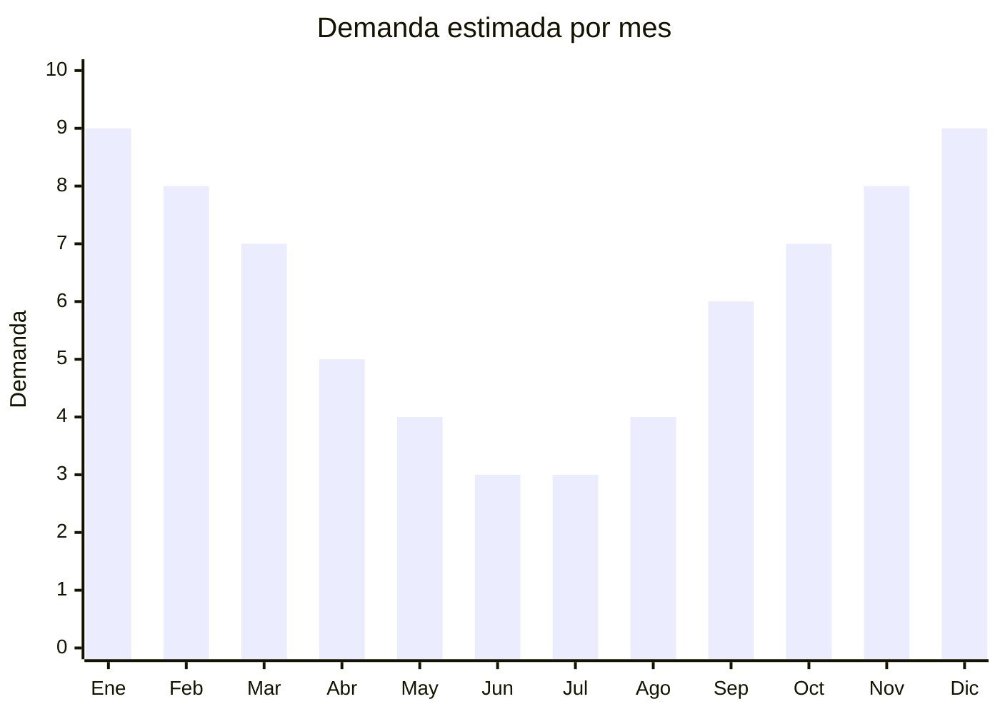

# Lentes de sol

> **Capítulo NCM 90** — Instrumentos y aparatos de óptica, medida y control | **Temporada:** Atemporal

## Qué es y por qué importarlo

Los lentes de sol son accesorios de protección ocular y moda que incluyen monturas con lentes oscuros o polarizados con filtro UV. Es uno de los productos de importación más rentables por su combinación de peso ultraliviano, costo FOB bajísimo y percepción de valor alta en el consumidor final. Se usan todo el año (verano por necesidad, invierno como accesorio de moda).

Wenzhou (China) es la capital mundial de fabricación de anteojos, concentrando más del 70% de la producción global de gafas económicas y de gama media. Los proveedores de Wenzhou ofrecen catálogos con miles de modelos actualizados por temporada, posibilidad de marca propia (private label) con logo grabado en patillas, y MOQ accesibles desde 20-50 unidades por modelo.

Argentina tiene un mercado enorme de lentes de sol: la combinación de altas temperaturas en gran parte del año, cultura de moda y precios locales elevados de marcas oficiales genera una oportunidad constante para importadores que ofrezcan diseños actuales a precios competitivos.

## Datos clave

| Dato | Valor |
|------|-------|
| **Posiciones NCM típicas** | 9004.10.00 (gafas de sol) |
| **Derecho de importación** | 20% (DIE) + 3% tasa estadística |
| **Rango FOB típico** | USD 0.50 — USD 5.00 por unidad |
| **Precio de venta en Argentina** | ARS 5.000 — ARS 30.000 |
| **Margen bruto estimado** | 200% — 500% |
| **MOQ típico** | 50 — 300 unidades (surtido de modelos); 500+ para private label |
| **Demanda en MercadoLibre** | Muy Alta |
| **Competencia en MercadoLibre** | Alta |
| **Dificultad para importar** | Fácil |
| **Certificaciones necesarias** | No requiere ANMAT |
| **Antidumping** | No |

## Variantes y subtipos más comunes

| Subtipo / Variante | FOB aprox. | Venta AR aprox. | Nota |
|--------------------|-----------|-----------------|------|
| Aviador clásico (metal) | USD 0.80 — 2.50 | ARS 5.000 — 15.000 | Clásico atemporal, siempre vende |
| Wayfarer / cuadrado | USD 0.50 — 2.00 | ARS 5.000 — 12.000 | **Más vendido** — diseño universal |
| Deportivo polarizado | USD 1.50 — 5.00 | ARS 10.000 — 30.000 | Segmento premium, ciclismo/running |
| Cat-eye mujer | USD 0.80 — 3.00 | ARS 6.000 — 18.000 | Tendencia consolidada, público femenino |
| Oversized / maxi | USD 1.00 — 3.50 | ARS 8.000 — 20.000 | Moda actual, cobertura amplia |
| Clip-on magnético | USD 1.50 — 4.00 | ARS 8.000 — 25.000 | Para usuarios de lentes recetados |

## Regulaciones y requisitos

<Tabs>
  <Tab title="Certificaciones">
    | Organismo | Requiere | Detalle | Costo aprox. | Tiempo aprox. |
    |-----------|----------|---------|-------------|--------------|
    | ARCA (Aduana) | Sí siempre | Despacho de importación estándar | — | — |
    | ANMAT | **No** | Los lentes de sol sin graduación no son dispositivos médicos. Solo requieren ANMAT si tienen lentes recetados/correctivos | — | — |
    | ENACOM | No | No es dispositivo electrónico | — | — |
    | INTI | No | No es textil ni calzado | — | — |

    **Nota estratégica:** La ausencia de requisito ANMAT es una gran ventaja. Los lentes de sol se clasifican como accesorios de indumentaria/protección, no como dispositivos médicos. Esto simplifica enormemente el despacho aduanero.
  </Tab>

  <Tab title="Etiquetado">
    | Requisito | Aplica |
    |-----------|--------|
    | Idioma español | Sí |
    | Datos del importador | Sí (razón social, CUIT, dirección) |
    | Protección UV | Sí (indicar UV400 o categoría de filtro) |
    | País de origen | Sí ("Industria China" o "Made in China") |
    | Categoría de filtro | Recomendado (Cat. 1 a 4 según norma) |
    | Garantía legal 6 meses | Sí |
  </Tab>

  <Tab title="Restricciones">
    Sin restricciones especiales para lentes de sol sin graduación. No hay antidumping, no hay licencias previas, no hay cupos.

    **Nota sobre marcas:** Importar lentes con logos de marcas registradas (Ray-Ban, Oakley, etc.) sin licencia es **contrabando marcario** y puede generar decomiso total de la mercadería más sanciones penales. Solo importar modelos genéricos o con marca propia.
  </Tab>
</Tabs>

## Logística

| Dato | Valor |
|------|-------|
| **Peso típico por unidad** | 0.03 — 0.05 kg (con estuche: 0.08 — 0.15 kg) |
| **Volumen típico** | Muy bajo |
| **Fragilidad** | Media (lentes pueden rayarse) |
| **Envío recomendado** | Aéreo/Courier ideal por peso ultraliviano; Marítimo LCL para volúmenes grandes |
| **Tiempo total estimado** | 15 — 25 días (aéreo) / 45 — 75 días (marítimo) |
| **Baterías de litio** | No |
| **Requiere empaque especial** | Sí — estuche rígido o semi-rígido individual para evitar rayaduras |

<Tip>
Los lentes de sol son uno de los mejores productos para envío aéreo: 1,000 unidades pueden pesar apenas 30-50 kg sin estuche. Incluso con estuche rígido, el peso total es mínimo. Esto permite hacer reposiciones rápidas por courier en 15 días sin que el flete encarezca significativamente el producto.
</Tip>

## Estacionalidad



| Aspecto | Detalle |
|---------|---------|
| **Meses pico** | Noviembre-Febrero (primavera-verano, máxima demanda), Octubre (pre-temporada, Día de la Madre) |
| **Meses valle** | Mayo-Julio (invierno, menor uso) |
| **Cuándo pedir para llegar a tiempo** | Agosto-Septiembre (para capturar pico Nov-Feb con 60-75 días de lead time marítimo) |

## Ventajas y riesgos

<CardGroup cols={2}>
  <Card title="Ventajas" icon="circle-check">
    - Márgenes excepcionales (200-500%)
    - Producto ultraliviano (flete mínimo)
    - No requiere ANMAT ni certificaciones especiales
    - Demanda masiva y constante
    - Ideal para marca propia y diferenciación por diseño
    - MOQ bajo para empezar
  </Card>
  <Card title="Riesgos" icon="triangle-exclamation">
    - Competencia muy alta en MercadoLibre
    - Lentes sin protección UV real pueden generar problemas legales
    - Riesgo de decomiso si se importan con marcas falsificadas
    - Fragilidad: lentes se rayan si el empaque es deficiente
    - La moda cambia rápido (stock de modelos pasados de moda no se vende)
  </Card>
</CardGroup>

<Warning>
**Nunca importar lentes de sol sin verificar la protección UV real.** Lentes oscuros sin filtro UV son más peligrosos que no usar lentes, porque la pupila se dilata por la oscuridad y recibe más radiación. Exigir al proveedor certificado de laboratorio con test UV400. Un test independiente en Argentina cuesta aprox. USD 50-100 por modelo.
</Warning>

## Palabras clave para buscar en Alibaba

```
sunglasses wholesale, custom logo sunglasses, polarized sunglasses bulk,
UV400 sunglasses wholesale, aviator sunglasses cheap, fashion sunglasses women,
cat eye sunglasses wholesale, sport sunglasses polarized, clip on sunglasses magnetic
```

## Fuentes

- [MercadoLibre Argentina — Lentes de sol](https://listado.mercadolibre.com.ar/lentes-de-sol)
- [Alibaba — Sunglasses wholesale](https://www.alibaba.com/showroom/sunglasses-wholesale.html)
- [ARCA — Nomenclador arancelario posición 9004](https://www.arca.gob.ar)
