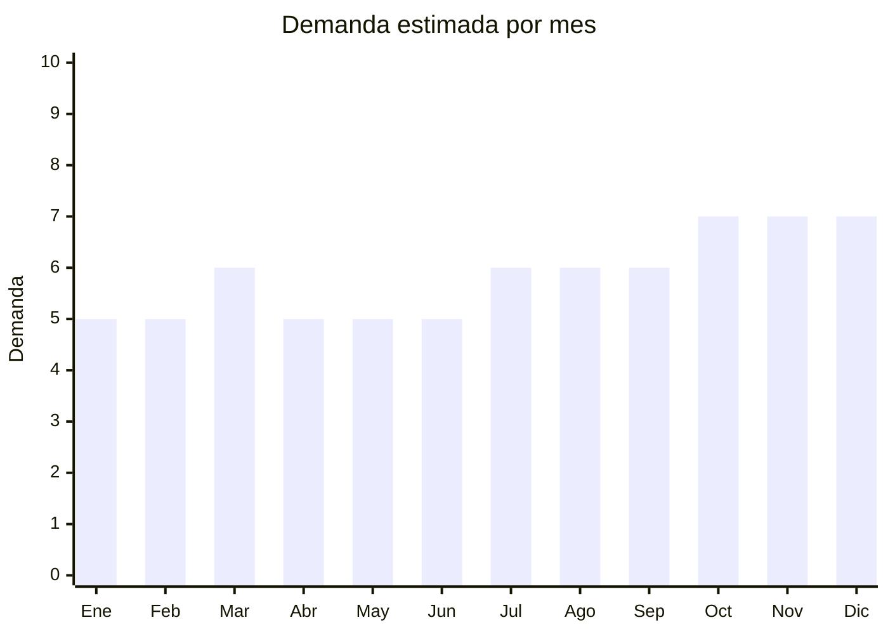

# Lupas con LED

> **Capítulo NCM 90** — Instrumentos y aparatos de óptica, medida y control | **Temporada:** Atemporal

## Qué es y por qué importarlo

Las lupas con LED son instrumentos ópticos de aumento con iluminación integrada, utilizadas para lectura de textos pequeños, trabajos de precisión (electrónica, joyería, relojería, costura), numismática, filatelia, inspección de calidad y uso profesional en dermatología y estética. Combinan una o varias lentes de aumento (2x hasta 60x) con LEDs alimentados por pilas o batería recargable.

Es un producto con demanda estable y sostenida en Argentina, impulsado por una población envejecida que necesita ayuda para leer (lupas de mano), artesanos y profesionales que requieren magnificación para trabajo fino, y hobbyistas (coleccionistas de monedas, estampillas, minerales). El público es diverso y constante, no depende de modas ni temporadas.

China produce prácticamente todas las lupas con LED del mercado mundial, con precios FOB muy bajos y gran variedad de formatos. Al no ser dispositivo médico ni electrónico regulado, no requiere ANMAT ni ENACOM, lo que simplifica enormemente la importación.

## Datos clave

| Dato | Valor |
|------|-------|
| **Posiciones NCM típicas** | 9013.80.90 (dispositivos ópticos no especificados) |
| **Derecho de importación** | 14-18% (DIE) + 3% tasa estadística |
| **Rango FOB típico** | USD 1.00 — USD 5.00 por unidad |
| **Precio de venta en Argentina** | ARS 5.000 — ARS 20.000 |
| **Margen bruto estimado** | 200% — 400% |
| **MOQ típico** | 50 — 300 unidades (según modelo) |
| **Demanda en MercadoLibre** | Media |
| **Competencia en MercadoLibre** | Media-Baja |
| **Dificultad para importar** | Fácil |
| **Certificaciones necesarias** | No requiere ANMAT |
| **Antidumping** | No |

## Variantes y subtipos más comunes

| Subtipo / Variante | FOB aprox. | Venta AR aprox. | Nota |
|--------------------|-----------|-----------------|------|
| Lupa de mano con LED (3x-5x) | USD 1.00 — 2.00 | ARS 5.000 — 10.000 | **Más vendida** — lectura, uso general |
| Lupa escritorio articulada con luz | USD 3.00 — 5.00 | ARS 12.000 — 20.000 | Profesional, manos libres, electrónica |
| Lupa vincha/cabeza con LED | USD 2.00 — 4.00 | ARS 8.000 — 18.000 | Joyeros, relojeros, dentistas |
| Lupa joyero 10x-60x (bolsillo) | USD 1.00 — 2.50 | ARS 5.000 — 12.000 | Compacta, coleccionistas, gemología |
| Lupa plegable con luz | USD 1.50 — 3.00 | ARS 6.000 — 14.000 | Portátil, ideal regalo adultos mayores |

## Regulaciones y requisitos

<Tabs>
  <Tab title="Certificaciones">
    | Organismo | Requiere | Detalle | Costo aprox. | Tiempo aprox. |
    |-----------|----------|---------|-------------|--------------|
    | ARCA (Aduana) | Sí siempre | Despacho de importación estándar | — | — |
    | ANMAT | **No** | Una lupa no es dispositivo médico. Solo requeriría ANMAT si se comercializa como instrumento de diagnóstico médico | — | — |
    | ENACOM | **No** | Los LEDs no emiten radiofrecuencia. No es dispositivo de comunicación | — | — |
    | INTI | No | No es textil ni calzado | — | — |

    **Nota estratégica:** Producto con barrera regulatoria prácticamente nula. No requiere ninguna certificación especial, lo que lo hace ideal para importadores principiantes que quieren empezar con productos simples y de bajo riesgo.
  </Tab>

  <Tab title="Etiquetado">
    | Requisito | Aplica |
    |-----------|--------|
    | Idioma español | Sí |
    | Datos del importador | Sí (razón social, CUIT, dirección) |
    | Aumento indicado | Sí (2x, 5x, 10x, etc.) |
    | Tipo de pila/batería | Sí (indicar tipo: AAA, botón, recargable) |
    | País de origen | Sí |
    | Garantía legal 6 meses | Sí |
  </Tab>

  <Tab title="Restricciones">
    Sin restricciones especiales. No hay antidumping, no hay licencias previas, no hay cupos de importación. Producto de libre importación con despacho estándar.

    **Nota:** Si la lupa incluye batería de litio recargable (en vez de pilas comunes), verificar las regulaciones de transporte aéreo para baterías de litio (no afecta al despacho aduanero pero sí al tipo de envío).
  </Tab>
</Tabs>

## Logística

| Dato | Valor |
|------|-------|
| **Peso típico por unidad** | 0.05 — 0.30 kg (según modelo) |
| **Volumen típico** | Bajo (lupas de mano/bolsillo) a Medio (lupas escritorio articuladas) |
| **Fragilidad** | Media (lente de vidrio puede quebrarse) |
| **Envío recomendado** | Aéreo/Courier para lupas pequeñas; Marítimo LCL para lupas de escritorio |
| **Tiempo total estimado** | 15 — 25 días (aéreo) / 45 — 75 días (marítimo) |
| **Baterías de litio** | Algunos modelos (recargables USB). Verificar regulación aérea si aplica |
| **Requiere empaque especial** | Sí — protección para lentes de vidrio, caja individual |

<Tip>
Las lupas de mano y de bolsillo son ideales para envío aéreo por su peso mínimo. Las lupas de escritorio articuladas ocupan más volumen y conviene enviarlas por marítimo. Un buen mix inicial es combinar 70% lupas de mano/bolsillo (alta rotación) con 30% lupas profesionales (mayor margen unitario).
</Tip>

## Estacionalidad



| Aspecto | Detalle |
|---------|---------|
| **Meses pico** | Octubre-Diciembre (Día del Padre, Navidad — excelente regalo para adultos mayores y hobbyistas) |
| **Meses valle** | Enero-Febrero (post-fiestas) |
| **Cuándo pedir para llegar a tiempo** | Agosto (para capturar pico Oct-Dic con lead time de 60-75 días marítimo) |

## Ventajas y riesgos

<CardGroup cols={2}>
  <Card title="Ventajas" icon="circle-check">
    - Sin certificaciones (ANMAT, ENACOM) — importación simple
    - Márgenes altos (200-400%)
    - Producto liviano y compacto
    - Competencia baja-media (menos saturado que otros nichos)
    - Demanda estable y diversa (lectura, profesional, hobby)
    - Ideal como producto complementario en kit
  </Card>
  <Card title="Riesgos" icon="triangle-exclamation">
    - Mercado más chico que otros productos (nicho)
    - Lentes de baja calidad distorsionan la imagen y generan devoluciones
    - LEDs de mala calidad se queman rápido
    - Rotación más lenta que productos masivos
    - Lupas de escritorio ocupan volumen en envío
  </Card>
</CardGroup>

<Warning>
La calidad óptica de la lente es fundamental. Lupas con lentes de plástico barato generan distorsión en los bordes (aberración cromática) y cansan la vista rápidamente, lo que produce reclamos. Pedir muestras y verificar que la lente sea de vidrio óptico o acrílico de calidad. Los LEDs deben ser luz blanca neutra (4000-5000K), no azulada ni amarillenta.
</Warning>

## Palabras clave para buscar en Alibaba

```
magnifying glass with LED, LED magnifier lamp, desk magnifier with light,
headband magnifier LED, jeweler loupe LED, pocket magnifier LED,
reading magnifier elderly, foldable magnifier with light wholesale
```

## Fuentes

- [MercadoLibre Argentina — Lupas con luz LED](https://listado.mercadolibre.com.ar/lupa-con-luz-led)
- [Alibaba — LED magnifier wholesale](https://www.alibaba.com/showroom/led-magnifying-glass.html)
