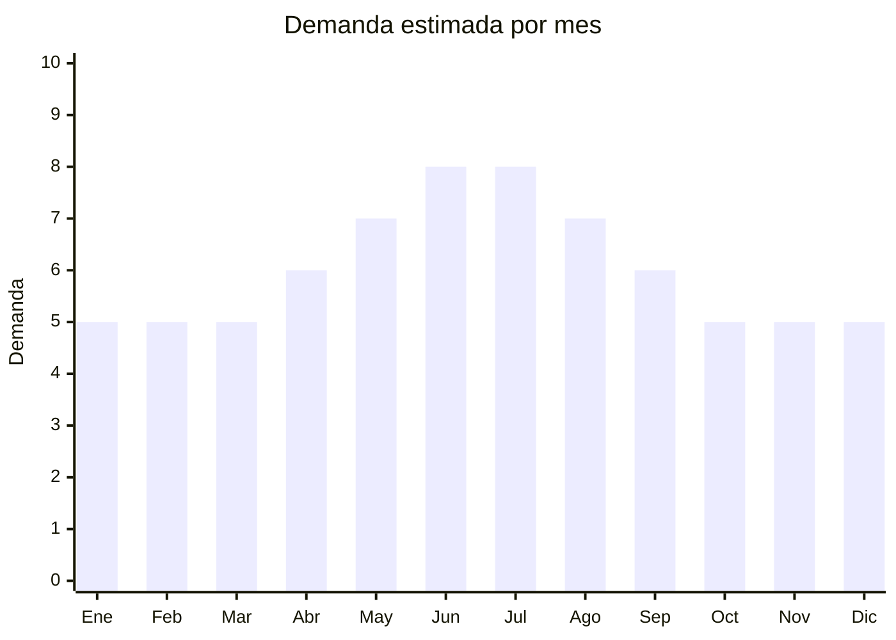

# Oxímetros de pulso

> **Capítulo NCM 90** — Instrumentos y aparatos de óptica, medida y control | **Temporada:** Atemporal

## Qué es y por qué importarlo

Los oxímetros de pulso (pulse oximeters) son dispositivos médicos portátiles que miden la saturación de oxígeno en sangre (SpO2) y la frecuencia cardíaca colocándose en la punta del dedo. Funcionan mediante tecnología de espectrofotometría, emitiendo luz roja e infrarroja a través del dedo para calcular el porcentaje de hemoglobina oxigenada.

La pandemia de COVID-19 transformó al oxímetro de un dispositivo exclusivamente clínico a un producto de salud doméstica masiva. La demanda se estabilizó en un nivel significativamente más alto que el pre-pandemia, porque millones de hogares ahora consideran el oxímetro como parte del botiquín esencial, especialmente familias con adultos mayores o personas con enfermedades respiratorias crónicas.

China fabrica más del 95% de los oxímetros de dedo del mundo. Los precios FOB son muy competitivos, pero el requisito obligatorio de registro ANMAT como dispositivo médico es la principal barrera de entrada, lo que también limita la competencia a importadores serios.

## Datos clave

| Dato | Valor |
|------|-------|
| **Posiciones NCM típicas** | 9018.19.90 (instrumentos y aparatos de medicina) |
| **Derecho de importación** | 14% (DIE) + 3% tasa estadística |
| **Rango FOB típico** | USD 3.00 — USD 10.00 por unidad |
| **Precio de venta en Argentina** | ARS 10.000 — ARS 35.000 |
| **Margen bruto estimado** | 150% — 250% |
| **MOQ típico** | 100 — 500 unidades |
| **Demanda en MercadoLibre** | Media-Alta |
| **Competencia en MercadoLibre** | Media |
| **Dificultad para importar** | Media-Alta (ANMAT obligatorio) |
| **Certificaciones necesarias** | **ANMAT obligatorio** (dispositivo médico Clase II) |
| **Antidumping** | No |

## Variantes y subtipos más comunes

| Subtipo / Variante | FOB aprox. | Venta AR aprox. | Nota |
|--------------------|-----------|-----------------|------|
| Fingertip básico (pantalla LED) | USD 3.00 — 5.00 | ARS 10.000 — 18.000 | **Más vendido** — económico y funcional |
| Fingertip con curva pletismográfica | USD 5.00 — 8.00 | ARS 15.000 — 28.000 | Pantalla OLED, datos más completos |
| Pediátrico (dedo pequeño) | USD 4.00 — 8.00 | ARS 12.000 — 30.000 | Diseño adaptado para niños, colores |
| Con alarma de SpO2/pulso | USD 5.00 — 10.00 | ARS 18.000 — 35.000 | Para monitoreo continuo nocturno |

## Regulaciones y requisitos

<Tabs>
  <Tab title="Certificaciones">
    | Organismo | Requiere | Detalle | Costo aprox. | Tiempo aprox. |
    |-----------|----------|---------|-------------|--------------|
    | ARCA (Aduana) | Sí siempre | Despacho de importación estándar | — | — |
    | ANMAT | **Sí** | Dispositivo médico Clase II. Requiere Registro de Producto Médico (RPM) con dossier técnico completo. El fabricante debe tener ISO 13485 | USD 1,000 — 3,000 | 4 — 8 meses |
    | ENACOM | No | No emite radiofrecuencia (los básicos) | — | — |
    | INTI | No | No es textil ni calzado | — | — |

    **Nota estratégica:** El oxímetro es Clase II (mayor regulación que Clase I), lo que implica un proceso ANMAT más riguroso y costoso. Sin embargo, esto genera una barrera competitiva sólida. Los importadores con registro ANMAT aprobado tienen ventaja significativa sobre quienes no lo tienen. El registro es por producto/modelo, no por marca general.
  </Tab>

  <Tab title="Etiquetado">
    | Requisito | Aplica |
    |-----------|--------|
    | Idioma español | Sí (etiqueta + manual de uso completo) |
    | Datos del importador | Sí (razón social, CUIT, dirección) |
    | Número de registro ANMAT | Sí (PM-XXXX-XX, visible en empaque) |
    | Instrucciones de uso | Sí (manual detallado en español) |
    | Precisión declarada | Sí (SpO2: ± 2%, Pulso: ± 2 bpm típico) |
    | Advertencias médicas | Sí ("No reemplaza diagnóstico médico") |
    | País de origen | Sí |
    | Garantía legal 6 meses | Sí |
  </Tab>

  <Tab title="Restricciones">
    **Importación sin registro ANMAT es ilegal.** La aduana decomisa la mercadería si no se presenta certificado de Producto Médico registrado vigente.

    Documentación obligatoria del fabricante chino:
    - Certificado ISO 13485 vigente
    - Certificado CE (Clase IIa según MDD/MDR europeo) o FDA 510(k)
    - Dossier técnico completo (diseño, validación, biocompatibilidad)
    - Reportes de ensayos clínicos o equivalencia sustancial
    - Sistema de gestión de riesgos (ISO 14971)
  </Tab>
</Tabs>

## Logística

| Dato | Valor |
|------|-------|
| **Peso típico por unidad** | 0.05 — 0.10 kg (con caja y cordón) |
| **Volumen típico** | Muy bajo |
| **Fragilidad** | Media (sensor óptico sensible) |
| **Envío recomendado** | Aéreo/Courier ideal por peso mínimo; Marítimo LCL para volúmenes grandes |
| **Tiempo total estimado** | 15 — 25 días (aéreo) / 45 — 75 días (marítimo) |
| **Baterías de litio** | No (usan pilas AAA) |
| **Requiere empaque especial** | Sí — caja individual con inserto protector para sensor |

<Tip>
Un lote de 1,000 oxímetros pesa apenas 50-100 kg, lo que hace al envío aéreo una opción viable incluso para lotes medianos. Dado que el trámite ANMAT puede demorar meses, aprovechar ese tiempo para negociar precio, revisar muestras y planificar la logística con calma.
</Tip>

## Estacionalidad



| Aspecto | Detalle |
|---------|---------|
| **Meses pico** | Mayo-Agosto (temporada respiratoria invernal, gripe, bronquiolitis) |
| **Meses valle** | Diciembre-Febrero (verano, menor incidencia respiratoria) |
| **Cuándo pedir para llegar a tiempo** | Febrero-Marzo (considerando que ANMAT ya esté aprobado previamente) |

## Ventajas y riesgos

<CardGroup cols={2}>
  <Card title="Ventajas" icon="circle-check">
    - Barrera ANMAT limita competencia (ventaja competitiva)
    - Demanda estable y predecible
    - Producto ultraliviano y compacto
    - Márgenes sólidos (150-250%)
    - Producto esencial de salud doméstica
    - Canal farmacia adicional al e-commerce
  </Card>
  <Card title="Riesgos" icon="triangle-exclamation">
    - Registro ANMAT costoso y lento (inversión inicial alta)
    - Oxímetros imprecisos son un riesgo de salud grave
    - Competencia de marcas establecidas (Omron, Choicemmed)
    - Requiere soporte post-venta y manual en español
    - Si ANMAT cambia regulación, puede afectar stock en tránsito
  </Card>
</CardGroup>

<Warning>
**La precisión del oxímetro puede ser cuestión de vida o muerte.** Un oxímetro que muestre SpO2 de 95% cuando el valor real es 88% puede hacer que una persona no busque atención médica urgente. Solo trabajar con fabricantes certificados ISO 13485 que provean reportes de validación clínica. Comparar lecturas de muestras contra oxímetros de referencia hospitalaria antes de importar.
</Warning>

## Palabras clave para buscar en Alibaba

```
pulse oximeter wholesale, fingertip oximeter CE FDA, SpO2 monitor finger,
pulse oximeter manufacturer ISO 13485, oximeter OLED display, pediatric pulse oximeter,
blood oxygen monitor wholesale, pulse oximeter with alarm
```

## Fuentes

- [MercadoLibre Argentina — Oxímetro de pulso](https://listado.mercadolibre.com.ar/oximetro-de-pulso)
- [Alibaba — Pulse oximeter wholesale](https://www.alibaba.com/showroom/pulse-oximeter.html)
- [ANMAT — Registro de productos médicos](https://www.argentina.gob.ar/anmat/productos-medicos)
