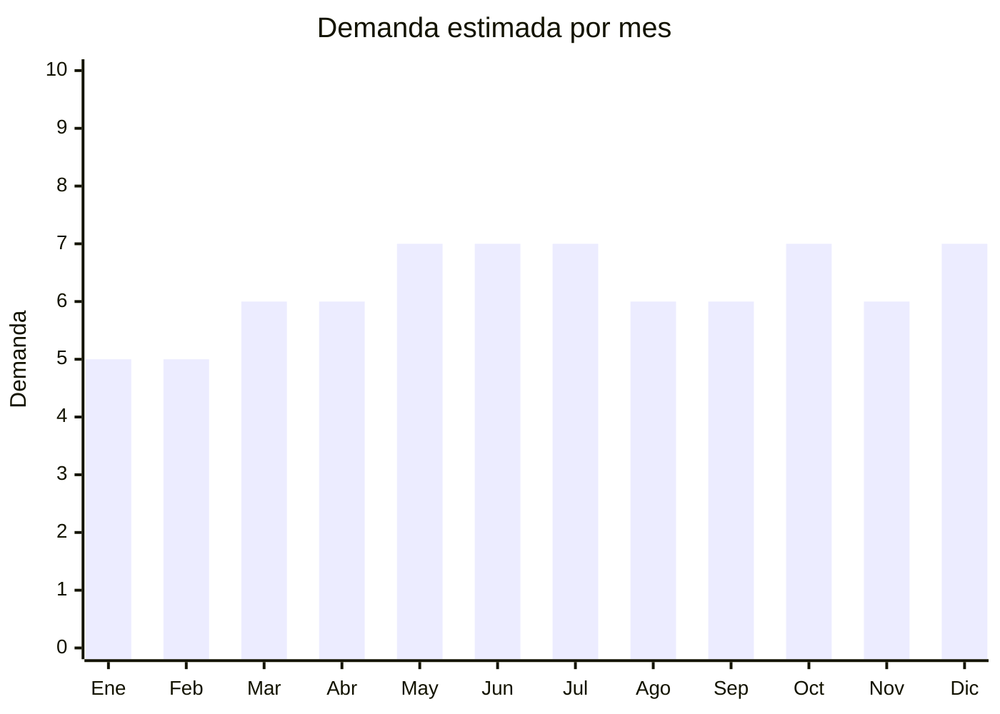

# Tensiómetros digitales

> **Capítulo NCM 90** — Instrumentos y aparatos de óptica, medida y control | **Temporada:** Atemporal

## Qué es y por qué importarlo

Los tensiómetros digitales son dispositivos médicos electrónicos que miden la presión arterial (sistólica, diastólica y pulso) de forma automática mediante método oscilométrico. Se colocan en el brazo (manguito inflable) o en la muñeca y muestran los resultados en una pantalla digital. Son esenciales para el monitoreo domiciliario de la hipertensión, una de las enfermedades crónicas más prevalentes en Argentina.

La hipertensión afecta a aproximadamente 1 de cada 3 adultos argentinos. Esto genera un mercado enorme y constante de tensiómetros para uso doméstico, impulsado por médicos que recomiendan a sus pacientes el autocontrol diario. Además, el envejecimiento poblacional garantiza un crecimiento sostenido de la demanda.

China es el principal fabricante mundial de tensiómetros digitales de gama económica y media. Marcas como Omron y Beurer dominan el segmento premium, pero existe un espacio amplio para marcas importadas con buena relación calidad-precio en el rango de ARS 20.000-60.000.

## Datos clave

| Dato | Valor |
|------|-------|
| **Posiciones NCM típicas** | 9018.19.90 (instrumentos y aparatos de medicina) |
| **Derecho de importación** | 14% (DIE) + 3% tasa estadística |
| **Rango FOB típico** | USD 5.00 — USD 15.00 por unidad |
| **Precio de venta en Argentina** | ARS 20.000 — ARS 60.000 |
| **Margen bruto estimado** | 150% — 250% |
| **MOQ típico** | 100 — 500 unidades |
| **Demanda en MercadoLibre** | Alta |
| **Competencia en MercadoLibre** | Media-Alta |
| **Dificultad para importar** | Media-Alta (ANMAT obligatorio) |
| **Certificaciones necesarias** | **ANMAT obligatorio** (dispositivo médico Clase II) |
| **Antidumping** | No |

## Variantes y subtipos más comunes

| Subtipo / Variante | FOB aprox. | Venta AR aprox. | Nota |
|--------------------|-----------|-----------------|------|
| Brazo automático básico | USD 5.00 — 8.00 | ARS 20.000 — 35.000 | **Más vendido** — recomendado por médicos |
| Muñeca compacto | USD 5.00 — 10.00 | ARS 18.000 — 40.000 | Portátil, pero menos preciso que brazo |
| Brazo con voz (español) | USD 8.00 — 12.00 | ARS 30.000 — 50.000 | Ideal adultos mayores con vista reducida |
| Brazo con Bluetooth/app | USD 10.00 — 15.00 | ARS 40.000 — 60.000 | Registro de historial en celular (requiere ENACOM) |

## Regulaciones y requisitos

<Tabs>
  <Tab title="Certificaciones">
    | Organismo | Requiere | Detalle | Costo aprox. | Tiempo aprox. |
    |-----------|----------|---------|-------------|--------------|
    | ARCA (Aduana) | Sí siempre | Despacho de importación estándar | — | — |
    | ANMAT | **Sí** | Dispositivo médico Clase II. Requiere Registro de Producto Médico (RPM). Fabricante debe tener ISO 13485 y validación clínica del algoritmo oscilométrico | USD 1,500 — 4,000 | 4 — 10 meses |
    | ENACOM | **Solo Bluetooth** | Los modelos con Bluetooth o WiFi requieren homologación ENACOM adicional | USD 500 — 1,500 | 2 — 4 meses |
    | INTI | No | No es textil ni calzado | — | — |

    **Nota estratégica:** Para un primer emprendimiento, se recomienda empezar con modelos **sin Bluetooth** para evitar el doble trámite ANMAT + ENACOM. Los modelos básicos de brazo son más fáciles de registrar y cubren el 70% del mercado. Una vez establecido, agregar modelos con conectividad.
  </Tab>

  <Tab title="Etiquetado">
    | Requisito | Aplica |
    |-----------|--------|
    | Idioma español | Sí (etiqueta + manual de uso completo) |
    | Datos del importador | Sí (razón social, CUIT, dirección) |
    | Número de registro ANMAT | Sí (PM-XXXX-XX, visible en empaque) |
    | Instrucciones de uso detalladas | Sí (manual completo en español, con tablas de referencia de presión) |
    | Precisión declarada | Sí (presión: ± 3 mmHg, pulso: ± 5%) |
    | Advertencias médicas | Sí ("No reemplaza diagnóstico médico", "Consulte a su médico") |
    | País de origen | Sí |
    | Garantía legal 6 meses | Sí |
  </Tab>

  <Tab title="Restricciones">
    **Importación sin registro ANMAT es ilegal.** La aduana retiene la mercadería automáticamente.

    Documentación obligatoria del fabricante:
    - Certificado ISO 13485 vigente
    - Validación clínica del algoritmo de medición (protocolo BHS o ESH)
    - Certificado CE (Clase IIa) o equivalente FDA 510(k)
    - Dossier técnico completo
    - Calibración de fábrica documentada
    - Manual de servicio técnico

    **Modelos con Bluetooth:** Requieren además homologación ENACOM como dispositivo de radiofrecuencia de baja potencia.
  </Tab>
</Tabs>

## Logística

| Dato | Valor |
|------|-------|
| **Peso típico por unidad** | 0.30 — 0.50 kg (con manguito y caja) |
| **Volumen típico** | Bajo-Medio |
| **Fragilidad** | Media (pantalla LCD y bomba interna) |
| **Envío recomendado** | Marítimo LCL para volumen; Aéreo/Courier para muestras o lotes chicos |
| **Tiempo total estimado** | 15 — 25 días (aéreo) / 45 — 75 días (marítimo) |
| **Baterías de litio** | Algunos modelos con recargable (verificar regulación aérea) |
| **Requiere empaque especial** | Sí — caja individual con protección para pantalla y manguito |

<Tip>
El manguito (brazalete inflable) es la parte más voluminosa del tensiómetro. Al calcular espacio en contenedor, considerar que cada caja individual ocupa aprox. 20x15x10 cm. Un pallet estándar puede contener aprox. 400-600 unidades. Pedir al proveedor que optimice el empaque para maximizar unidades por CBM.
</Tip>

## Estacionalidad



| Aspecto | Detalle |
|---------|---------|
| **Meses pico** | Mayo-Julio (frío — mayor control de hipertensión), Octubre (Día de la Madre — regalo salud), Diciembre (regalo Navidad para abuelos) |
| **Meses valle** | Enero-Febrero (verano, menor preocupación por salud) |
| **Cuándo pedir para llegar a tiempo** | Febrero-Marzo (para stock invernal, con ANMAT ya tramitado) |

## Ventajas y riesgos

<CardGroup cols={2}>
  <Card title="Ventajas" icon="circle-check">
    - Demanda creciente por envejecimiento poblacional
    - ANMAT como barrera competitiva fuerte
    - Producto esencial de salud (no depende de modas)
    - Márgenes sólidos (150-250%)
    - Canal farmacia y geriátrico adicional al e-commerce
    - Hipertensión es crónica: clientes que controlan toda la vida
  </Card>
  <Card title="Riesgos" icon="triangle-exclamation">
    - ANMAT Clase II: trámite largo y costoso
    - Competencia de Omron (marca dominante en segmento premium)
    - Tensiómetros imprecisos son riesgo de salud grave
    - Requiere soporte post-venta (manguitos de repuesto, calibración)
    - Modelos Bluetooth suman requisito ENACOM
    - Producto con componentes mecánicos que pueden fallar (bomba inflado)
  </Card>
</CardGroup>

<Warning>
**La precisión del tensiómetro es crítica para la salud del usuario.** Un tensiómetro que subestime la presión puede hacer que un hipertenso no tome su medicación. Solo trabajar con fabricantes que tengan validación clínica según protocolo de la European Society of Hypertension (ESH) o British Hypertension Society (BHS). Pedir certificados de calibración de fábrica y verificar muestras contra un esfigmomanómetro de referencia.
</Warning>

## Palabras clave para buscar en Alibaba

```
blood pressure monitor wholesale, digital sphygmomanometer, arm blood pressure monitor,
wrist blood pressure monitor, talking blood pressure monitor, Bluetooth blood pressure monitor,
blood pressure monitor CE ISO 13485, automatic blood pressure cuff wholesale
```

## Fuentes

- [MercadoLibre Argentina — Tensiómetro digital](https://listado.mercadolibre.com.ar/tensiometro-digital)
- [Alibaba — Blood pressure monitor wholesale](https://www.alibaba.com/showroom/blood-pressure-monitor.html)
- [ANMAT — Registro de productos médicos](https://www.argentina.gob.ar/anmat/productos-medicos)
- [ENACOM — Homologación de equipos](https://www.enacom.gob.ar)
