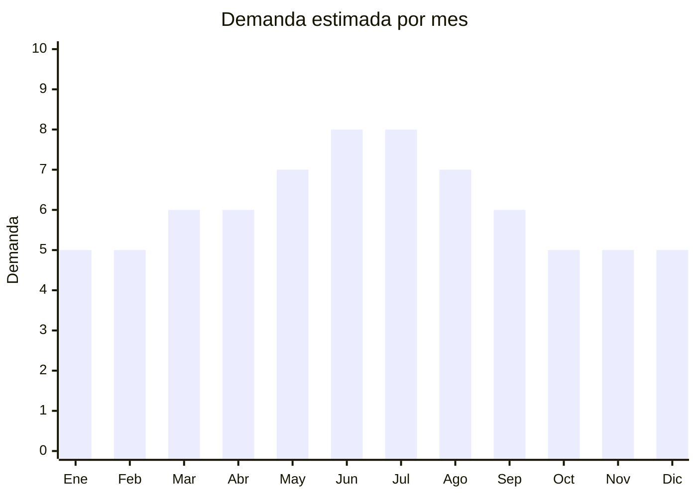

# Termómetros digitales

> **Capítulo NCM 90** — Instrumentos y aparatos de óptica, medida y control | **Temporada:** Atemporal

## Qué es y por qué importarlo

Los termómetros digitales son dispositivos electrónicos para medir la temperatura corporal, disponibles en versiones de contacto (axilar, oral) e infrarrojos (frente, oído, sin contacto). La demanda se consolidó fuertemente después de la pandemia de COVID-19 y se mantiene estable como producto de salud doméstica esencial que todo hogar debería tener.

El mercado argentino tiene una demanda constante impulsada por familias con niños pequeños (principal segmento comprador), consultorios médicos y clínicas, farmacias que revenden, y empresas que mantienen stock para controles laborales. Los termómetros infrarrojos sin contacto son los más demandados por su rapidez y comodidad.

China concentra más del 90% de la producción mundial de termómetros digitales, con hubs de fabricación en Shenzhen y Guangzhou. Los precios FOB permiten márgenes atractivos incluso considerando el requisito obligatorio de registro ANMAT.

## Datos clave

| Dato | Valor |
|------|-------|
| **Posiciones NCM típicas** | 9025.19.90 (termómetros no combinados con otros instrumentos) |
| **Derecho de importación** | 14-18% (DIE) + 3% tasa estadística |
| **Rango FOB típico** | USD 2.00 — USD 8.00 por unidad |
| **Precio de venta en Argentina** | ARS 10.000 — ARS 40.000 |
| **Margen bruto estimado** | 150% — 300% |
| **MOQ típico** | 100 — 500 unidades |
| **Demanda en MercadoLibre** | Alta |
| **Competencia en MercadoLibre** | Media-Alta |
| **Dificultad para importar** | Media (requiere ANMAT) |
| **Certificaciones necesarias** | **ANMAT obligatorio** (dispositivo médico Clase I-II) |
| **Antidumping** | No |

## Variantes y subtipos más comunes

| Subtipo / Variante | FOB aprox. | Venta AR aprox. | Nota |
|--------------------|-----------|-----------------|------|
| Infrarrojo de frente (pistola) | USD 3.00 — 6.00 | ARS 15.000 — 30.000 | **Más vendido** — lectura en 1 segundo |
| Infrarrojo sin contacto profesional | USD 5.00 — 8.00 | ARS 25.000 — 40.000 | Mayor precisión, uso clínico |
| Digital axilar clásico | USD 2.00 — 3.00 | ARS 10.000 — 15.000 | Económico, punta flexible |
| De oído (timpánico) | USD 4.00 — 7.00 | ARS 18.000 — 35.000 | Rápido, preferido pediatras |
| Multifunción (frente + oído + ambiente) | USD 5.00 — 8.00 | ARS 20.000 — 40.000 | Versátil, buena percepción de valor |

## Regulaciones y requisitos

<Tabs>
  <Tab title="Certificaciones">
    | Organismo | Requiere | Detalle | Costo aprox. | Tiempo aprox. |
    |-----------|----------|---------|-------------|--------------|
    | ARCA (Aduana) | Sí siempre | Despacho de importación estándar | — | — |
    | ANMAT | **Sí** | Dispositivo médico Clase I (axilar) o Clase II (infrarrojo). Requiere Registro de Producto Médico (RPM). El fabricante chino debe tener certificación ISO 13485 | USD 500 — 2,000 | 3 — 6 meses |
    | ENACOM | No | Termómetros IR no emiten radiofrecuencia | — | — |
    | INTI | No | No es textil ni calzado | — | — |

    **Nota estratégica:** El registro ANMAT es la principal barrera de entrada, lo que también actúa como **barrera competitiva** que protege a quienes ya lo tienen. Una vez obtenido el registro para un modelo/marca, se puede importar indefinidamente. Elegir un proveedor que ya tenga ISO 13485 y documentación técnica lista simplifica enormemente el trámite.
  </Tab>

  <Tab title="Etiquetado">
    | Requisito | Aplica |
    |-----------|--------|
    | Idioma español | Sí (etiqueta + manual de uso) |
    | Datos del importador | Sí (razón social, CUIT, dirección) |
    | Número de registro ANMAT | Sí (PM-XXXX-XX) |
    | Instrucciones de uso | Sí (obligatorio, manual en español) |
    | País de origen | Sí |
    | Precisión declarada | Sí (± 0.1°C o ± 0.2°C) |
    | Garantía legal 6 meses | Sí |
  </Tab>

  <Tab title="Restricciones">
    **No se puede importar sin registro ANMAT vigente.** La aduana retiene la mercadería si no se presenta el certificado de Producto Médico registrado.

    El fabricante chino debe proveer:
    - Certificado ISO 13485 vigente
    - Dossier técnico del producto
    - Certificado CE (marcado europeo) o FDA 510(k) facilitan el trámite
    - Declaración de conformidad
  </Tab>
</Tabs>

## Logística

| Dato | Valor |
|------|-------|
| **Peso típico por unidad** | 0.08 — 0.20 kg (con caja individual) |
| **Volumen típico** | Bajo |
| **Fragilidad** | Media (sensor infrarrojo sensible) |
| **Envío recomendado** | Aéreo/Courier para lotes chicos; Marítimo LCL para volumen |
| **Tiempo total estimado** | 15 — 25 días (aéreo) / 45 — 75 días (marítimo) |
| **Baterías de litio** | No (usan pilas AAA o botón CR2032, no litio recargable) |
| **Requiere empaque especial** | Sí — protección antiimpacto para sensor IR, cada unidad en caja individual |

<Tip>
Los termómetros digitales son livianos y compactos, pero el sensor infrarrojo es sensible a golpes. Exigir al proveedor empaque individual con inserto de espuma. Un lote de 500 unidades pesa apenas 40-100 kg, lo que hace viable el envío aéreo para primeros pedidos o reposiciones urgentes.
</Tip>

## Estacionalidad



| Aspecto | Detalle |
|---------|---------|
| **Meses pico** | Mayo-Agosto (temporada de gripe e infecciones respiratorias en invierno) |
| **Meses valle** | Diciembre-Febrero (verano, menor incidencia de enfermedades) |
| **Cuándo pedir para llegar a tiempo** | Febrero-Marzo (para tener stock completo en mayo, considerando ANMAT ya tramitado) |

## Ventajas y riesgos

<CardGroup cols={2}>
  <Card title="Ventajas" icon="circle-check">
    - Demanda estable todo el año con pico invernal predecible
    - ANMAT actúa como barrera competitiva (menos competidores)
    - Producto liviano y compacto
    - Márgenes sólidos (150-300%)
    - Producto esencial de salud (no depende de modas)
    - Venta a farmacias y consultorios además de consumidor final
  </Card>
  <Card title="Riesgos" icon="triangle-exclamation">
    - Registro ANMAT obligatorio (inversión inicial de tiempo y dinero)
    - Termómetros imprecisos generan reclamos y problemas legales
    - Competencia de marcas establecidas (Omron, Beurer)
    - Requiere manual en español y soporte post-venta
    - El fabricante debe mantener ISO 13485 vigente
  </Card>
</CardGroup>

<Warning>
**La precisión del termómetro es crítica.** Un termómetro que mida mal puede llevar a decisiones médicas incorrectas. Siempre verificar la precisión declarada (± 0.1°C o ± 0.2°C) con muestras reales antes de importar volumen. Comparar lecturas contra un termómetro de referencia calibrado. El fabricante debe proveer certificado de calibración.
</Warning>

## Palabras clave para buscar en Alibaba

```
infrared thermometer wholesale, digital thermometer forehead, non-contact thermometer,
baby thermometer infrared, medical thermometer CE FDA, ear thermometer digital,
clinical thermometer manufacturer, thermometer gun wholesale ISO 13485
```

## Fuentes

- [MercadoLibre Argentina — Termómetro digital infrarrojo](https://listado.mercadolibre.com.ar/termometro-digital-infrarrojo)
- [Alibaba — Infrared thermometer wholesale](https://www.alibaba.com/showroom/infrared-thermometer.html)
- [ANMAT — Registro de productos médicos](https://www.argentina.gob.ar/anmat/productos-medicos)
