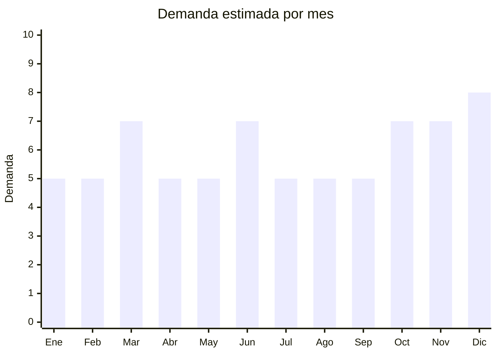

# Despertadores digitales

> **Capítulo NCM 91** — Relojería | **Temporada:** Atemporal

## Qué es y por qué importarlo

Los despertadores digitales son relojes de mesa con alarma, pantalla LED o LCD, y funciones adicionales como temperatura ambiente, humedad, radio FM, proyección de hora en techo o simulación de amanecer (sunrise). Aunque el celular tiene alarma, el despertador digital de mesa mantiene demanda firme porque mucha gente prefiere no dormir con el celular al lado, son un elemento decorativo de mesita de luz, y los modelos con display grande son ideales para adultos mayores.

El mercado argentino valora los despertadores digitales como producto funcional y de regalo. Los modelos con display LED grande y diseño minimalista son los más demandados, seguidos por los que incluyen proyección o radio FM. Es un producto que se vende mucho como regalo práctico para Día del Padre, Día de la Madre y fiestas.

China fabrica prácticamente todos los despertadores digitales del mundo, con hubs en Shenzhen y Dongguan. La variedad de modelos es enorme y los precios FOB permiten márgenes muy atractivos.

## Datos clave

| Dato | Valor |
|------|-------|
| **Posiciones NCM típicas** | 9105.91.00 (otros relojes eléctricos) |
| **Derecho de importación** | 18-20% (DIE) + 3% tasa estadística |
| **Rango FOB típico** | USD 2.00 — USD 8.00 por unidad |
| **Precio de venta en Argentina** | ARS 8.000 — ARS 25.000 |
| **Margen bruto estimado** | 200% — 350% |
| **MOQ típico** | 50 — 300 unidades |
| **Demanda en MercadoLibre** | Media-Alta |
| **Competencia en MercadoLibre** | Media |
| **Dificultad para importar** | Fácil |
| **Certificaciones necesarias** | Ninguna especial (modelos sin radio FM). Con radio FM: consultar ENACOM |
| **Antidumping** | No |

## Variantes y subtipos más comunes

| Subtipo / Variante | FOB aprox. | Venta AR aprox. | Nota |
|--------------------|-----------|-----------------|------|
| LED display grande (cubito/espejo) | USD 2.00 — 4.00 | ARS 8.000 — 16.000 | **Más vendido** — estética minimalista |
| Con proyector de hora (techo/pared) | USD 3.00 — 6.00 | ARS 12.000 — 22.000 | Atractivo visual, buen regalo |
| Con radio FM | USD 4.00 — 7.00 | ARS 15.000 — 25.000 | Multifunción, verificar ENACOM |
| Sunrise simulation (luz gradual) | USD 5.00 — 8.00 | ARS 18.000 — 28.000 | Tendencia bienestar/wellness |
| Doble alarma (para parejas) | USD 2.50 — 5.00 | ARS 10.000 — 20.000 | Funcional, diferenciación simple |

## Regulaciones y requisitos

<Tabs>
  <Tab title="Certificaciones">
    | Organismo | Requiere | Detalle | Costo aprox. | Tiempo aprox. |
    |-----------|----------|---------|-------------|--------------|
    | ARCA (Aduana) | Sí siempre | Despacho de importación estándar | — | — |
    | ANMAT | No | No es producto médico | — | — |
    | ENACOM | **Depende** | Modelos con radio FM o Bluetooth requieren homologación. Modelos solo LED/alarma no requieren | USD 500 — 1,500 | 2 — 4 meses |
    | INTI | No | No es textil ni calzado | — | — |

    **Nota estratégica:** Para simplificar, empezar importando modelos **sin radio FM ni Bluetooth** (solo LED + alarma + temperatura). Estos no requieren ENACOM y tienen el proceso de importación más simple posible dentro de la categoría.
  </Tab>

  <Tab title="Etiquetado">
    | Requisito | Aplica |
    |-----------|--------|
    | Idioma español | Sí |
    | Datos del importador | Sí (razón social, CUIT, dirección) |
    | Alimentación eléctrica | Sí (USB, pilas AAA, o adaptador — indicar voltaje) |
    | Instrucciones de uso | Sí (manual en español, especialmente configuración de alarma) |
    | País de origen | Sí |
    | Garantía legal 6 meses | Sí |
  </Tab>

  <Tab title="Restricciones">
    Sin restricciones especiales para modelos básicos (LED + alarma).

    **Modelos con radio FM:** La radio FM es un receptor de radiofrecuencia, lo que puede activar requisito de homologación ENACOM. Consultar con despachante antes de importar.

    **Modelos con Bluetooth:** Requieren homologación ENACOM como dispositivo de radiofrecuencia de baja potencia.
  </Tab>
</Tabs>

## Logística

| Dato | Valor |
|------|-------|
| **Peso típico por unidad** | 0.15 — 0.40 kg (con caja) |
| **Volumen típico** | Bajo |
| **Fragilidad** | Media (pantalla LED/LCD) |
| **Envío recomendado** | Aéreo/Courier para lotes chicos; Marítimo LCL para volumen |
| **Tiempo total estimado** | 15 — 25 días (aéreo) / 45 — 75 días (marítimo) |
| **Baterías de litio** | Algunos modelos con batería interna recargable (verificar regulación aérea) |
| **Requiere empaque especial** | Sí — caja individual con protección para pantalla |

<Tip>
Los despertadores tipo "cubito LED" son compactos y livianos, ideales para aéreo. Un lote de 500 unidades pesa aprox. 75-200 kg. Los modelos con cable USB son preferibles a los que incluyen adaptador de pared, ya que el adaptador agrega volumen, peso y potencial problema de compatibilidad con voltaje argentino (220V). Verificar que los modelos con adaptador sean bivolt (110-220V).
</Tip>

## Estacionalidad



| Aspecto | Detalle |
|---------|---------|
| **Meses pico** | Marzo (vuelta a clases/trabajo — necesidad de alarma), Junio (Día del Padre), Octubre (Día de la Madre), Noviembre-Diciembre (regalos de fiestas) |
| **Meses valle** | Enero-Febrero (vacaciones), Abril (post-vuelta a rutina) |
| **Cuándo pedir para llegar a tiempo** | Agosto-Septiembre (para capturar Día Madre, Black Friday, Navidad) |

## Ventajas y riesgos

<CardGroup cols={2}>
  <Card title="Ventajas" icon="circle-check">
    - Sin certificaciones (modelos básicos sin radio/BT)
    - Márgenes excelentes (200-350%)
    - Producto liviano y compacto
    - Alto valor percibido como regalo
    - Gran variedad de diseños para diferenciarse
    - Funciones extras (temp, humedad) agregan valor sin costo
  </Card>
  <Card title="Riesgos" icon="triangle-exclamation">
    - Pantalla LED puede ser difícil de ver a luz del día
    - Instrucciones complejas de configurar (generan consultas post-venta)
    - Alarmas de baja calidad suenan débil o se descalibran
    - Modelos con radio/BT requieren ENACOM
    - Verificar compatibilidad de voltaje (220V Argentina)
  </Card>
</CardGroup>

<Warning>
**Compatibilidad eléctrica es crítica.** Argentina usa 220V/50Hz. Si el despertador incluye adaptador de pared (no solo USB), verificar que sea bivolt (100-240V). Un adaptador de 110V conectado a 220V se quema y puede causar incendio. Los modelos alimentados por USB son más seguros porque el usuario elige su propio cargador. Verificar también que la frecuencia de la pantalla LED no genere parpadeo visible en 50Hz.
</Warning>

## Palabras clave para buscar en Alibaba

```
digital alarm clock LED wholesale, mirror alarm clock, projection alarm clock,
sunrise alarm clock wholesale, LED cube clock, alarm clock with temperature display,
FM radio alarm clock, bedside digital clock wholesale
```

## Fuentes

- [MercadoLibre Argentina — Despertadores digitales](https://listado.mercadolibre.com.ar/despertador-digital)
- [Alibaba — Digital alarm clock wholesale](https://www.alibaba.com/showroom/digital-alarm-clock-wholesale.html)
