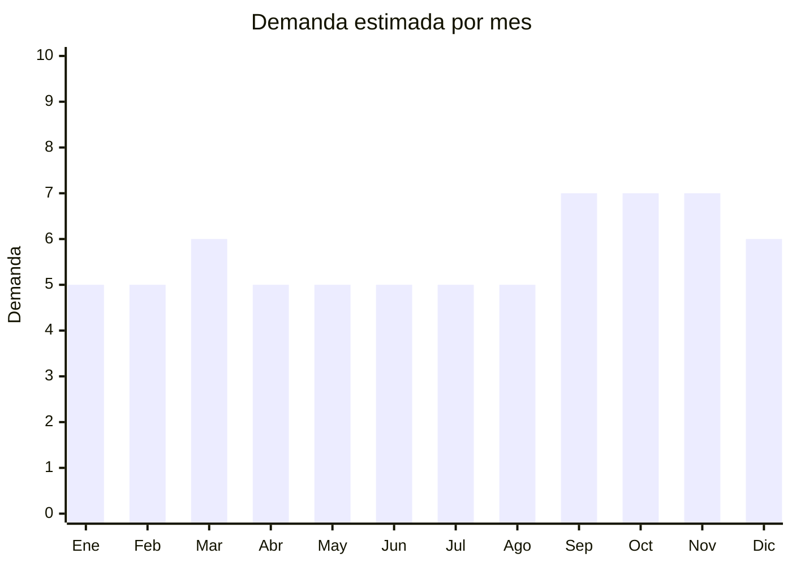

# Mecanismos de reloj

> **Capítulo NCM 91** — Relojería | **Temporada:** Atemporal

## Qué es y por qué importarlo

Los mecanismos de reloj (movimientos de cuarzo) son los componentes internos que hacen funcionar un reloj de pared o de mesa. Incluyen el motor de cuarzo, el eje y el juego de agujas (hora, minuto, segundo). Se venden como repuesto para reparación de relojes existentes y como componente para la fabricación artesanal de relojes personalizados (manualidades, decoración DIY, emprendimientos creativos).

Este es un producto de nicho altamente rentable dirigido a tres públicos específicos: relojeros y restauradores de relojes antiguos que necesitan mecanismos de repuesto, artesanos y emprendedores DIY que fabrican relojes personalizados con discos de vinilo, madera, resina y otros materiales, y bazares/ferreterías que los venden como repuesto general. La combinación de precio FOB irrisorio (desde USD 0.20) con precio de venta alto (ARS 2,000-8,000) genera los márgenes más altos de todo el capítulo 91.

China produce prácticamente el 100% de los mecanismos de cuarzo económicos del mundo. La marca Youngtown (Fujian) y similares fabrican millones de unidades mensuales a precios imbatibles.

## Datos clave

| Dato | Valor |
|------|-------|
| **Posiciones NCM típicas** | 9110.19.00 (movimientos de relojería completos, sin montar) |
| **Derecho de importación** | 14% (DIE) + 3% tasa estadística |
| **Rango FOB típico** | USD 0.20 — USD 2.00 por unidad |
| **Precio de venta en Argentina** | ARS 2.000 — ARS 8.000 |
| **Margen bruto estimado** | 300% — 600% |
| **MOQ típico** | 100 — 1,000 unidades (peso mínimo de envío es la limitante, no el MOQ) |
| **Demanda en MercadoLibre** | Media |
| **Competencia en MercadoLibre** | Baja |
| **Dificultad para importar** | Fácil |
| **Certificaciones necesarias** | Ninguna |
| **Antidumping** | No |

## Variantes y subtipos más comunes

| Subtipo / Variante | FOB aprox. | Venta AR aprox. | Nota |
|--------------------|-----------|-----------------|------|
| Cuarzo silencioso (silent sweep) | USD 0.30 — 0.80 | ARS 2.500 — 5.000 | **Más vendido** — sin tic-tac |
| Cuarzo con tic-tac (step movement) | USD 0.20 — 0.50 | ARS 2.000 — 3.500 | Económico, para relojeros |
| Péndulo (con mecanismo oscilante) | USD 0.80 — 1.50 | ARS 4.000 — 7.000 | Relojes vintage/rústicos |
| Alto torque (eje largo para agujas grandes) | USD 0.50 — 1.50 | ARS 3.000 — 6.000 | Relojes de pared XL (+30 cm de aguja) |
| Kit completo con agujas (varios estilos) | USD 0.40 — 2.00 | ARS 3.000 — 8.000 | DIY listo para armar, incluye gancho |

## Regulaciones y requisitos

<Tabs>
  <Tab title="Certificaciones">
    | Organismo | Requiere | Detalle | Costo aprox. | Tiempo aprox. |
    |-----------|----------|---------|-------------|--------------|
    | ARCA (Aduana) | Sí siempre | Despacho de importación estándar | — | — |
    | ANMAT | No | No es producto médico | — | — |
    | ENACOM | No | No emite radiofrecuencia | — | — |
    | INTI | No | No es textil ni calzado | — | — |

    **Nota estratégica:** Cero barreras regulatorias. Es probablemente el producto más simple de importar dentro de todo el capítulo 91. Ideal para combinar en el mismo envío con relojes de pared terminados.
  </Tab>

  <Tab title="Etiquetado">
    | Requisito | Aplica |
    |-----------|--------|
    | Idioma español | Sí (instrucciones de instalación) |
    | Datos del importador | Sí |
    | Tipo de pila requerida | Sí (1x AA generalmente) |
    | Longitud del eje | Recomendado (para que el comprador sepa si es compatible con su esfera) |
    | País de origen | Sí |
    | Garantía legal 6 meses | Sí |
  </Tab>

  <Tab title="Restricciones">
    Sin restricciones de ningún tipo. Producto de libre importación con despacho estándar. No hay antidumping, no hay licencias, no hay cupos.
  </Tab>
</Tabs>

## Logística

| Dato | Valor |
|------|-------|
| **Peso típico por unidad** | 0.03 — 0.08 kg |
| **Volumen típico** | Muy bajo (5x5x2 cm aprox. por unidad) |
| **Fragilidad** | Baja-Media (mecanismo plástico resistente, agujas pueden doblarse) |
| **Envío recomendado** | Aéreo/Courier ideal (peso total mínimo incluso en lotes grandes) |
| **Tiempo total estimado** | 15 — 25 días (aéreo) / 45 — 75 días (marítimo) |
| **Baterías de litio** | No (pilas AA alcalinas) |
| **Requiere empaque especial** | Mínimo — proteger agujas de doblarse (bolsita individual) |

<Tip>
1,000 mecanismos de reloj pesan apenas 30-80 kg y ocupan el volumen de 2-3 cajas de zapatos. Es uno de los productos con mejor ratio valor/peso/volumen para importar. Ideal para enviar por courier express en primeros pedidos. Considerar vender en packs de 5 o 10 para artesanos (aumenta el ticket promedio y reduce el costo de envío por unidad al comprador).
</Tip>

## Estacionalidad



| Aspecto | Detalle |
|---------|---------|
| **Meses pico** | Septiembre-Noviembre (artesanos preparando stock para ferias navideñas y regalos), Marzo (vuelta a talleres y cursos) |
| **Meses valle** | Enero-Febrero (vacaciones, menor actividad artesanal) |
| **Cuándo pedir para llegar a tiempo** | Julio-Agosto (para que artesanos tengan stock para producir en Sep-Nov) |

## Ventajas y riesgos

<CardGroup cols={2}>
  <Card title="Ventajas" icon="circle-check">
    - Márgenes extraordinarios (300-600%)
    - Producto ultraliviano (flete mínimo)
    - Cero certificaciones requeridas
    - Competencia baja en MercadoLibre
    - Nicho fiel (artesanos compran recurrente)
    - Ideal como complemento de otros productos de relojería
  </Card>
  <Card title="Riesgos" icon="triangle-exclamation">
    - Mercado de nicho (volumen total menor que productos masivos)
    - Mecanismos muy baratos pueden ser imprecisos (adelantan/atrasan)
    - Agujas se doblan si el empaque no las protege
    - Ticket promedio bajo por unidad (vender en packs o combos)
    - Necesita algo de conocimiento técnico para atender consultas de clientes
  </Card>
</CardGroup>

<Warning>
Verificar la precisión del mecanismo con muestras antes de comprar en volumen. Un mecanismo de cuarzo de buena calidad debería tener una desviación máxima de ± 1 segundo por día. Los mecanismos ultra baratos pueden adelantar o atrasar varios minutos por semana, lo que genera reclamos. Pedir mecanismos con cristal de cuarzo certificado. Verificar también que el mecanismo **silent sweep** sea realmente silencioso (algunos dicen "silent" pero tienen tick audible).
</Warning>

## Palabras clave para buscar en Alibaba

```
clock movement wholesale, quartz clock mechanism, silent clock movement sweep,
clock mechanism with hands, pendulum clock movement, high torque clock movement,
DIY clock kit wholesale, clock movement long shaft, wall clock mechanism bulk
```

## Fuentes

- [MercadoLibre Argentina — Mecanismo de reloj](https://listado.mercadolibre.com.ar/mecanismo-de-reloj)
- [Alibaba — Clock movement wholesale](https://www.alibaba.com/showroom/clock-movement-wholesale.html)
