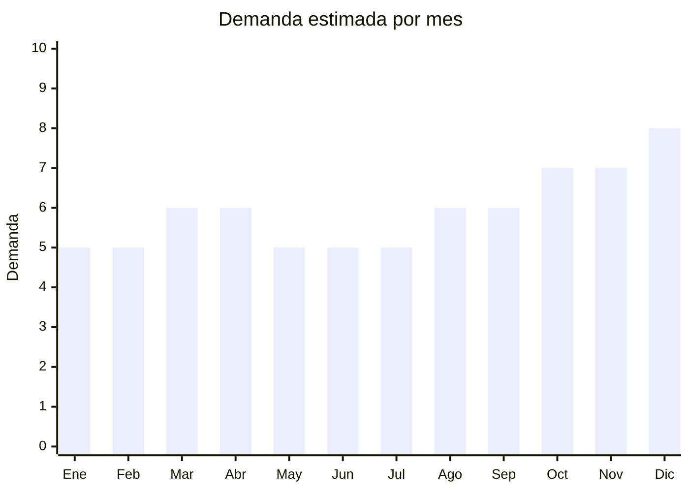

# Relojes de pared

> **Capítulo NCM 91** — Relojería | **Temporada:** Atemporal

## Qué es y por qué importarlo

Los relojes de pared son artículos de decoración funcional que combinan la medición del tiempo con diseño estético para hogares, oficinas, comercios y espacios públicos. Incluyen desde modelos clásicos con números hasta diseños modernos 3D adhesivos, minimalistas nórdicos, vintage retro e infantiles temáticos. Es un producto que se vende por impulso visual y valor decorativo, no solo por funcionalidad.

El mercado argentino tiene demanda constante de relojes de pared porque es un artículo de decoración accesible que transforma un ambiente con inversión mínima, se regala frecuentemente (inauguración de casa, mudanza, cumpleaños), y los modelos 3D adhesivos y nórdicos están en tendencia fuerte impulsados por redes sociales de decoración (Pinterest, Instagram).

China es el productor dominante mundial de relojes de pared, con centros de fabricación en Fujian (Zhangzhou) y Guangdong. Los precios FOB son extraordinariamente bajos para la percepción de valor que tiene el producto terminado, lo que genera márgenes superiores al 200%.

## Datos clave

| Dato | Valor |
|------|-------|
| **Posiciones NCM típicas** | 9105.21.00 (relojes de pared eléctricos) |
| **Derecho de importación** | 20% (DIE) + 3% tasa estadística |
| **Rango FOB típico** | USD 2.00 — USD 10.00 por unidad |
| **Precio de venta en Argentina** | ARS 10.000 — ARS 40.000 |
| **Margen bruto estimado** | 200% — 350% |
| **MOQ típico** | 50 — 200 unidades (según modelo) |
| **Demanda en MercadoLibre** | Alta |
| **Competencia en MercadoLibre** | Media |
| **Dificultad para importar** | Fácil |
| **Certificaciones necesarias** | Ninguna especial |
| **Antidumping** | No |

## Variantes y subtipos más comunes

| Subtipo / Variante | FOB aprox. | Venta AR aprox. | Nota |
|--------------------|-----------|-----------------|------|
| Clásico con números (30 cm) | USD 2.00 — 4.00 | ARS 10.000 — 18.000 | Siempre vende, público amplio |
| 3D adhesivo espejo (acrílico) | USD 2.50 — 5.00 | ARS 12.000 — 25.000 | **Más vendido** — tendencia decoración |
| Minimalista nórdico (madera/metal) | USD 4.00 — 8.00 | ARS 15.000 — 35.000 | Diseño premium, margen alto |
| Vintage retro (hierro/metal envejecido) | USD 5.00 — 10.00 | ARS 20.000 — 40.000 | Bares, restoranes, deco industrial |
| Infantil temático (animales, personajes) | USD 2.00 — 5.00 | ARS 10.000 — 22.000 | Dormitorios infantiles |

## Regulaciones y requisitos

<Tabs>
  <Tab title="Certificaciones">
    | Organismo | Requiere | Detalle | Costo aprox. | Tiempo aprox. |
    |-----------|----------|---------|-------------|--------------|
    | ARCA (Aduana) | Sí siempre | Despacho de importación estándar | — | — |
    | ANMAT | No | No es producto médico | — | — |
    | ENACOM | No | No emite radiofrecuencia (los estándar a pila). Modelos con radio-reloj o WiFi sí requieren | — | — |
    | INTI | No | No es textil ni calzado | — | — |

    **Nota estratégica:** Producto con cero barreras regulatorias (modelos estándar a pila). Esto lo convierte en excelente opción para importadores principiantes que buscan aprender el proceso con mínimo riesgo regulatorio.
  </Tab>

  <Tab title="Etiquetado">
    | Requisito | Aplica |
    |-----------|--------|
    | Idioma español | Sí |
    | Datos del importador | Sí (razón social, CUIT, dirección) |
    | Tipo de pila requerida | Sí (generalmente 1x AA) |
    | Dimensiones | Recomendado |
    | País de origen | Sí |
    | Garantía legal 6 meses | Sí |
  </Tab>

  <Tab title="Restricciones">
    Sin restricciones especiales para relojes de pared estándar. No hay antidumping, no hay licencias previas, no hay cupos.

    **Nota sobre pilas:** Los relojes de pared usan pilas alcalinas AA o C (no litio), por lo que no hay restricciones adicionales de transporte. La pila generalmente NO se incluye en el envío para evitar regulaciones de materiales peligrosos.
  </Tab>
</Tabs>

## Logística

| Dato | Valor |
|------|-------|
| **Peso típico por unidad** | 0.20 — 1.00 kg (según material y tamaño) |
| **Volumen típico** | Medio (modelos de 30-60 cm de diámetro ocupan espacio) |
| **Fragilidad** | Media-Alta (vidrio frontal, mecanismo interno) |
| **Envío recomendado** | Marítimo LCL para volumen; Aéreo solo para los modelos 3D adhesivos (planos y livianos) |
| **Tiempo total estimado** | 15 — 25 días (aéreo) / 45 — 75 días (marítimo) |
| **Baterías de litio** | No (pilas AA alcalinas, no incluidas) |
| **Requiere empaque especial** | Sí — caja individual con protección para vidrio y mecanismo |

<Tip>
Los relojes 3D adhesivos son los más eficientes logísticamente: se envían planos (desarmados), pesan muy poco y no tienen vidrio que se rompa. El cliente lo arma en su pared. Esto permite enviar grandes cantidades por aéreo a costo razonable. Los relojes con vidrio requieren empaque reforzado y es mejor enviarlos por marítimo con embalaje anti-golpes.
</Tip>

## Estacionalidad



| Aspecto | Detalle |
|---------|---------|
| **Meses pico** | Octubre-Diciembre (mudanzas de fin de año, regalos, decoración navideña), Marzo (vuelta a la rutina, renovación de espacios) |
| **Meses valle** | Enero-Febrero (vacaciones, menor interés en decoración) |
| **Cuándo pedir para llegar a tiempo** | Agosto (para capturar pico Oct-Dic) |

## Ventajas y riesgos

<CardGroup cols={2}>
  <Card title="Ventajas" icon="circle-check">
    - Sin certificaciones complejas (importación simple)
    - Márgenes excelentes (200-350%)
    - Demanda constante todo el año
    - Gran variedad de diseños para diferenciarse
    - Producto de decoración con alto valor percibido
    - Modelos 3D adhesivos: livianos y sin vidrio
  </Card>
  <Card title="Riesgos" icon="triangle-exclamation">
    - Relojes con vidrio se rompen en tránsito si el empaque es deficiente
    - Mecanismos baratos son ruidosos (tick-tack molesto)
    - Ocupan volumen en envío (diámetro 30-60 cm)
    - Competencia de bazares y tiendas de decoración
    - Moda decorativa cambia: stock de diseños pasados de moda se estanca
  </Card>
</CardGroup>

<Warning>
El mecanismo de cuarzo es la pieza clave. Los mecanismos ultra baratos (menos de USD 0.30) son ruidosos y duran poco. Pedir siempre mecanismos **"silent sweep"** (movimiento continuo sin tic-tac) que cuestan apenas USD 0.10-0.20 más pero eliminan el ruido, principal causa de devoluciones en relojes de pared. Verificar con muestras que el mecanismo sea realmente silencioso.
</Warning>

## Palabras clave para buscar en Alibaba

```
wall clock wholesale, 3D wall clock adhesive, silent wall clock,
minimalist wall clock Nordic, vintage wall clock metal, kids wall clock,
large wall clock decorative, DIY wall clock mirror acrylic, wall clock mechanism silent
```

## Fuentes

- [MercadoLibre Argentina — Relojes de pared](https://listado.mercadolibre.com.ar/relojes-de-pared)
- [Alibaba — Wall clock wholesale](https://www.alibaba.com/showroom/wall-clock-wholesale.html)
