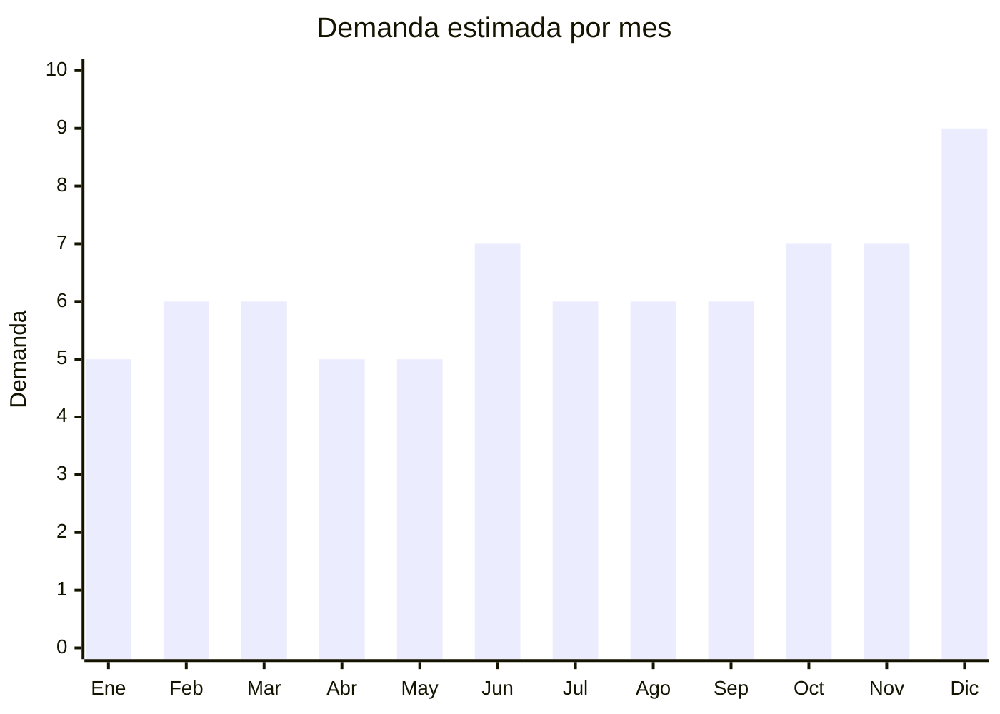

# Relojes de pulsera económicos

> **Capítulo NCM 91** — Relojería | **Temporada:** Atemporal

## Qué es y por qué importarlo

Los relojes de pulsera económicos son relojes analógicos de cuarzo con precios FOB de USD 2-10 que se posicionan como accesorios de moda, no como instrumentos de precisión. Incluyen modelos con correa de cuero sintético, silicona deportiva o malla de acero inoxidable, en estilos que van desde el clásico elegante hasta el deportivo casual. A pesar de la era del smartwatch, los relojes analógicos mantienen demanda firme como complemento de vestimenta y accesorio de estilo.

El mercado argentino de relojes de pulsera económicos es amplio y diverso. El consumidor compra por estética y estilo, no por marca (en este rango de precio). Los modelos minimalistas tipo "Daniel Wellington" (que se fabrican en China por menos de USD 5) se venden a ARS 10,000-40,000 en Argentina. Los packs de pareja (x2) son especialmente populares como regalo.

China (Shenzhen, específicamente Bao'an district) es la capital mundial de fabricación de relojes económicos, con miles de fábricas que producen para marcas de todo el mundo. La capacidad de hacer marca propia (private label) con logo grabado, packaging personalizado y diseños exclusivos es una ventaja enorme para diferenciarse.

## Datos clave

| Dato | Valor |
|------|-------|
| **Posiciones NCM típicas** | 9102.11.00 (relojes de pulsera eléctricos, con indicador mecánico), 9102.19.00 (otros relojes de pulsera eléctricos) |
| **Derecho de importación** | 20% (DIE) + 3% tasa estadística |
| **Rango FOB típico** | USD 2.00 — USD 10.00 por unidad |
| **Precio de venta en Argentina** | ARS 10.000 — ARS 40.000 |
| **Margen bruto estimado** | 200% — 400% |
| **MOQ típico** | 50 — 300 unidades (modelos de catálogo); 500+ para private label completo |
| **Demanda en MercadoLibre** | Alta |
| **Competencia en MercadoLibre** | Alta |
| **Dificultad para importar** | Fácil |
| **Certificaciones necesarias** | Ninguna especial |
| **Antidumping** | No |

## Variantes y subtipos más comunes

| Subtipo / Variante | FOB aprox. | Venta AR aprox. | Nota |
|--------------------|-----------|-----------------|------|
| Analógico clásico cuero sintético | USD 2.00 — 5.00 | ARS 10.000 — 25.000 | **Más vendido** — elegante, unisex |
| Analógico deportivo silicona | USD 2.50 — 6.00 | ARS 10.000 — 22.000 | Resistente, colores variados |
| Analógico malla acero inoxidable | USD 4.00 — 10.00 | ARS 15.000 — 40.000 | Premium percibido, mayor margen |
| Cuarzo minimalista (esfera limpia) | USD 3.00 — 7.00 | ARS 12.000 — 30.000 | Tendencia actual, estilo "DW" |
| Pack parejas x2 (caja regalo) | USD 5.00 — 12.00 | ARS 20.000 — 50.000 | Excelente para regalo, alto ticket |

## Regulaciones y requisitos

<Tabs>
  <Tab title="Certificaciones">
    | Organismo | Requiere | Detalle | Costo aprox. | Tiempo aprox. |
    |-----------|----------|---------|-------------|--------------|
    | ARCA (Aduana) | Sí siempre | Despacho de importación estándar | — | — |
    | ANMAT | No | No es producto médico | — | — |
    | ENACOM | No | Relojes analógicos de cuarzo no emiten RF | — | — |
    | INTI | No | No es textil ni calzado | — | — |

    **Nota estratégica:** Cero barreras regulatorias para relojes analógicos de cuarzo. La clave está en la diferenciación por diseño y marca propia. Invertir en packaging premium (caja, almohadilla, bolsa) agrega valor percibido enorme por costo mínimo.
  </Tab>

  <Tab title="Etiquetado">
    | Requisito | Aplica |
    |-----------|--------|
    | Idioma español | Sí |
    | Datos del importador | Sí (razón social, CUIT, dirección) |
    | Material de la correa | Sí (cuero genuino, cuero sintético, acero, silicona) |
    | Resistencia al agua | Sí si se declara (3ATM, 5ATM — no exagerar si no es real) |
    | País de origen | Sí |
    | Garantía legal 6 meses | Sí |
  </Tab>

  <Tab title="Restricciones">
    Sin restricciones especiales para relojes de pulsera genéricos.

    **Advertencia sobre marcas:** Importar relojes con logos de marcas registradas (Rolex, Casio, Swatch, etc.) sin licencia es **contrabando marcario** penalizado por ley. Solo importar modelos genéricos o con marca propia. La aduana puede retener cualquier envío que sospeche falsificación.

    **Nota sobre resistencia al agua:** No declarar resistencia al agua (ATM) que el reloj no tenga realmente. Publicar "sumergible" sin serlo genera reclamos y problemas legales por publicidad engañosa.
  </Tab>
</Tabs>

## Logística

| Dato | Valor |
|------|-------|
| **Peso típico por unidad** | 0.05 — 0.15 kg (con caja individual) |
| **Volumen típico** | Muy bajo |
| **Fragilidad** | Media (vidrio/cristal de la esfera) |
| **Envío recomendado** | Aéreo/Courier ideal por peso mínimo; Marítimo LCL para volúmenes grandes |
| **Tiempo total estimado** | 15 — 25 días (aéreo) / 45 — 75 días (marítimo) |
| **Baterías de litio** | No (pila botón SR626SW o similar, no litio recargable) |
| **Requiere empaque especial** | Sí — caja individual con almohadilla para proteger esfera |

<Tip>
La caja y presentación del reloj pueden costar tanto como el reloj mismo, y valen cada centavo. Un reloj de USD 3 FOB en una bolsa plástica se vende a ARS 8,000. El mismo reloj en caja premium con almohadilla y bolsa de regalo se vende a ARS 20,000+. Pedir al proveedor opciones de packaging: caja cartón básica, caja con ventana, caja madera/bambú, caja con almohadilla de cuero sintético.
</Tip>

## Estacionalidad



| Aspecto | Detalle |
|---------|---------|
| **Meses pico** | Junio (Día del Padre — top regalo), Octubre (Día de la Madre), Noviembre-Diciembre (Black Friday, Navidad, fiestas de fin de año) |
| **Meses valle** | Enero (post-fiestas), Abril-Mayo |
| **Cuándo pedir para llegar a tiempo** | Abril (para stock de Día del Padre en junio), Agosto (para pico Oct-Dic) |

## Ventajas y riesgos

<CardGroup cols={2}>
  <Card title="Ventajas" icon="circle-check">
    - Márgenes altos (200-400%), especialmente con marca propia
    - Producto ultraliviano (aéreo viable siempre)
    - Sin certificaciones ni trámites complejos
    - Demanda alta todo el año con picos de regalo
    - Private label accesible desde 500 unidades
    - Packaging premium multiplica el precio de venta
  </Card>
  <Card title="Riesgos" icon="triangle-exclamation">
    - Competencia alta en MercadoLibre
    - Relojes de mala calidad pierden tiempo o se empañan
    - Correas de cuero sintético barato se pelan rápidamente
    - Riesgo de decomiso si se importan marcas falsificadas
    - La pila puede agotarse en depósito si el proveedor no coloca aislante
    - Vidrio mineral económico se raya fácilmente
  </Card>
</CardGroup>

<Warning>
**Calidad de la maquinaria y el vidrio son clave.** Los movimientos de cuarzo japoneses (Miyota, Seiko/TMI) son superiores a los chinos genéricos y cuestan solo USD 0.30-0.50 más. El vidrio mineral debe tener al menos 7H de dureza para resistir rayaduras. Pedir muestras y usar el reloj durante 2 semanas antes de importar volumen. Verificar que la pila traiga aislante plástico de fábrica para evitar que se descargue en almacenamiento.
</Warning>

## Palabras clave para buscar en Alibaba

```
quartz watch wholesale, custom logo watch, minimalist watch men,
leather strap watch wholesale, mesh strap watch women, couple watches set,
private label watch manufacturer, fashion watch OEM, stainless steel watch cheap
```

## Fuentes

- [MercadoLibre Argentina — Relojes de pulsera](https://listado.mercadolibre.com.ar/relojes-de-pulsera)
- [Alibaba — Watches wholesale OEM](https://www.alibaba.com/showroom/watch-wholesale-oem.html)
