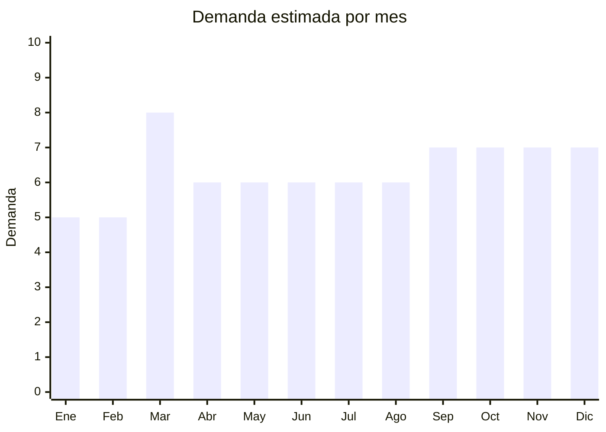

# Accesorios de guitarra

> **Capítulo NCM 92** — Instrumentos musicales, sus partes y accesorios | **Temporada:** Atemporal

## Qué es y por qué importarlo

Los accesorios de guitarra abarcan todos los consumibles y complementos que necesita un guitarrista: cuerdas (nylon y acero), púas/plumillas, capos (cejillas), correas, afinadores clip, cejuelas, slides, soportes y herramientas de mantenimiento. Son productos de reposición frecuente (las cuerdas se cambian cada 1-3 meses, las púas se pierden constantemente) con demanda garantizada.

Argentina tiene uno de los índices más altos del mundo de guitarristas per cápita. La guitarra es el instrumento nacional no oficial, presente en folklore, tango, rock, pop y cumbia. Esto genera un mercado masivo y constante de accesorios que se reponen cíclicamente. Cada guitarrista activo consume entre ARS 20,000-50,000 anuales en accesorios.

China produce la gran mayoría de accesorios de guitarra económicos y de gama media del mundo. Los precios FOB son irrisorios (púas desde USD 0.01/unidad, capos desde USD 0.50) y los márgenes de reventa en Argentina son extraordinarios, especialmente en packs.

## Datos clave

| Dato | Valor |
|------|-------|
| **Posiciones NCM típicas** | 9209.30.00 (cuerdas para instrumentos musicales), 9209.99.00 (otros accesorios) |
| **Derecho de importación** | 14-18% (DIE) + 3% tasa estadística |
| **Rango FOB típico** | USD 0.20 — USD 5.00 por unidad/set |
| **Precio de venta en Argentina** | ARS 2.000 — ARS 15.000 |
| **Margen bruto estimado** | 200% — 500% |
| **MOQ típico** | 100 — 1,000 unidades (según artículo) |
| **Demanda en MercadoLibre** | Muy Alta |
| **Competencia en MercadoLibre** | Alta |
| **Dificultad para importar** | Fácil |
| **Certificaciones necesarias** | Ninguna |
| **Antidumping** | No |

## Variantes y subtipos más comunes

| Subtipo / Variante | FOB aprox. | Venta AR aprox. | Nota |
|--------------------|-----------|-----------------|------|
| Cuerdas guitarra clásica (nylon, set x6) | USD 0.30 — 1.50 | ARS 3.000 — 8.000 | **Consumible #1** — reposición mensual |
| Cuerdas guitarra acústica (acero, set x6) | USD 0.40 — 2.00 | ARS 3.500 — 10.000 | Alta demanda en rock/folk |
| Púas/plumillas (pack x50-100) | USD 0.20 — 1.50 | ARS 2.000 — 8.000 | Márgenes altísimos, se pierden siempre |
| Capo/cejilla (metal con gatillo) | USD 0.50 — 3.00 | ARS 3.000 — 12.000 | Accesorio esencial, alta rotación |
| Correa guitarra (tela/cuero sintético) | USD 0.50 — 3.00 | ARS 3.000 — 12.000 | Diseños variados, personalización |
| Afinador clip (cromático) | USD 1.00 — 5.00 | ARS 5.000 — 15.000 | Electrónico, buena percepción de valor |

## Regulaciones y requisitos

<Tabs>
  <Tab title="Certificaciones">
    | Organismo | Requiere | Detalle | Costo aprox. | Tiempo aprox. |
    |-----------|----------|---------|-------------|--------------|
    | ARCA (Aduana) | Sí siempre | Despacho de importación estándar | — | — |
    | ANMAT | No | No es producto médico | — | — |
    | ENACOM | No | Los afinadores clip no emiten RF (son receptores pasivos de vibración) | — | — |
    | INTI | No | No es textil ni calzado | — | — |

    Producto con cero barreras regulatorias. La categoría completa de accesorios de guitarra se importa con despacho estándar sin trámites adicionales.
  </Tab>

  <Tab title="Etiquetado">
    | Requisito | Aplica |
    |-----------|--------|
    | Idioma español | Sí |
    | Datos del importador | Sí (razón social, CUIT, dirección) |
    | Calibre/especificaciones | Sí para cuerdas (calibre, material: nylon, acero, bronce fosforado) |
    | País de origen | Sí |
    | Garantía legal 6 meses | Sí (aplica a accesorios duraderos como capos, afinadores) |
  </Tab>

  <Tab title="Restricciones">
    Sin restricciones de ningún tipo. Producto de libre importación con despacho estándar. No hay antidumping, no hay licencias, no hay cupos.

    **Nota sobre pilas:** Los afinadores clip usan pila botón (CR2032). No es litio recargable, por lo que no hay restricciones de transporte aéreo.
  </Tab>
</Tabs>

## Logística

| Dato | Valor |
|------|-------|
| **Peso típico por pack** | 0.01 — 0.30 kg (según artículo) |
| **Volumen típico** | Muy bajo (productos compactos y planos) |
| **Fragilidad** | Baja (cuerdas, púas, capos son resistentes) |
| **Envío recomendado** | Aéreo/Courier ideal (peso total mínimo incluso en grandes volúmenes) |
| **Tiempo total estimado** | 15 — 25 días (aéreo) / 45 — 75 días (marítimo) |
| **Baterías de litio** | No (afinadores usan pila botón no recargable) |
| **Requiere empaque especial** | Mínimo — las cuerdas vienen selladas al vacío de fábrica |

<Tip>
Los accesorios de guitarra son el producto logístico perfecto: pesan casi nada, ocupan mínimo espacio, no se rompen y tienen altísima densidad de valor. 5,000 púas pesan menos de 2 kg. 500 sets de cuerdas pesan aprox. 15 kg. La estrategia ideal es armar un **mix variado** en cada envío (cuerdas + púas + capos + correas + afinadores) para diversificar la oferta y maximizar el valor del flete.
</Tip>

## Estacionalidad



| Aspecto | Detalle |
|---------|---------|
| **Meses pico** | Marzo (inicio de clases de música, compra masiva de accesorios), Septiembre-Diciembre (primavera, eventos, regalos navideños) |
| **Meses valle** | Enero-Febrero (vacaciones) |
| **Cuándo pedir para llegar a tiempo** | Enero (para stock de vuelta a clases en marzo), Julio (para stock Sep-Dic) |

## Ventajas y riesgos

<CardGroup cols={2}>
  <Card title="Ventajas" icon="circle-check">
    - Sin certificaciones (importación simple)
    - Márgenes extraordinarios (200-500%)
    - Producto ultraliviano (flete casi irrelevante)
    - Consumible de reposición (compra recurrente garantizada)
    - Argentina = país de guitarristas (mercado masivo)
    - Ideal para venta mayorista a luthiers y tiendas de música
  </Card>
  <Card title="Riesgos" icon="triangle-exclamation">
    - Competencia alta en cuerdas (marcas establecidas: D'Addario, Ernie Ball)
    - Cuerdas de mala calidad se oxidan rápido y suenan mal
    - Ticket promedio bajo por unidad (vender en packs y combos)
    - Púas genéricas son commodity (diferenciarse con diseños/colores)
    - Los afinadores clip compiten con apps de celular gratuitas
  </Card>
</CardGroup>

<Warning>
**La calidad de las cuerdas es lo más sensible.** Los guitarristas son exigentes con sus cuerdas: si suenan mal, se oxidan rápido o se desafinan, no vuelven a comprar. Las cuerdas económicas chinas han mejorado mucho pero no compiten con D'Addario o Ernie Ball en el segmento premium. Posicionarse en el segmento de **precio accesible con calidad aceptable** (estudiantes, principiantes) y no intentar competir contra las marcas premium. Pedir muestras, probar en guitarra real y verificar la oxidación después de 2 semanas de uso.
</Warning>

## Palabras clave para buscar en Alibaba

```
guitar strings wholesale, nylon guitar strings classical, guitar picks bulk 100pcs,
guitar capo wholesale, guitar strap wholesale, clip tuner chromatic,
guitar accessories set, guitar picks custom design, guitar bridge pins wholesale
```

## Fuentes

- [MercadoLibre Argentina — Accesorios de guitarra](https://listado.mercadolibre.com.ar/accesorios-guitarra)
- [Alibaba — Guitar accessories wholesale](https://www.alibaba.com/showroom/guitar-accessories-wholesale.html)
