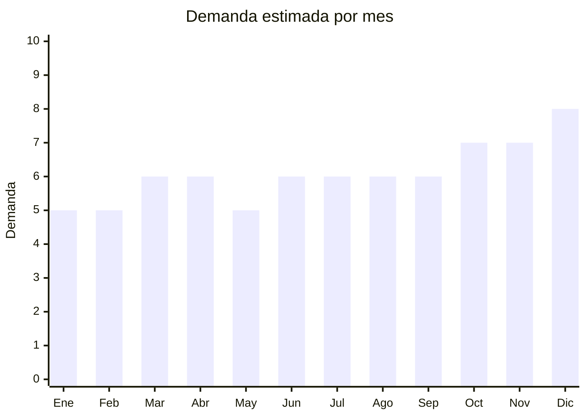

# Kalimbas

> **Capítulo NCM 92** — Instrumentos musicales, sus partes y accesorios | **Temporada:** Atemporal

## Qué es y por qué importarlo

La kalimba (también llamada mbira o piano de pulgar) es un instrumento musical africano de percusión de láminas que se toca con los pulgares. Consiste en una caja de resonancia de madera con láminas metálicas afinadas que producen un sonido dulce y relajante. Se popularizó masivamente a través de videos virales en TikTok, Instagram Reels y YouTube, donde millones de reproducciones de covers de canciones populares impulsaron la demanda global.

Lo que empezó como viralización en redes se consolidó como un producto estable en el mercado de instrumentos musicales. La kalimba atrae un público amplio: personas que nunca tocaron un instrumento (es extremadamente fácil de aprender), practicantes de meditación y relajación (sonido terapéutico), músicos que la suman como instrumento complementario, y compradores de regalos originales.

China produce la gran mayoría de las kalimbas del mundo, con fabricantes concentrados en Huizhou (Guangdong). La calidad ha mejorado enormemente en los últimos años, con modelos de caoba sólida que suenan excelente a precios FOB de USD 3-10.

## Datos clave

| Dato | Valor |
|------|-------|
| **Posiciones NCM típicas** | 9206.00.00 (instrumentos musicales de percusión) |
| **Derecho de importación** | 18% (DIE) + 3% tasa estadística |
| **Rango FOB típico** | USD 3.00 — USD 10.00 por unidad |
| **Precio de venta en Argentina** | ARS 15.000 — ARS 40.000 |
| **Margen bruto estimado** | 200% — 400% |
| **MOQ típico** | 50 — 200 unidades |
| **Demanda en MercadoLibre** | Media-Alta |
| **Competencia en MercadoLibre** | Media |
| **Dificultad para importar** | Fácil |
| **Certificaciones necesarias** | Ninguna |
| **Antidumping** | No |

## Variantes y subtipos más comunes

| Subtipo / Variante | FOB aprox. | Venta AR aprox. | Nota |
|--------------------|-----------|-----------------|------|
| 17 teclas caoba sólida | USD 3.00 — 6.00 | ARS 15.000 — 28.000 | **Más vendida** — afinación estándar en C |
| 21 teclas cromática | USD 5.00 — 10.00 | ARS 25.000 — 40.000 | Mayor rango, para músicos avanzados |
| Acrílica transparente | USD 4.00 — 8.00 | ARS 18.000 — 35.000 | Estética llamativa, popular en redes |
| Eléctrica con pickup | USD 6.00 — 10.00 | ARS 22.000 — 40.000 | Para amplificación y grabación |
| Mini 8 teclas (infantil/introductoria) | USD 2.00 — 4.00 | ARS 8.000 — 18.000 | Regalo, niños, souvenir |

## Regulaciones y requisitos

<Tabs>
  <Tab title="Certificaciones">
    | Organismo | Requiere | Detalle | Costo aprox. | Tiempo aprox. |
    |-----------|----------|---------|-------------|--------------|
    | ARCA (Aduana) | Sí siempre | Despacho de importación estándar | — | — |
    | ANMAT | No | No es producto médico | — | — |
    | ENACOM | No | No es electrónico (la eléctrica con pickup es pasiva, no emite RF) | — | — |
    | INTI | No | No es textil ni calzado | — | — |

    Producto con cero barreras regulatorias. Importación directa y simple.
  </Tab>

  <Tab title="Etiquetado">
    | Requisito | Aplica |
    |-----------|--------|
    | Idioma español | Sí |
    | Datos del importador | Sí (razón social, CUIT, dirección) |
    | Material del cuerpo | Recomendado (caoba, pino, acrílico) |
    | Cantidad de teclas | Sí (8, 17, 21) |
    | Afinación | Recomendado (Do mayor / C major estándar) |
    | País de origen | Sí |
    | Garantía legal 6 meses | Sí |
  </Tab>

  <Tab title="Restricciones">
    Sin restricciones especiales. No hay antidumping, no hay licencias, no hay cupos.

    **Nota sobre madera:** Las kalimbas de caoba o pino procesado (barnizado/lacado) no requieren certificado fitosanitario SENASA. Solo aplicaría si se importa madera en crudo sin tratar, lo cual es muy raro en este producto.
  </Tab>
</Tabs>

## Logística

| Dato | Valor |
|------|-------|
| **Peso típico por unidad** | 0.20 — 0.45 kg (con caja) |
| **Volumen típico** | Bajo (tamaño de mano, aprox. 18x13x5 cm con caja) |
| **Fragilidad** | Baja-Media (cuerpo sólido, las teclas pueden desafinarse con golpes fuertes) |
| **Envío recomendado** | Aéreo/Courier ideal por peso y volumen compacto; Marítimo LCL para volumen |
| **Tiempo total estimado** | 15 — 25 días (aéreo) / 45 — 75 días (marítimo) |
| **Baterías de litio** | No |
| **Requiere empaque especial** | Mínimo — caja individual con inserto. Las acrílicas necesitan más protección |

<Tip>
La kalimba es un producto logísticamente excelente: compacta, liviana y resistente. 500 unidades pesan apenas 100-225 kg y caben en pocas cajas. Esto hace viable el envío aéreo incluso para lotes medianos. Pedir al proveedor que incluya accesorios en la caja (martillo de afinación, stickers de notas, funda, paño de limpieza): cuestan USD 0.30-0.50 extra y agregan mucho valor percibido.
</Tip>

## Estacionalidad



| Aspecto | Detalle |
|---------|---------|
| **Meses pico** | Octubre (Día de la Madre — regalo musical original), Noviembre-Diciembre (Navidad, regalo estrella por precio y originalidad) |
| **Meses valle** | Enero-Febrero (vacaciones, post-fiestas) |
| **Cuándo pedir para llegar a tiempo** | Agosto (para stock Oct-Dic con 60-75 días de lead time marítimo) |

## Ventajas y riesgos

<CardGroup cols={2}>
  <Card title="Ventajas" icon="circle-check">
    - Sin certificaciones (importación simple)
    - Márgenes excelentes (200-400%)
    - Producto compacto y liviano (logística eficiente)
    - Demanda consolidada post-viralización
    - Excelente como regalo original
    - Bajo FOB: riesgo financiero mínimo en primer pedido
  </Card>
  <Card title="Riesgos" icon="triangle-exclamation">
    - Calidad de afinación variable entre proveedores
    - Las teclas de mala calidad se desafinan rápidamente
    - Mercado puede saturarse si entran muchos importadores
    - Instrumento de nicho (mercado más chico que guitarra)
    - Modelos acrílicos se rayan si el empaque es deficiente
  </Card>
</CardGroup>

<Warning>
La **afinación de fábrica** es el factor más importante. Las kalimbas deben llegar afinadas en Do mayor (C major) y mantener la afinación durante semanas. Las teclas de acero al carbono de mala calidad se desafinan en días y suenan metálico/estridente en vez de dulce. Pedir muestras, afinar con un afinador cromático y verificar que la afinación se mantenga durante al menos 2 semanas. Las teclas deben tener un sonido sostenido y resonante, no corto y seco.
</Warning>

## Palabras clave para buscar en Alibaba

```
kalimba wholesale, kalimba 17 keys mahogany, thumb piano wholesale,
kalimba 21 keys chromatic, acrylic kalimba transparent, electric kalimba pickup,
kalimba manufacturer, mbira wholesale, kalimba set with accessories
```

## Fuentes

- [MercadoLibre Argentina — Kalimba](https://listado.mercadolibre.com.ar/kalimba)
- [Alibaba — Kalimba wholesale](https://www.alibaba.com/showroom/kalimba-wholesale.html)
