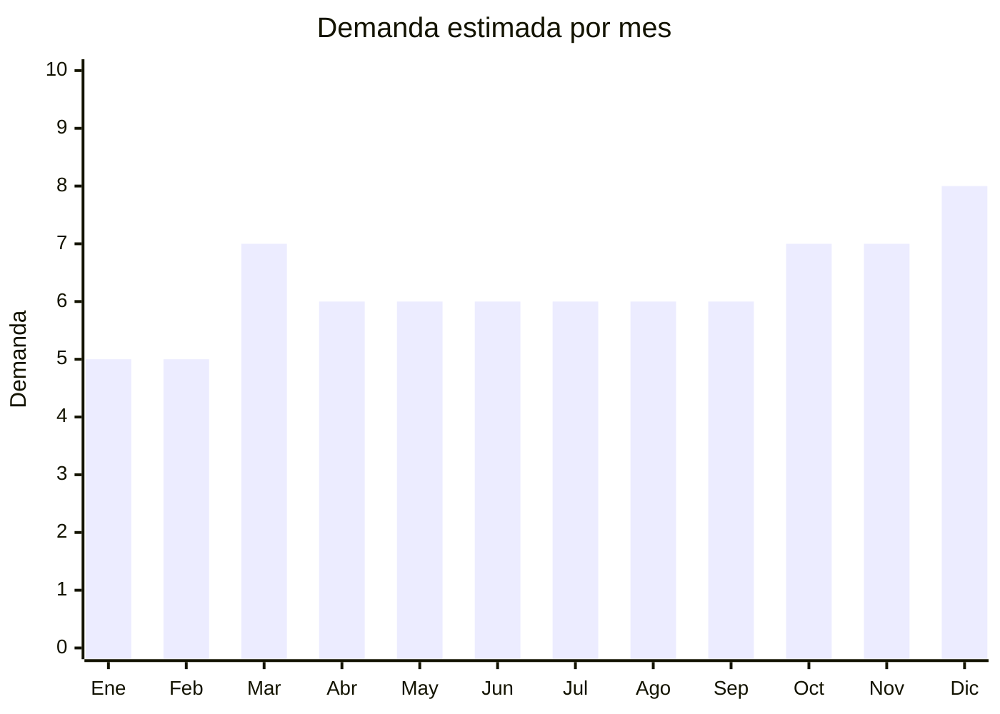

# Soportes y atriles de música

> **Capítulo NCM 92** — Instrumentos musicales, sus partes y accesorios | **Temporada:** Atemporal

## Qué es y por qué importarlo

Los soportes y atriles de música son accesorios metálicos plegables que sirven para sostener instrumentos (guitarras, teclados, micrófonos) o para exhibir partituras y tablets durante ensayos y presentaciones. Son productos complementarios esenciales: todo músico necesita al menos un soporte o atril, y la mayoría tiene varios según su setup.

Argentina tiene un altísimo índice de músicos per cápita. La cultura musical argentina es una de las más fuertes de Latinoamérica, con millones de personas que tocan guitarra, teclado, bajo u otro instrumento de forma amateur o profesional. Esto genera una demanda permanente de soportes y atriles que se renueva conforme el mercado de instrumentos crece. Además, el auge de home studios, podcasters, streamers y creadores de contenido sumó una nueva capa de demanda por soportes de micrófono y atriles para tablets/laptops.

China produce la gran mayoría de soportes y atriles del mundo, con fábricas especializadas en tubería metálica y mecanismos plegables concentradas en Guangdong y Zhejiang. Los precios FOB son muy bajos (USD 3-15 por unidad) y la calidad ha mejorado enormemente, con modelos de acero reforzado y aluminio que rivalizan con marcas como Hercules o K&M a una fracción del precio.

## Datos clave

| Dato | Valor |
|------|-------|
| **Posiciones NCM típicas** | 9209.99.00 (partes y accesorios de instrumentos musicales) |
| **Derecho de importación** | 14-18% (DIE) + 3% tasa estadística |
| **Rango FOB típico** | USD 3.00 — USD 15.00 por unidad |
| **Precio de venta en Argentina** | ARS 10.000 — ARS 40.000 |
| **Margen bruto estimado** | 200% — 350% |
| **MOQ típico** | 50 — 200 unidades |
| **Demanda en MercadoLibre** | Alta |
| **Competencia en MercadoLibre** | Media |
| **Dificultad para importar** | Fácil |
| **Certificaciones necesarias** | Ninguna |
| **Antidumping** | No |

## Variantes y subtipos más comunes

| Subtipo / Variante | FOB aprox. | Venta AR aprox. | Nota |
|--------------------|-----------|-----------------|------|
| Atril partituras plegable (metal) | USD 3.00 — 7.00 | ARS 10.000 — 25.000 | **Más vendido** — liviano, plegable, uso universal |
| Soporte guitarra tipo A (trípode) | USD 3.00 — 6.00 | ARS 10.000 — 20.000 | Esencial para guitarristas, alta rotación |
| Soporte guitarra de pared | USD 2.00 — 5.00 | ARS 8.000 — 18.000 | Para exhibición en casa o tienda, ahorra espacio |
| Soporte teclado doble X | USD 5.00 — 12.00 | ARS 15.000 — 35.000 | Robusto, ajustable en altura, imprescindible para tecladistas |
| Soporte micrófono boom (jirafa) | USD 4.00 — 10.00 | ARS 12.000 — 30.000 | Demanda creciente: músicos, podcasters, streamers |
| Soporte múltiple 3-5 guitarras | USD 8.00 — 15.00 | ARS 25.000 — 40.000 | Para estudios y tiendas de música |

## Regulaciones y requisitos

<Tabs>
  <Tab title="Certificaciones">
    | Organismo | Requiere | Detalle | Costo aprox. | Tiempo aprox. |
    |-----------|----------|---------|-------------|--------------|
    | ARCA (Aduana) | Sí siempre | Despacho de importación estándar | — | — |
    | ANMAT | No | No es producto médico | — | — |
    | ENACOM | No | No es electrónico ni emite RF | — | — |
    | INTI | No | No es textil ni calzado | — | — |

    Producto con cero barreras regulatorias. Importación directa y simple con despacho estándar. No hay ningún organismo adicional que intervenga.
  </Tab>

  <Tab title="Etiquetado">
    | Requisito | Aplica |
    |-----------|--------|
    | Idioma español | Sí |
    | Datos del importador | Sí (razón social, CUIT, dirección) |
    | Material de fabricación | Recomendado (acero, aluminio, hierro) |
    | Capacidad de carga máxima | Recomendado (especialmente soportes de teclado e instrumentos pesados) |
    | País de origen | Sí |
    | Garantía legal 6 meses | Sí |
  </Tab>

  <Tab title="Restricciones">
    Sin restricciones de ningún tipo. No hay antidumping, no hay licencias, no hay cupos. Producto de libre importación.

    **Nota sobre pintura:** Algunos soportes económicos usan pintura con alto contenido de plomo o cromo. Aunque no hay regulación estricta en Argentina para este tipo de accesorio (no es juguete), es buena práctica verificar con el proveedor que la pintura cumpla con estándares básicos, especialmente si se van a vender soportes de instrumentos infantiles.
  </Tab>
</Tabs>

## Logística

| Dato | Valor |
|------|-------|
| **Peso típico por unidad** | 1.00 — 3.00 kg (según modelo y material) |
| **Volumen típico** | Medio (plegables reducen significativamente el volumen de envío) |
| **Fragilidad** | Baja (estructura metálica resistente a golpes) |
| **Envío recomendado** | Marítimo LCL para volumen (>50 unidades); Aéreo viable para muestras o pedidos chicos |
| **Tiempo total estimado** | 15 — 25 días (aéreo) / 45 — 75 días (marítimo) |
| **Baterías de litio** | No |
| **Requiere empaque especial** | Mínimo — caja individual con el soporte plegado. Proteger partes cromadas con plástico burbuja |

<Tip>
La gran ventaja logística de los soportes es que son **plegables**. Un atril de partituras plegado ocupa apenas 50x10x10 cm, un soporte de guitarra tipo A plegado mide 40x10x8 cm. Esto permite empacar grandes cantidades en poco espacio. La estrategia ideal es importar un **mix de variantes** en el mismo envío (atriles + soportes guitarra + soportes teclado + soportes micrófono) para diversificar oferta y cubrir todo el público musical con un solo flete. Pedir al proveedor que incluya tornillos de repuesto y gomas antideslizantes extra.
</Tip>

## Estacionalidad



| Aspecto | Detalle |
|---------|---------|
| **Meses pico** | Marzo (inicio de clases de música — compra de accesorios), Octubre (Día de la Madre), Noviembre-Diciembre (Navidad, regalos para músicos) |
| **Meses valle** | Enero-Febrero (vacaciones, post-fiestas) |
| **Cuándo pedir para llegar a tiempo** | Enero (para stock de vuelta a clases en marzo), Julio-Agosto (para stock Oct-Dic con 60-75 días de lead time marítimo) |

## Ventajas y riesgos

<CardGroup cols={2}>
  <Card title="Ventajas" icon="circle-check">
    - Cero certificaciones (importación más simple posible)
    - Márgenes excelentes (200-350%)
    - Producto plegable (logística eficiente por CBM)
    - Demanda permanente (todo músico necesita soportes)
    - Resistente a daños en tránsito (metal sólido)
    - Producto complementario ideal para venta cruzada con instrumentos
  </Card>
  <Card title="Riesgos" icon="triangle-exclamation">
    - Mecanismos de ajuste flojos en modelos ultra-económicos
    - Gomas antideslizantes de mala calidad (se despegan, no amortiguan)
    - Peso del producto puede encarecer flete si se importa mucho volumen
    - Competencia de marcas premium (Hercules, K&M) en segmento alto
    - Ticket promedio moderado (ARS 10,000-30,000 por unidad)
  </Card>
</CardGroup>

<Warning>
El punto crítico de calidad en soportes y atriles es el **mecanismo de ajuste y bloqueo**. Los modelos ultra-baratos (FOB < USD 3) suelen tener perillas de plástico que se rompen, rosca que se pela, y mecanismos de altura que no sostienen el peso del instrumento. Un soporte de guitarra que deja caer la guitarra genera un reclamo costoso. Pedir muestras, cargar con peso real (guitarra, teclado) y verificar que los mecanismos de bloqueo sostengan durante semanas. Las gomas de las bases deben ser de caucho real, no de plástico rígido que resbala en piso.
</Warning>

## Palabras clave para buscar en Alibaba

```
music stand foldable, guitar stand wholesale, guitar wall mount hanger,
keyboard stand double X, microphone boom stand, music stand metal portable,
guitar stand multiple, mic stand wholesale, sheet music stand folding,
instrument stand wholesale, guitar floor stand tripod
```

## Fuentes

- [MercadoLibre Argentina — Soporte instrumentos musicales](https://listado.mercadolibre.com.ar/soporte-instrumentos-musicales)
- [Alibaba — Music stand wholesale](https://www.alibaba.com/showroom/music-stand-wholesale.html)
