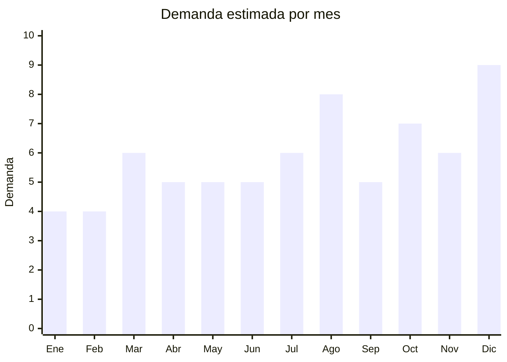

# Teclados musicales

> **Capítulo NCM 92** — Instrumentos musicales, sus partes y accesorios | **Temporada:** Atemporal

## Qué es y por qué importarlo

Los teclados musicales electrónicos (también llamados órganos electrónicos o pianos digitales portátiles) son instrumentos con teclas que reproducen sonidos sintetizados o sampleados de piano, órgano, cuerdas y otros instrumentos. Los modelos más comunes tienen 61 teclas (5 octavas) con teclas no pesadas, lo que los convierte en el instrumento de teclado más accesible para principiantes, estudiantes y músicos aficionados.

China es el mayor productor mundial de teclados musicales económicos, con fábricas concentradas en Guangdong y Zhejiang que fabrican para marcas globales y también ofrecen modelos OEM/ODM a precios FOB extraordinariamente competitivos. En Argentina, el segmento de teclados económicos chinos tiene un espacio enorme: las marcas premium como Casio y Yamaha dominan la gama media-alta (ARS 200,000+), pero hay una demanda masiva de teclados de iniciación en el rango de ARS 60,000-150,000 que las marcas premium no cubren.

La demanda es estable durante todo el año con picos marcados en fechas de regalo (Día del Niño, Navidad, Día de la Madre). Argentina tiene una cultura musical fuerte, y el teclado es la segunda opción más popular después de la guitarra para aprender música. Escuelas de música, iglesias, productores caseros de contenido y familias con niños conforman un mercado amplio y constante.

## Datos clave

| Dato | Valor |
|------|-------|
| **Posiciones NCM típicas** | 9207.10.00 (instrumentos musicales de teclado eléctricos/electrónicos) |
| **Derecho de importación** | 18% (DIE) + 3% tasa estadística |
| **Rango FOB típico** | USD 15.00 — USD 50.00 por unidad |
| **Precio de venta en Argentina** | ARS 60.000 — ARS 200.000 |
| **Margen bruto estimado** | 150% — 250% |
| **MOQ típico** | 20 — 100 unidades |
| **Demanda en MercadoLibre** | Media-Alta |
| **Competencia en MercadoLibre** | Media (Casio y Yamaha en gama alta; marcas chinas en gama económica) |
| **Dificultad para importar** | Media |
| **Certificaciones necesarias** | S-Mark puede requerirse (producto eléctrico con fuente de alimentación) |
| **Antidumping** | No |

## Variantes y subtipos más comunes

| Subtipo / Variante | FOB aprox. | Venta AR aprox. | Nota |
|--------------------|-----------|-----------------|------|
| 61 teclas básico (sin pantalla) | USD 15.00 — 25.00 | ARS 60.000 — 100.000 | **Más vendido** — iniciación, ideal para niños y principiantes |
| 61 teclas con pantalla LCD | USD 25.00 — 35.00 | ARS 90.000 — 140.000 | Visualización de notas, ritmos, función de enseñanza |
| 88 teclas ponderadas (semipesadas) | USD 40.00 — 80.00 | ARS 150.000 — 300.000 | Simula piano acústico, público intermedio-avanzado |
| Mini 49 teclas portátil | USD 12.00 — 20.00 | ARS 45.000 — 80.000 | Ultracompacto, niños pequeños, viaje |
| Roll-up flexible silicona | USD 8.00 — 18.00 | ARS 30.000 — 70.000 | Enrollable, portabilidad extrema, producto de regalo/novedad |

## Regulaciones y requisitos

<Tabs>
  <Tab title="Certificaciones">
    | Organismo | Requiere | Detalle | Costo aprox. | Tiempo aprox. |
    |-----------|----------|---------|-------------|--------------|
    | ARCA (Aduana) | Sí siempre | Despacho de importación estándar | — | — |
    | ANMAT | No | No es producto médico | — | — |
    | ENACOM | No | No posee WiFi ni Bluetooth (modelos estándar) | — | — |
    | INTI | No | No es textil ni calzado | — | — |
    | S-Mark | **Puede requerirse** | Los teclados con fuente de alimentación externa o transformador pueden requerir certificación de seguridad eléctrica | USD 500 — 1,500 | 30 — 60 días |

    **Nota estratégica:** La mayoría de los teclados económicos usan fuente de alimentación externa genérica (9V o 12V DC). Si la fuente ya tiene certificación de seguridad (UL, CE, etc.), el trámite S-Mark se simplifica. Los modelos que funcionan solo a pilas no requieren S-Mark. Verificar con despachante antes de importar.
  </Tab>

  <Tab title="Etiquetado">
    | Requisito | Aplica |
    |-----------|--------|
    | Idioma español | Sí |
    | Datos del importador | Sí (razón social, CUIT, dirección) |
    | Voltaje y frecuencia | Sí (220V/50Hz para Argentina si tiene fuente) |
    | Cantidad de teclas | Sí (49, 61, 88) |
    | Sonidos/voces incluidas | Recomendado |
    | País de origen | Sí |
    | Garantía legal 6 meses | Sí |
  </Tab>

  <Tab title="Restricciones">
    Sin restricciones de antidumping ni cupos. La importación es de despacho estándar.

    **Nota sobre voltaje:** Los teclados chinos suelen venir con fuente de alimentación para 110V. Es imprescindible solicitar al proveedor fuente compatible con **220V/50Hz** (estándar argentino) o fuente universal (100-240V). Enviar un teclado con fuente de 110V obliga a usar adaptador de voltaje, lo que genera reclamos y devoluciones.

    **Nota sobre ENACOM:** Los modelos con conectividad Bluetooth o WiFi (gama alta) sí requieren homologación ENACOM. Los modelos económicos estándar (sin conectividad inalámbrica) no la requieren.
  </Tab>
</Tabs>

## Logística

| Dato | Valor |
|------|-------|
| **Peso típico por unidad** | 2.00 — 8.00 kg (61 teclas) / 8.00 — 15.00 kg (88 teclas ponderadas) |
| **Volumen típico** | Alto (cajas de 90-100 cm de largo para 61 teclas, 130-140 cm para 88 teclas) |
| **Fragilidad** | Media (electrónica interna, teclas pueden dañarse con golpes fuertes) |
| **Envío recomendado** | Marítimo LCL/FCL para 61 y 88 teclas; Aéreo viable solo para mini 49 teclas y roll-up |
| **Tiempo total estimado** | 15 — 25 días (aéreo, solo modelos compactos) / 45 — 75 días (marítimo) |
| **Baterías de litio** | No (funcionan con pilas AA o fuente externa DC) |
| **Requiere empaque especial** | Sí — caja individual con espuma protectora, especialmente para teclas ponderadas |

<Tip>
El volumen y peso son los factores logísticos dominantes en teclados musicales. Un teclado de 61 teclas en caja mide aproximadamente 100x40x15 cm y pesa 4-8 kg. Esto hace que el envío marítimo sea prácticamente obligatorio para lotes de más de 10 unidades. Calcular el CBM cuidadosamente: un pallet estándar puede contener aprox. 20-30 teclados de 61 teclas. Los modelos roll-up y mini 49 teclas son la excepción — pesan menos de 2 kg y son lo suficientemente compactos para envío aéreo, lo que permite testear el mercado con inversión menor antes de escalar a marítimo.
</Tip>

## Estacionalidad



| Aspecto | Detalle |
|---------|---------|
| **Meses pico** | Agosto (Día del Niño — teclado es regalo estrella para niños), Octubre (Día de la Madre), Diciembre (Navidad — pico máximo anual) |
| **Meses valle** | Enero-Febrero (vacaciones, post-fiestas) |
| **Cuándo pedir para llegar a tiempo** | Mayo-Junio (para stock Ago-Dic con 60-75 días de lead time marítimo) |

## Ventajas y riesgos

<CardGroup cols={2}>
  <Card title="Ventajas" icon="circle-check">
    - Espacio amplio en gama económica (Casio/Yamaha no compiten ahí)
    - Márgenes atractivos (150-250%)
    - Demanda estable con picos predecibles
    - Argentina tiene fuerte cultura musical
    - Producto aspiracional (ideal como regalo)
    - Roll-up y mini son excelentes para testear mercado
  </Card>
  <Card title="Riesgos" icon="triangle-exclamation">
    - Logística costosa por peso y volumen (cajas grandes y pesadas)
    - Calidad de sonido muy variable en gama ultra-económica
    - Fuente de alimentación debe ser 220V (riesgo si el proveedor envía 110V)
    - S-Mark puede encarecer el proceso si se exige
    - Competencia de marcas reconocidas en segmento medio
    - Reclamos por teclas que no funcionan o sensibilidad despareja
  </Card>
</CardGroup>

<Warning>
Los modelos de **88 teclas ponderadas** (semipesadas o martillo) son muy atractivos por su precio de venta alto, pero son extremadamente pesados (10-15 kg por unidad en caja) y voluminosos (cajas de 130-140 cm de largo). El costo de flete marítimo puede representar un porcentaje significativo del costo total. Evaluar cuidadosamente si el margen justifica el flete antes de incluirlos en el pedido. Para un primer envío, empezar con 61 teclas estándar o modelos roll-up/mini para validar el mercado.
</Warning>

## Palabras clave para buscar en Alibaba

```
electronic keyboard 61 keys, musical keyboard wholesale, piano keyboard 61 keys,
organ keyboard 88 keys weighted, mini keyboard 49 keys portable,
roll up piano silicone, electronic piano wholesale, keyboard instrument OEM,
61 key keyboard with LCD, digital piano 88 keys semi-weighted
```

## Fuentes

- [MercadoLibre Argentina — Teclado musical](https://listado.mercadolibre.com.ar/teclado-musical)
- [Alibaba — Electronic keyboard wholesale](https://www.alibaba.com/showroom/electronic-keyboard-wholesale.html)
