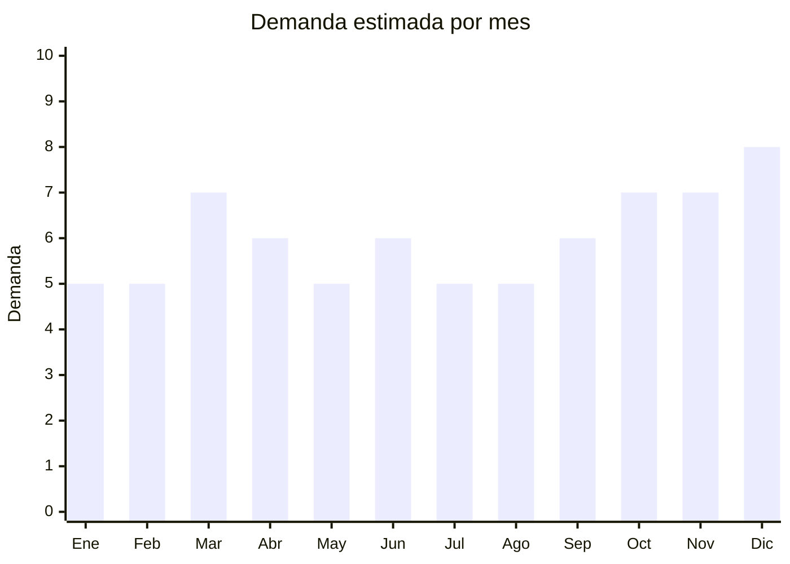

# Ukuleles

> **Capítulo NCM 92** — Instrumentos musicales, sus partes y accesorios | **Temporada:** Atemporal

## Qué es y por qué importarlo

El ukulele es un instrumento de cuerda pulsada de origen hawaiano, con 4 cuerdas de nylon y cuerpo compacto. Es considerado el instrumento más fácil de aprender, lo que lo convierte en la puerta de entrada a la música para niños, jóvenes y adultos. Su popularidad explotó con covers virales en redes sociales y se consolidó como producto estable, no como moda pasajera.

El mercado argentino de ukuleles creció enormemente en la última década. Argentina tiene una cultura musical fuerte, y el ukulele se posicionó como alternativa accesible a la guitarra: es más pequeño, más barato, más fácil de transportar y se aprende más rápido. Las escuelas de música lo adoptaron como instrumento de iniciación y hay comunidades activas de ukulelistas en todo el país.

China es el mayor productor mundial de ukuleles económicos y de gama media, con hubs de fabricación en Guangdong (fábricas de instrumentos de cuerda) y Fujian. Los precios FOB permiten márgenes atractivos incluso en modelos con acabado de madera real (caoba, abeto).

## Datos clave

| Dato | Valor |
|------|-------|
| **Posiciones NCM típicas** | 9202.90.00 (otros instrumentos musicales de cuerda) |
| **Derecho de importación** | 18% (DIE) + 3% tasa estadística |
| **Rango FOB típico** | USD 5.00 — USD 20.00 por unidad |
| **Precio de venta en Argentina** | ARS 20.000 — ARS 80.000 |
| **Margen bruto estimado** | 150% — 300% |
| **MOQ típico** | 50 — 200 unidades (según modelo y acabado) |
| **Demanda en MercadoLibre** | Alta |
| **Competencia en MercadoLibre** | Media-Alta |
| **Dificultad para importar** | Fácil-Media |
| **Certificaciones necesarias** | Ninguna especial |
| **Antidumping** | No |

## Variantes y subtipos más comunes

| Subtipo / Variante | FOB aprox. | Venta AR aprox. | Nota |
|--------------------|-----------|-----------------|------|
| Soprano 21" (estándar) | USD 5.00 — 10.00 | ARS 20.000 — 40.000 | **Más vendido** — tamaño clásico, iniciación |
| Concert 23" | USD 7.00 — 14.00 | ARS 30.000 — 55.000 | Más cómodo para manos grandes |
| Tenor 26" | USD 10.00 — 20.00 | ARS 40.000 — 80.000 | Sonido más profundo, semiprofesional |
| Soprano con cutaway | USD 6.00 — 12.00 | ARS 25.000 — 45.000 | Acceso a trastes agudos |
| Electroacústico (con pickup) | USD 12.00 — 20.00 | ARS 45.000 — 80.000 | Para escenario, amplificación |

## Regulaciones y requisitos

<Tabs>
  <Tab title="Certificaciones">
    | Organismo | Requiere | Detalle | Costo aprox. | Tiempo aprox. |
    |-----------|----------|---------|-------------|--------------|
    | ARCA (Aduana) | Sí siempre | Despacho de importación estándar | — | — |
    | ANMAT | No | No es producto médico ni cosmético | — | — |
    | ENACOM | No | No es electrónico (salvo electroacústico con transmisor inalámbrico, caso raro) | — | — |
    | INTI | No | No es textil ni calzado | — | — |
    | SENASA | **Verificar** | Si el instrumento incluye madera sin tratar o cáscara de coco, SENASA puede requerir certificado fitosanitario | Mínimo | Variable |

    **Nota estratégica:** Producto con barrera regulatoria mínima. El único punto de atención es SENASA si se importa madera sin tratar, pero la mayoría de ukuleles chinos usan madera laminada con acabado barnizado/lacado que no requiere certificado fitosanitario.
  </Tab>

  <Tab title="Etiquetado">
    | Requisito | Aplica |
    |-----------|--------|
    | Idioma español | Sí |
    | Datos del importador | Sí (razón social, CUIT, dirección) |
    | Material del cuerpo | Recomendado (caoba, tilo, abeto, etc.) |
    | Tamaño del instrumento | Sí (soprano, concert, tenor) |
    | País de origen | Sí |
    | Garantía legal 6 meses | Sí |
  </Tab>

  <Tab title="Restricciones">
    Sin restricciones especiales significativas.

    **Nota CITES:** Algunos ukuleles premium pueden usar maderas protegidas por CITES (palisandro/rosewood para diapasón). Los modelos económicos chinos generalmente usan maderas no protegidas (caoba africana, tilo, sapeli), lo que evita este problema. Verificar con el proveedor que no incluya maderas CITES listadas.
  </Tab>
</Tabs>

## Logística

| Dato | Valor |
|------|-------|
| **Peso típico por unidad** | 0.40 — 0.80 kg (soprano) / 0.60 — 1.20 kg (tenor) |
| **Volumen típico** | Medio-Alto (forma irregular, cajas 60-70 cm de largo) |
| **Fragilidad** | Alta (instrumento de madera, golpes pueden quebrarlo) |
| **Envío recomendado** | Marítimo LCL para volumen; Aéreo solo para muestras o pedidos chicos |
| **Tiempo total estimado** | 15 — 25 días (aéreo) / 45 — 75 días (marítimo) |
| **Baterías de litio** | No (salvo electroacústico con preamplificador, que usa pila 9V) |
| **Requiere empaque especial** | Sí — caja individual reforzada con inserto de espuma. Ideal con funda acolchada incluida |

<Tip>
El volumen es el factor logístico clave, no el peso. Un ukulele soprano pesa menos de 1 kg pero ocupa una caja de 60x25x12 cm. Calcular CBM cuidadosamente: un pallet estándar puede contener aprox. 80-120 sopranos. Pedir al proveedor que incluya **funda acolchada** (gig bag) como parte del paquete — cuesta apenas USD 1-2 extra y protege el instrumento durante el envío además de agregar valor percibido para el comprador final.
</Tip>

## Estacionalidad



| Aspecto | Detalle |
|---------|---------|
| **Meses pico** | Marzo (inicio de clases de música), Octubre (Día de la Madre, regalo popular), Noviembre-Diciembre (Navidad, ideal como primer instrumento) |
| **Meses valle** | Enero-Febrero (vacaciones), Mayo (entre temporadas) |
| **Cuándo pedir para llegar a tiempo** | Agosto (para stock Oct-Dic), Enero (para stock de inicio de clases en marzo) |

## Ventajas y riesgos

<CardGroup cols={2}>
  <Card title="Ventajas" icon="circle-check">
    - Sin certificaciones complejas
    - Márgenes atractivos (150-300%)
    - Demanda creciente y consolidada
    - Producto aspiracional (instrumento musical como regalo)
    - Ideal para marca propia con logo en pala
    - Público diverso: niños, jóvenes, adultos
  </Card>
  <Card title="Riesgos" icon="triangle-exclamation">
    - Volumen alto para el peso (logística costosa por CBM)
    - Instrumento frágil: daños en tránsito frecuentes si el empaque es deficiente
    - Calidad variable: afinación inestable en modelos baratos
    - Cuerdas de fábrica suelen ser malas (incluir set extra)
    - Competencia de marcas establecidas (Makala, Mahalo, Kala)
  </Card>
</CardGroup>

<Warning>
La calidad de construcción es crucial. Los ukuleles muy baratos (FOB < USD 4) suelen tener problemas de **afinación inestable** (clavijas que no sostienen la tensión), **trastes mal nivelados** (zumbidos al tocar) y **cuerdas de mala calidad**. Pedir muestras, afinar y tocar durante varios días. Verificar que las clavijas sean de engranaje cerrado (no de fricción) y que el mástil no tenga curvatura. Incluir un juego de cuerdas Aquila o equivalente como valor agregado.
</Warning>

## Palabras clave para buscar en Alibaba

```
ukulele wholesale, soprano ukulele 21 inch, concert ukulele mahogany,
tenor ukulele wholesale, ukulele manufacturer OEM, ukulele with bag,
ukulele private label, acoustic electric ukulele, ukulele beginner set
```

## Fuentes

- [MercadoLibre Argentina — Ukuleles](https://listado.mercadolibre.com.ar/ukulele)
- [Alibaba — Ukulele wholesale](https://www.alibaba.com/showroom/ukulele-wholesale.html)
