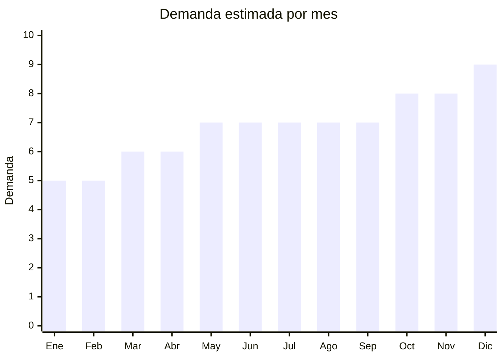

# Almohadas Memory Foam

> **Capitulo NCM 94** — Muebles, iluminacion y construcciones prefabricadas | **Temporada:** Atemporal

## Que es y por que importarlo

Las almohadas memory foam (espuma viscoelastica) son productos de descanso que se adaptan a la forma de la cabeza y el cuello del usuario, ofreciendo soporte ergonomico. Incluyen modelos cervicales con contorno, tipo mariposa, tradicionales, cojines lumbares y almohadas de viaje. El material memory foam se deforma con la presion y el calor corporal, volviendo a su forma original al retirarse.

China es el principal productor mundial de productos de espuma viscoelastica, con precios FOB significativamente menores que los de fabricantes locales argentinos. La ventaja logistica clave es que las almohadas memory foam se pueden comprimir al vacio, reduciendo su volumen hasta un 70%, lo que hace viable el envio maritimo e incluso aereo en cantidades moderadas. La demanda en Argentina es alta y creciente, impulsada por la conciencia sobre salud postural y calidad de sueno.

## Datos clave

| Dato | Valor |
|------|-------|
| **Posiciones NCM tipicas** | 9404.90 |
| **Derecho de importacion** | 20% (DIE) + 3% tasa estadistica |
| **Rango FOB tipico** | USD 3 — USD 15 por unidad |
| **Precio de venta en Argentina** | ARS 15,000 — ARS 50,000 |
| **Margen bruto estimado** | 150% — 250% |
| **MOQ tipico** | 100 — 500 unidades |
| **Demanda en MercadoLibre** | Alta |
| **Competencia en MercadoLibre** | Media-Alta |
| **Dificultad para importar** | Baja |
| **Certificaciones necesarias** | Ninguna obligatoria especifica |
| **Antidumping** | **No** |

## Variantes y subtipos mas comunes

| Subtipo / Variante | FOB aprox. | Venta AR aprox. | Nota |
|--------------------|-----------|-----------------|------|
| Cervical contorno | USD 4 — 8 | ARS 18,000 — 35,000 | La mas vendida, perfil ergonomico |
| Mariposa | USD 5 — 10 | ARS 20,000 — 40,000 | Huecos laterales para orejas |
| Almohada tradicional memory foam | USD 3 — 7 | ARS 15,000 — 30,000 | Forma clasica, material premium |
| Cojin lumbar | USD 3 — 8 | ARS 12,000 — 30,000 | Nicho oficina/auto |
| Almohada viaje cervical | USD 2 — 5 | ARS 8,000 — 20,000 | Compacta, demanda de viajeros |

## Regulaciones y requisitos

<Tabs>
  <Tab title="Certificaciones">
    | Organismo | Requiere | Detalle | Costo aprox. | Tiempo aprox. |
    |-----------|----------|---------|-------------|--------------|
    | ARCA (Aduana) | Si siempre | Despacho de importacion | Variable | — |
    | S-Mark | No | No es producto electrico | — | — |
    | ENACOM | No | No emite radiofrecuencia | — | — |
    | ANMAT | No | No es producto medico (salvo que se publicite como tal) | — | — |
    | IRAM | No obligatorio | No hay norma IRAM obligatoria para almohadas genericas | — | — |

    <Note>
    Las almohadas memory foam no requieren certificaciones especificas obligatorias en Argentina, lo que simplifica enormemente el proceso de importacion. Sin embargo, **no publicitar como producto medico** (ej: "cura el dolor cervical") ya que esto podria activar regulaciones de ANMAT.
    </Note>
  </Tab>

  <Tab title="Etiquetado">
    | Requisito | Aplica |
    |-----------|--------|
    | Idioma espanol | Si |
    | Datos del importador | Si |
    | Composicion / materiales | Si |
    | Instrucciones de cuidado | Si |
    | Pais de origen | Si |
    | Garantia legal 6 meses | Si |

    El etiquetado debe indicar composicion del relleno (espuma viscoelastica/memory foam), material de la funda (generalmente poliester o algodon), instrucciones de lavado de la funda, datos del importador con CUIT y pais de origen.
  </Tab>

  <Tab title="Restricciones">
    No hay medidas antidumping ni restricciones especificas. Consideraciones:

    - No publicitar como producto medico o terapeutico para evitar regulaciones ANMAT
    - Verificar que la espuma no contenga sustancias toxicas (solicitar certificado CertiPUR o equivalente)
    - Las almohadas comprimidas al vacio deben descomprimirse dentro de 3-6 meses desde la fabricacion para mantener sus propiedades
    - Algunas espumas de baja calidad emiten olor quimico fuerte (off-gassing) que genera reclamos
  </Tab>
</Tabs>

## Logistica

| Dato | Valor |
|------|-------|
| **Peso tipico por unidad** | 0.5 — 1.5 kg (con caja) |
| **Volumen tipico** | Bajo (comprimido al vacio) / Alto (sin comprimir) |
| **Fragilidad** | Muy baja |
| **Envio recomendado** | Maritimo (volumen), aereo viable si comprimido al vacio |
| **Tiempo total estimado** (pedido a deposito) | 3 — 6 semanas (aereo) / 8 — 12 semanas (maritimo) |
| **Baterias de litio** | No |
| **Requiere empaque especial** | No: la compresion al vacio es el empaque ideal |

<Tip>
Solicitar siempre al proveedor que envie las almohadas comprimidas al vacio y enrolladas (vacuum compressed + rolled). Esto reduce el volumen hasta un 70% y permite enviar grandes cantidades en pocos cartones. Verificar con el proveedor que las almohadas mantengan sus propiedades tras la compresion. Las almohadas de alta densidad (40-60 kg/m3) recuperan mejor su forma que las de baja densidad.
</Tip>

## Estacionalidad



| Aspecto | Detalle |
|---------|---------|
| **Meses pico** | Octubre (Dia de la Madre), Noviembre-Diciembre (regalos fiestas) |
| **Meses valle** | Enero-Febrero (vacaciones de verano) |
| **Cuando pedir para llegar a tiempo** | Julio-Agosto para temporada de regalos de fin de ano |

## Ventajas y riesgos

<CardGroup cols={2}>
  <Card title="Ventajas" icon="circle-check">
    - No requiere certificaciones obligatorias (importacion simple)
    - Compresion al vacio reduce volumen 70% (flete eficiente)
    - Producto no fragil: practicamente indestructible en transito
    - Demanda creciente por conciencia sobre salud postural
    - Margen del 150% al 250% con costos de importacion bajos
    - Producto de recompra: los clientes compran multiples unidades para toda la familia
  </Card>
  <Card title="Riesgos" icon="triangle-exclamation">
    - Espumas de baja calidad emiten olor quimico (off-gassing) que genera reclamos
    - La densidad de la espuma varia entre proveedores: pedir siempre especificaciones tecnicas
    - Almohadas comprimidas por mas de 6 meses pueden no recuperar su forma completamente
    - Competencia de marcas locales con produccion nacional
    - Margenes menores que productos electronicos (150-250% vs 300%+)
    - Productos voluminosos si no se comprimen correctamente
  </Card>
</CardGroup>

## Palabras clave para buscar en Alibaba

```
memory foam pillow cervical, contour memory foam pillow,
butterfly memory foam pillow, lumbar support cushion memory foam,
travel pillow memory foam, vacuum compressed pillow factory,
OEM memory foam pillow custom, high density foam pillow 50D
```

## Fuentes

- [Nomenclador NCM - ARCA (ex-AFIP)](https://www.arca.gob.ar)
- [MercadoLibre Argentina - Almohadas memory foam](https://www.mercadolibre.com.ar/almohadas-viscoelasticas)
- [Alibaba - Memory foam pillow suppliers](https://www.alibaba.com/trade/search?SearchText=memory+foam+pillow)
- [Ministerio de Economia - Arancel externo comun](https://www.argentina.gob.ar/economia)
