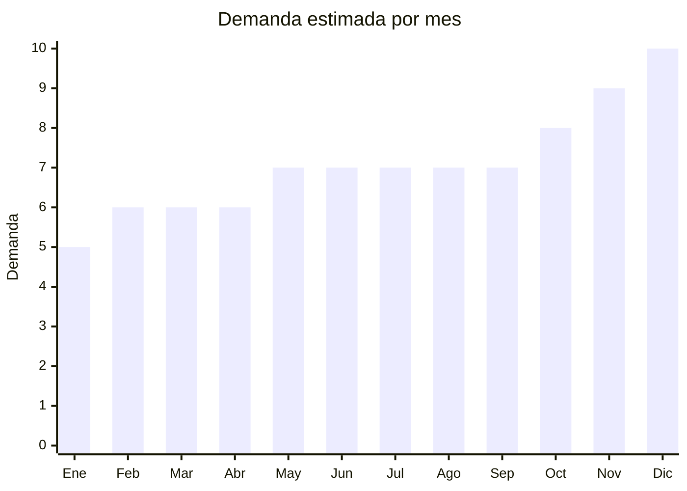

# Lamparas Decorativas

> **Capitulo NCM 94** — Muebles, iluminacion y construcciones prefabricadas | **Temporada:** Atemporal

## Que es y por que importarlo

Las lamparas decorativas son productos de iluminacion cuyo principal atractivo es el diseno estetico y la ambientacion, mas que la funcionalidad de iluminacion pura. Incluyen lamparas de luna 3D levitantes, hongos tactiles, proyectores de atardecer (sunset lamps), cristales recargables y neon LED con formas personalizadas. Son productos altamente virales en redes sociales, especialmente Instagram y TikTok.

Este es un producto de compra impulsiva por excelencia. Su atractivo visual genera ventas organicas a traves de redes sociales sin necesidad de grandes inversiones en publicidad. China concentra la produccion mundial de estos productos, con fabricas que constantemente lanzan nuevos disenos siguiendo tendencias virales. Los margenes son excepcionales, superando el 200% facilmente y alcanzando hasta 400% en modelos de tendencia.

## Datos clave

| Dato | Valor |
|------|-------|
| **Posiciones NCM tipicas** | 9405.20 / 9405.40 |
| **Derecho de importacion** | 20% (DIE) + 3% tasa estadistica |
| **Rango FOB tipico** | USD 3 — USD 15 por unidad |
| **Precio de venta en Argentina** | ARS 10,000 — ARS 50,000 |
| **Margen bruto estimado** | 200% — 400% |
| **MOQ tipico** | 50 — 300 unidades |
| **Demanda en MercadoLibre** | Alta |
| **Competencia en MercadoLibre** | Media |
| **Dificultad para importar** | Moderada (S-Mark puede requerir) |
| **Certificaciones necesarias** | S-Mark + QR fiscal (segun modelo) |
| **Antidumping** | **No** |

## Variantes y subtipos mas comunes

| Subtipo / Variante | FOB aprox. | Venta AR aprox. | Nota |
|--------------------|-----------|-----------------|------|
| Luna 3D levitante | USD 8 — 15 | ARS 30,000 — 50,000 | Efecto WOW, viral en redes |
| Hongo tactil | USD 4 — 8 | ARS 15,000 — 30,000 | Cambio de color tactil, recargable |
| Sunset projection lamp | USD 3 — 6 | ARS 10,000 — 25,000 | Proyector de atardecer, Instagram-friendly |
| Cristal recargable | USD 5 — 10 | ARS 18,000 — 35,000 | Elegante, uso como velador |
| Neon LED forma personalizada | USD 5 — 12 | ARS 15,000 — 40,000 | Carteles, figuras, letras personalizadas |

## Regulaciones y requisitos

<Tabs>
  <Tab title="Certificaciones">
    | Organismo | Requiere | Detalle | Costo aprox. | Tiempo aprox. |
    |-----------|----------|---------|-------------|--------------|
    | ARCA (Aduana) | Si siempre | Despacho de importacion | Variable | — |
    | S-Mark (Seguridad electrica) | Segun modelo | Obligatoria si se conecta a 220V. Modelos USB/bateria pueden estar exentos | USD 200 — 500 por modelo | 4 — 6 semanas |
    | QR fiscal | Si | Codigo QR de trazabilidad obligatorio | Incluido en proceso S-Mark | — |
    | ENACOM | No | No aplica (salvo modelos con WiFi/Bluetooth) | — | — |

    <Warning>
    Los modelos que se conectan directamente a 220V requieren S-Mark obligatoriamente. Los modelos que funcionan unicamente con USB o bateria recargable pueden tener requisitos simplificados, pero es recomendable consultar con un despachante de aduanas actualizado.
    </Warning>
  </Tab>

  <Tab title="Etiquetado">
    | Requisito | Aplica |
    |-----------|--------|
    | Idioma espanol | Si |
    | Datos del importador | Si |
    | Potencia y voltaje (si aplica) | Si |
    | Instrucciones de uso | Si |
    | Garantia legal 6 meses | Si |
    | QR de trazabilidad | Si |

    El packaging debe incluir informacion en espanol con datos del importador, CUIT, pais de origen e instrucciones de uso. Para modelos con bateria, incluir advertencias de seguridad sobre la carga.
  </Tab>

  <Tab title="Restricciones">
    No hay medidas antidumping vigentes. Consideraciones importantes:

    - Los modelos con bateria de litio tienen restricciones de envio aereo (normas UN38.3)
    - La lampara de luna levitante utiliza imanes potentes que pueden requerir declaracion especial en transporte aereo
    - Los neon LED con transformador incluido deben cumplir normas de seguridad electrica
  </Tab>
</Tabs>

## Logistica

| Dato | Valor |
|------|-------|
| **Peso tipico por unidad** | 0.2 — 1.5 kg (con caja) |
| **Volumen tipico** | Bajo-Medio |
| **Fragilidad** | Alta (especialmente luna 3D y cristal) |
| **Envio recomendado** | Aereo para lotes chicos, maritimo para volumenes grandes |
| **Tiempo total estimado** (pedido a deposito) | 3 — 6 semanas (aereo) / 8 — 12 semanas (maritimo) |
| **Baterias de litio** | Si en modelos recargables — requiere UN38.3 y MSDS |
| **Requiere empaque especial** | Si: empaque reforzado con foam moldeado, especialmente luna 3D |

<Tip>
Las lamparas decorativas son productos de tendencia que pueden perder popularidad rapidamente. Es mejor hacer pedidos frecuentes y pequenos para testear cada diseno antes de comprar en volumen. Empezar con 50-100 unidades de cada modelo y escalar solo los que tengan buena respuesta en redes sociales y MercadoLibre.
</Tip>

## Estacionalidad



| Aspecto | Detalle |
|---------|---------|
| **Meses pico** | Noviembre-Diciembre (regalos de Navidad, Dia de la Madre en Oct) |
| **Meses valle** | Enero-Febrero (post-fiestas) |
| **Cuando pedir para llegar a tiempo** | Agosto-Septiembre para temporada alta de fin de ano |

## Ventajas y riesgos

<CardGroup cols={2}>
  <Card title="Ventajas" icon="circle-check">
    - Margenes excepcionales del 200% al 400%
    - Producto viral: se vende solo con buenas fotos en redes sociales
    - Compra impulsiva: alta conversion en publicaciones de Instagram y TikTok
    - MOQ bajo: muchos proveedores aceptan desde 50 unidades
    - Peso liviano: flete aereo competitivo
    - Rotacion constante de disenos permite renovar catalogo permanentemente
  </Card>
  <Card title="Riesgos" icon="triangle-exclamation">
    - Fragilidad alta: la luna 3D y modelos de cristal se rompen facilmente en transito
    - Tendencias efimeras: un diseno viral hoy puede no venderse en 3 meses
    - Calidad variable: modelos muy baratos tienen LEDs que fallan prematuramente
    - Competencia de dropshippers que venden sin stock
    - Modelos con bateria de litio complican logistica
    - Riesgo de stock muerto si la tendencia cambia antes de vender todo
  </Card>
</CardGroup>

## Palabras clave para buscar en Alibaba

```
moon lamp 3D levitating, mushroom touch lamp rechargeable,
sunset projection lamp, crystal table lamp rechargeable,
neon LED sign custom, night light decorative OEM,
Instagram lamp trending, RGB mood lamp factory
```

## Fuentes

- [Nomenclador NCM - ARCA (ex-AFIP)](https://www.arca.gob.ar)
- [S-Mark - Seguridad electrica Argentina](https://www.argentina.gob.ar/comercio-interior/marca-de-seguridad)
- [MercadoLibre Argentina - Lamparas decorativas](https://www.mercadolibre.com.ar/lamparas-decorativas)
- [Alibaba - Decorative lamp suppliers](https://www.alibaba.com/trade/search?SearchText=decorative+lamp)
- [Ministerio de Economia - Arancel externo comun](https://www.argentina.gob.ar/economia)
