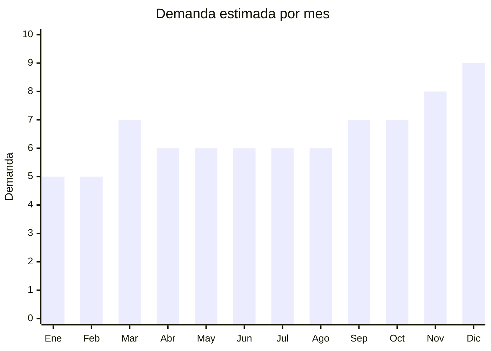

# Lamparas de Escritorio LED

> **Capitulo NCM 94** — Muebles, iluminacion y construcciones prefabricadas | **Temporada:** Atemporal

## Que es y por que importarlo

Las lamparas de escritorio LED son dispositivos de iluminacion personal disenados para espacios de trabajo, estudio y lectura. Utilizan tecnologia LED que ofrece bajo consumo energetico, larga vida util y distintas temperaturas de color ajustables. Su demanda es constante durante todo el ano, impulsada por el crecimiento del trabajo remoto y el estudio desde casa.

China, especificamente la ciudad de Zhongshan en la provincia de Guangdong, es la capital mundial de la iluminacion. Alli se concentran miles de fabricas especializadas que producen lamparas de todo tipo, desde modelos basicos hasta disenos premium con carga inalambrica integrada. Los precios FOB permiten margenes superiores al 200% en el mercado argentino.

## Datos clave

| Dato | Valor |
|------|-------|
| **Posiciones NCM tipicas** | 9405.20 |
| **Derecho de importacion** | 20% (DIE) + 3% tasa estadistica |
| **Rango FOB tipico** | USD 3 — USD 12 por unidad |
| **Precio de venta en Argentina** | ARS 15,000 — ARS 50,000 |
| **Margen bruto estimado** | 200% — 350% |
| **MOQ tipico** | 100 — 500 unidades |
| **Demanda en MercadoLibre** | Alta |
| **Competencia en MercadoLibre** | Media-Alta |
| **Dificultad para importar** | Moderada (requiere S-Mark) |
| **Certificaciones necesarias** | S-Mark + QR fiscal obligatorio |
| **Antidumping** | **No** |

## Variantes y subtipos mas comunes

| Subtipo / Variante | FOB aprox. | Venta AR aprox. | Nota |
|--------------------|-----------|-----------------|------|
| LED recargable USB | USD 3 — 5 | ARS 15,000 — 25,000 | Portatil, ideal para estudiantes |
| Brazo articulado con clip | USD 4 — 8 | ARS 18,000 — 35,000 | Popular para escritorios pequenos |
| Base con carga inalambrica | USD 8 — 12 | ARS 30,000 — 50,000 | Mayor valor percibido, margen premium |
| Con regulador de intensidad | USD 5 — 9 | ARS 20,000 — 40,000 | Dimmer tactil, muy buscado |
| Tipo arquitecto | USD 6 — 10 | ARS 25,000 — 45,000 | Brazo largo articulado, uso profesional |

## Regulaciones y requisitos

<Tabs>
  <Tab title="Certificaciones">
    | Organismo | Requiere | Detalle | Costo aprox. | Tiempo aprox. |
    |-----------|----------|---------|-------------|--------------|
    | ARCA (Aduana) | Si siempre | Despacho de importacion | Variable | — |
    | S-Mark (Seguridad electrica) | **Si** | Marca de seguridad electrica obligatoria para luminarias | USD 200 — 500 por modelo | 4 — 6 semanas |
    | QR fiscal | Si | Codigo QR de trazabilidad obligatorio en el packaging | Incluido en proceso S-Mark | — |
    | ENACOM | No | No emite radiofrecuencia (salvo modelos smart WiFi) | — | — |

    <Warning>
    La certificacion S-Mark es **obligatoria** para todas las luminarias electricas que se comercialicen en Argentina. Sin esta marca, la aduana puede retener el envio y no se puede comercializar legalmente. Cada modelo requiere su propia certificacion.
    </Warning>
  </Tab>

  <Tab title="Etiquetado">
    | Requisito | Aplica |
    |-----------|--------|
    | Idioma espanol | Si |
    | Datos del importador | Si |
    | Potencia y voltaje | Si |
    | Instrucciones de uso | Si |
    | Garantia legal 6 meses | Si |
    | Logo S-Mark y numero de certificacion | Si |
    | QR de trazabilidad | Si |

    El etiquetado debe incluir: nombre del importador, CUIT, direccion, pais de origen, potencia en watts, voltaje de operacion (220V/50Hz para Argentina), y el logo S-Mark con su numero de certificacion. Se pueden usar stickers adheridos al packaging.
  </Tab>

  <Tab title="Restricciones">
    No hay medidas antidumping vigentes para lamparas de escritorio LED. Tener en cuenta:

    - Las lamparas con bateria de litio recargable tienen restricciones de envio aereo (normas UN38.3)
    - Los modelos con puerto USB deben cumplir con normas de seguridad electrica para el cargador
    - Modelos con WiFi/Bluetooth (smart lamps) requieren ademas homologacion ENACOM
  </Tab>
</Tabs>

## Logistica

| Dato | Valor |
|------|-------|
| **Peso tipico por unidad** | 0.3 — 1.2 kg (con caja) |
| **Volumen tipico** | Bajo-Medio |
| **Fragilidad** | Media-Alta |
| **Envio recomendado** | Maritimo (por volumen) o aereo (pedidos chicos) |
| **Tiempo total estimado** (pedido a deposito) | 3 — 6 semanas (aereo) / 8 — 12 semanas (maritimo) |
| **Baterias de litio** | Solo modelos recargables — requiere UN38.3 y MSDS |
| **Requiere empaque especial** | Si: caja individual reforzada + relleno para proteger brazo articulado |

<Tip>
Zhongshan (Guangdong) es la capital mundial de la iluminacion y tiene acceso directo al puerto de Shenzhen y Guangzhou. Al negociar con proveedores de esta zona, pedir que incluyan empaque reforzado con foam interior para evitar roturas durante el transito. Los modelos con brazo articulado son los mas fragiles.
</Tip>

## Estacionalidad



| Aspecto | Detalle |
|---------|---------|
| **Meses pico** | Marzo (vuelta a clases), Noviembre-Diciembre (regalos, Black Friday) |
| **Meses valle** | Enero-Febrero (vacaciones de verano) |
| **Cuando pedir para llegar a tiempo** | Enero para temporada escolar, Agosto-Septiembre para temporada de fiestas |

## Ventajas y riesgos

<CardGroup cols={2}>
  <Card title="Ventajas" icon="circle-check">
    - Margenes brutos superiores al 200%, alcanzando 350% en modelos con carga inalambrica
    - Demanda estable todo el ano con picos en vuelta a clases y fiestas
    - Zhongshan ofrece miles de proveedores con MOQ accesibles (desde 100 unidades)
    - Producto relativamente liviano, flete manejable
    - Posibilidad de marca propia (OEM) con diseno personalizado
    - El trabajo remoto impulso la demanda de iluminacion de escritorio
  </Card>
  <Card title="Riesgos" icon="triangle-exclamation">
    - Requiere certificacion S-Mark obligatoria (costo y tiempo)
    - Fragilidad media-alta: los brazos articulados pueden danarse en transito
    - Modelos con bateria de litio complican la logistica
    - Competencia creciente en MercadoLibre
    - Voltaje: asegurarse de que operen en 220V/50Hz (estandar argentino)
    - Modelos muy baratos (sub USD 3) tienen alta tasa de falla en componentes LED
  </Card>
</CardGroup>

## Palabras clave para buscar en Alibaba

```
LED desk lamp USB rechargeable, desk lamp wireless charging,
architect desk lamp adjustable, clip on LED reading lamp,
LED table lamp touch dimmer, Zhongshan desk lamp factory,
OEM desk lamp custom logo, foldable LED desk lamp
```

## Fuentes

- [Nomenclador NCM - ARCA (ex-AFIP)](https://www.arca.gob.ar)
- [S-Mark - Seguridad electrica Argentina](https://www.argentina.gob.ar/comercio-interior/marca-de-seguridad)
- [MercadoLibre Argentina - Lamparas escritorio LED](https://www.mercadolibre.com.ar/lamparas-escritorio-led)
- [Alibaba - LED desk lamp suppliers](https://www.alibaba.com/trade/search?SearchText=led+desk+lamp)
- [Ministerio de Economia - Arancel externo comun](https://www.argentina.gob.ar/economia)
