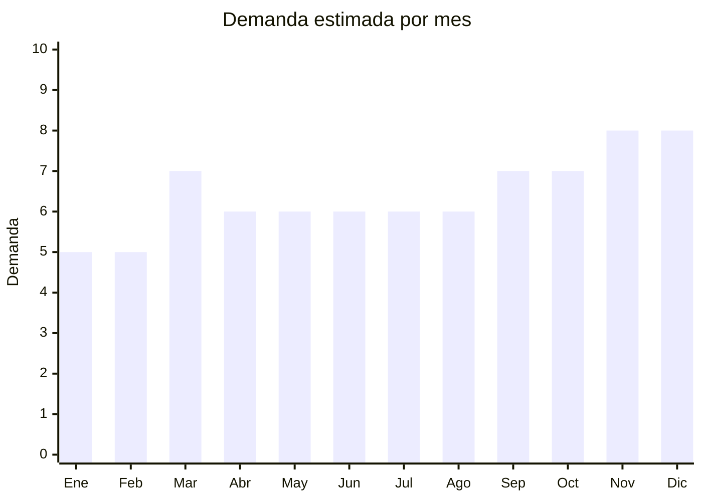

# Muebles Organizadores

> **Capitulo NCM 94** — Muebles, iluminacion y construcciones prefabricadas | **Temporada:** Atemporal

## Que es y por que importarlo

Los muebles organizadores son piezas de mobiliario disenadas para maximizar el almacenamiento y el orden en espacios reducidos. Incluyen cubos modulares apilables, cajoneras de tela con estructura metalica, estantes flotantes, zapateros y organizadores de escritorio multifuncion. Son productos con demanda constante impulsada por la tendencia de optimizacion de espacios pequenos y el movimiento minimalista.

China es el principal exportador mundial de muebles, con hubs de produccion en Foshan (Guangdong) para muebles de madera y metal, y Yiwu (Zhejiang) para organizadores de plastico y tela. La clave para importar muebles es el formato flat-pack (desarmado plano), que reduce el volumen de envio hasta un 70%, haciendo viable el flete maritimo incluso en cantidades moderadas.

## Datos clave

| Dato | Valor |
|------|-------|
| **Posiciones NCM tipicas** | 9403.60 (muebles madera) / 9403.70 (muebles plastico) |
| **Derecho de importacion** | 20% (DIE) + 3% tasa estadistica |
| **Rango FOB tipico** | USD 5 — USD 20 por unidad |
| **Precio de venta en Argentina** | ARS 20,000 — ARS 60,000 |
| **Margen bruto estimado** | 150% — 250% |
| **MOQ tipico** | 100 — 500 unidades |
| **Demanda en MercadoLibre** | Alta |
| **Competencia en MercadoLibre** | Media |
| **Dificultad para importar** | Moderada (flete es factor critico) |
| **Certificaciones necesarias** | Ninguna especifica (no electrico, no juguete) |
| **Antidumping** | **No** |

<Warning>
**EVALUAR FLETE CUIDADOSAMENTE.** Los muebles organizadores pueden tener margenes atractivos en precio FOB pero el flete maritimo puede erosionar la ganancia significativamente si no se optimiza el empaque. El formato flat-pack (desarmado plano) reduce el volumen hasta un 70% y es la unica forma viable de importar muebles en cantidades comerciales.
</Warning>

## Variantes y subtipos mas comunes

| Subtipo / Variante | FOB aprox. | Venta AR aprox. | Nota |
|--------------------|-----------|-----------------|------|
| Cubos modulares apilables | USD 5 — 10 | ARS 20,000 — 35,000 | Versatiles, flat-pack ideal |
| Cajonera tela + estructura metal | USD 8 — 15 | ARS 25,000 — 45,000 | Liviana, facil de armar |
| Estante flotante | USD 5 — 12 | ARS 15,000 — 35,000 | Tendencia deco, bajo volumen |
| Zapatero de tela | USD 6 — 12 | ARS 20,000 — 40,000 | Alta demanda, producto practico |
| Organizador escritorio multifuncion | USD 5 — 15 | ARS 20,000 — 60,000 | Nicho home-office en crecimiento |

## Regulaciones y requisitos

<Tabs>
  <Tab title="Certificaciones">
    | Organismo | Requiere | Detalle | Costo aprox. | Tiempo aprox. |
    |-----------|----------|---------|-------------|--------------|
    | ARCA (Aduana) | Si siempre | Despacho de importacion | Variable | — |
    | S-Mark | No | No es producto electrico | — | — |
    | ENACOM | No | No emite radiofrecuencia | — | — |
    | IRAM | No obligatorio | No hay norma IRAM obligatoria para muebles genericos | — | — |
    | SENASA | Solo si madera maciza | Certificado fitosanitario si la madera no esta tratada | Variable | Variable |

    <Note>
    Los muebles organizadores genericos no requieren certificaciones especificas, lo que simplifica significativamente el proceso de importacion. Sin embargo, si el producto contiene madera maciza (no MDF ni melamina), puede requerir certificado fitosanitario de SENASA para verificar que no contenga plagas.
    </Note>
  </Tab>

  <Tab title="Etiquetado">
    | Requisito | Aplica |
    |-----------|--------|
    | Idioma espanol | Si |
    | Datos del importador | Si |
    | Material de fabricacion | Si |
    | Instrucciones de armado | Si |
    | Pais de origen | Si |
    | Peso maximo soportado | Recomendado |

    Incluir instrucciones de armado claras en espanol con diagramas. Indicar materiales utilizados, peso maximo soportado por estante/cubo y datos del importador con CUIT.
  </Tab>

  <Tab title="Restricciones">
    No hay medidas antidumping vigentes para muebles organizadores. Consideraciones:

    - Muebles de madera maciza pueden requerir certificado fitosanitario
    - Productos con melamina o MDF no tienen esta restriccion
    - Respetar normas de embalaje ISPM-15 para pallets y cajas de madera del envio
    - Muebles con componentes metalicos pesados pueden aumentar significativamente el peso del envio
  </Tab>
</Tabs>

## Logistica

| Dato | Valor |
|------|-------|
| **Peso tipico por unidad** | 2 — 8 kg (segun modelo, con caja flat-pack) |
| **Volumen tipico** | Medio-Alto (reducible con flat-pack) |
| **Fragilidad** | Baja-Media |
| **Envio recomendado** | Maritimo (obligatorio por volumen) |
| **Tiempo total estimado** (pedido a deposito) | 10 — 14 semanas (maritimo) |
| **Baterias de litio** | No |
| **Requiere empaque especial** | Si: flat-pack con carton reforzado y esquineros |

<Tip>
Solicitar siempre al proveedor que envie los muebles en formato flat-pack con instrucciones de armado incluidas. Verificar que las piezas de conexion (tornillos, tuercas, herramienta Allen) vengan incluidas en bolsa sellada dentro del paquete. Un mueble flat-pack bien disenado ocupa hasta un 70% menos de volumen que uno armado, reduciendo drasticamente el costo de flete maritimo.
</Tip>

## Estacionalidad



| Aspecto | Detalle |
|---------|---------|
| **Meses pico** | Marzo (vuelta a clases, mudanzas), Octubre-Diciembre (renovacion hogar) |
| **Meses valle** | Enero-Febrero (vacaciones de verano) |
| **Cuando pedir para llegar a tiempo** | Diciembre-Enero para temporada de marzo, Julio-Agosto para temporada de fiestas |

## Ventajas y riesgos

<CardGroup cols={2}>
  <Card title="Ventajas" icon="circle-check">
    - No requiere certificaciones especificas (simplifica importacion)
    - Demanda estable todo el ano con tendencia creciente por home-office
    - Formato flat-pack reduce costos de flete significativamente
    - Producto no perecedero, sin riesgo de vencimiento
    - Posibilidad de marca propia con disenos personalizados
    - Bajo riesgo de obsolescencia: los muebles no pasan de moda rapidamente
  </Card>
  <Card title="Riesgos" icon="triangle-exclamation">
    - El flete maritimo es el costo mas significativo y puede erosionar margenes
    - Volumen alto: requiere espacio de almacenamiento considerable
    - Calidad de materiales variable: MDF barato puede danarse con humedad
    - Peso elevado aumenta costo de envio al comprador final
    - Competencia de fabricantes locales argentinos en muebles basicos
    - Piezas faltantes o danadas generan reclamos y devoluiones
  </Card>
</CardGroup>

## Palabras clave para buscar en Alibaba

```
modular cube storage organizer, fabric drawer organizer metal frame,
floating shelf wall mount, shoe rack fabric cover,
desk organizer multifunctional, flat pack furniture OEM,
Foshan furniture factory, storage cabinet knockdown
```

## Fuentes

- [Nomenclador NCM - ARCA (ex-AFIP)](https://www.arca.gob.ar)
- [MercadoLibre Argentina - Muebles organizadores](https://www.mercadolibre.com.ar/muebles-organizadores)
- [Alibaba - Storage organizer furniture](https://www.alibaba.com/trade/search?SearchText=storage+organizer+furniture)
- [Ministerio de Economia - Arancel externo comun](https://www.argentina.gob.ar/economia)
- [SENASA - Requisitos fitosanitarios](https://www.argentina.gob.ar/senasa)
