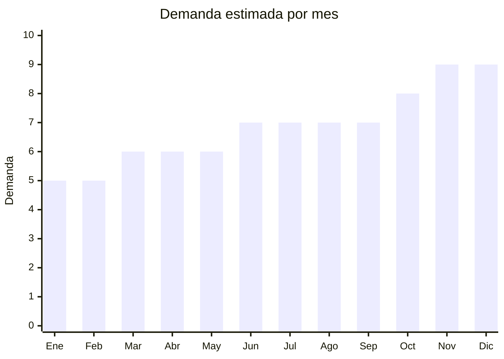

# Sillas Gamer

> **Capitulo NCM 94** — Muebles, iluminacion y construcciones prefabricadas | **Temporada:** Atemporal

## Que es y por que importarlo

Las sillas gamer son asientos ergonomicos con diseno deportivo (tipo butaca de carreras) disenados para sesiones prolongadas frente a la computadora. Incluyen modelos basicos, premium con reposapiés, ergonomicos de oficina y estilo racing. Tambien se considera dentro de este nicho los escritorios gamer. El publico objetivo abarca gamers, trabajadores remotos y profesionales que buscan comodidad para jornadas largas.

China es el mayor productor mundial de sillas gamer, con hubs en Anji (Zhejiang) — conocida como la "ciudad de las sillas" — y Foshan (Guangdong). Los precios FOB son muy competitivos, pero el principal desafio de este producto es el flete: cada silla ocupa entre 0.3 y 0.5 CBM (metros cubicos), lo que significa que solo es viable importar en contenedor completo (FCL) para mantener margenes saludables.

## Datos clave

| Dato | Valor |
|------|-------|
| **Posiciones NCM tipicas** | 9401.30 |
| **Derecho de importacion** | 20% (DIE) + 3% tasa estadistica |
| **Rango FOB tipico** | USD 30 — USD 80 por unidad |
| **Precio de venta en Argentina** | ARS 100,000 — ARS 350,000 |
| **Margen bruto estimado** | 100% — 200% |
| **MOQ tipico** | 50 — 200 unidades |
| **Demanda en MercadoLibre** | Alta |
| **Competencia en MercadoLibre** | Alta |
| **Dificultad para importar** | Alta (flete y volumen) |
| **Certificaciones necesarias** | Ninguna obligatoria especifica |
| **Antidumping** | **No** |

<Warning>
**CUIDADO CON EL FLETE.** Cada silla gamer ocupa entre 0.3 y 0.5 CBM desarmada. Un contenedor de 40 pies (67 CBM) carga aproximadamente 130-220 sillas. Solo es viable importar en contenedor completo (FCL). Envios LCL (consolidado) o aereos destruyen el margen por el alto volumen relativo al valor.
</Warning>

## Variantes y subtipos mas comunes

| Subtipo / Variante | FOB aprox. | Venta AR aprox. | Nota |
|--------------------|-----------|-----------------|------|
| Gamer basica | USD 30 — 45 | ARS 100,000 — 180,000 | Entry-level, mayor volumen de ventas |
| Gamer con reposapiés | USD 40 — 60 | ARS 150,000 — 250,000 | Feature premium, diferenciacion |
| Ergonomica oficina | USD 50 — 80 | ARS 180,000 — 350,000 | Nicho corporativo, mas marginal |
| Racing premium | USD 60 — 80 | ARS 200,000 — 350,000 | Cuero PU premium, mecanismo mariposa |
| Escritorio gamer (mesa) | USD 40 — 70 | ARS 150,000 — 300,000 | Complemento natural, venta cruzada |

## Regulaciones y requisitos

<Tabs>
  <Tab title="Certificaciones">
    | Organismo | Requiere | Detalle | Costo aprox. | Tiempo aprox. |
    |-----------|----------|---------|-------------|--------------|
    | ARCA (Aduana) | Si siempre | Despacho de importacion | Variable | — |
    | S-Mark | No | No es producto electrico | — | — |
    | ENACOM | No | No emite radiofrecuencia | — | — |
    | IRAM | No obligatorio | No hay norma IRAM obligatoria para sillas genericas | — | — |

    <Note>
    Las sillas gamer no requieren certificaciones especificas obligatorias, lo que simplifica el proceso regulatorio. El principal desafio es logistico (volumen y flete), no regulatorio.
    </Note>
  </Tab>

  <Tab title="Etiquetado">
    | Requisito | Aplica |
    |-----------|--------|
    | Idioma espanol | Si |
    | Datos del importador | Si |
    | Materiales de fabricacion | Si |
    | Instrucciones de armado | Si |
    | Peso maximo soportado | Recomendado |
    | Pais de origen | Si |
    | Garantia legal 6 meses | Si |

    Incluir instrucciones de armado claras en espanol con diagramas paso a paso. Indicar peso maximo soportado (generalmente 120-150 kg), materiales del tapizado (cuero PU, tela mesh), datos del importador con CUIT y pais de origen.
  </Tab>

  <Tab title="Restricciones">
    No hay medidas antidumping ni restricciones especificas. Consideraciones importantes:

    - Verificar que el mecanismo de elevacion (piston a gas) cumpla con normas de seguridad (clase 3 minimo, clase 4 recomendado)
    - El cuero PU de baja calidad se descascara en 6-12 meses, generando reclamos masivos
    - Las ruedas de plastico rayan pisos de madera: ofrecer ruedas de goma como upgrade
    - Respetar normas ISPM-15 para pallets de madera del envio
  </Tab>
</Tabs>

## Logistica

| Dato | Valor |
|------|-------|
| **Peso tipico por unidad** | 15 — 25 kg (con caja, desarmada) |
| **Volumen tipico** | 0.3 — 0.5 CBM por silla (desarmada en caja) |
| **Fragilidad** | Baja |
| **Envio recomendado** | Maritimo FCL obligatorio |
| **Tiempo total estimado** (pedido a deposito) | 10 — 14 semanas (maritimo FCL) |
| **Baterias de litio** | No |
| **Requiere empaque especial** | Si: caja reforzada con foam para proteger mecanismo y tapizado |

<Tip>
Un contenedor de 40 pies (40HC, 67 CBM) carga aproximadamente 130-220 sillas gamer desarmadas dependiendo del modelo. Para maximizar la rentabilidad: (1) negociar precio FOB por contenedor completo, (2) mezclar modelos para diversificar riesgo, (3) solicitar que cada caja incluya herramienta de armado y manual en espanol. La ciudad de Anji (Zhejiang) es el hub mundial de sillas y ofrece los mejores precios FOB del mercado.
</Tip>

## Estacionalidad



| Aspecto | Detalle |
|---------|---------|
| **Meses pico** | Noviembre-Diciembre (Black Friday, regalos), Junio (Dia del Padre) |
| **Meses valle** | Enero-Febrero (vacaciones de verano) |
| **Cuando pedir para llegar a tiempo** | Julio-Agosto para temporada de fiestas (lead time maritimo 10-14 semanas) |

## Ventajas y riesgos

<CardGroup cols={2}>
  <Card title="Ventajas" icon="circle-check">
    - Ticket promedio alto (ARS 100,000-350,000), menos ventas necesarias para rentabilizar
    - Demanda creciente por gaming y trabajo remoto
    - No requiere certificaciones especificas (proceso simple)
    - Posibilidad de marca propia con diseno personalizado
    - Venta cruzada natural: silla + escritorio + accesorios
    - Hub de produccion concentrado en Anji facilita sourcing
  </Card>
  <Card title="Riesgos" icon="triangle-exclamation">
    - **Flete muy alto:** solo viable en contenedor completo (FCL)
    - Requiere inversion inicial alta (USD 5,000-15,000 minimo por contenedor)
    - Espacio de almacenamiento considerable (0.3-0.5 CBM por silla)
    - Cuero PU de baja calidad se descascara rapidamente (reclamos garantia)
    - Pistones a gas de mala calidad pueden ser peligrosos
    - Competencia de marcas establecidas (Corsair, Cougar, marcas locales)
    - Devoluiones costosas: producto grande y pesado
  </Card>
</CardGroup>

## Palabras clave para buscar en Alibaba

```
gaming chair factory Anji, racing gaming chair OEM,
ergonomic office chair mesh, gaming chair with footrest,
gaming desk RGB, custom logo gaming chair,
PU leather gaming chair class 4 gas lift,
Anji chair manufacturer wholesale
```

## Fuentes

- [Nomenclador NCM - ARCA (ex-AFIP)](https://www.arca.gob.ar)
- [MercadoLibre Argentina - Sillas gamer](https://www.mercadolibre.com.ar/sillas-gamer)
- [Alibaba - Gaming chair suppliers Anji](https://www.alibaba.com/trade/search?SearchText=gaming+chair+factory)
- [Ministerio de Economia - Arancel externo comun](https://www.argentina.gob.ar/economia)
